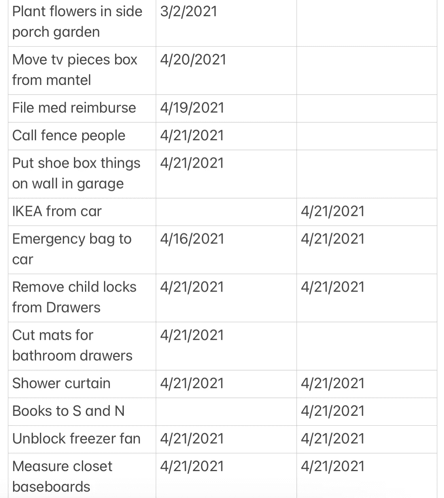
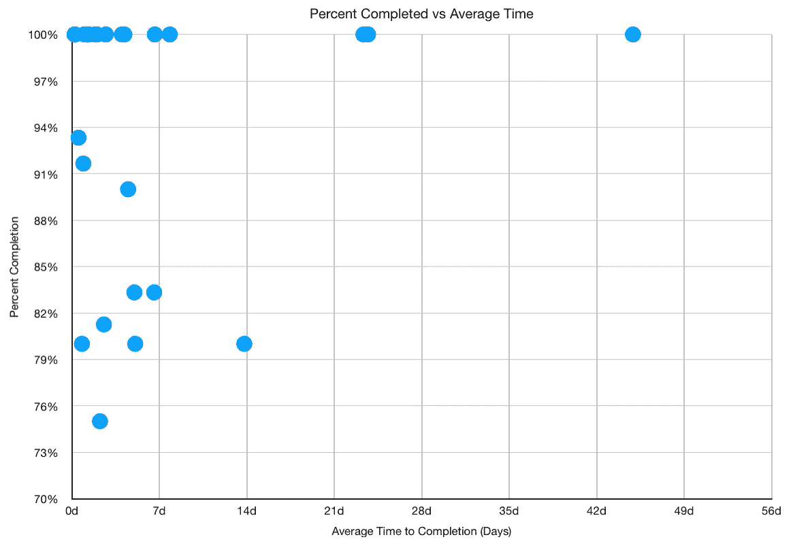
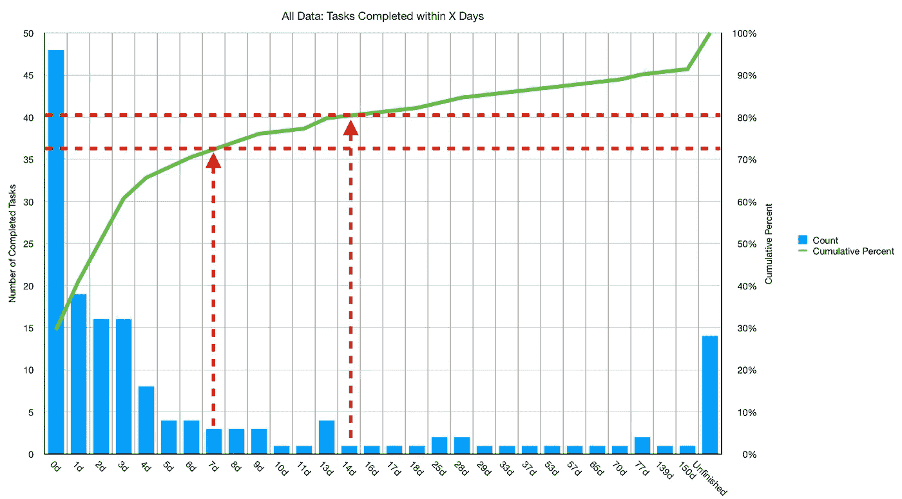
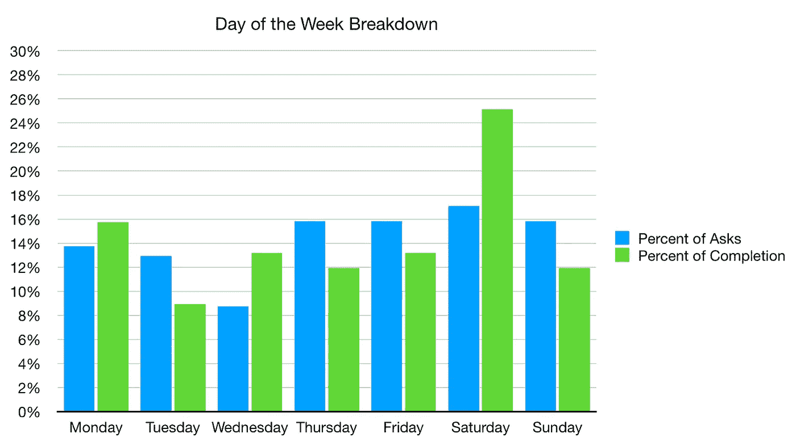
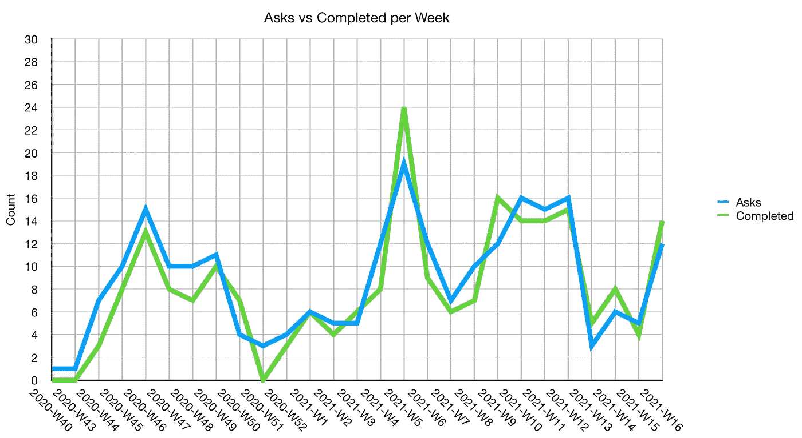

# 使用数据改善家务劳动

> 原文：<https://towardsdatascience.com/improving-chores-using-data-d972e5f24475?source=collection_archive---------24----------------------->

## 野外的数据科学

## 对付多动症的方法

我们先说，我不记得有什么事情做得这么好。我记得我感兴趣的事情，但我患有多动症，这意味着我在追逐多巴胺。这些年来，我已经能够欺骗我的大脑来提高我做不有趣的任务或杂务的能力，但它一直具有挑战性。

在压力很大的情况下，我会用音乐来保持精力充沛的状态，但是我必须持续保持活跃才能很好地工作。在某些时候也有一个崩溃期。对于搬到一个新的地方，这是一个有用的工具。

通常，列表是最有帮助的。大约六个月前，我创建了一个包含三列的表格:{任务、询问日期、完成日期}。目的是帮助了解哪些事情是重要的，以及我完成工作的效率如何。我可以看看这个清单，找到我能完成的事情。

所有图片由作者提供

# 数据分析

几个月后，我决定做一些分析，看看我在完成任务方面是否有所进步。数据中唯一的问题是，通过观察和记录这类数据，影响了我的行为。

我开始按月查看一些指标:

最大的改进是当天完成。我最终完成了 90%我想完成的事情。完成任务的平均时间普遍下降，这可能与一些长期任务有关。

我也按周查看了这些数据

利用这些数据，我做了一个散点图来寻找任何趋势。但是，似乎并没有大的趋势。

我们可以从整体上看这些数据，以了解任务完成的速度。似乎我能够在一周内完成 70%的任务，在两周内完成 80%多一点的任务。然后是长尾，这主要是由于新任务的优先级推低了旧任务。

星期几呢？对我来说，周二似乎是最不适合完成任务的一天，但是周六承担了很多完成任务的负担。

完成时间可能看起来有点长，但是如果有一个稳定的任务完成流，那么单个任务的持续时间是由优先级的重新调整驱动的。看看每周的要求和完成的任务，每周都有稳定的任务流被完成。

每次我觉得数据没什么用的时候，它似乎成了过更好生活的绝佳解决方案。有时候，没有目标是很难完成任务的，但这个列表绝对给了我一个目标和一个指定的目标。

如果你愿意，可以在 Twitter 和 YouTube 上关注我，我会在那里发布不同机器上的浓缩咖啡视频和浓缩咖啡相关的东西。你也可以在 [LinkedIn](https://www.linkedin.com/in/robert-mckeon-aloe-01581595?source=post_page---------------------------) 上找到我。也可以在 [Medium](https://towardsdatascience.com/@rmckeon/follow) 或者 [Patreon](https://www.patreon.com/EspressoFun) 上关注我。

# [我的进一步阅读](https://rmckeon.medium.com/story-collection-splash-page-e15025710347):

[浓缩咖啡系列文章](https://rmckeon.medium.com/a-collection-of-espresso-articles-de8a3abf9917?postPublishedType=repub)

[工作和学校故事集](https://rmckeon.medium.com/a-collection-of-work-and-school-stories-6b7ca5a58318?source=your_stories_page-------------------------------------)

[个人故事和关注点](https://rmckeon.medium.com/personal-stories-and-concerns-51bd8b3e63e6?source=your_stories_page-------------------------------------)

[乐高故事启动页面](https://rmckeon.medium.com/lego-story-splash-page-b91ba4f56bc7?source=your_stories_page-------------------------------------)

[摄影飞溅页](https://rmckeon.medium.com/photography-splash-page-fe93297abc06?source=your_stories_page-------------------------------------)

[数据科学:基础知识](https://medium.com/@rmckeon/data-science-essentials-9fda7b617d16?source=your_stories_page-------------------------------------)

[数据展示要领](https://medium.com/swlh/presentation-essentials-802e3d28784c?source=your_stories_page-------------------------------------)

[生活色彩数据](https://medium.com/dataseries/seeing-your-number-in-living-color-e2a4a647105c?source=your_stories_page-------------------------------------)

[如何轻松进入数据科学领域](/how-to-break-into-data-science-the-easy-way-dd498995057f?source=your_stories_page-------------------------------------)

[数据科学家的一天](/a-day-in-the-life-of-a-data-scientist-eb63cdd71edb?source=your_stories_page-------------------------------------)

[机器学习中的隐私:PII](https://becominghuman.ai/privacy-in-machine-learning-pii-34edb95be6c6?source=your_stories_page-------------------------------------)

[收集爱好数据集:咖啡](/collecting-a-hobby-dataset-454e07a3f48e?source=your_stories_page-------------------------------------)

[使用自适应滤波器的车道识别](https://medium.com/mlearning-ai/lane-identification-using-an-adaptive-filter-31c150d04e94?source=your_stories_page-------------------------------------)