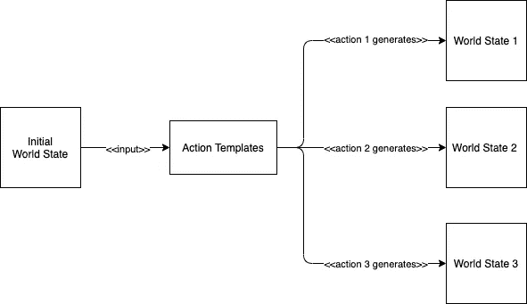
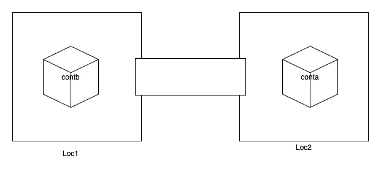
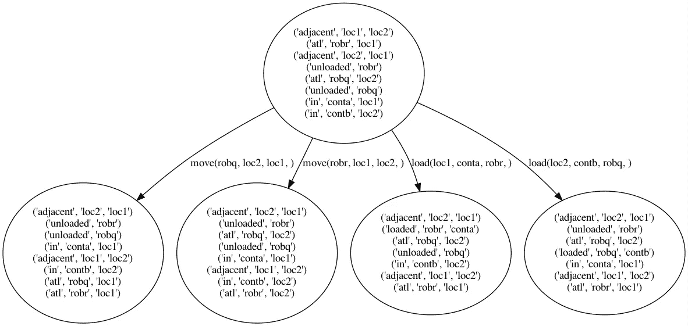
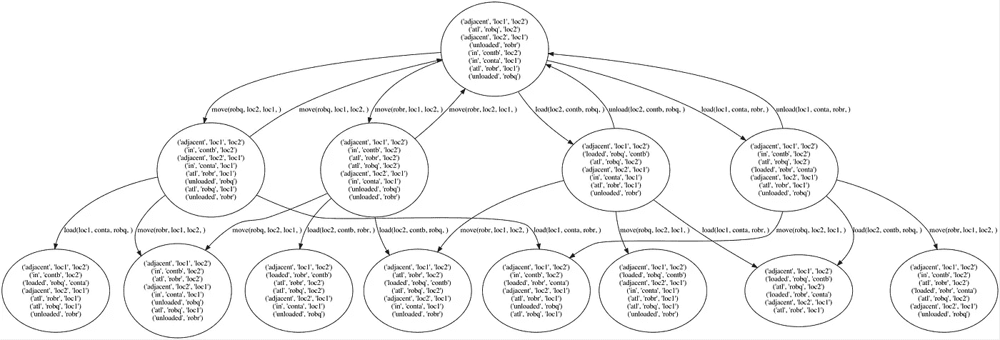
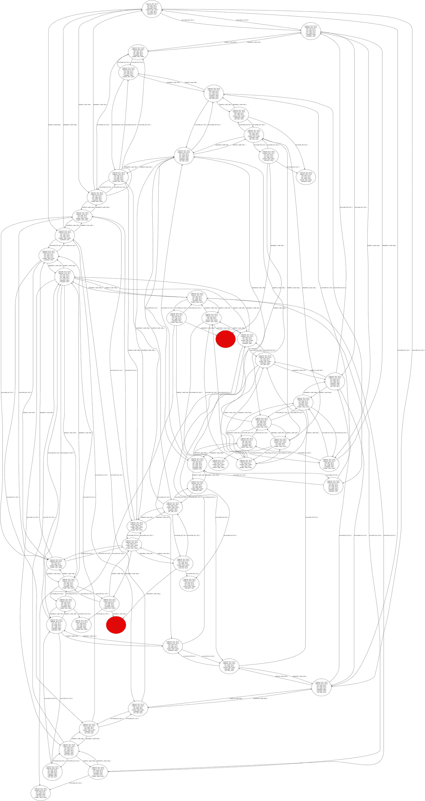

# 用规划图提高经典人工智能规划的复杂性

> 原文：<https://towardsdatascience.com/improving-classical-ai-planning-complexity-with-planning-graph-c63d47f87018?source=collection_archive---------23----------------------->

使用一个新的搜索空间，规划图，以提高表现力和复杂性的问题，发现在经典的规划方法。

规划图(图片由作者提供)

# 介绍

人工智能规划的经典方法使用*状态空间*和*计划空间*来搜索解决方案以解决规划问题。在状态空间搜索中，通过应用适当的动作，初始世界状态经历几次变换，直到找到解决方案以达到目标，或者搜索算法终止并返回失败。我们可以使用 BFS、DFS、Dijkstra、A*等搜索算法。

状态空间(作者图片)

由此产生的解决方案是*一系列动作*，当应用时，通过一个或多个步骤将初始世界状态转换为目标状态。

国家空间计划(图片由作者提供)

另一个搜索空间是计划空间，我们将计划作为我们的节点，并尝试以 ***开放(未解决)目标*** 和 ***威胁*** 的形式解决 ***缺陷*** 。

平面空间规划(作者图片)

这种方法本身相当复杂，我们不打算在这里讨论细节，如果你有兴趣了解更多，你可以阅读这篇文章:

<https://medium.com/swlh/plan-space-search-2d877b4ab231>  

## 改善空间的大小

在《自动化规划:理论与实践》一书中，Malik、Dana 和 Paolo 提到传统方法的研究由于表达性和复杂性的原因而停滞不前，规划图——一种新的搜索空间，允许搜索空间大小的改进，从而为解决更复杂的规划问题开辟了一条道路。

我们将在下面的章节中探讨细节，以理解它如何改进传统规划方法中发现的问题。

## 码头工人机器人规划领域

对于我们的例子，我们将使用简化的码头工人机器人(DWR)领域和问题，经常在人工智能规划教程中使用。

简单码头工人机器人领域(图片由作者提供)

在这个领域中，我们有两个机器人 **robr** 和 **robq** ，两个容器 **conta** 和 **contb** ，以及两个位置 **loc1** 和 **loc2** 。

有三种可能的操作:

*   **装载(位置、容器、机器人)**:将容器装载到机器人上
*   **移动(位置，位置)**:从一个位置移动到另一个位置
*   **卸载(位置、容器、机器人)**:从机器人上卸载容器

动作的 ***前置条件*** 和 ***效果*** 的细节可以在下面的 pddl 文件中看到。

我们还有五个谓词来表示状态:

*   **相邻(位置 1，位置 2)** —这是关于位置的静态信息
*   **atl(机器人，位置)** —描述机器人的位置
*   **已装载(机器人，集装箱)** —机器人是否已装载，哪个集装箱在机器人上
*   **卸载(机器人)** —机器人卸载
*   **在(集装箱，位置)** —描述集装箱的位置

我们用 [PDDL](https://en.wikipedia.org/wiki/Planning_Domain_Definition_Language) (规划领域定义语言)来表示我们的规划领域和规划问题。下面是我们感兴趣的领域的 pddl 文件。

现在让我们开始深入研究规划图及其规划器。

# 规划图

> 规划图基于可达性分析的思想，可达性分析是一种计算一组状态是否可以从一组初始状态到达的过程。

让我们通过一个例子来逐步理解这个概念。首先，这是我们的初始状态:

初始状态(图片由作者提供)

我们使用谓词来表示我们的世界状态(为了简单起见，我们省略了相邻的谓词):

*   in(conta，loca 1)
*   in(contb，loc2)
*   atl(机器人，位置 1)
*   atl(robq，loc2)
*   空载(机器人)
*   空载(robq)

我们想知道这个状态是否可以达到:

目标状态(图片由作者提供)

我们没有在图片中展示机器人，因为我们不关心它们的位置，我们只对集装箱的位置感兴趣。我们用这种方式表示它:

*   in(contb，loc1)
*   in(conta，loc2)

## 可达性树

现在，最简单的方法是使用可达性树。我们从初始状态(根节点)开始，搜索状态(边)的适用动作，然后我们生成预测状态(子节点)，我们对所有子节点重复该过程，直到达到指定的 ***深度*** 。

这是深度=1 的可达性树。

可达性树-深度=1(作者图片)

并且，这是深度=2 的可达性树。

可达性树-深度=2(作者图片)

我们可以看到，这并没有很好地扩展，当我们增加深度时，节点的数量会激增。此外，我们还没有在这个深度找到目标，我们需要进一步扩展它。

## 可达性图

我相信你会这样想，我们可以用图来改善它，因为有些节点确实是重复的。这是深度=2 的图形版本。

可达图—深度=2(作者图片)

它略有改进，但要达到我们的目标(红色节点)，我们需要深度=6，如下所示:

可达图—深度=6(作者图片)

很吓人吧？规模确实很大，因为当我们增加深度时，复杂程度会增加，如果我们想解决更复杂的问题，这在某些时候变得不切实际。

## 规划图的可达性

规划图的概念是带有松弛的的*可达性图。在每个深度(也称为 ***级*** )它不使用单个状态，而是使用状态的联合，因此我们可以认为每个级别只有一个节点。*

与我们通过应用可应用的动作来生成节点的可达图不同，*所有的动作都用来生成状态的联合*。

规划图(图片由作者提供)

另一个区别是，在可达图中，一个状态是一组**一致命题**，但在规划图中，它不是。例如在图中的前提条件 1 中， **robr** 的位置可以同时在 **loc1** 和 **loc2** 中。

类似地，这些动作并不总是**兼容**，它们可能会抵消彼此的影响。

在规划图中，为了跟踪这些**不一致的命题**和**不兼容的动作**，我们使用了所谓的互斥(mutex)。在每个级别，我们都有:

*   一组命题互斥体
*   一组动作互斥体

## 创建计划图表

现在，让我们看看如何一步一步地构建规划图。最初，我们有 0 级，其中只有**和**前提条件 0，等于初始状态。

0 级(图片由作者提供)

接下来，我们建立下一个级别，级别 1。从一系列行动开始:

A1 号楼(图片由作者提供)

这个等式的意思是 A1 是一组动作，它们:

*   当前状态满足前提条件，并且
*   在命题互斥中没有成对的前提条件

下一步是建立一套主张:

建设 P1(图片由作者提供)

我们采用先前构建的 A1，并创建所有行动的积极效果的联合。

接下来的两步是构建互斥体，从 A1 的互斥体开始:

为 A1 构建互斥体(图片由作者提供)

A1 的两个动作是互斥的，如果它们是依赖的(它们互相抵消对方的效果)或者它们的前提条件是 P0 的互斥。如果有负面影响会抵消行动正面影响的前提条件，则两个行动是相关的:

依赖动作(作者图片)

最后一步是为 P1 构建互斥体:

为 P1 构建互斥体

这基本上意味着 P1 的一对命题是互斥的，如果:

*   在**中，A1 的所有**动作对都有正面效果，这些动作是互斥的，并且
*   在 A1 中没有一个动作可以同时产生这两种效果

现在，这很复杂，但这一步可以简单地重复到下一个级别。这是深度=3 的规划图的结果。

规划图—深度=3

在这一点上，我们可以看到，与可达性树和可达性图相比，规划图的构建要复杂得多，但正如您所看到的，它的搜索时间更快，大小更小，更重要的是，它更易于我们进行分析或调试。

构建规划图时的另一个要点是，在一定深度后，它将是固定的，这意味着动作集和命题集不会再发生任何变化。

我们的目标在第三级达到了，我们可以看到这两个命题:

*   in(contb，loc1)
*   in(conta，loc2)

在 P3(见上图)。

# 搜索计划图表

现在我们有了规划图——数据结构，我们可以使用搜索算法来为我们的规划问题找到解决方案。

这种方法中的计划不是一系列的行动，而是一系列行动的集合。一个级别集合中的所有操作都可以独立执行，这意味着它们之间没有顺序约束。

在我们的例子中，从 P3 到 P0 向后执行搜索，递归地求解目标中的所有命题。在我们解决它们之后，我们递归地使用行动的前提条件作为子目标，直到我们达到 P0。

向后搜索(作者图片)

我们跳过的一件重要的事情是，在每一关我们都有 ***虚拟动作*** ，它们什么也不做——它们的前提条件和效果是一样的。这允许算法对于那些在较低级别中已经被满足的命题平稳地工作。

对于我们的示例，我们的解决方案是:

*   级别 1: {load(loc2，contb，robq)，load(loc1，conta，robr)}
*   级别 2: {move(robq，loc2，loc1)，move(robr，loc1，loc2)}
*   级别 3: {unload(loc1，contb，robq)，unload(loc2，conta，robr)}

# 结论

我们现在有希望理解如何通过使用规划图方法来改进传统规划方法的复杂性。与可达性树和可达性图相比，规划图的构建更为复杂，但它节省了我们搜索解决方案的时间和空间，如分步示例所示。

我希望你理解这个概念，在下一篇文章中，我们将用 Python 实现这个方法来证明它是可行的，并帮助我们进一步理解它。