# 使用自适应阈值改善咖啡研磨分布

> 原文：<https://towardsdatascience.com/improving-coffee-grind-distribution-using-adaptive-thresholds-194e001f301?source=collection_archive---------45----------------------->

## 咖啡数据科学

## 利用图像处理了解磨床性能第 4 部分

[之前](https://link.medium.com/sItOmzLrkeb)，我已经使用了筛子和不同的成像技术来改进咖啡磨粒分布测量，现在我将应用我的一项旧技术来更好地收集成像数据。通常，图像很容易找到依据，但有些却不是。由于光线与咖啡的相互作用，简单的阈值并不总是有效，所以我仔细观察了一下。

由此产生的变化使我能够测量的咖啡颗粒的数量增加了两倍，这是一个直接的自适应滤波器，有助于解决照明问题。

# 快速回顾

我拍了一张照片，用一张纸确定了测量地面的真实情况(像素到毫米)，然后用一个阈值来寻找粒子。

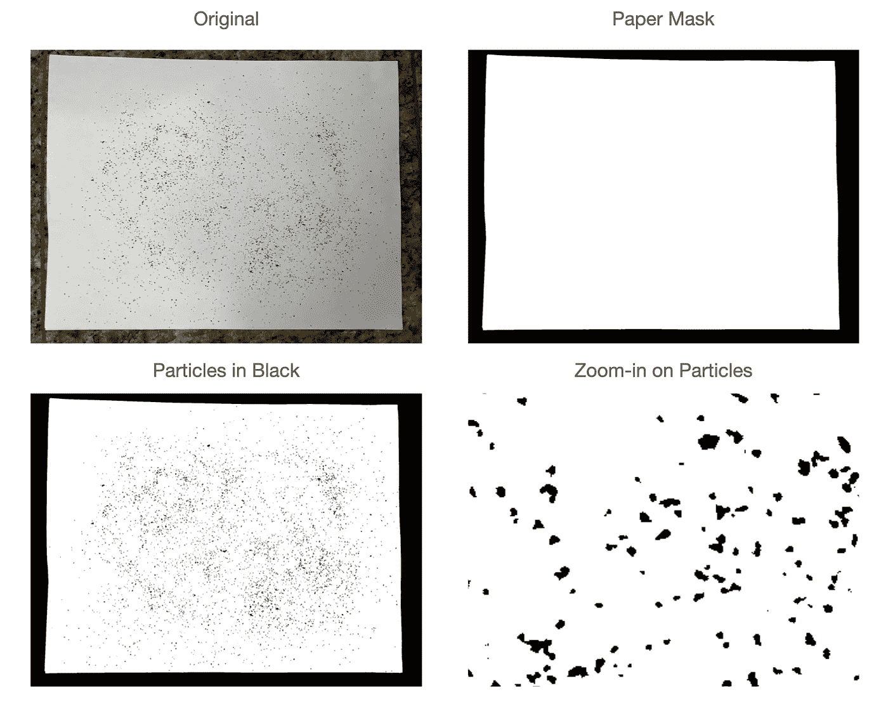

所有图片由作者提供

# 适应滤波器

我从看一些图片开始。我觉得这些分布没有完全捕捉到微粒的数量。所以我看着我的灰度图像，它是红色、绿色和蓝色平面的乘积。然后我取逆得到黑点为 1 为最高值。

我以两种方式想象这一点:

1.  假色
2.  带有虚假颜色的网格

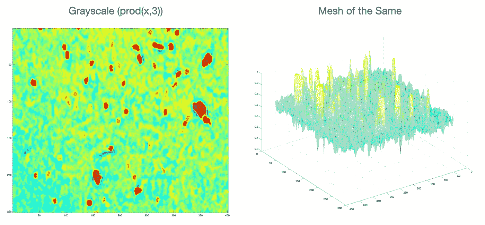

它揭示了有许多较亮的斑点可能没有达到阈值。在这种情况下，阈值为 0.9，这有两种影响:

1.  抛出小颗粒
2.  减少其他粒子的边缘，这会影响过度分布。

# 低通滤波器(自适应滤波器)

在我攻读硕士学位期间，我在计算机视觉的青铜时代研究过一辆自动驾驶汽车。使用低级别图像处理，我开发了一种称为[低滤波器](https://link.medium.com/XTPAI4Mrkeb)的方法，用于在尝试进行车道线识别(自主移动机器人的车道识别和路径规划)时改善滤除噪声。

“低”过滤器基于这样的观察结果:从图像底部到顶部，平均行值会增加。这可以用来帮助滤除全局阈值不能滤除的不太理想的像素。

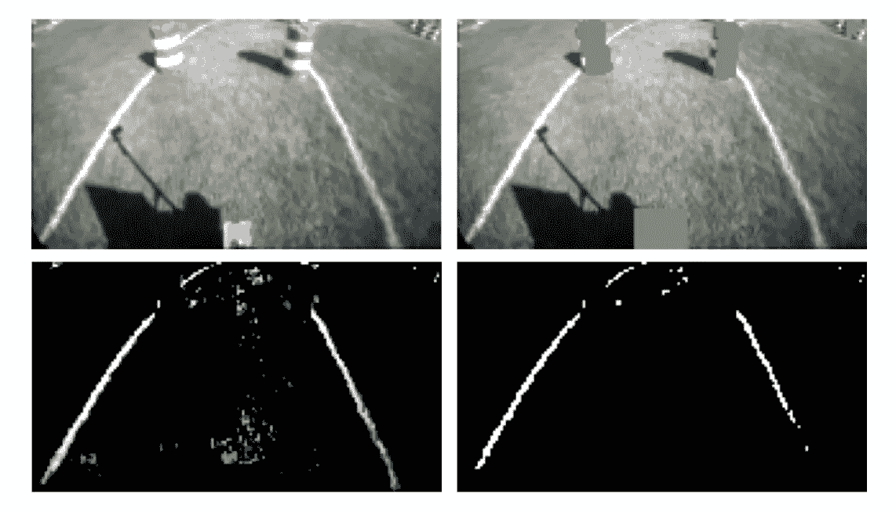

左上:原图。右上:桶被移除。左下角:应用了低通滤波器。右下:门槛。

该过滤器的工作原理是基于该阈值丢弃每个颜色平面中的像素:

> 阈值=平均值(行)+ A *标准值(行)，其中 A 是用户定义的常数。

所以我把这个想法应用到咖啡渣上！

# 用低滤器过滤咖啡

我按行和列的方式应用了这个过滤器，我发现 A=2.5 对我的应用程序来说相当不错。我似乎比以前获得了更多的粒子和粒子边缘。

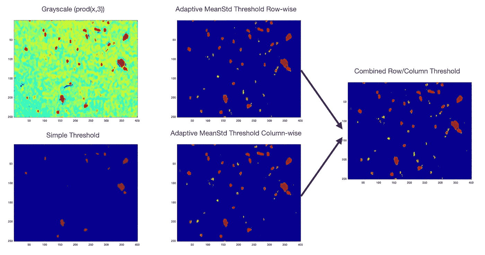

我们可以查看三幅图像的总计数，几乎是三倍。

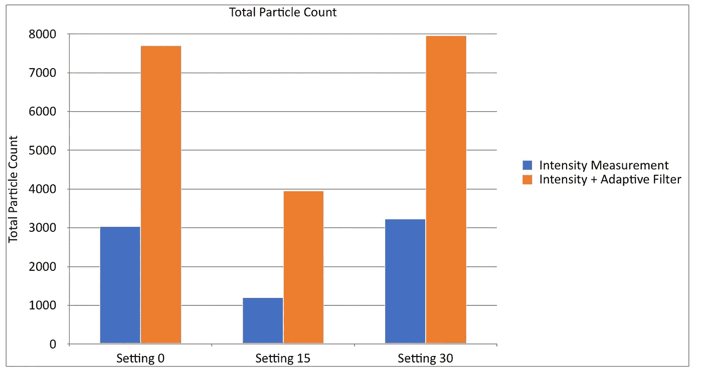

# 咖啡分发

我展示了前后粒子分布的对比。我在顶部有三个设置，然后我在下面拆分每个设置。

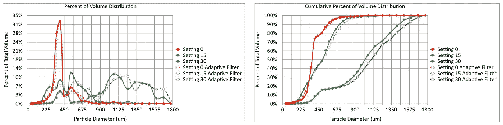

对于最小的设置有轻微的偏移，这证实了该技术能够挑选出更小的颗粒，或者至少它挑选出更多的小颗粒。

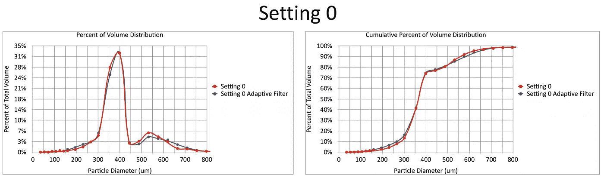

这看起来像是 15 号场景怪异分布的转变。

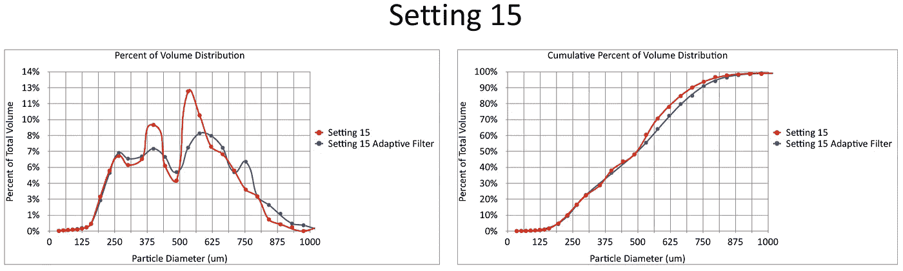

我越看这些分布，它们似乎越不符合我的想法，因为它们很不平坦。除了轻微的移动，这个基本上不受影响。

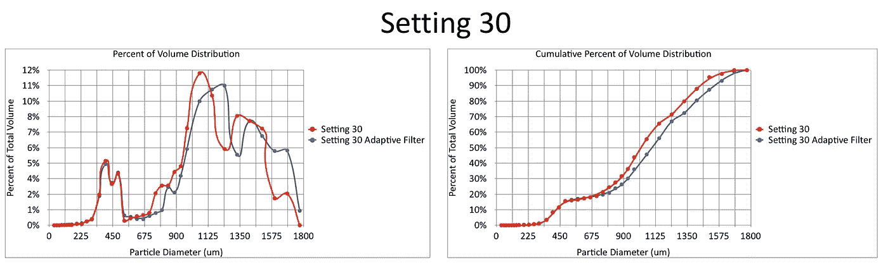

# 粒子分布

这些分布很接近，所以我观察了原始粒子的分布。

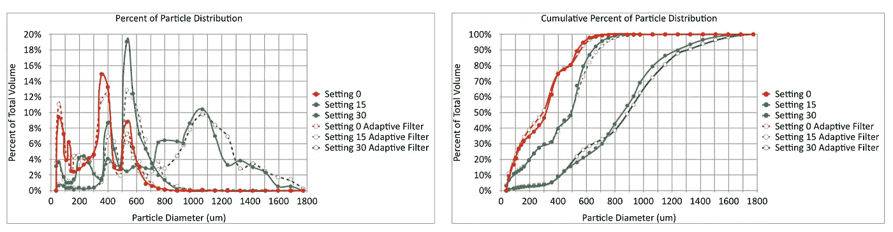

正如你在这张设置分类图中看到的，这两者非常接近。曲线的形状有些变化。

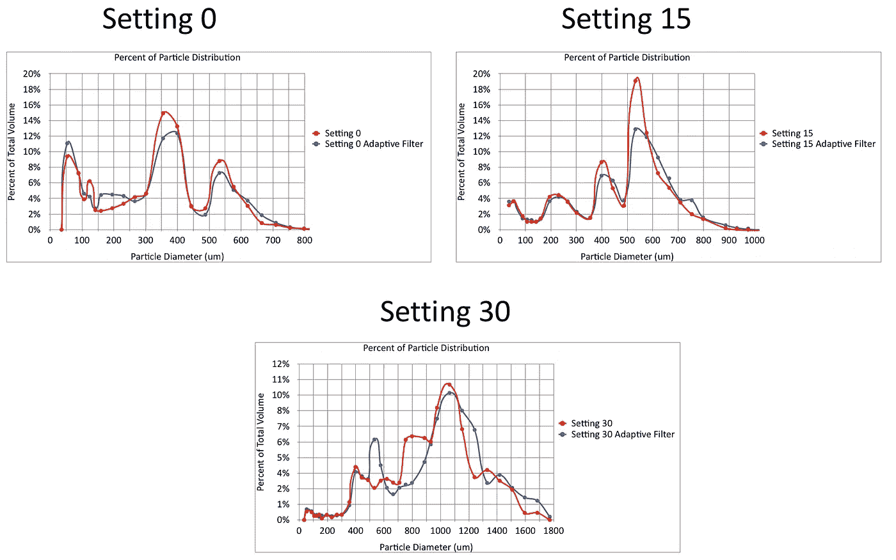

主要的问题仍然是假设咖啡是圆的，但它不是。然而，这种技术仍然可以比较好地比较不同的研磨设置和研磨机。我更有信心有一个自适应过滤器来帮助表征粒子。这种技术也使整个过程对光照变化更加鲁棒。

下一步是比较多个研磨设置和研磨机。

如果你愿意，可以在 Twitter 和 YouTube 上关注我，我会在那里发布不同机器上的浓缩咖啡视频和浓缩咖啡相关的东西。你也可以在 [LinkedIn](https://www.linkedin.com/in/robert-mckeon-aloe-01581595?source=post_page---------------------------) 上找到我。也可以关注我[中](https://towardsdatascience.com/@rmckeon/follow)。

# [我的进一步阅读](https://rmckeon.medium.com/story-collection-splash-page-e15025710347):

[浓缩咖啡系列文章](https://rmckeon.medium.com/a-collection-of-espresso-articles-de8a3abf9917?postPublishedType=repub)

[工作和学校故事集](https://rmckeon.medium.com/a-collection-of-work-and-school-stories-6b7ca5a58318?source=your_stories_page-------------------------------------)

[个人故事和关注点](https://rmckeon.medium.com/personal-stories-and-concerns-51bd8b3e63e6?source=your_stories_page-------------------------------------)

[乐高故事启动页面](https://rmckeon.medium.com/lego-story-splash-page-b91ba4f56bc7?source=your_stories_page-------------------------------------)

[摄影启动页面](https://rmckeon.medium.com/photography-splash-page-fe93297abc06?source=your_stories_page-------------------------------------)

[使用图像处理测量咖啡研磨颗粒分布](https://link.medium.com/9Az9gAfWXdb)

[浓缩咖啡过滤器:分析](/espresso-filters-an-analysis-7672899ce4c0?source=your_stories_page-------------------------------------)

[浓缩咖啡过滤篮:可视化](https://medium.com/@rmckeon/espresso-filter-baskets-visualized-189043a8929d?source=your_stories_page-------------------------------------)

[建模咖啡研磨机](/modeling-coffee-gringers-afb7c4949d6b?source=your_stories_page-------------------------------------)

[浓缩咖啡过滤器对比:佩萨多 vs VST](/espresso-filter-comparison-pesado-vs-vst-18a1321e62d?source=your_stories_page-------------------------------------)

[浓缩咖啡篮(VST):有脊与无脊](https://medium.com/swlh/espresso-baskets-vst-ridged-vs-ridgeless-89ac52767f13?source=your_stories_page-------------------------------------)

[IMS superficial vs VST:小样浓缩咖啡过滤器对比](/ims-superfine-vs-vst-a-small-sample-espresso-filter-comparison-4c9233e194?source=your_stories_page-------------------------------------)

[浓缩咖啡模拟:计算机模型的第一步](https://medium.com/@rmckeon/espresso-simulation-first-steps-in-computer-models-56e06fc9a13c?source=your_stories_page-------------------------------------)

[克鲁夫:对技术状态的进一步分析](https://medium.com/overthinking-life/kruve-further-analysis-on-the-state-of-the-art-18cf2f3b142c?source=your_stories_page-------------------------------------)

[克鲁夫咖啡筛:一项分析](https://medium.com/overthinking-life/kruve-coffee-sifter-an-analysis-c6bd4f843124?source=your_stories_page-------------------------------------)

[浓缩咖啡篮隆隆作响:机器人 vs 铂尔曼 vs 正派](/espresso-basket-rumble-robot-vs-pullman-vs-decent-9a63e9963a74?source=your_stories_page-------------------------------------)