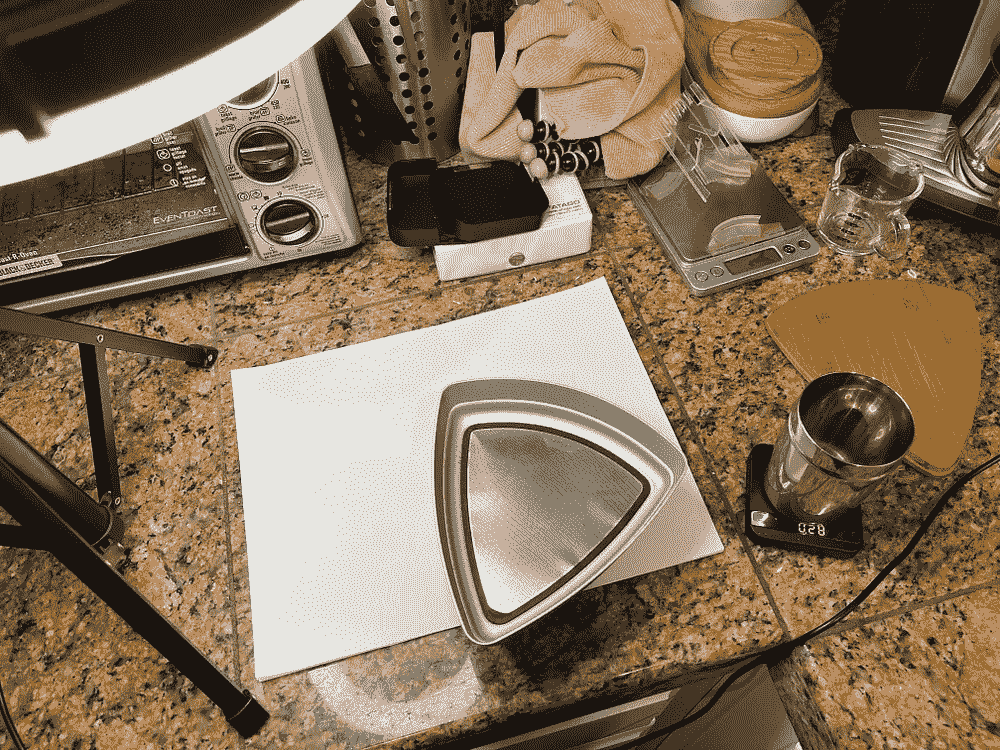

# 使用筛子改进咖啡研磨测量

> 原文：<https://towardsdatascience.com/improving-coffee-grind-measurement-using-a-sifter-7b358f9c8331?source=collection_archive---------43----------------------->

## 咖啡数据科学

## 使用图像处理了解磨床性能第 2 部分

[在之前的](https://link.medium.com/YAKHioMVXdb)中，我研究了使用图像处理来测量研磨颗粒分布，我发现这很有挑战性。拍摄图像需要细心，但这还不是全部。咖啡似乎发生了一些事情，因为根据图像处理技术，在[壁龛](https://www.nichecoffee.co.uk/)上设置 15 和 30 产生了类似的结果。我怀疑这是由于地面粘在一起，为了测试这一点，我将使用筛子。

我有一个 [Kruve](https://medium.com/overthinking-life/kruve-coffee-sifter-an-analysis-c6bd4f843124) 筛，我有几个筛(250，400，500，800)，但我主要用 400um 和 500um。考虑到我最关心的是使用一些利基研磨水平来制作一个[断奏](https://medium.com/overthinking-life/staccato-espresso-leveling-up-espresso-70b68144f94)镜头，我将注意力集中在这两个屏幕上，这两个屏幕给出了三个筛选水平。

所有图片由作者提供

我用了 4 或 5 颗豆子，所以测试很快。然后我筛出每一层的粉末，测量每一层的重量，然后把每一层的粉末放在纸上成像。

这里是使用研磨设置 15 在纸上的三个筛水平。

设置 15 幅图像:左边是<400um, Middle is between 400um and 500um, and the right is > 500um

我使用了从每个筛子测得的重量，并将其与成像测量结合起来，给出了下面的这些分布。这假设粒子是球形的([它们不完全是](https://rmckeon.medium.com/coffee-is-not-round-5c102491be4c)但是任何 3D 形状都与三次方成比例)。

然而，这些图表并不正确。设置 15 和 0 看起来太接近了，它们看起来都有很多较粗的颗粒，这是不可能的，因为使用了筛子将它们过滤掉。让我们看看设置 0 和每个筛子中颗粒的分布:

大于 500 微米的粉末数量是有问题的。对于< 400um 或中间值，任何高于 500um 的值都是错误的。很可能是由于多个粒子聚集在一起导致算法出现问题。

此外，如果我们合计三个筛子的体积，我们不会得到相对于地面事实的正确分布。

如果我们忽略所有期望筛之外的颗粒，我们得到的分布看起来好得多。这些曲线是在合并筛上数据时忽略筛范围之外的颗粒的结果。

将成像和筛子结合起来似乎是一种可以廉价确定咖啡研磨颗粒分布的技术，但这仍然没有达到更理想的情况，即任何人都可以将咖啡研磨颗粒放在一张纸上，并拍摄图像以获得颗粒分布。

在[第 3 部分](/measuring-fines-in-coffee-grounds-using-advanced-image-processing-148f048bdb7)中，我将研究这些数据，看看使用图像处理来自动清理图像可以做出哪些改进。

如果你愿意，可以在 [Twitter](https://mobile.twitter.com/espressofun?source=post_page---------------------------) 和 [YouTube](https://m.youtube.com/channel/UClgcmAtBMTmVVGANjtntXTw?source=post_page---------------------------) 上关注我，我会在那里发布不同机器上的浓缩咖啡照片和浓缩咖啡相关的视频。你也可以在 [LinkedIn](https://www.linkedin.com/in/robert-mckeon-aloe-01581595?source=post_page---------------------------) 上找到我。也可以在[中](https://towardsdatascience.com/@rmckeon/follow)关注我。

# [我的进一步阅读](https://rmckeon.medium.com/story-collection-splash-page-e15025710347):

[浓缩咖啡系列文章](https://rmckeon.medium.com/a-collection-of-espresso-articles-de8a3abf9917?postPublishedType=repub)

[工作和学校故事集](https://rmckeon.medium.com/a-collection-of-work-and-school-stories-6b7ca5a58318?source=your_stories_page-------------------------------------)

[个人故事和关注点](https://rmckeon.medium.com/personal-stories-and-concerns-51bd8b3e63e6?source=your_stories_page-------------------------------------)

[乐高故事启动页面](https://rmckeon.medium.com/lego-story-splash-page-b91ba4f56bc7?source=your_stories_page-------------------------------------)

[摄影飞溅页](https://rmckeon.medium.com/photography-splash-page-fe93297abc06?source=your_stories_page-------------------------------------)

[使用图像处理测量咖啡研磨颗粒分布](https://link.medium.com/9Az9gAfWXdb)

[浓缩咖啡过滤器:分析](/espresso-filters-an-analysis-7672899ce4c0?source=your_stories_page-------------------------------------)

[浓缩咖啡过滤篮:可视化](https://medium.com/@rmckeon/espresso-filter-baskets-visualized-189043a8929d?source=your_stories_page-------------------------------------)

[造型咖啡研磨机](/modeling-coffee-gringers-afb7c4949d6b?source=your_stories_page-------------------------------------)

[浓缩咖啡过滤器对比:佩萨多 vs VST](/espresso-filter-comparison-pesado-vs-vst-18a1321e62d?source=your_stories_page-------------------------------------)

[浓缩咖啡篮(VST):有脊与无脊](https://medium.com/swlh/espresso-baskets-vst-ridged-vs-ridgeless-89ac52767f13?source=your_stories_page-------------------------------------)

[IMS 超细 vs VST:小样浓缩咖啡过滤器对比](/ims-superfine-vs-vst-a-small-sample-espresso-filter-comparison-4c9233e194?source=your_stories_page-------------------------------------)

[浓缩咖啡模拟:计算机模型的第一步](https://medium.com/@rmckeon/espresso-simulation-first-steps-in-computer-models-56e06fc9a13c?source=your_stories_page-------------------------------------)

[克鲁夫:对技术状态的进一步分析](https://medium.com/overthinking-life/kruve-further-analysis-on-the-state-of-the-art-18cf2f3b142c?source=your_stories_page-------------------------------------)

克鲁夫咖啡筛:一项分析

[咖啡篮隆隆声:机器人 vs 铂尔曼 vs 体面](/espresso-basket-rumble-robot-vs-pullman-vs-decent-9a63e9963a74?source=your_stories_page-------------------------------------)