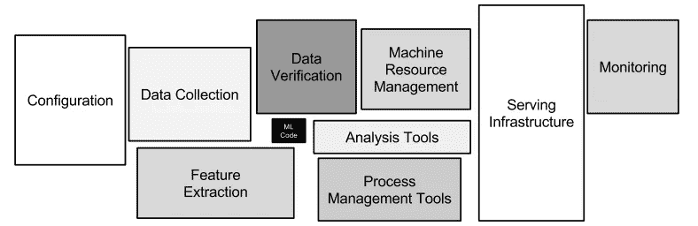
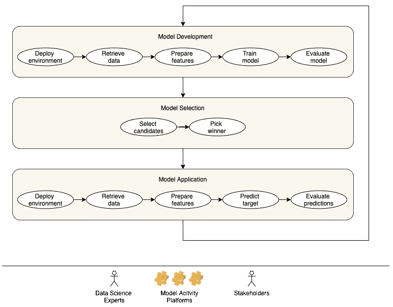
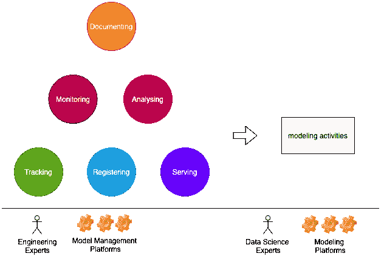
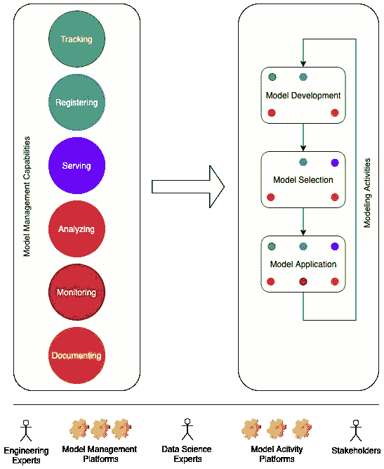

# 改进机器学习团队的模型管理实践

> 原文：<https://towardsdatascience.com/improving-model-management-practices-for-machine-learning-teams-3bec1dc40929?source=collection_archive---------24----------------------->

## 如何通过模型管理功能识别使机器学习活动更有效的问题

在本文中，我们阐述了如何通过模型管理功能来识别使机器学习(ML)活动更有效的问题。然而，我们并没有提出任何具体的解决方案，而是提供了一个系统地思考模型管理问题的框架。这样一个框架对于那些处于产业化或扩展他们的 ML 系统的边缘的团队来说是很有用的，他们可以在处理 ML 模型时解决技术债务或缺口。如果你对此感兴趣，请继续阅读。

图 1:只有一小部分真实世界的机器学习系统由机器学习代码组成，如中间的小黑框所示。所需的周边基础设施庞大而复杂。最初发表在论文[机器学习系统中隐藏的技术债务。](https://papers.nips.cc/paper/5656-hidden-technical-debt-in-machine-learning-systems.pdf)

ML 系统是复杂的，因为它们将所有的技术问题与维护代码库结合在一起，而代码库又是由数据和建模问题产生的。如图 1 所示，生成 ML 模型的代码只是整个系统中用于端到端模型处理的一小部分。模型管理的目标是使所有建模活动中的 ML 模型的处理尽可能简单和高效。在接下来的小节中，我们将简要描述建模活动以及管理功能。如果您已经熟悉这些概念，请跳到下两个部分。

# ML 建模中的活动

图 2:ML 中的三个主要建模活动:开发、选择和应用。这些活动具有线性相关性。这些活动主要由数据科学专家监督和执行，而活动的结果可由利益相关方(如业务方的代表)访问和批准。这些活动是在团队可访问的基础设施上的一系列平台上进行的。图片由作者提供。

图 2 描述了 ML 建模中的三个主要活动:模型开发、选择和应用。*模型开发*是使用训练数据训练新模型的过程。*模型选择*是从一组训练好的模型中选出一个获胜模型的过程。*模型应用*是使用选定的模型进行预测工作以促进业务流程的过程。这些活动具有线性依赖关系，这意味着它们必须按照一定的顺序执行。例如，在生产中应用一个模型一段时间后，它的性能可能会因为不同的原因而下降。在这种情况下，需要重新开发和选择新的模型。

建模活动的结果最终会进入业务流程，并且很可能需要得到业务代表的理解和批准。这些活动由数据科学专家执行，即在这些活动中具有知识和/或经验的分析师、科学家、工程师。这些活动在众多平台上开展。为了更好地理解，我们在这里列出了几个这样的平台:

*   代码管理: [GitHub](https://github.com/)
*   数据管理: [Azure 数据湖](https://azure.microsoft.com/sv-se/solutions/data-lake/)
*   集群管理: [Azure Kubernetes 服务](https://azure.microsoft.com/en-us/services/kubernetes-service/)
*   工作流管理:[阿帕奇气流](https://airflow.apache.org/)
*   知识管理:[微软 Sharepoint](https://www.microsoft.com/en-us/microsoft-365/sharepoint)
*   仪表盘管理:[电量 BI](https://powerbi.microsoft.com/en-us/)

现代组织中的团队访问云计算服务提供的基础设施中的大多数平台，如 [Azure](https://azure.microsoft.com/en-us/) 。你会发现来自其他提供商的类似平台，比如[谷歌云](https://cloud.google.com/)、[亚马逊网络服务](https://aws.amazon.com/)。

# 模型管理功能

图 3:模型管理过程中的关键能力:跟踪、注册、服务、分析、监控和文档化。ML 建模活动使用这些能力来更有效和透明地管理这些活动的输入和输出。数据科学专家是这些能力的主要利益相关者。这些功能主要是由团队中的工程专家通过团队可以访问的一系列平台提供的。图片由作者提供。

模型管理功能使得使用模型变得更加简单、透明和高效。如图 3 所示，主要功能是跟踪、注册、服务、分析和监控。*模型跟踪*是保持关于建模活动的关键信息记录的能力。*模型注册*是使用一系列打包格式将模型注册为版本化模型的能力。此外，它让模型处于众所周知的状态，例如，测试、生产、存档等。并且能够改变模型的状态。*模型服务*是使模型可用于预测过程的能力。*模型分析*是通过输入和输出的质量来评估模型质量的能力。*模型监控*是跟踪模型和数据质量并对不可接受的变化做出反应的能力。*模型文档*是在执行活动的团队之内和之外获取和传递关于建模活动的部落知识的能力。

模型管理功能由图 1 中描述的不同系统来表示。我们在此列举几个众所周知的公共平台作为例子:

*   数据块的 [MLflow](https://mlflow.org/)
*   海王艾的[海王](https://neptune.ai/)
*   亚马逊的 [SageMaker](https://aws.amazon.com/sagemaker/getting-started/)
*   Azure 的[机器学习](https://azure.microsoft.com/en-us/services/machine-learning/)
*   谷歌的[顶点 AI](https://cloud.google.com/vertex-ai)
*   网飞的[元流](https://metaflow.org/)

# 改进建模活动

图 4:模型管理能力与建模活动之间的关系。颜色编码的模型管理功能作为较小的表示放在不同的建模活动中。图片由作者提供。

图 4 展示了模型管理功能和建模活动监控之间的关系。我们建议，改进模型训练需要关注模型跟踪、注册、分析和记录。改进模型选择需要关注模型注册、服务、分析和记录。改进模型应用需要采用所有的模型管理功能。

为了更好地阐明这一点，我们提出了下面的框架，重点关注七个改进挑战。

## 模型管理挑战

为了更好地理解这些挑战，我们使用了一些改进因素:

*   *持续时间*:完成挑战需要多长时间？
*   *准确性:*解决挑战的解决方案/方法的质量如何？
*   *清晰的范围:*在不同的上下文中使用模型有多容易？
*   便携性:在任何地方使用该机型有多容易？

**挑战 1:** 观察并展示跑步过程中发生的事情

相关性:所有三个建模活动

关键改善因素:

*   持续时间:当模型跟踪使用不是专门为模型管理而构建的不同技术时，该任务需要很长时间。为了应对这个挑战，有必要关注一个模型跟踪工具，它提供了一个单一的面板来捕获和显示所有的信息。您可以从现代代码管理工具中获得灵感，例如 [GitHub](https://github.com/) ，它提供了一个 CLI 和一个 UI 来处理许多代码更改。

**挑战 2:** 决定一个模型的质量是否适合生产使用

相关性:模型开发和选择

关键改进因素:

*   准确性:当模型分析和测试方法不充分且不一致时，决策的准确性较低。因此，有必要集中精力提高可重复和可再现的模型分析和测试的覆盖率。您可以从[测试驱动开发](https://www.freecodecamp.org/news/test-driven-development-what-it-is-and-what-it-is-not-41fa6bca02a2/)的实践中获得灵感，在这种实践中，从一开始就以某种方式为代码开发考虑一系列单元、集成和其他种类的测试。
*   持续时间:如果模型分析和测试方法大部分是手工完成的，那么这个任务需要很长时间。因此，有必要关注尽可能自动化的分析和测试。您可以从代码变更的[持续集成](https://www.atlassian.com/continuous-delivery/continuous-integration/how-to-get-to-continuous-integration)实践中获得灵感，其中自动化单元和集成测试扮演着至关重要的角色。

**挑战 3:** 在生产中高效使用模型

相关性:模型应用

关键改进因素:

*   持续时间:由于缺乏良好的模型服务解决方案，准备运行预测作业花费的时间太长。为了应对这一挑战，有必要投资一个好的模型服务解决方案(购买或内部开发)。你可以从构建能够对几乎所有查询提供亚秒级响应的[搜索引擎](https://www.youtube.com/watch?v=BhAGrenI_xE)中获得灵感。
*   清晰的范围:当缺乏定义模型版本和状态的能力时，模型的范围是不清晰的。此外，当一个模型通过它的存储位置而不是一个(唯一可识别的)名称被引用时，情况会变得更糟。为了应对这一挑战，有必要采用一种注册管理机构模式。为了获得灵感，你可以查看 [API 版本控制技术](https://www.freecodecamp.org/news/how-to-version-a-rest-api/)。

挑战 4: 监控生产中模型的质量

相关性:模型应用

关键改进因素:

*   准确性:当数据、概念和模型发生漂移时，模型的质量会降低。如果不测量这种漂移，就很难确定是否/何时会发生这种漂移，从而影响对降级作出反应的机会。此外，不知道漂移的严重程度会导致不正确的响应。为了解决这个问题，重要的是进行这样的测量，并将其作为常规分析的一部分。从过去的经验中收集知识也很重要，这将为未来的事件建立反应基准。为了获得灵感，考虑一下[仪表盘](https://en.wikipedia.org/wiki/Dashboard)和现代汽车的基本技术，它会在轮胎压力低、发动机温度高等情况下发出警告。以及对这种警报的不同程度的反应。
*   持续时间:如果大部分步骤是手动进行的，那么捕捉漂移的持续时间太长。为了应对这一挑战，有必要投资一个良好的监控解决方案(购买或内部开发)。要获得灵感，您可以看看[基础设施监控解决方案](https://www.datadoghq.com/)。

**挑战 5:** 使用开发团队范围之外的模型

相关性:模型应用

关键改善因素:

*   可移植性:如果意大利面条式的代码溢出到打包的模型中，那么使用模型的依赖性就很高。此外，缺乏模型元信息，例如，输入-输出模式和样本数据、种子、超参数等。，与模型使问题变得更糟。为了解决这个问题，有必要遵循一个好的模型验证机制，这包括采用更好的模型分析和模型注册解决方案。为了获得灵感，考虑一下 Python [库打包](https://pypi.org/)，它支持在任何操作系统环境中安装新的库。

**挑战六:**重现一次奔跑

相关性:所有三个建模活动

关键改善因素:

*   准确性:缺乏重现运行能力的主要原因是缺少代码、配置、数据和任何其他使其可行的依赖版本。关注这些工件的更好的版本控制能力是很重要的。从更简单的对应物中获取灵感，即 [GitHub](https://github.com/) 提供的代码版本控制能力。
*   持续时间:延迟执行任务的主要原因是缺乏良好的跟踪能力和任何利用跟踪版本的工作流自动化能力。因此，关注基于版本化信息的工作流非常重要。为了获得灵感，你可以看看关于代码测试覆盖率和代码版本质量分析的[持续集成](http://continuous integration)过程。

**挑战 7** :执行整个流程，包括但不限于安排活动、处理对资源和工件的依赖、准备、风险监控等。建模活动

相关性:所有三个建模活动

关键改善因素:

*   准确性:一个不准确的过程的主要原因是在大多数阶段严重依赖于人工参与，并且分散的技术不是主要为模型管理而构建的。重要的是尽可能地转换手动步骤，同时采用一个解决方案框架，能够使用几个窗格完成大多数步骤。你可以从[空中交通管制](https://en.wikipedia.org/wiki/Air_traffic_control)活动和实践中获得灵感。
*   持续时间:需要很长时间来应对这一挑战的主要原因是大多数步骤都是手动的。重要的是尽可能自动化这些步骤，使它们易于执行和简化。您可以从[空中交通管制](https://en.wikipedia.org/wiki/Air_traffic_control)活动和实践所采用的技术中获得灵感。

**整体挑战:**传授建模活动的知识

相关性:所有三个建模活动和以上所有七个挑战

关键改善因素:

*   准确性:准确性低的主要原因是缺乏针对不同技能水平的足够的文档。重要的是专注于全面记录以捕捉所有细节。从知名图书馆的文档中获取灵感，例如 [scikit-learn](https://scikit-learn.org/stable/user_guide.html) 。
*   持续时间:持续时间长的主要原因是缺乏良好的文档组织。不管理信息，不提供良好的结构，不在更少的地方维护，不提供容易访问的机制，就会导致这样的情况。从知名图书馆的文档中获取灵感，例如 [scikit-learn](https://scikit-learn.org/stable/user_guide.html) 。

# 评论

一次性解决所有这些挑战是不可行的。当一个团队没有解决一些或所有的挑战时，采取一种务实的方法是很重要的。我们在这里提供一种方法。挑战 1-4 比其余的更重要。因此，我们作为一个团队可以对属于该组的挑战进行优先排序。在每个挑战中，准确性和功能性比持续时间和文档化更重要。

显然，细节决定成败。你面临这些挑战吗？这些澄清有用吗？你不同意这样的观点吗？让我们知道。

我要感谢我在 H&M 的同事，他们为这篇文章提供了意见和反馈。