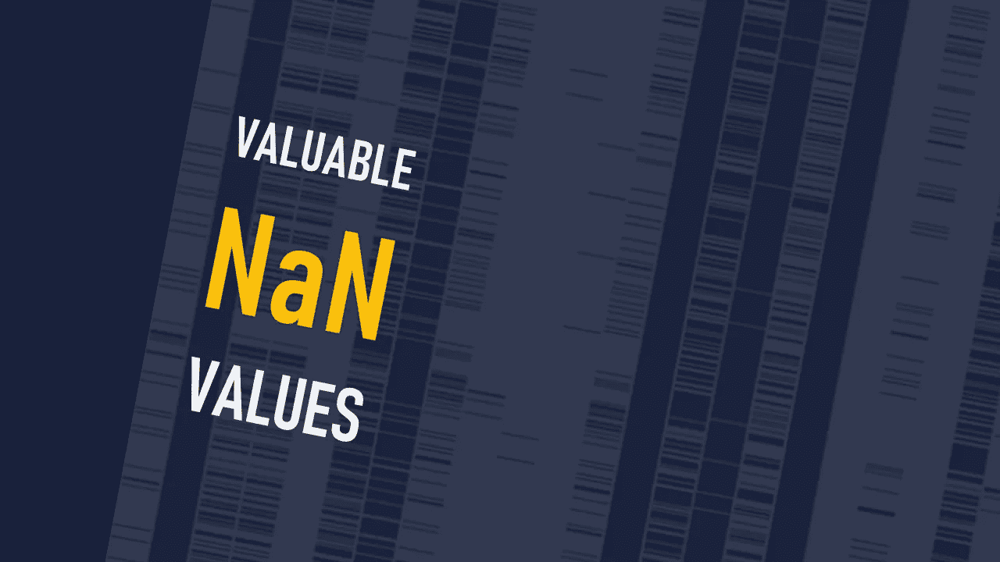

# 使用缺失值改进模型

> 原文：<https://towardsdatascience.com/improving-models-with-missing-values-52fb19559948?source=collection_archive---------37----------------------->

## 数据科学

## 从缺失值中获取有价值的信息。

图片由作者提供。

当我加载一个新的数据集时，我首先检查的事情之一是我们有多少丢失的值。看到所有这些南价值观令人失望和沮丧。超过 50%的值缺失的列并不罕见。我们都对新的数据集感到兴奋，主要是因为新的数据集意味着更多的数据和更多的改进。但是像任何其他以前的数据集一样，新的数据集充满了无用的缺失值！！！！

> 但是等等！缺失的价值观真的无价吗？我能从缺失的值中获得一些额外的信息或见解吗？

在这篇短文中，我将改变你对缺失数据的看法。我将向您展示如何以不同的方式看待缺失值，并利用缺失数据提高模型性能。让我说清楚，专业数据科学家和普通数据科学家之间的主要区别之一是他们如何处理缺失值并从中获得有价值的信息。

我先问个问题。当您看到缺少值时，您会怎么做？我们中的许多人最初(或永久)移除它们。我们中的一些人折磨自己几个星期来归咎于他们。

在调查其背后的原因之前，删除或输入缺失的值有三个负面后果。

1.  删除缺失值的样本(即行)会迫使我们忽略其他非缺失值，这些值可以帮助我们构建更好的预测模型。
2.  移除具有大量缺失值的特征(即，列)会再次移除该特征的其他非缺失值，这是对数据的浪费。
3.  有时，缺失值本身就具有很好的信息，这些信息对于改进分析或我们预测模型的性能是必要的。
4.  删除或输入缺失值会给我们的模型带来偏差。

让我说清楚。我不反对删除或添加丢失的值，但是你可以问自己几个问题。这里有三个重要的问题，在遗漏数据删除或插补之前，你必须问自己。

马库斯·温克勒在 [Unsplash](https://unsplash.com?utm_source=medium&utm_medium=referral) 上的照片

# 是什么产生了这些缺失值？

想象一下，我们有一个医学研究小组收集的患有和未患有某种癌症的人的数据集。你有两组的所有信息。缺失的一列可能是活检测试结果。没有癌症的人的价值观缺失是有道理的，但为什么我们对最终确诊为癌症的人有很多价值观缺失呢？一个简单的解释是，收集数据的医学研究小组无法找到一些患者的活检结果，因此跳过了这些结果。但一个更重要的原因可能是医生因为其他因素而没有安排活检。例如，可能其他测试结果使医生确信应该诊断癌症(即使没有活检)。或者另一种可能性是，医生无法诊断癌症，并拒绝安排活检测试。如果您删除或忽略丢失的值，您将丢失大量信息。在本例中，缺失值是这种特定类型癌症的症状非常明确和非常不明确的一类患者。活检结果中没有缺失值的患者(样本)是具有足够症状的患者，医生为他们安排了活检。

如您所见，缺失值为我们提供了至关重要的信息。获得这些有价值信息的唯一方法是思考为什么我们会看到一个缺失的值并理解它的意义。

请记住，缺失值不仅仅是由数据收集者的错误造成的。也许，其他因素(本例中的医生)出于某些原因决定将其作为缺失值。

迈克·阿隆佐在 [Unsplash](https://unsplash.com?utm_source=medium&utm_medium=referral) 上的照片

# 缺失数据和其他数据之间有关联吗？

有时，一个或几个特征与缺失值之间有很好的相关性。换句话说，缺失值不是随机缺失的。

一个非常简单的例子是从患者信息表中收集的数据。这些数据中的许多(尤其是原始数据集)都缺少关于怀孕问题的值。男人不检查这些问题(当然)，这些表格的原始数据集将在那些列中充满缺失值。请注意，一些女性可能没有检查这些问题，但是男性患者的缺失值与女性患者的缺失值的含义不同。

有时，您可能会看到丢失的值与一些奇怪的特征(如 id 或代码号)之间的关联。例如，在医院中，患者 ID 号或订单编号可能有特定的含义。有时，缺失值和 ID 号之间的关联可以帮助我们理解缺失值以及这些代码和数字背后的结构。

戴维·特拉维斯在 [Unsplash](https://unsplash.com?utm_source=medium&utm_medium=referral) 上拍摄的照片

# 有缺失值的样本是否存在偏倚？

(在调查缺失值背后的原因之前)移除缺失值样本的另一个危险是给我们的模型或研究带来偏差。假设我们有一个在线约会应用程序的用户资料数据库。该数据库可以基于年龄和种族为可选问题的问卷来制作。我们应该期待女性或少数民族群体对这些与年龄和种族相关的问题不予回答吗？我认为这是一种可能性。如果我们删除基于缺失值的行，我们会在模型中引入偏差。我的假设(应该被检验)是，在去除了提到的缺失值的样本后，数据库应该更偏向于白人男性。通过这个假设的例子，我想向您展示，在不考虑固有偏差的情况下删除缺失值的样本会如何导致有偏差的模型。

# 摘要

缺失值可能包含重要的信息，这些信息不仅可以改善我们模型的性能，还可以改善我们正在解决的业务问题。

在删除或添加丢失的值之前，问自己三个问题。

1)是什么产生了这些缺失值？

2)缺失数据和其他数据之间有什么关联吗？

3)有缺失值的样本是否存在偏倚？