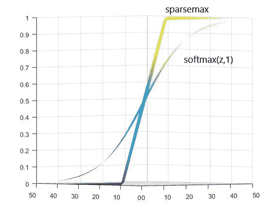
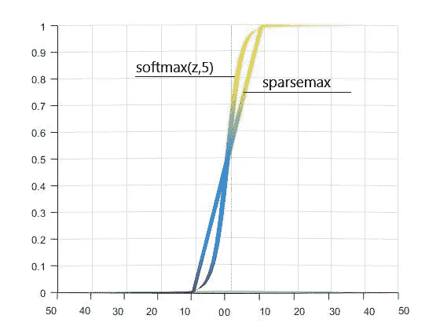

# 提高 TabNet 的推理速度

> 原文：<https://towardsdatascience.com/improving-the-inference-speed-of-tabnet-971397b74f63?source=collection_archive---------41----------------------->

## [*小窍门*](https://towardsdatascience.com/tagged/tips-and-tricks)

## 通过修改一行代码来加速 TabNet 推理的简单方法。

TabNet[1]是一个基于深度神经网络(dnn)的表格数据集模型。TabNet 的作者声称，dnn 对于图像数据、序列数据(例如，文本)是成功的，但是当涉及到表格数据时，它的性能比 LGBM 或 XGBM 等梯度增强模型差。作者试图用 dnn 解决这个问题。他们可以为表格数据集开发一种新的基于 dnn 的模型，并表明 TabNet 的性能明显优于梯度推进模型。此外，TabNet 在一项 Kaggle 竞赛中提供了其卓越的性能——动作预测机制[2]。

尽管 TabNet 的性能很好，但它有一个弱点——推理速度慢。我先解释一下为什么推理速度慢(如果不感兴趣可以跳到下一段下一段)。由于其特征选择步骤，TabNet 很慢。TabNet 使用“sparsemax”[3]选择其特征，对于向量$z$，sparse max 定义为:

```
sparsemax_i(z) = [z_i - \tau(z)]_+ 
```

Sparsemax 输出稀疏概率，这在进行特征选择时很有用。例如，假设我们有 3 个特征(A、B 和 C)，只有 A 与预测相关。在这种情况下，sparsemax 在 A 上分配概率 1，在 B 和 C 上分配概率 0，以便只处理合适的特征。我们在 softmax 上没有看到这种趋势。

现在，我们来谈谈为什么 sparsemax 会让 TabNet 变慢。慢度来自上面函数中的$\tau(z)$值。为了获得$\tau(z)$，它涉及排序和搜索时间复杂度分别为 O(n*log(n))和 O(n)的最大值，其中$n$是向量$z$的长度。

那么，我们该如何解决这个问题呢？我建议使用 softmax 而不是 sparsemax，但要用 multiplier $m$。

```
softmax_i(z,m) = exp(m*z_i)/(exp(m*z_1)+...+exp(m*z_n))
```



Sparsemax V softmax:从左到右，乘数分别设置为 3、1 和 5。z 的长度是 2。

上图显示了 sparsemax 和 softmax 之间的比较。正如 sparsemax[3]的作者所声称的，sparsemax 在创建稀疏概率方面可以比乘数为 1 的 softmax 执行得更好。然而，当我们增加乘数幅度时，softmax 相当好地逼近 sparsemax，尤其是当乘数等于 3 时。此外，计算 softmax 比计算 sparsemax 要快得多。因此，我们可以期待快速的推理速度！

**性能对比:**我将这个修改版的 TabNet 应用于 Kaggle 竞赛，简街市场预测[4]。在那场比赛中，一个人需要在 16 毫秒内决定是否接受金融交易机会，给出的数据是表格。虽然这是一个金融交易决策问题，但我不认为它可以用时间序列来表述，因为大部分数据都是匿名的:匿名的特征、匿名的证券类型、匿名的市场等等。不管怎样，我能得到 7990.420 分，而其他人只能得到 5000 分。在比赛中，大多数人因为 TabNet 的推理时间慢而停止使用它，而我利用了 softmax 的快速推理。

综上所述，我建议使用带乘法器的 softmax 来提高 TabNet 的推理速度。虽然我没有将它应用于许多其他数据集，但它似乎不会因为使用 softmax 和 multiplier 而降低性能；它有时会提高性能。

请务必让我知道，如果你发现任何错误或如何在媒体中键入数学方程式。感谢您阅读我的文章。

**参考**

[1] Arik，S.O .和 Pfister，t .，2019 年。Tabnet:专注的可解释表格学习。 *arXiv 预印本 arXiv:1908.07442* 。

[2]卡格尔。2020.作用机制(MoA)预测。[https://www.kaggle.com/c/lish-moa](https://www.kaggle.com/c/lish-moa)

[3] Martins，a .和 Astudillo，r .，2016 年 6 月。从 softmax 到 sparsemax:注意力和多标签分类的稀疏模型。在*机器学习国际会议*(第 1614–1623 页)。PMLR。

[4]卡格尔。2021.简街市场预测。[https://www.kaggle.com/c/jane-street-market-prediction](https://www.kaggle.com/c/jane-street-market-prediction)