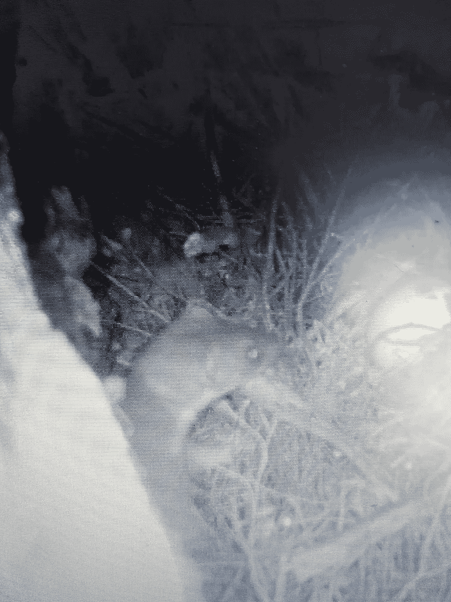

# 为鸟类改善世界

> 原文：<https://towardsdatascience.com/improving-the-world-for-birds-3ab0ecbdbe21?source=collection_archive---------28----------------------->

## [变更数据](https://towardsdatascience.com/tagged/data-for-change)

## 一次一只捕食者


怀塔克里山脉的惠亚湾。得到[凯莉·贝内特](https://kellybennett.photography)许可的照片

想象一下，就一会儿，你可以通过在你的社区做一些小事来改变现状。这就是成千上万的新西兰人在全国各地所做的，他们一起努力捕捉入侵的食肉动物。新西兰是一个鸟类之国，但负鼠、老鼠、刺猬和鼬(雪貂、黄鼠狼和白鼬)已经大量减少了鸟类的数量，并且在许多地区还破坏了原始森林。新西兰人正在夺回国家，改善鸟类的世界，一次一个捕食者。只需要一点时间，正确的诱捕方法和足够多的邻居。

新西兰“干净、绿色”的形象有点像神话。今天的国家是一个高度改良的环境，其中最深刻的改变是哺乳动物的引入。政府保护部门记录了澳大利亚的刷尾负鼠，不仅严重破坏了标志性的本土树木，如 [Pohutukawa](https://projectcrimson.org.nz/wp-content/uploads/2016/05/Possum-Brochure-Jan-2014-web.pdf) ，还吃掉鸟蛋甚至雏鸟。在这段视频中，kea 保护基金会记录了负鼠对活着的 Kea 雏鸟的捕食。

刺猬通常被认为是可爱的，虽然它们在英国受到保护，但在新西兰，刺猬攻击南岛辫状河上的涉禽巢穴，并吃掉大量的本地无脊椎动物。当亚南极山毛榉森林或罗汉松森林有所谓的[“肥大年”](https://predatorfreenz.org/what-mast-why-matters/)时，船鼠、挪威鼠和老鼠繁殖迅速，它们的数量激增。这些啮齿动物是贪婪的掠食者，不仅捕食鸟蛋，还捕食当地特有的昆虫，如湿地鼠和本地石龙子。视频中甚至有老鼠啃食活信天翁幼鸟的记录。

白鼬和其他鼬类动物，如雪貂和黄鼠狼，是最凶残的外来食肉动物。它们不寻常的生殖系统允许它们优化利用现有的食物，它们在肥大的年份享用老鼠爆发的食物。众所周知，它们很难被捕获。

在新西兰捕捉捕食者有一个不寻常的方面，那就是将努力转化为一个公民科学项目。许多人统计他们的诱捕捕获量，并将它们输入数据库。有几个[应用程序](https://predatorfreenz.org/resources/recording-monitoring-options/online-data-collection/)可用于记录和总结捕获量。在某些情况下，这些应用程序还提供有毒杂草和鸟类的数量。

这些数据本身对于追踪减少或甚至从景观中消除入侵捕食者的进展非常有用。在某些情况下，消灭是可能的，新西兰已经在世界上率先消灭了隐藏着珍贵本土动植物的近海岛屿上的食肉动物。[捕食者自由 2050](https://www.doc.govt.nz/nature/pests-and-threats/predator-free-2050/history/) 是一个政府资助的项目，有着更广泛的抱负[仍然有争议](https://medium.com/@jameswinter_91781/predator-free-2050-almost-just-a-fantasy-ec336bf72e38)。无论最终是否有可能从新西兰消灭捕食者，无可争议的是，邻里诱捕具有减少当地捕食者数量和改善鸟类生活环境的潜力。

## 将陷阱与摄像机配对

动物的行为很复杂，通过使用野生动物摄像机观察陷阱周围的行为，可以提高邻里诱捕的成功率。在 Waitakere 山脉的 Huia 进行诱捕时拍摄的镜头很有启发性。

在这个视频中，老鼠研究了一个自动化的 Goodnature A24 陷阱。然后，一只负鼠试图袭击陷阱，触发装置，产生一个错误的捕杀记录。第二天晚上，一只老鼠被 A24 捕鼠器杀死，第二天早上，尸体被一只猫吃掉了，没有尸体。如果没有录像，就不可能知道一个是假杀，一个是真杀。

下一个视频解决了一个谜，一个捕鼠笼陷阱被触发，诱饵被移走，但陷阱里什么也没有。为了确定谁该负责，我安装了一个摄像头。答案是老鼠触发陷阱并吃掉诱饵，而老鼠和一只乌鸫也从陷阱内外同时吃掉诱饵。这个问题是通过在鼠笼附近设置捕鼠夹来解决的。

另一个问题是诱饵是从捕鼠夹里偷出来的。这段视频展示了一只大的雄性老鼠在一只负鼠到来之前从捕鼠夹里偷取野生饲料诱饵。解决办法是在负鼠陷阱附近放置一些捕鼠器，以杀死诱饵袭击者。

在下一个视频例子中，诱饵从 Goodnature A24 自动捕鼠器中消失，一台摄像机让我确定罪犯是老鼠。一只刺猬的死亡证明了捕鼠器已经装好并且正在工作，这只刺猬尝试了和老鼠一样的把戏。

最后，运动感应相机可能会捕捉到尚未被捕捉到的重要掠食者。在这个例子中，相机捕捉到一只白鼬。这是非常重要的信息，因为白鼬很怕陷阱，通常只对用整只蛋做诱饵的陷阱感兴趣。它们是新西兰最具破坏性的哺乳动物掠食者。



摄像机截图显示一只尚未被陷阱捕获的白鼬。照片由惠亚陷阱组的戴夫·明蒂许可。

视频显示白鼬拿一个鸡蛋。视频许可戴夫明蒂，惠亚陷阱组。

## 数据探索

经过三年的邻近诱捕，我们现在在 Huia 有超过 1000 次捕获，所以我们可以对数据提出一些探索性的问题。首先，我们在抓什么？答案主要是大鼠和小鼠(图 1B 和 A)，刺猬(图 1C)和负鼠(图 1D)少得多。老鼠是最丰富的捕获物(图 1B)。第二个问题是捕获量是否有季节性？有了四年的数据，捕鼠的季节模式很明显(图 1A)，但老鼠、刺猬或负鼠没有明显的季节模式。老鼠在冬天更容易被抓到(图 1A)。也有一些迹象表明，更多的老鼠是在秋季或冬季被捕获的，尽管与老鼠相比，这种模式在不同年份之间变化更大(图 1B)。


图 1:在过去的 4 年中，新西兰怀塔克里山脉的休伊阿地区的邻里捕获组捕获的捕食者。所有这些食肉动物都是已知会破坏鸟类生活的哺乳动物。这项诱捕行动是对新西兰政府保护部 2050 年无捕食者行动的自愿贡献。

## 密码

使用 [tidyverse](https://www.tidyverse.org) 系统用 R 编写了这个初步分析的代码。[的完整剧本可以在这里下载](http://u.pc.cd/lB3ctalK)。代码的解释如下。

加载必要的库:

```
*# plot_catches
library*(tidyverse)
*library*(tibbletime)
*library*(lubridate)
*library*(gridExtra)
*library*(ggthemes)
*library*(ggpubr) 
```

原始数据是从我们的 Huia 项目中导出的。新西兰网站。这段代码使用的数据可以从这里下载[。](http://u.pc.cd/CC67)

```
*# load raw data* series <- *read_csv*("./data/export.csv")
```

陷阱存储的数据。由于储存的方式，新西兰需要一些操作。日期以字符形式存储，渔获量作为一个称为“捕获的物种”的单一变量存储，而不是作为每个物种的单独变量存储，这很不方便。


以下代码将导出的数据转换为结构合理的时间表，每个物种有单独的变量:

```
*# keep the required variables* series2 <- *select*(series, Date, "Trap type", "Trap", "Recorded by", "Species caught")

*# create new variable  with Date in the correct format,
# and new variables for catches by species* series2 <- *mutate* (series2,
                   date = *dmy_hm*(Date, tz = "Pacific/Auckland"),
                   rats = *ifelse* (series2$"Species caught" %in% *c* ("Rat", "Rat - Ship", "Rat - Norway"), 1, NA),
                   mice = *ifelse* (series2$"Species caught" == "Mouse", 1,NA),
                   possums = *ifelse* (series2$"Species caught" == "Possum", 1,NA),
                   hedgehogs = *ifelse* (series2$"Species caught" == "Hedgehog", 1,NA),
                   scavenged = *ifelse* (series2$"Species caught" == "Unspecified", 1, NA)
)
*# convert tibble to tibble time
# summarize catches by time interval* series2 <- *as_tbl_time*(series2, index = date)
series2 <- *arrange*(series2, date)

*# keep the required variables* series2 <- *select*(series2, date, rats, mice, possums, hedgehogs, scavenged)
```

现在，时间变量可用于方便地将数据分组为四分之一年的季节:

```
grouped_data <- *collapse_by*(series2, "quarterly") %>%
  dplyr::*group_by*(date) %>%
  dplyr::*summarise_all*(sum, na.rm=TRUE)
```

接下来，绘制数据:

```
*# Plots* mp <- *ggplot*(grouped_data, *aes*(x = date, y = mice)) +
  *geom_bar*(stat = "identity") +
  *geom_bar*(stat="identity", fill="darkblue") +
  *annotate*("text", x = grouped_data$date[1:16], y = -12,
           label = *rep*(*c*("Spring","Summer","Autumn","Winter"),4),
           size=3.5, angle = 70) +
  *ylim*(-20,80) +
  *theme_hc*(base_size = 18)

rp <- *ggplot*(grouped_data, *aes*(x = date, y = rats)) +
  *geom_bar*(stat = "identity") +
  *geom_bar*(stat="identity", fill="dark gray") +
  *annotate*("text", x = grouped_data$date[1:16], y = -12,
           label = *rep*(*c*("Spring","Summer","Autumn","Winter"),4),
           size=3.5, angle = 70) +
  *ylim*(-20,80) +
  *theme_hc*(base_size = 18)

hp <- *ggplot*(grouped_data, *aes*(x = date, y = hedgehogs)) +
  *geom_bar*(stat = "identity") +
  *geom_bar*(stat="identity", fill="dark gray") +
  *annotate*("text", x = grouped_data$date[1:16], y = -12,
           label = *rep*(*c*("Spring","Summer","Autumn","Winter"),4),
           size=3.5, angle = 70) +
  *ylim*(-20,80) +
  *theme_hc*(base_size = 18)

pp<- *ggplot*(grouped_data, *aes*(x = date, y = possums)) +
  *geom_bar*(stat = "identity") +
  *geom_bar*(stat="identity", fill="dark gray") +
  *annotate*("text", x = grouped_data$date[1:16], y = -12,
           label = *rep*(*c*("Spring","Summer","Autumn","Winter"),4),
           size=3.5, angle = 70) +
  *ylim*(-20,80) +
  *theme_hc*(base_size = 18)

sc<- *ggplot*(grouped_data, *aes*(x = date, y = scavenged)) +
  *geom_bar*(stat = "identity") +
  *geom_bar*(stat="identity", fill="dark gray") +
  *annotate*("text", x = grouped_data$date[1:16], y = -12,
           label = *rep*(*c*("Spring","Summer","Autumn","Winter"),4),
           size=2.5, angle = 70) +
  *ylim*(-20,80)

*# layout plots on the page
ggarrange*(mp, rp, hp, pp,
          labels = *c*("A", "B", "C", "D"),
          ncol = 2, nrow = 2)
```

本文描述了一个简单的探索性数据分析。从这些数据中可以得出更多信息。我们将在后续的文章中进一步探讨这个问题。

## 结论

最后，我要强调的是，将相机与陷阱配对，为揭示动物行为增加了一个额外的维度。对陷阱周围动物行为的了解使得诱捕策略得以改进，使其更加有效。相机也可能揭示惊喜，如隐形，难以捕捉的捕食者。有了这些知识，就可以有针对性地把注意力放在那些害怕陷阱的动物身上。

数据的收集和管理对于保护工作非常重要。没有渔获量的数据，就不可能制定指标来衡量诱捕努力的成功。通过将诱捕数据与[对鸟类鸣声的环境监测](/dawn-chorus-morepork-owls-and-predator-control-107e5ca38fd)配对，有可能确定邻里诱捕努力是否达到了改善鸟类世界的预期效果，一次一只捕食者。