# 改进对比表征学习中的变换不变性

> 原文：<https://towardsdatascience.com/improving-transformation-invariance-in-contrastive-representation-learning-63f881ea1ac2?source=collection_archive---------31----------------------->

## 转换不变性对对比学习有什么作用？

在这篇博文中，我想快速回顾一下我最近与 Adam Foster 和 Tom Rainforth 合作的关于[提高对比表征学习中的转换不变性](https://arxiv.org/abs/2010.09515)的工作，我们试图回答“转换不变性在对比学习中的作用是什么？”我们的方法是加强更强的不变性，并表明这导致下游任务的性能提高。

> 我们的方法是加强更强的不变性，并表明这导致下游任务的性能提高。

# 对比学习

对比学习是一种自我监督的方法，通过利用来自未标记数据的信号来学习有用的数据表示。为了评估这种方法，我们重新引入标签，并在冻结的表示上安装线性分类器。最近的对比学习方法已经在这个评估任务上实现了最先进的性能，并且几乎消除了与监督学习的差距，例如 [SimCLR](https://arxiv.org/abs/2002.05709) 、 [MoCo](https://arxiv.org/abs/1911.05722) 。这些方法的主要思想是学习对诸如随机裁剪或旋转之类的有害变换不变的表示。我们问了以下问题

1.  我们能在这种对比环境中提高不变性吗？
2.  不变性越强，性能越好吗？

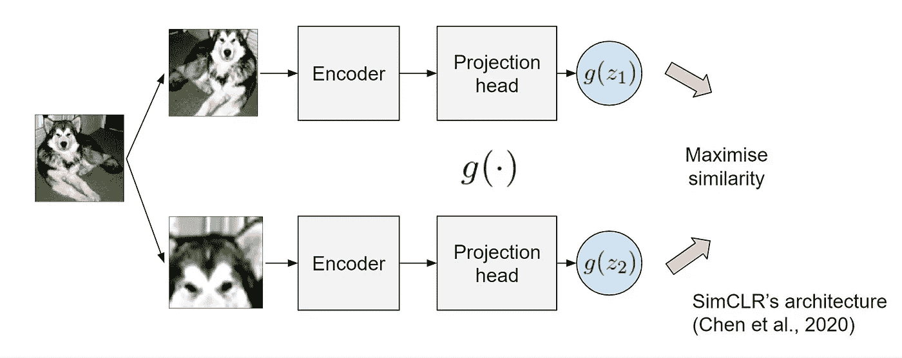

SimCLR 体系结构学习用不同的变换来匹配相同输入的低维投影。—作者图片

> 这些方法的主要思想是学习对诸如随机裁剪或旋转之类的有害变换不变的表示。

# 我们的方法

我们提出了 2 个想法 **1)一个新的梯度正则化 2)特征平均**来鼓励更强的不变性。我们另外提出了一个新的数据集 **Spirograph** 来探索我们在完全可微分的生成过程中的想法。

变换不变性是什么样子的？这里我们看到了相同输入的不同转换，我们希望它们的表示接近。

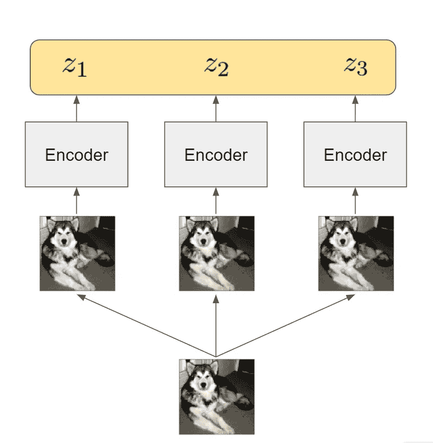

作者图片

## 梯度正则化子

我们感兴趣的许多变换(例如颜色失真)是可微的，并且由连续参数α控制。如果我们用一个变换参数α，z_α来调用一个输入的表示，我们可以通过*条件方差*正式地测量该表示如何随着变换的变化而变化

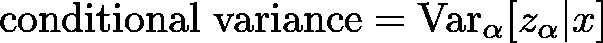

我们想把这一项减到最小，这样当我们应用不同的变换时，表示就不会有太大的变化。

由于变换是可微的，**我们可以取表示相对于α** 的梯度。鼓励这个梯度变小将使表示随着变换的改变而缓慢改变。在本文中，我们在这个梯度和条件方差的近似值之间建立了联系。我们的最后一个正则项是不同输入的近似条件方差，以促进输入之间的不变性。

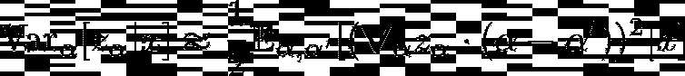

梯度相对于α的条件方差的近似值。

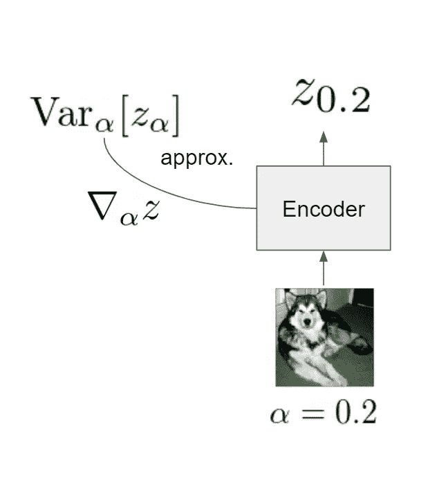

梯度正则化-利用相对于变换参数的梯度来近似条件方差。—作者图片

> 由于变换是可微的，我们可以取表示关于α的梯度。鼓励这个梯度变小将使表示随着变换的改变而缓慢改变。

## 特征平均

对于测试时间，标准协议是使用来自未转换输入的表示。我们建议，在测试期间利用转换，对来自同一输入的不同转换的多个表示进行平均。该方法产生了一个强不变的表示
，包括不可微的变换(例如随机水平翻转)，因此在第一个想法中不能被正则化。

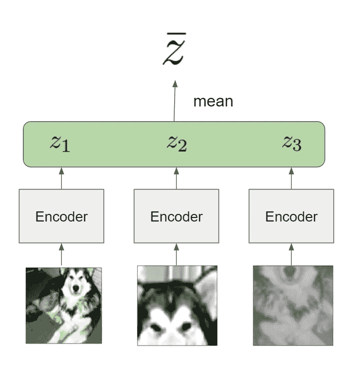

要素平均-相同输入但使用不同变换的平均表示。—作者图片

> 我们建议，在测试期间利用转换，对来自同一输入的不同转换的多个表示进行平均。

## 肺活量记录仪

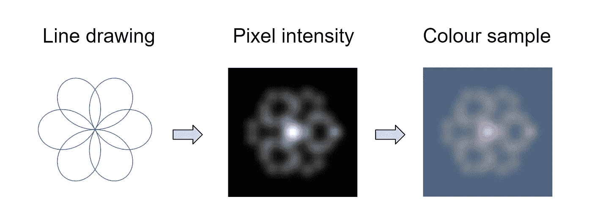

肺活量描记器的产生。

受 spirograph 模式的启发，我们提出了一个新的数据集，该数据集允许从*有害转换因子* (6 个因子)中分离出*感兴趣的生成因子* (4 个因子)，并由**完全可微分的生成过程形成。**

下游任务是使用冻结表示上的线性回归来恢复生成因子。下图显示了具有相同生成因子但具有不同变换因子的肺活量图。

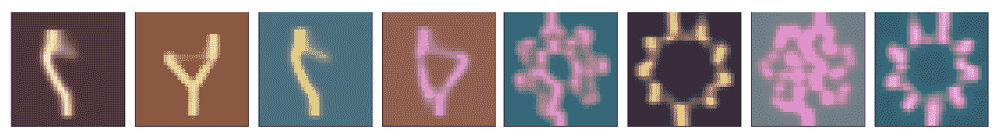

肺活量图数据集的样本。两组四幅图像(左和右):每组
显示应用于感兴趣的相同生成因子的不同变换。—作者图片

这里讨厌的变换超出了改变纹理的传统变换，即相同输入的颜色。螺旋图变换也使用相同的生成因子改变图像的结构，如下所示。这允许我们在不变性确实存在的地方探索变换不变性的贡献。

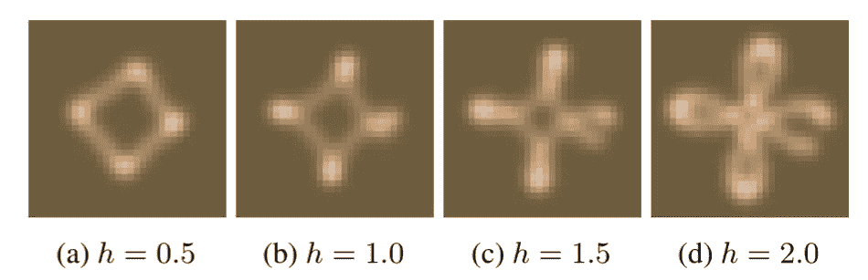

仅改变变换参数 h 对相同生成因子的影响。—作者图片

# 实验

我们将展示我们在 CIFAR-10、CIFAR-100 和 spirograph 数据集上的实验结果。让我们回到我们的问题

## 我们能在这种对比环境中提高不变性吗？

是的，有可能学到更强的不变性。如图所示，我们的梯度正则化有效地降低了 CIFAR-10 上的条件方差。

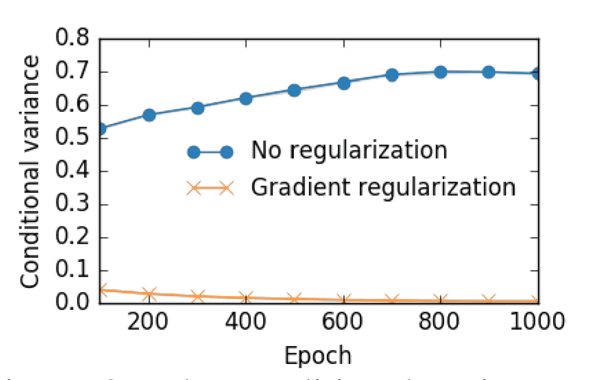

CIFAR-10 的条件方差

## 不变性越强，性能越好吗？

是的，梯度正则化和特征平均都能带来更好的下游性能。

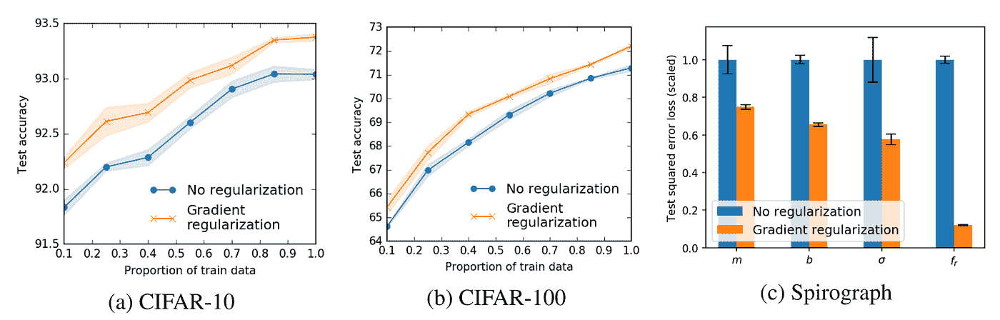

不同数据集上半监督任务的梯度正则化性能

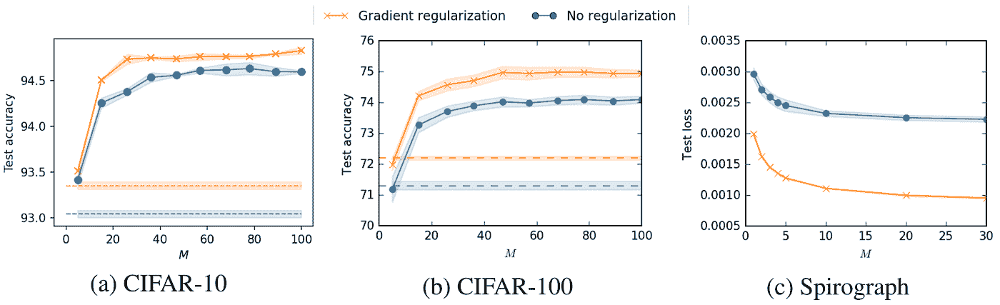

不同数据集的特征平均性能，其中虚线表示来自未转换输入的表示性能。

当结合我们的两种方法时，**我们在 CIFAR-10、CIFAR-100 数据集上实现了一流的性能。**

## 对测试时引入不可见转换的鲁棒性

除了改进下游性能之外，我们发现我们的正则化器还导致对变换参数α的移动更鲁棒的表示，例如，移动α分布的均值，增加α分布的方差。

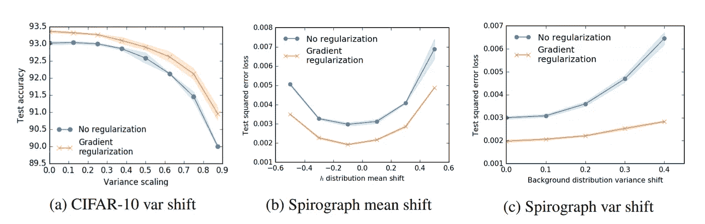

# 密码

您可以在这里找到可复制的代码

