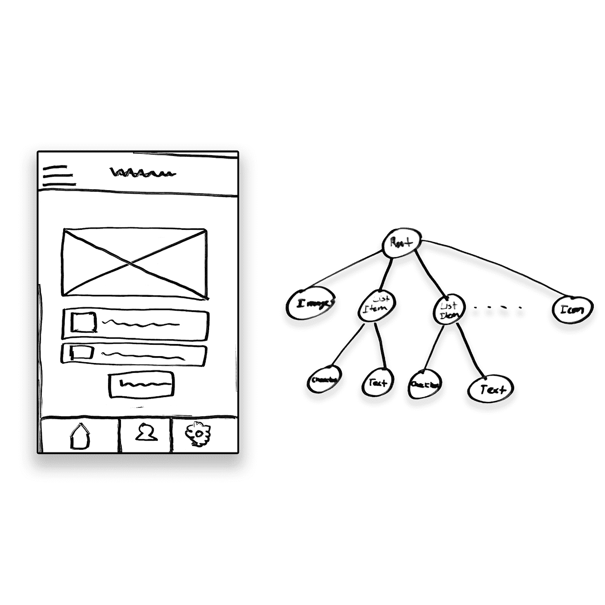
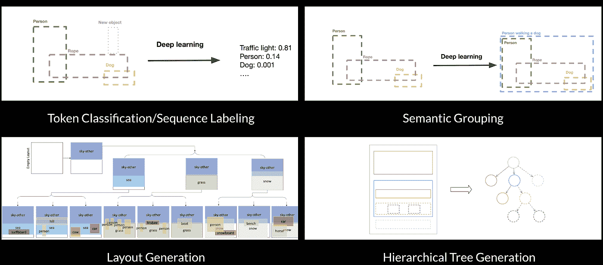
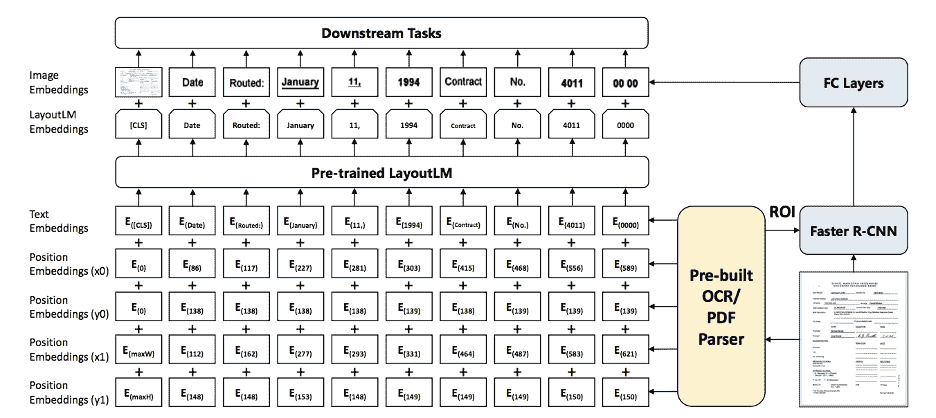
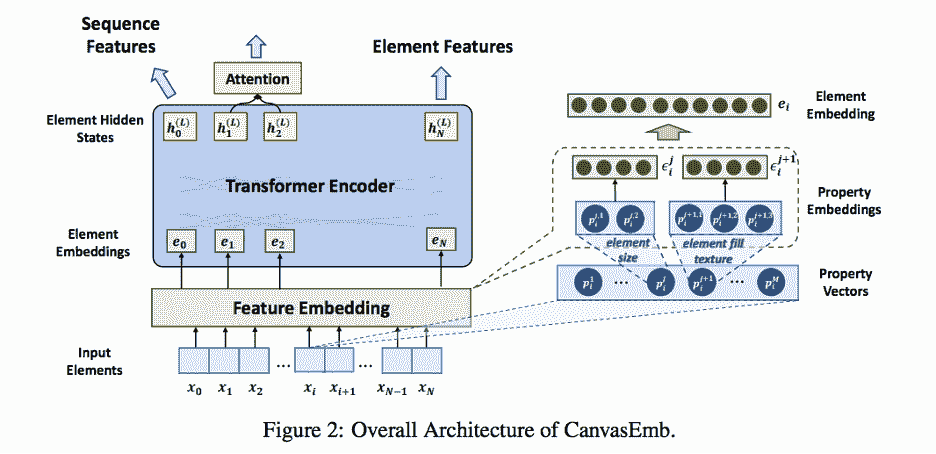
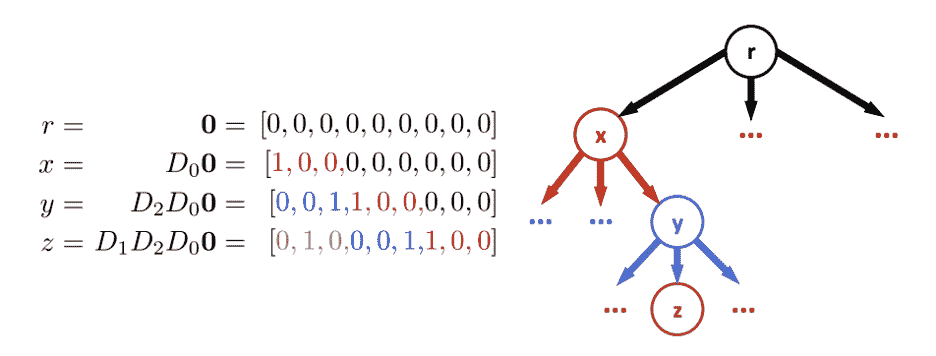
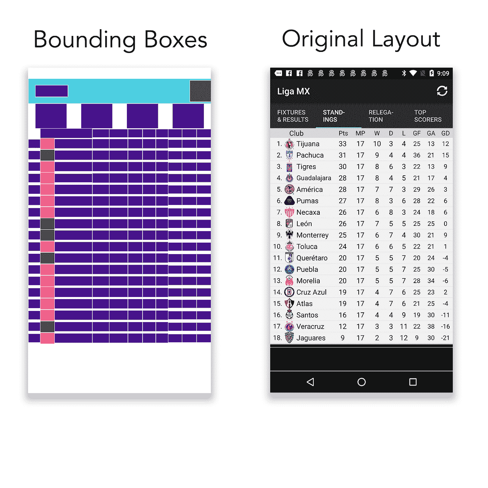
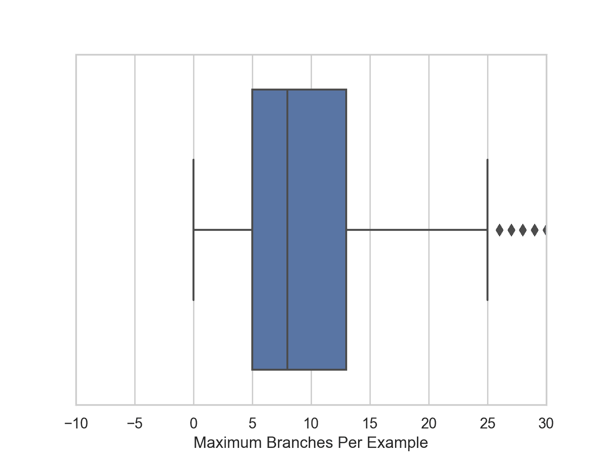

# 使用分层位置编码改进用户界面布局理解

> 原文：<https://towardsdatascience.com/improving-ui-layout-understanding-with-hierarchical-positional-encodings-b19e1e9235e?source=collection_archive---------14----------------------->

## [思想和理论](https://towardsdatascience.com/tagged/thoughts-and-theory)

## 我们如何为以用户界面为中心的任务修改转换器？

**[**【杰森·李】**](https://www.linkedin.com/in/choonghwanlee/)*****[**【康纳约翰逊】**](https://www.linkedin.com/in/cmj70/) ***，以及** [**瓦伦奈尔**](https://www.linkedin.com/in/varunnair18/)**

****

**用户界面包含丰富的元素层次结构，可以用基于树的表示进行编码。(图片由作者提供)**

**布局理解是人工智能的一个子领域，它使机器能够更好地处理布局中的语义和信息，如用户界面(ui)、文本文档、表格、演示幻灯片、图形设计组合等。许多公司已经在他们的网络/移动应用的用户界面和用户体验上投入了大量的资源(UX)，据《快速公司》报道，在 UX 上投入的每 1 美元可以获得 2-100 倍的投资回报。因此，人工智能和深度学习工具有很大的潜力来帮助和加速迭代设计过程。**

**在这篇博客文章中，我们将分享我们的发现和教训，利用基于深度学习的布局理解模型来完成以用户界面为中心的任务。这项研究是与位于 [Uizard](https://uizard.io) 的机器智能团队合作进行的。**

**具体来说，我们重点研究如何改变变压器模型的位置编码( [Vaswani，2017](https://arxiv.org/pdf/1706.03762.pdf) )，以编码更好的布局表示。我们强调:**

*   *****用户界面的分层信息是丰富的信息源，可以使用新颖的位置嵌入(***[***Shiv&Quirk，2020***](https://papers.nips.cc/paper/2019/file/6e0917469214d8fbd8c517dcdc6b8dcf-Paper.pdf) ***)注入到变压器模型中。*****
*   *****处理好 UI 领域特有的特性将是成功训练模型的关键。*****

**这是一个相对未探索的领域，仍有许多工作要做——我们希望使用这篇短文来指导未来对布局理解的研究，并释放深度学习在设计领域的更多潜力。**

**我们将首先完成一些与 UI 布局理解相关的任务，然后分享一些我们认为有用的论文背景，最后更详细地讨论上面列出的要点。**

# **相关任务**

**当试图在 transformer 模型中构建良好的 UI 布局表示时，考虑数据集和许多类型的任务来帮助构建这些表示是很重要的。我们使用 [RICO](https://interactionmining.org/rico) 数据集，这是一个 9.3K Android 应用的数据集，具有超过 66k 个独特 UI 屏幕和 3M+ UI 元素的视觉、文本、结构和交互设计属性。我们还提出了构建布局表示的四个任务，到目前为止已经独立研究过这些任务:**

****

**对后续任务有用的布局理解预培训任务示例(左上和右上由 [Javier Fuentes Alonso](https://javierfuent.es/) ，左下由 [Gupta 等人，2020](https://arxiv.org/pdf/2006.14615.pdf) ，右下由[李等人，2020](https://arxiv.org/pdf/2001.05308.pdf) )。**

****令牌分类****

**在令牌分类中，除了一个目标元素之外，所有 UI 元素的类名都会呈现给我们，并要求我们预测该目标元素的类。我们还知道所有元素的边界框位置，包括目标元素。**

****语义分组****

**在此任务中，我们将看到 UI 元素的类名和边界框位置，并被要求预测输入序列中元素集的分组。例如，给定一个图像、段落和图标，我们可能希望将这个组归类为卡片元素。**

****布局生成****

**布局生成遵循我们在 LayoutTransformer ( [Gupta 等人，2020](https://arxiv.org/pdf/2006.14615.pdf) )中研究的工作，通过生成与训练数据集中的示例相似的布局。我们大概可以使用 RICO 数据集训练一个布局生成模型来生成真实的 UI 元素。**

****层次树生成****

**该任务遵循李等人在[2020](https://arxiv.org/pdf/2001.05308.pdf)中研究的工作，其中基于变换器的树解码器模型用于接受 UI 元素作为输入，并输出元素的层次结构。这个任务可以被认为是语义分组的一个更复杂的版本，其中可以找到其他分组的组并将其分配给一个树。**

**—**

**虽然我们在工作中没有尝试所有这些任务，但我们希望这能给出对理解布局有用的任务类型的一般概念。采用多任务学习框架，类似于[文本到文本转换转换器](https://arxiv.org/pdf/1910.10683.pdf) (T5)模型，这些任务甚至可以通过一个模型来组合和解决。我们下面的发现将讨论标记分类(即序列标记)任务。**

# **相关著作**

**除了上面的任务之外，这里有几篇论文为我们在布局理解方面的工作提供了信息。我们在下面提供了最有影响力的几部作品的摘要和其他作品的链接。**

****LayoutLM****

**[LayoutLM](https://arxiv.org/pdf/1912.13318.pdf) 模型的架构深受 [BERT](https://arxiv.org/pdf/1810.04805.pdf) 的启发，同时结合了来自[更快的 R-CNN](https://arxiv.org/pdf/1506.01497.pdf) 模型的图像嵌入。LayoutLM 输入嵌入作为文本和位置嵌入的组合生成，然后与图像嵌入组合。屏蔽视觉语言模型(受原始 MLM 的启发)和多标签文档分类模型(模型如何很好地聚类相似的文档)主要用作 LayoutLM 的预训练任务。LayoutLM 模型对于版面理解是足够有用和动态的，表单理解、收据理解和文档图像分类作为下游任务包含在本文中。在我们的例子中，微调的主要下游任务是屏蔽(元素)语言建模，屏蔽表示 UI 的每个元素的标记。**

****

**LayoutLM 模型架构—(图片来自[徐等，2020](https://arxiv.org/pdf/1912.13318.pdf) )**

**原始 LayoutLM 模型在 IIT-CDIP 测试集 1.0 上进行预训练，该测试集包含超过 600 万个文档，以及超过 1100 万个扫描文档图像。正如在相关任务一节中介绍的，我们针对我们的目的对 RICO 数据集上的模型进行了微调。**

**我们考虑改进 LayoutLM 论文，因为它将现成的 OCR 视为基本事实，这对于从业者来说不太实际。对 OCR 有更大程度的控制可以提供更好的下游任务相关的结果。**

## ****CanvasEMB****

****

**CanvasEmb 模型的架构——(图片来自[谢等，2020](https://openreview.net/pdf?id=HNA0kUAFdbv) )。**

**[CanvasEMB](https://openreview.net/pdf?id=HNA0kUAFdbv) 是一个大规模、自我监督、预训练的模型，用于学习上下文布局信息，如 LayoutLM，它将布局分解为类型、几何形状、颜色和内容相关属性。该模型可以应用于下游任务，如角色标签和图像字幕(具有 SOTA 性能)，也可以用于布局自动完成和布局检索。**

**在该模型中，从 0 到 N 的每个视觉元素 X_i 由属性元素 0 到 M 组成，这些属性元素被投影并连接成元素嵌入。对于分类属性(类型、颜色)，使用嵌入矩阵，对于数字属性，采用正弦位置编码。**

**该模型基于 BERT 或 LayoutLM 等屏蔽语言建模进行训练，其他微调任务添加了特定于任务的层，如:**

*   **元素级别—预测元素的特定特征/属性**
*   **元素对元素—预测一对元素之间的关系**

**该模型根据带标签的数据进行预训练，并根据演示幻灯片数据集进行微调，这意味着与其他模型预训练的文档不同，该模型包含不同类型的语义信息。**

## ***支持基于树的变压器的新颖位置编码***

**这篇论文( [Shiv 等人，2020](https://papers.nips.cc/paper/2019/file/6e0917469214d8fbd8c517dcdc6b8dcf-Paper.pdf) )提出了一种生成新的位置编码来编码分层信息的技术。在像 RICO 这样的数据集里，用户界面有丰富的层次信息，普通变形金刚中的顺序位置嵌入是不够的。本文针对常规树**提出了这种技术，其中形成了类似堆栈的数据结构，并且针对树中向下的每一步将一个向量添加到堆栈中，n 长向量中的一个向量(针对每个节点的 n 个节点)表示当前节点是上一级的下一个分支。****

****因为我们不是在处理常规的树(其中每个节点都有相同数量的子节点)，所以必须对本文中的技术进行修改，以使其可行。下面将更详细地讨论新颖的位置编码和这些变化的示意图。****

# ****调查的结果****

****—****

## *******#1 —用户界面的分层信息是一个丰富的信息源，可以使用新颖的位置嵌入将其注入到变压器模型中。*******

****—****

****用户界面通常在组成它的元素集合中包含丰富的层次结构。例如，一个列表可以包含几个列表项，每个列表项可以包含一个卡片对象，这个卡片对象可以包含一个图像、一个段落和一个图标。我们也不需要一个固定的事实来获得这个信息——如果除了元素类名之外还存在边界框信息，那么我们可以通过查看哪些边界框相互重叠来推断哪些元素是子元素。****

****我们试图解决的第一个任务是上面的标记分类(即序列标记)任务。我们修改了我们最初研究的模型 LayoutLM，使其能够输入边界框和类标签信息。与大多数传统的 transformer 模型一样，LayoutLM 接受由序列中的位置编码的固定大小的输入。然而，由于我们知道用户界面的层次信息是一个丰富的信息源，我们可以通过将 LayoutLM 方法与基于树的新颖位置嵌入相结合来利用这个信息**。******

********

****从 [Shiv & Quirk，2020](https://papers.nips.cc/paper/2019/file/6e0917469214d8fbd8c517dcdc6b8dcf-Paper.pdf) 到变压器的基于树的输入的新颖位置编码(图片来自 [Shiv & Quirk，2020](https://papers.nips.cc/paper/2019/file/6e0917469214d8fbd8c517dcdc6b8dcf-Paper.pdf) )。****

****直观地说，通过注入关于输入令牌(UI 元素)如何相互关联的附加信息，我们应该能够更好地执行下游任务。否则，该信息可能已经由模型在多个训练步骤之后或者在看到许多示例之后学习到，但是通过在输入中显式地提供它，我们允许模型的参数编码其他(并且希望更有用)表示。****

****元素之间的关系由 JSON 文件中的 RICO 数据集提供，它告诉我们每个 UI 元素的祖先和子元素。我们找到了树的最大度数(n)和树的最大深度(k ),并为每个示例中的每个元素形成了 n×k 大小的向量，为每个单独节点未使用的每个值添加了填充。这个大小是一致的，因此解码器可以理解这些嵌入。****

****虽然我们相信有很好的理由通过这些位置嵌入来提高性能(如上所述)，但实际上它们很难实现。我们面临的一些挑战包括:****

*   ****为基于树的位置编码的维度(n 和 k 的值)选择适当的值。****
*   ****将基于树的位置编码投影到令牌表示的维度(例如 512)以进行拼接。****

****当实现这些分层位置嵌入时，由于在所有示例中简单使用最大深度和度时位置编码向量的稀疏性，为维度选择适当的值是重要的。我们将在下一节进一步讨论这些挑战。****

****—****

## ****#2 —处理好特定于用户界面领域的特征将是成功训练模型的关键。****

****—****

****为了探索布局理解模型，我们使用了前面提到的 RICO 数据集，它由超过 66k 个独特的 UI 屏幕的视觉、文本、结构和交互设计属性组成。当探索这样的数据集时，最初的认识是 UI 屏幕并不总是像我们预期的那样出现，例如，它们可能具有非常高的信息密度。下面的示例显示了在 RICO 数据集的任何给定级别上具有最大节点数的 UI:421。****

********

****下面的示例显示了在 RICO 数据集的任何给定级别上具有最大节点数的 UI—总共 421 个。(图片由作者提供)。****

****当使基于树的位置嵌入适应于非规则树(其中每个节点可以有不同数量的孩子)时，一个考虑是存储器使用。为异常值示例添加的填充如果过多，在微调变压器时会给计算带来很大压力。回想一下，我们的基于树的位置嵌入向量的维数和填充是数据集中任何单个节点(包括根)的总最大深度和总最大分支的乘积。****

****在下面的方框图中，我们看到绝大多数 UI 屏幕的元素层次最多有 25 个分支或者更少。如果我们保留离群值，位置嵌入向量的维数将大几个数量级。在 80/20 训练测试分割且没有过滤的情况下，包含训练示例的位置嵌入向量的文本文件是 3.09 千兆字节，其在投影层中被投影为 631.40 千兆字节。通过过滤具有最多 80 个分支的示例，我们能够将每个向量的维数从 2947 (421*7)减少到 560 (80*7)，由于填充和削减存储嵌入的存储器，使得向量不那么稀疏，减少了 80%以上。虽然过滤减少了内存占用，但使用 560 的令牌嵌入维度仍然会导致向量投影到 79.11 千兆字节，远远超过(我们的)典型 GPU 上可用的 16 千兆字节内存。****

********

****RICO 数据集中示例树层次结构中节点的最大分支数量的箱线图(图片由作者提供)。****

****有了这些信息，改进模型在 RICO 数据集上的微调方式的一个可能的解决方案是在进一步使用的示例中过滤最大数量的节点(从 421 个节点到 25 个节点)，以便更好地反映数据集本身的分布。另一种方法是从数据集中移除被认为是“装饰性元素”的内容。对数据集的分析显示，所有叶子(没有子节点的节点)的 39%多一点存在于数据集中的第一级树上。****

****我们还可以通过限制层次结构的深度来过滤 RICO 数据集中的元素。虽然最大深度是 7，但超过 99%的叶子都集中在每个示例树的前三层，这意味着很少有分支到达第 7 层甚至第 4 层(0.6%的叶子位于该层)。****

****总之，过滤数据集中使用了哪些示例以及每个示例中包含了哪些节点的信息会导致有价值的语义信息的显著丢失，这些信息有助于识别复杂的 UI 元素分组。然而，保留所有信息会在训练时导致严重的内存问题，我们认为过滤是对 RICO 数据集上的 LayoutLM 等模型进行微调以执行相关下游任务的必要的第一步。****

# ****未来的工作****

****布局理解是一个子领域，在未来的几年里已经成熟，可以取得更大的进步，我们希望这项工作能够展示一些潜力。最近将 [LayoutLM](https://huggingface.co/transformers/model_doc/layoutlm.html) 添加到 HuggingFace transformers 库中也应该允许研究社区进行更快的迭代。总结一下:****

*   ****用户界面的分层信息是一个丰富的信息源，可以使用新颖的位置嵌入将其注入到变压器模型中。****
*   ****处理好特定于用户界面领域的特征将是成功训练模型的关键。****

****如相关任务部分所述，布局理解任务可以在多任务训练中结合起来，以获得更好的表征学习(类似于 T5 模型， [Raffel 等人，2020](https://arxiv.org/pdf/1910.10683.pdf) )。其他未来的工作包括试验其他形式的位置嵌入，并将这项工作扩展到下一代版本的 LayoutLM (LayoutLMv2 — [徐等人，2020](https://arxiv.org/pdf/2012.14740.pdf) )。****

## ****承认****

****感谢 Javier Fuentes Alonso、Arturo Arranz 和 Tony Beltramelli 在过去几个月对这项工作的支持。要了解更多关于 Uizard 如何将机器学习应用到设计中，请查看 Uizard 的研究页面[这里](https://uizard.io/research)。****

****这篇文章的作者也是杜克应用机器学习(DAML)的成员，这是杜克大学的一个学生团体，致力于应用人工智能项目和研究——点击这里了解更多关于 DAML [的信息。](http://dukeaml.com)****