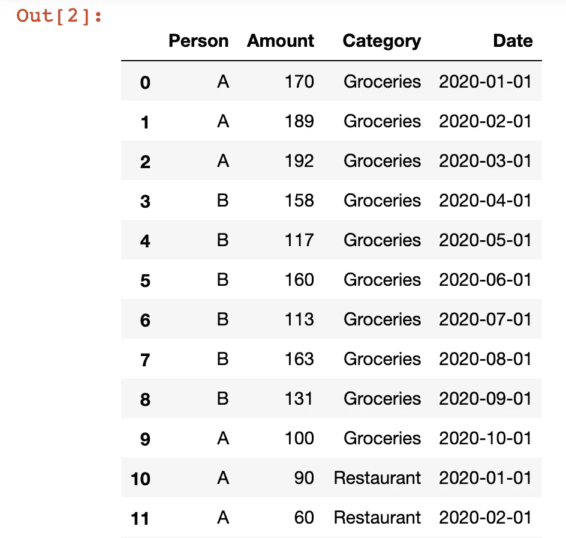
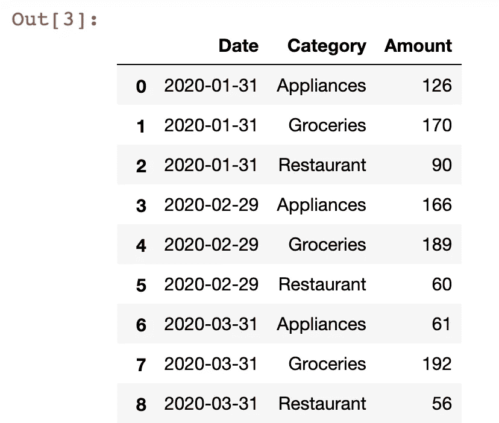
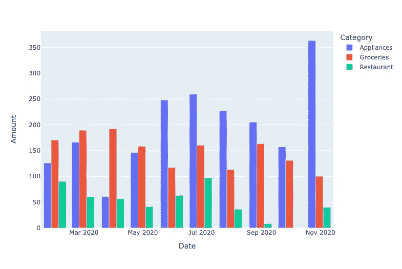
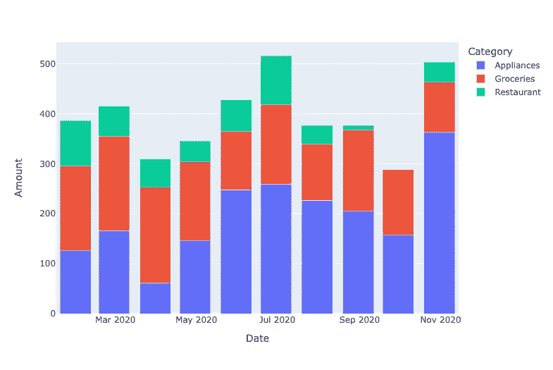
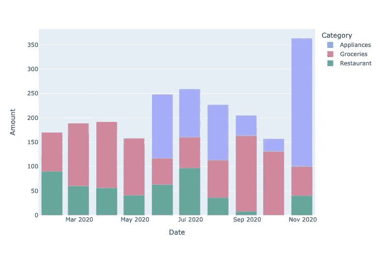
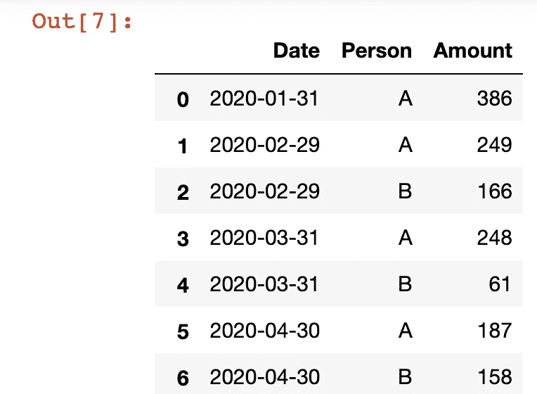
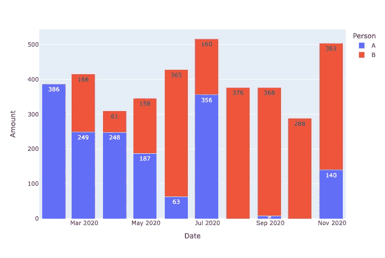
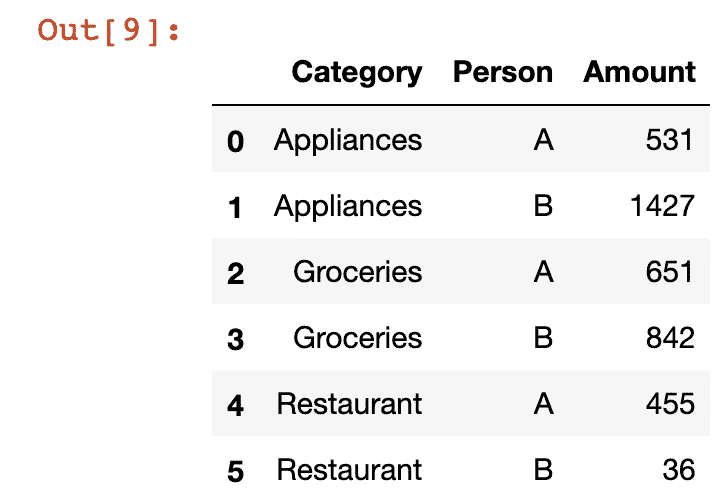
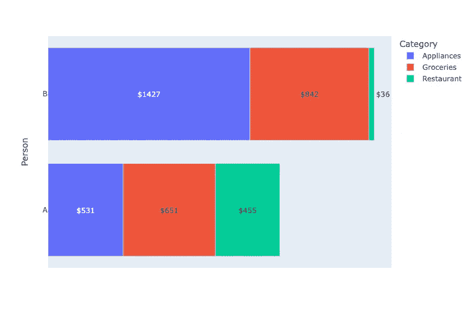

# 使用 Python 中的堆叠条形图改进数据可视化

> 原文：<https://towardsdatascience.com/improving-your-data-visualizations-with-stacked-bar-charts-in-python-f18e2b2b9b70?source=collection_archive---------23----------------------->

## 大蟒

## 使用 pandas 和 Plotly Express 可视化分类数据并显示数据集的趋势


我才华横溢的姐姐的作品

仅仅看表中的数字可能会使识别数据集中的趋势变得困难。可视化数据使人们更容易快速理解关键思想。数据可视化的一个重要部分是根据正在分析的数据类型选择正确的图表类型。

标准散点图、折线图和条形图非常适合可视化各种数值和分类数据。您可以通过添加附加功能来改进这些基本图表，使最终用户更容易理解数据。

在这篇文章中，让我们来看看如何使用 Python 中的 Plotly Express 库来**创建和定制堆积条形图以实现数据可视化。我们还将使用 Pandas 库进行一些数据预处理步骤，所以请确保您已经安装了这两个包。然后，导入以下内容，并准备好在您自己的 Jupyter 笔记本上继续学习！**

```
import pandas as pd
import plotly.express as px
import random
```

我们开始吧！

# 用 Plotly Express 实现简单的堆积条形图

首先，让我们生成一些样本数据，用于我们的数据分析和可视化。为此，请运行以下代码。

```
expense_data = {
    "Person": random.choices(["A", "B"], k=30),
    "Amount": random.sample(range(100, 200), 10) + random.sample(range(0, 99), 10) + random.sample(range(49, 499), 10),
    "Category": ["Groceries"] * 10 + ["Restaurant"] * 10 + ["Appliances"] * 10,
    "Date": pd.to_datetime(pd.date_range('2020-01-01','2020-10-01', freq='MS').tolist() * 3)
}
df = pd.DataFrame(data=expense_data)
```



作者图片

在这篇文章中，我们将分析和可视化一些随机生成的个人支出数据。该代码应该生成一个 Pandas 数据框架，其中包含一段时间内三个不同类别的 30 行费用。

**此数据分析的目标是检查每个月每个类别的支出，并潜在地确定一段时间内发生的趋势。**因此，让我们用一些熊猫来对每个类别每月的总支出进行分组。您可以使用下面的两行代码来做到这一点。

```
df_grouped = df.groupby(by=[pd.Grouper(key="Date", freq="1M"), "Category"])["Amount"]
df_grouped = df_grouped.sum().reset_index()
```



作者图片

现在我们的数据已经被处理以适应我们最初的问题，我们可以直接进入可视化数据。Plotly 库使看起来干净的可视化比你用 Pandas(或 matplotlib)创建的标准图形更有风格。Plotly Express 更进了一步，使创建可视化变得简单得可笑。我们将用下面的一行代码创建初始图表。

```
fig = px.bar(df_grouped, x="Date", y="Amount", color="Category")
fig.show()
```


作者图片

`bar`方法的第一个输入是我们刚刚创建的分组数据帧。然后，我们将数据帧中的列名传递给`bar`方法的`x`和`y`参数。最后，要实现堆叠条形图，我们需要做的就是将想要堆叠的列名传递到`color`参数中。

通过填写可选的`barmode`参数，您可以进一步定制堆积条形图。你可以在下面看到一个例子和结果图。

```
fig2 = px.bar(df_grouped, x="Date", y="Amount", color="Category", barmode="group")
fig2.show()
```



作者图片

将`group`作为参数传递给`barmode`给我们一个类似上面的图，其中每个月的每个类别的费用条并排分组，而不是垂直堆叠。

**有四个可能的选项可以传入** `**barmode**` **:堆栈、组、覆盖和相对。**作为探索性数据分析阶段的一个示例，您可以运行以下代码来查看条形图的所有不同选项。

```
barmodes = ["stack", "group", "overlay", "relative"]
for barmode in barmodes:
    fig_bar = px.bar(df_grouped, x="Date", y="Amount", color="Category", barmode=barmode)
    fig_bar.show()
```



作者图片


作者图片



作者图片


作者图片

每个条形模式选项显示的图形略有不同。“相对”栏模式仅在您有负值时才相关，因为此模式将导致 Plotly 在轴下方显示负值的相关类别。

您可以将上面的代码块封装到一个函数中，然后作为探索性数据分析(EDA)的一部分在您的数据上运行它，在这里您还可以找出这些图形中的哪一个最适合您正在查看的数据。然后，一旦你决定了哪种条形模式最适合你，你可以选择只生成一个图形或者从你的笔记本中将图形导出为 png(这是 Plotly Express 的一个便利特性)。

# 使用 Plotly Express 在堆叠条形图中实现附加功能

我们来看看条形图的其他一些功能，让我们继续分析我们的样本数据并**比较一段时间内的人均支出数据**。为此，我们将使用与之前相同的`groupby`方法再次对数据进行分组。

```
df_people = df.groupby(by=[pd.Grouper(key="Date", freq="1M"), "Person"])["Amount"]
df_people = df_people.sum().reset_index()
```



作者图片

得到的数据框架将给出我们数据集中每人每月的总支出。我们现在可以像以前一样将这个数据帧插入到 Plotly `bar`方法中，但是有一个小的增加。

```
fig_people = px.bar(df_people, x="Date", y="Amount", color="Person", barmode="stack", text="Amount")
fig_people.show()
```



作者图片

通过这张图表，我们现在可以清楚地看到哪个人每月花费更多。因为我们处理的是财务数据，所以将每个类别的金额直接显示在条形图上可能会有用(而不必从轴上猜测大致的金额)。

为此，我们将`bar`方法中的`text`参数设置为我们希望显示为条形标签的列，在本例中是“Amount”。然后，您可能会从图表中删除 y 轴，因为它现在是多余的，因为文本标签直接在列上。

通过**分析每个类别的人均支出，我们可以探索 Plotly Express 中条形图的最后一个特性。**我们将通过运行下面的代码，首先将我们的数据按类别和人员分组到一个新的数据框架中。

```
df_category = df.groupby(["Category", "Person"]).sum().reset_index()
```



作者图片

现在，使用这个分组的数据帧，我们可以使用相同的 Plotly express `bar`方法，使用我们到目前为止探索过的特性，但是增加了一些内容。

```
fig_category = px.bar(df_category, x="Amount", y="Person", color="Category", text="Amount", orientation="h")
fig_category = fig_category.update_traces(insidetextanchor="middle", texttemplate="$%{text}")
fig_category = fig_category.update_xaxes(visible=False, showticklabels=False)
fig_category.show()
```



作者图片

首先，您将看到我们创建了一个水平条形图，而不是我们以前使用的垂直格式。我们所要做的就是将“h”传递给 bar 方法中的参数`orientation`。然后，我们还想再次拥有文本标签，但是为了确保文本标签出现在条形标签的中间，我们将使用`update_traces`方法，并将“中间”传递给`insidetextanchor`参数。

此外，我们可以通过在`update_traces`方法的`texttemplate`参数中设置文本标签的自定义格式。我们将简单地在标签前添加一个美元符号，所以在这种情况下，我们传入`"$%{text}"`，因为在 Plotly Express 中，您可以通过使用百分号后跟括号中的列名来引用列。

最后，由于我们已经添加了一个美元符号来使条形值非常清楚，我们可以继续使用`update_xaxes`方法并设置`visible`和`showticklabels`参数为“False”来删除带有“Amount”列值的轴。

仅此而已！

我希望你会发现这个用 Python 编写的关于堆积条形图的快速介绍对你的数据分析很有用。使用 Plotly Express，您只需插入一个 Pandas 数据框架，只需几行代码就可以直接可视化您的数据。

再次感谢您的阅读！如果你正在考虑成为 Medium 的付费会员，如果你使用我下面的推荐链接注册，我会非常感激！这会让直接收到你的一部分会费，所以这将是一个很大的帮助。

<https://byrondolon.medium.com/membership>  

```
**More by me:** - [Check for a Substring in a Pandas DataFrame](/check-for-a-substring-in-a-pandas-dataframe-column-4b949f64852?sk=bfb5bbab11ae45c47bfb316d931c3b56)
- C[onditional Selection and Assignment With .loc in Pandas](/conditional-selection-and-assignment-with-loc-in-pandas-2a5d17c7765b?sk=e5672d859a3964c1453a1c09edca22cf)
- [2 Easy Ways to Get Tables From a Website With Pandas](/2-easy-ways-to-get-tables-from-a-website-with-pandas-b92fc835e741?sk=9981ddaf0785a79be893b5a1dd3e03dd)
- [Top 4 Repositories on GitHub to Learn Pandas](/top-4-repositories-on-github-to-learn-pandas-1008cb769f77?source=friends_link&sk=d3acc38062490a86ecb46875342224e6)
- [Level Up Your Data Visualizations with Trend Lines in Python](/level-up-your-data-visualizations-with-trend-lines-in-python-6ad4a8253d6?sk=d9174bf7fd3394000acd92289ac41623)
- [Better Data Visualization with Dual Axis Graphs in Python](/better-data-visualization-with-dual-axis-graphs-in-python-a7f35a493558?sk=4e080437f9d29818e25120e287fa550d)
```