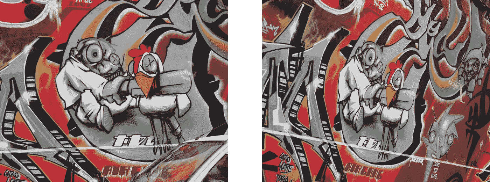
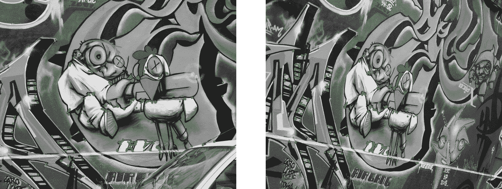
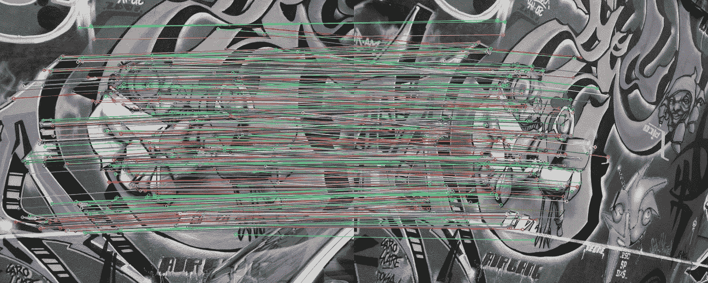
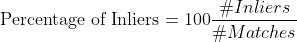

# 用一行代码将图像匹配结果提高 14%

> 原文：<https://towardsdatascience.com/improving-your-image-matching-results-by-14-with-one-line-of-code-b72ae9ca2b73?source=collection_archive---------1----------------------->

## OpenCV 4 . 5 . 1 版包括 BEBLID，这是一个新的本地特性描述符，允许您这样做！

OpenCV 4.5.1 中最令人兴奋的功能之一是 **BEBLID(增强的高效二进制局部图像描述符)**，这是一种新的描述符，能够提高图像匹配的准确性，同时减少执行时间！这篇文章将向你展示这个魔法是如何实现的。所有源代码都存储在这个 GitHub 存储库中:

<https://github.com/iago-suarez/beblid-opencv-demo/blob/main/demo.ipynb>  

在本例中，我们将匹配这两幅因视点变化而相关的图像:



首先，确保安装了正确版本的 OpenCV 是很重要的。在您喜欢的环境中，您可以使用以下命令安装并检查 OpenCV Contrib 版本:

```
**pip install "opencv-contrib-python>=4.5.1"**
python
>>> import cv2 as cv
>>> print(f"OpenCV Version: {cv.__version__}")
OpenCV Version: 4.5.1
```

用 Python 加载这两幅图像所需的代码是:

为了评估我们的图像匹配程序，我们需要两幅图像之间正确的(即地面真实)几何变换。这是一个称为单应性的 3×3 矩阵，当我们将第一幅图像中的一个点(在[齐次坐标](https://en.wikipedia.org/wiki/Homogeneous_coordinates)中)相乘时，它会返回第二幅图像中该点的坐标。让我们加载它:

下一步是**检测**图像中一些容易在其他图像中发现的部分:**局部图像特征**。在这个例子中，我们将使用快速可靠的检测器 [ORB](https://docs.opencv.org/4.5.1/d1/d89/tutorial_py_orb.html) 来检测角点。ORB 检测强角点，在不同的尺度上进行比较，并使用其 FAST 或 Harris 响应来选择最佳角点。它还使用局部面片一阶矩找到每个角点方向。让我们在每幅图像中最多检测 10000 个角:

在下图中，您可以看到用绿点标记的 500 个检测响应最强的角点特征:



干得好！现在是时候用一种我们可以在其他图像中找到的方式来表示这些关键点了。该步骤被称为描述，因为**每个角周围的局部小块中的纹理由来自图像上不同操作的数字矢量**表示 **(即被描述)。有许多描述符，但如果我们想要一些准确的东西，甚至在手机或低功耗设备上实时运行，OpenCV 有两种重要的方法:**

*   **ORB(定向快速旋转简报)**:经典的替代品，已有 10 年历史，效果相当不错。
*   **BEBLID(提升的高效二进制局部图像描述符)**:2020 年引入的新描述符，已被证明在几个任务中提高了 ORB。由于 BEBLID 适用于多种检测方法，因此您必须将 ORB 关键点的比例设置为 0.75~1。

是时候匹配两幅图像的描述符以建立对应关系了。让我们使用[强力](https://opencv-python-tutroals.readthedocs.io/en/latest/py_tutorials/py_feature2d/py_matcher/py_matcher.html)算法，它基本上将第一幅图像中的每个描述符与第二幅图像中的所有描述符进行比较。当我们处理二进制描述符时，使用汉明距离进行比较，即计算每对描述符之间不同的位数。

这里还使用了一个叫做比率测试的小技巧。它确保不仅描述符 1 和 2 彼此相似，而且没有其他描述符像 2 一样接近 1。

因为我们知道正确的几何变换，所以让我们检查有多少匹配是正确的(内嵌)。如果它在图像 2 中的点和它从图像 1 投影到图像 2 的点之间的距离小于 2.5 个像素，我们将认为马赫是有效的。

既然我们在 inliers1 和 inliers2 变量中有了正确的匹配，我们可以使用 [cv.drawMatches](https://docs.opencv.org/4.5.1/d4/d5d/group__features2d__draw.html) 对结果进行定性评估。每一个对应点都可以帮助我们完成更高层次的任务，如[单应性估计](https://docs.opencv.org/4.5.1/d9/d0c/group__calib3d.html#ga4abc2ece9fab9398f2e560d53c8c9780)、[透视-n 点](https://docs.opencv.org/4.5.1/d9/d0c/group__calib3d.html#ga549c2075fac14829ff4a58bc931c033d)、[平面跟踪](https://docs.opencv.org/4.5.1/dc/d16/tutorial_akaze_tracking.html)、[实时姿态估计](https://docs.opencv.org/4.5.1/dc/d2c/tutorial_real_time_pose.html)或[图像拼接](https://docs.opencv.org/4.5.1/df/d8c/group__stitching__match.html)。



因为很难对这种结果进行定性比较，所以让我们绘制一些定量评估指标。最能反映我们的描述符可靠性的指标是内联体的百分比:



```
Matching Results (**BEBLID**)
*******************************
# Keypoints 1:                          9105
# Keypoints 2:                          9927
# Matches:                              660
# Inliers:                              512
# Percentage of Inliers:                **77.57%**
```

使用 **BEBLID** 描述符获得一个 **77.57%** 的内联器。如果我们在 description 单元格中注释 BEBLID 并取消注释 **ORB** 描述符，结果将下降到 **63.20%** :

```
Matching Results (**ORB**)
*******************************
# Keypoints 1:                          9105
# Keypoints 2:                          9927
# Matches:                              780
# Inliers:                              493
# Percentage of Inliers:                **63.20%**
```

总之，只需更改一行代码，用 BEBLID 替换 ORB 描述符，我们就可以将这两幅图像的匹配结果提高 14%。这对需要局部特征匹配的高级任务有很大的影响，所以不要犹豫，试试 BEBLID 吧！