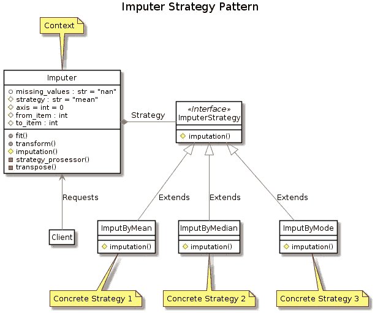

# Python 中从头开始的估算类

> 原文：<https://towardsdatascience.com/imputer-class-in-python-from-scratch-66df6ae067e1?source=collection_archive---------18----------------------->

## “从零开始估算”项目是我在 OOP 课程中展示我对面向对象编程理解的选择，被评为 97%。


类图

# 假设

这份实验室工作报告的主要重点是展示对面向对象编程原则的理解以及如何应用它们。

实现的每一步都有说明；因此，假设额外的代码文档是多余的。然而，为了展示对 PEP 257 中描述的文档约定的理解，示例包含在类**inputr**中。

由于代码是为了演示的目的而不是为了重用，错误处理也简化为在类**估算器**中产生错误的两个例子。

# 履行

估算器将执行其估算选择的策略模式，这使得所使用的算法能够在运行时独立变化。从而应用**设计原则 1:** *识别应用程序中变化的方面，并将它们与保持不变的方面分开。*

## 导入库

导入一个用于定义抽象基类的元类，以及一个指示来自 abc 模块的抽象方法的装饰器。

```
from abc import ABCMeta, abstractmethod
```

导入 deepcopy 以制作复合对象的唯一副本。

```
from copy import deepcopy
```

## 策略界面

首先定义了策略界面。

插补策略类是所有复合类继承的超类，它定义了一个接口，其默认行为集等于所有具体策略。从而将**设计原则 2:** *程序应用于一个接口，而不是一个实现*，以及**设计原则 3:** *重组合轻继承。*

```
class ImputationStrategy(metaclass=ABCMeta): @abstractmethod
    def _imputation(self, my_list: list, missing_values: str) -> float:
        """Must be implemented in order to instanciate"""
```

## 算法家族

第二，明确具体策略。一系列算法被封装在单独的类中，并通过拥有相同的接口而变得可互换。

每个家庭成员都可以定义新的行为；然而，它们继承了所有超类的行为，可以通过覆盖它们来替换。在超类中定义 abstractmethods 要求任何子类实现特定的行为，从而实现一个公共的默认接口。

由于这些类只有一个单一的责任**设计原则 6:** *一个类应该只有一个改变的理由。*已应用。

## 具体战略 1

**用平均数估算**平均数是一组数字的平均总和。

```
class ImputeByMean(ImputationStrategy): def _imputation(self, my_list: list, missing_values: str) -> float:
        temp_sum = 0
        count = 0
        for num in my_list:
            if num != missing_values:
                temp_sum += num
                count += 1
        mean = (temp_sum/count)
        return round(mean, 2)
```

## 具体战略 2

**按中位数估算**
中位数是一个*排序的*数字列表的中间值。

```
class ImputeByMedian(ImputationStrategy): def _imputation(self, my_list: list, missing_values: str) -> float:
        temp_list = []
        for num in my_list:
            if num != missing_values:
                temp_list.append(num) temp_list.sort()
        temp_len = len(temp_list) if temp_len % 2 == 0:
            median1 = temp_list[temp_len//2]
            median2 = temp_list[temp_len//2 - 1]
            median = (median1 + median2)/2
        else:
            median = temp_list[temp_len//2]
        return round(median, 2)
```

## 具体战略 3

**通过模式**估算
模式是最频繁的值。

**注意:**模式包含在上下文中，但出于演示目的在下面实施。

```
class ImputeByMode(ImputationStrategy): def _imputation(self, my_list: list, missing_values: str) -> float:
        frequency = {}
        for item in my_list:
            if item != missing_values:
                if (item in frequency):
                    frequency[item] += 1
                else:
                    frequency[item] = 1
        mode = max(frequency, key=frequency.get)
        return round(mode, 2)
```

## 具体策略实例化

通过实例化类并引用对象实例，只需要创建一个对象。从而应用**设计原则 5:** *依赖抽象。不要依赖于具体的类。*

如果直接调用这个类，每次都会定义新的对象。

```
mean = ImputeByMean()
median = ImputeByMedian()
# mode = ImputeByMode()
```

## 背景

Imputer 是策略模式上下文，包含对具体策略对象的实例化的引用。

估算器使用策略接口调用由具体策略定义的算法；然后每个具体的策略实现一个算法。
因为这是估算器和策略接口**之间的唯一连接，所以应用了设计原则 4:** *争取交互*的对象之间的松耦合设计。

当需要一个操作时，具体的策略对象运行算法，而输入者不知道策略的实现。

如果有必要，可以实例化附加的估算对象，将数据从估算对象传递到策略接口，从而排除它作为单一候选对象。

```
class Imputer:
    """
     The base class for imputer objects.
     Enables the user to specify which imputation method, and which "cells" to 
     perform imputation on in a specific 2-dimensional list. 
     A unique copy is made of the specified 2-dimensional list before
     transforming and returning it to the user.
    """ def __init__(self, strategy="mean", axis=0) -> None:
        """
        Defining instanse attributes on instansiation. Args:
            strategy (str, optional): A concrete strategy. Defaults to "mean".
            axis (int, optional): Column=0 or Row=1\. Defaults to 0.
        """ # Reference to the concrete strategy object being used.
        self._strategy = strategy
        # Calling internal method.
        self.__strategy_prosessor()
        # Reference to the axis orientation being used.
        self._axis = axis
        # Reference to the keyword for missing values.
        # Defined as public, as per convention.
        self.missing_values = "nan"
        # Defines which column or row to start.
        self._from_item = None
        # Defines which column or row to end.
        self._to_item = None def __strategy_prosessor(self) -> None:
        """
        Internal method validating that selected strategy is allowed.
        If so, selecting its imputation method. Raises:
            AssertionError: If the selected strategy is not allowed.
        """ allowed_strategies = ["mean", "median", "mode"]
        if self._strategy == allowed_strategies[0]:
            self._strategy = mean._imputation
        elif self._strategy == allowed_strategies[1]:
            self._strategy = median._imputation
        elif self._strategy == allowed_strategies[2]:
            self._strategy = mode._imputation
        else:
            assert self._strategy in allowed_strategies, (
                f"Can only use these strategies: {allowed_strategies}, "
                f"got strategy = {self._strategy}") def __transpose(self, my_matrix: list) -> list:
        """
        Transposes 2-dimensional list. Args:
            my_matrix (list): 2-dimensional list. Returns:
            list: 2-dimensional list transposed.
        """ trans_matrix = []
        temp_matrix = [[my_matrix[j][i] for j in range(len(my_matrix))]
                       for i in range(len(my_matrix[0]))]
        for row in temp_matrix:
            trans_matrix.append(row)
        return trans_matrix def fit(self, my_matrix: list, from_item: int, to_item: int) -> object:
        """
        Passes in the 2-dimensional list for imputation, 
        and sets from which column to start with, and end by. Args:
            my_matrix (list): 2-dimensional list.
            from_item (int): The column to start with.
            to_item (int): The column to end by. Raises:
            ValueError: If axis is not equal to the defined options. Returns:
            object: The same imputer object that calls the method.
        """ self._to_item = to_item if self._axis == 0:
            self._array = my_matrix
            self._from_item = from_item - 1
        elif self._axis == 1:
            self._array = self.__transpose(my_matrix)
            self._from_item = from_item
        else:
            raise ValueError(
                f"Can only use integer value 0 or 1: "
                f"got axis = {self._axis}")
        return self def __axis_lister(self, matrix: list, col: int) -> list:
        """
        Generates a list for all values in a 2-dimensional list column. Args:
            matrix (list): 2-dimensional list.
            col (int): selected column to generat list from. Returns:
            list: All values in a 2-dimensional list column.
        """ temp_list = []
        for row in range(len(matrix)):
            temp_list.append((matrix[row][col]))
        return temp_list def _imputation(self, my_list: list, missing_values: str) -> float:
        """
        Passing a list to the concrete strategy object with the desired
        imputation algorithm. For this reason, the method cannot be private, 
        but have to be public or protected. Args:
            my_list (list): The list to be calculated by the algorithm.
            missing_values (str): The keyword for the missing values. Returns:
            float: The calculated value to swap with the missing value keyword
        """ return_value = self._strategy(my_list, missing_values)
        return return_value def transform(self) -> list:
        """
        Inserts the imputed column value in each column-row ("cell") of the 
        2-dimensional list where the missing value keyword exists. Returns:
            list: A unique copy of the selected 2-dimensional list after 
            it has been imputed.
        """ return_matrix = deepcopy(self._array)
        for col in range(self._from_item, self._to_item):
            imputed_value = self._imputation(
                self.__axis_lister(self._array, col), self.missing_values)
            for row in range(len(return_matrix)):
                if return_matrix[row][col] == self.missing_values:
                    return_matrix[row][col] = imputed_value
        if self._axis == 0:
            pass
        elif self._axis == 1:
            return_matrix = self.__transpose(return_matrix) return return_matrix def __str__(self) -> str:
        """
        Provides users with an easy to read representation of the class. Returns:
            str: The class name.
        """ return f"{self.__class__.__name__}" def __repr__(self) -> str:
        """
        Provides developers with unambigous information of the class. Returns:
            str: The class name and the state of instance variables.
        """
        return "{self.__class__.__name__}" \
               "(Strategy: {self._strategy}, " \
               "Axis:{self._axis}, " \
               "Missing value: {self.missing_values}, " \
               "From:{self._from_item}, " \
               "To:{self._to_item})".format(self=self)
```

# 示范

## 数据预处理

具有用于转置二维列表的方法和基于单词长度用制表符打印该列表格式的方法的类被实例化。

```
class Matrix:
    def transpose(self, my_matrix):
        trans_matrix = []
        temp_matrix = [[my_matrix[j][i] for j in range(len(my_matrix))]
                       for i in range(len(my_matrix[0]))]
        for row in temp_matrix:
            trans_matrix.append(row)
        return trans_matrix def printer(self, my_matrix, title=None, axis=0):
        my_matrix = deepcopy(my_matrix)
        if title is not None:
            if axis == 0:
                my_matrix.insert(0, title)
            elif axis == 1:
                for i in range(len(my_matrix)):
                    my_matrix[i].insert(0, title[i])
        str_matrix = [[str(entity) for entity in row] for row in my_matrix]
        max_len_col_str = [max(map(len, col)) for col in zip(*str_matrix)]
        form = "\t".join("{{:{}}}".format(x) for x in max_len_col_str)
        matrix_row = [form.format(*row) for row in str_matrix]
        return_matrix = "\n".join(matrix_row)
        print(return_matrix)matrix = Matrix()
```

提供了一个用于演示的模拟数据集。

```
dataset = list([["Country", "Age", "Salary", "Children", "Cars"],
                ["Swe", 38.0, 47200.0, 1, 1],
                ["Den", 27.0, 48000.0, 0, 6],
                ["Nor", 30.0, 54000.0, 2, "nan"],
                ["Den", 38.0, 61000.0, "nan", 1],
                ["Nor", 40.0, "nan", 2, 1],
                ["Swe", 35.0, 58000.0, 1, 1],
                ["Den", "nan", 52000.0, 0, "nan"],
                ["Swe", 48.0, 67900.0, 2, 1],
                ["Nor", 50.0, 88300.0, 6, 2],
                ["Swe", 37.0, 67900.0, "nan", 2]])
```

模拟了一些数据预处理。首先，从列表中删除标题行，并将其插入到自己的列表中供以后使用。

```
dataset_title_row = dataset.pop(0)
display(dataset_title_row)
display(dataset)['Country', 'Age', 'Salary', 'Children', 'Cars'][['Swe', 38.0, 47200.0, 1, 1],
 ['Den', 27.0, 48000.0, 0, 6],
 ['Nor', 30.0, 54000.0, 2, 'nan'],
 ['Den', 38.0, 61000.0, 'nan', 1],
 ['Nor', 40.0, 'nan', 2, 1],
 ['Swe', 35.0, 58000.0, 1, 1],
 ['Den', 'nan', 52000.0, 0, 'nan'],
 ['Swe', 48.0, 67900.0, 2, 1],
 ['Nor', 50.0, 88300.0, 6, 2],
 ['Swe', 37.0, 67900.0, 'nan', 2]]
```

定义数据集的转置版本，以便稍后演示轴功能。

```
dataset_trans = matrix.transpose(dataset)
```

模拟预处理结束后，演示矩阵对象打印方法；传入所需的数据集以及可选的标题行。

```
matrix.printer(dataset, dataset_title_row)Country	Age 	Salary 	Children	Cars
Swe    	38.0	47200.0	1       	1   
Den    	27.0	48000.0	0       	6   
Nor    	30.0	54000.0	2       	nan 
Den    	38.0	61000.0	nan     	1   
Nor    	40.0	nan    	2       	1   
Swe    	35.0	58000.0	1       	1   
Den    	nan 	52000.0	0       	nan 
Swe    	48.0	67900.0	2       	1   
Nor    	50.0	88300.0	6       	2   
Swe    	37.0	67900.0	nan     	2
```

现在，对转置版本执行相同的过程。但是，有必要将 axis 属性设置为`1`来表示转置矩阵，以确保正确的输出格式。

**注意:**为了正确显示转置矩阵的预期输出，运行 Jupyter 的网络浏览器必须具有默认缩放级别。

```
matrix.printer(dataset_trans, dataset_title_row, 1)Country 	Swe    	Den    	Nor    	Den    	Nor 	Swe    	Den    	Swe    	Nor    	Swe    
Age     	38.0   	27.0   	30.0   	38.0   	40.0	35.0   	nan    	48.0   	50.0   	37.0   
Salary  	47200.0	48000.0	54000.0	61000.0	nan 	58000.0	52000.0	67900.0	88300.0	67900.0
Children	1      	0      	2      	nan    	2   	1      	0      	2      	6      	nan    
Cars    	1      	6      	nan    	1      	1   	1      	nan    	1      	2      	2
```

## 使用估算器

## 用平均值估算

首先，实例化默认插补器、平均值插补和列插补。

```
mean_imputer = Imputer()
```

演示了在估算类中定义的`__str__`和`__repr__`方法。

```
print(mean_imputer) # <- __str__
mean_imputer        # <- __repr__ImputerImputer(Strategy: <bound method ImputeByMean._imputation of <__main__.ImputeByMean object at 0x10f3dbf50>>, Axis:0, Missing value: nan, From:None, To:None)
```

定义估算者应使用哪个数据集作为数据源，以及从哪个列开始和结束。

```
mean_imputer = mean_imputer.fit(dataset, 2, 5)
```

现在，估算器复制二维列表，使用所需的策略对象根据轴设置计算所有选定的列或行值，然后将结果返回给用户。

```
dataset_by_mean = mean_imputer.transform()
```

显示插补的结果。

```
matrix.printer(dataset_by_mean, dataset_title_row)Country	Age  	Salary  	Children	Cars
Swe    	38.0 	47200.0 	1       	1   
Den    	27.0 	48000.0 	0       	6   
Nor    	30.0 	54000.0 	2       	1.88
Den    	38.0 	61000.0 	1.75    	1   
Nor    	40.0 	60477.78	2       	1   
Swe    	35.0 	58000.0 	1       	1   
Den    	38.11	52000.0 	0       	1.88
Swe    	48.0 	67900.0 	2       	1   
Nor    	50.0 	88300.0 	6       	2   
Swe    	37.0 	67900.0 	1.75    	2
```

## 通过平均值估算—转置

现在演示由平均值估算的**的转置版本，以及从和到设置。在这个例子中，最后一行被省略了。**

首先，实例化均值插补器、均值插补器和 row。然后，执行与平均值输入的**所示相同的步骤。**

```
mean_imputer_trans = Imputer("mean", 1)
mean_imputer_trans = mean_imputer_trans.fit(dataset_trans, 1, 4)
dataset_by_mean_trans = mean_imputer_trans.transform()
matrix.printer(dataset_by_mean_trans, dataset_title_row, 1)Country 	Swe    	Den    	Nor    	Den    	Nor     	Swe    	Den    	Swe    	Nor    	Swe    
Age     	38.0   	27.0   	30.0   	38.0   	40.0    	35.0   	38.11  	48.0   	50.0   	37.0   
Salary  	47200.0	48000.0	54000.0	61000.0	60477.78	58000.0	52000.0	67900.0	88300.0	67900.0
Children	1      	0      	2      	1.75   	2       	1      	0      	2      	6      	1.75   
Cars    	1      	6      	nan    	1      	1       	1      	nan    	1      	2      	2
```

## 按中位数估算

首先，对中位数估算值进行实例化，按中位数和列进行估算。然后，执行与由平均值输入的**所示相同的步骤。**

```
median_imputer = Imputer("median")
median_imputer = median_imputer.fit(dataset, 2, 5)
dataset_by_median = median_imputer.transform()
matrix.printer(dataset_by_median, dataset_title_row)Country	Age 	Salary 	Children	Cars
Swe    	38.0	47200.0	1       	1   
Den    	27.0	48000.0	0       	6   
Nor    	30.0	54000.0	2       	1.0 
Den    	38.0	61000.0	1.5     	1   
Nor    	40.0	58000.0	2       	1   
Swe    	35.0	58000.0	1       	1   
Den    	38.0	52000.0	0       	1.0 
Swe    	48.0	67900.0	2       	1   
Nor    	50.0	88300.0	6       	2   
Swe    	37.0	67900.0	1.5     	2
```

## 扩展估算器

定义了一个新的具体策略类来证明估算器是可扩展的，而不影响任何现有的策略。启用新策略所需的唯一更新代码是在 Imputer _ _ strategy _ prosessor 方法的 allowed_strategies 列表中添加一个选项，以及在同一方法的 if 语句中添加一个选项。

```
class ImputeByMode(ImputationStrategy): def _imputation(self, my_list: list, missing_values: str) -> float:
        frequency = {}
        for item in my_list:
            if item != missing_values:
                if (item in frequency):
                    frequency[item] += 1
                else:
                    frequency[item] = 1
        mode = max(frequency, key=frequency.get)
        return round(mode, 2)
```

## 按模式估算

首先，模式估算器被实例化，按模式和列进行估算。然后，执行与平均值输入的**所示相同的步骤。**

```
mode = ImputeByMode()
mode_imputer = Imputer("mode")
mode_imputer = mode_imputer.fit(dataset, 2, 5)
dataset_by_mode = mode_imputer.transform()
matrix.printer(dataset_by_mode, dataset_title_row)Country	Age 	Salary 	Children	Cars
Swe    	38.0	47200.0	1       	1   
Den    	27.0	48000.0	0       	6   
Nor    	30.0	54000.0	2       	1   
Den    	38.0	61000.0	2       	1   
Nor    	40.0	67900.0	2       	1   
Swe    	35.0	58000.0	1       	1   
Den    	38.0	52000.0	0       	1   
Swe    	48.0	67900.0	2       	1   
Nor    	50.0	88300.0	6       	2   
Swe    	37.0	67900.0	2       	2
```

# UML 类图

使用 PlantUML 生成 UML 类图的演示。

```
from zlib import compress
import base64
import string
import requests# This was taken from plantuml library
plantuml_alphabet = string.digits + \
    string.ascii_uppercase + string.ascii_lowercase + '-_'
base64_alphabet = string.ascii_uppercase + \
    string.ascii_lowercase + string.digits + '+/'
b64_to_plantuml = bytes.maketrans(base64_alphabet.encode(
    'utf-8'), plantuml_alphabet.encode('utf-8')) def deflate_and_encode(plantuml_text):
    """
    zlib compress the plantuml text and encode it for the plantuml server.
    """
    zlibbed_str = compress(plantuml_text.encode('utf-8'))
    compressed_string = zlibbed_str[2:-4]
    return base64.b64encode(compressed_string).translate(b64_to_plantuml).\
        decode('utf-8') def render_uml(uml, fmt="svg"):
    uri = "http://www.plantuml.com/plantuml/{}/{}".format(
        fmt, deflate_and_encode(uml))
    r = requests.get(uri)
    if r.ok:
        return r.contentdiagram = """
@startumlskinparam class {
    BackgroundColor White
    ArrowColor Gray
    BorderColor Black
}
skinparam stereotypeCBackgroundColor Gray
hide circletitle Imputer Strategy Patternclass Client
hide Client methods
hide Client attributesclass Imputer
Imputer : +fit()
Imputer : +transform()
Imputer : #imputation()
Imputer : -strategy_prosessor()
Imputer : -transpose()
Imputer : +missing_values : str = "nan"
Imputer : #strategy : str = "mean"
Imputer : #axis = int = 0
Imputer : #from_item : int
Imputer : #to_item : int
note Top: Contextclass ImputerStrategy <<Interface>>
ImputerStrategy : #imputation()class ImputByMean
ImputByMean : #imputation()
note Bottom: Concrete Strategy 1class ImputByMedian
ImputByMedian : #imputation()
note Bottom: Concrete Strategy 2class ImputByMode
ImputByMode : #imputation()
note Bottom: Concrete Strategy 3Imputer <-- Client : Requests
Imputer *- ImputerStrategy : Strategy
ImputerStrategy <|-- ImputByMean : Extends
ImputerStrategy <|-- ImputByMedian : Extends
ImputerStrategy <|-- ImputByMode : Extends@enduml
"""from IPython.display import SVG
SVG(render_uml(diagram))
```



导出为 png 文件格式。

```
from IPython.display import Image
Image(render_uml(diagram, "png"))
```


# 结论

虽然我更愿意使用 sklearn 进行插补，但从头开始制作插补器教会了我很多关于面向对象编程的知识。

# 关于作者

**Lewi Uberg** 是挪威应用数据科学专业的一名四年级学生，拥有各行各业的极客、IT 经理和 CAD 工程师的背景。请随意在 [**中关注他的**](http://lewiuberg.medium.com/) 或访问他的 [**网站**](http://uberg.me/) 。