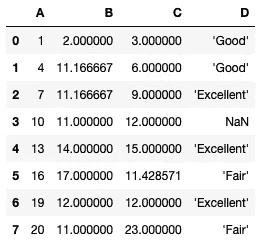

# 使用 sklearn 中的 SimpleImputer 类输入缺失值

> 原文：<https://towardsdatascience.com/imputing-missing-values-using-the-simpleimputer-class-in-sklearn-99706afaff46?source=collection_archive---------5----------------------->

## 了解如何使用 SimpleImputer 类来替换 Pandas 数据帧中的 nan


照片由 [Unsplash](https://unsplash.com?utm_source=medium&utm_medium=referral) 上的 sanga Rima Roman Selia 拍摄

在训练机器学习模型之前，您需要执行的任务之一是数据预处理。数据清理是数据预处理任务的一个关键部分，通常涉及删除具有空值的行，或者用一些估算值替换它们。

> “估算”一词指的是通过对其所贡献的产品或过程的价值进行推断而赋予某物的价值。在统计学中，插补是用替代值替换缺失数据的过程。

在这篇文章中，我将向你展示如何使用 **sklearn** 中的**简单估算器**类来快速方便地替换你的熊猫数据帧中缺失的值。

# 加载样本数据

对于本文，我有一个简单的 CSV 文件( **NaNDataset.csv** )，如下所示:

```
A,B,C,D
1,2,3,'Good'
4,,6,'Good'
7,,9,'Excellent'
10,11,12,
13,14,15,'Excellent'
16,17,,'Fair'
19,12,12,'Excellent'
20,11,23,'Fair'
```

以下代码片段将 CSV 文件加载到 Pandas 数据帧中:

```
import numpy as np
import pandas as pddf = pd.read_csv('NaNDataset.csv')
df
```

数据帧看起来像这样:


# 替换丢失的值

数据帧中所有缺失的值都用 NaN 表示。通常，您可以删除它们，或者用一些推断值替换它们。例如，要用平均值填充 **B** 列中的 NaN，您可以这样做:

```
df['B'] = df['B'].fillna(df['B'].mean())
df
```

B 列中的空值现在用该列的平均值填充:


这很简单，但有时你的填充策略可能会有所不同。您可能希望用最常出现的值来填充缺少的值，而不是用列的平均值来填充。一个很好的例子是 D 列，其中出现最多的值是“优秀”。

要用最频繁出现的值填充 D 列中缺少的值，可以使用以下语句:

```
df['D'] = df['D'].fillna(df['D'].value_counts().index[0])
df
```


# 使用 sklearn 的 SimpleImputer 类

使用 **fillna()** 方法的替代方法是使用 sklearn 的**simple imputr**类。你可以从 **sklearn.impute** 包中找到 **SimpleImputer** 类。理解如何使用它的最简单的方法是通过一个例子:

```
from sklearn.impute import SimpleImputerdf = pd.read_csv('NaNDataset.csv')imputer = SimpleImputer(strategy='mean', missing_values=np.nan)
imputer = imputer.fit(df[['B']])
df['B'] = imputer.transform(df[['B']])
df
```

首先，通过指示策略( *mean* )以及指定想要定位的缺失值( *np.nan* )，初始化 **SimpleImputer** 类的一个实例:

```
imputer = SimpleImputer(strategy='mean', missing_values=np.nan)
```

一旦创建了实例，您就可以使用 **fit()** 函数来拟合您想要处理的列的估算值:

```
imputer = imputer.fit(df[['B']])
```

现在，您可以使用 **transform()** 函数根据您在**simple import**类的初始化器中指定的策略来填充缺失的值:

```
df['B'] = imputer.transform(df[['B']])
```

> 注意， **fit()** 和 **transform()** 函数都需要一个 2D 数组，所以一定要传入一个 2D 数组或 dataframe。如果你传入一个 1D 数组或者熊猫系列，你会得到一个错误。

**transform()** 函数将结果作为 2D 数组返回。在我的例子中，我将值赋回给列 B:

```
df['B'] = imputer.transform(df[['B']])
```

更新后的数据帧如下所示:


# 替换多列

要替换数据帧中多个列*的缺失值，只需传入包含相关列的数据帧:*

```
df = pd.read_csv('NaNDataset.csv')imputer = SimpleImputer(strategy='mean', missing_values=np.nan)
imputer = imputer.fit(**df[['B','C']]**)
**df[['B','C']]** = imputer.transform(**df[['B','C']]**)
df
```

以上示例使用“平均”策略替换了 B 列和 C 列中缺少的值:



# 使用中间值替换

除了使用每列的平均值来更新缺失值，还可以使用 median:

```
df = pd.read_csv('NaNDataset.csv')imputer = SimpleImputer(strategy='**median**', missing_values=np.nan)
imputer = imputer.fit(df[['B','C']])
df[['B','C']] = imputer.transform(df[['B','C']])
df
```

结果如下:


# 用最常用的值替换

如果要用最频繁出现的值替换缺失值，请使用“*most _ frequency*”策略:

```
df = pd.read_csv('NaNDataset.csv')imputer = SimpleImputer(strategy='**most_frequent**', 
                        missing_values=np.nan)
imputer = imputer.fit(df[['D']])
df[['D']] = imputer.transform(df[['D']])
df
```

这种策略对于分类列很有用(尽管它也适用于数字列)。上述代码片段返回以下结果:


# 用固定值替换

您可以使用的另一个策略是用一个固定(常量)值替换缺失值。为此，为策略指定“*常量*，并使用 **fill_value** 参数指定填充值:

```
df = pd.read_csv('NaNDataset.csv')imputer = SimpleImputer(strategy='**constant**',
                        missing_values=np.nan, **fill_value=0**)imputer = imputer.fit(df[['B','C']])
df[['B','C']] = imputer.transform(df[['B','C']])
df
```

上面的代码片段用 0 替换了列 **B** 和 **C** 中所有缺失的值:


# 将简单估算器应用于整个数据帧

如果您想对整个数据帧应用相同的策略，您可以用数据帧调用 **fit()** 和 **transform()** 函数。当结果返回时，您可以使用 **iloc[]** 索引器方法来更新数据帧:

```
df = pd.read_csv('NaNDataset.csv')imputer = SimpleImputer(strategy='most_frequent', 
                        missing_values=np.nan)
imputer = imputer.fit(**df**)
**df.iloc[:,:]** = imputer.transform(**df**)
df
```

另一种技术是使用由 **transform()** 函数返回的结果创建一个新的数据帧:

```
df = pd.DataFrame(imputer.transform(df.loc[:,:]), 
                  columns = df.columns)
df
```

在任何一种情况下，结果都将如下所示:


> 在上面的例子中,“最频繁”策略应用于整个数据帧。如果您使用中位数或均值策略，您将会得到一个错误，因为列 D 不是一个数字列。

# 结论

在本文中，我将讨论如何使用 sklearn 的**simple imputr**类替换数据帧中缺失的值。虽然您也可以使用 **fillna()** 方法手动替换缺失值，但是**simple imputr**类使得处理缺失值变得相对容易。如果您正在使用 **sklearn** ，那么将**simple imputr**与 **Pipeline** 对象一起使用会更容易(在以后的文章中会有更多相关内容)。