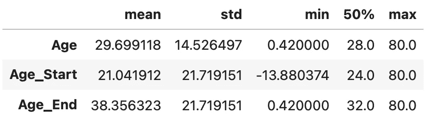

# 输入数字数据:每个数据科学家必须知道的 5 大技巧

> 原文：<https://towardsdatascience.com/imputing-numerical-data-top-5-techniques-every-data-scientist-must-know-587c0f51552a?source=collection_archive---------13----------------------->

## 从简单到高级，但对每个数据科学项目都至关重要。

马库斯·温克勒在 [Unsplash](https://unsplash.com/?utm_source=unsplash&utm_medium=referral&utm_content=creditCopyText) 上的照片

缺失值是日常数据科学工作的残酷现实。大多数数据集都不是 100%完整的，所以你的工作就是想出一个最佳的插补方法。幸运的是，今天你将学习 5 种处理缺失数值的基本技巧，比如年龄、价格、薪水等等。

这篇文章的结构如下:

*   缺失值的简要介绍
*   数据集加载和设置
*   #1 —任意值插补
*   #2 —分布插补的开始/结束
*   #3 —均值/中值/众数插补
*   #4 — KNN 插补
*   #5 —误森林插补
*   结论

# 缺失值的简要介绍

看到一堆缺失值简直是噩梦。除非你是一个领域专家，否则你没有办法对它们进行最佳估算。一个变量的丢失可能有无数的原因——也许它在 ETL 管道中没有得到正确的处理，也许用户没有使用那个特性，或者也许它是一个派生变量，因为其他变量也丢失了。

这是个问题。

你可能知道，最流行的机器学习库——Scikit-Learn——不支持在不完整的数据上建立模型。这意味着你必须以某种方式估算数据或完全删除缺失的记录。第二个选项可能会删除大部分数据集。

插补技术可以提供一个不错的解决方案，但是没有办法知道如果数据集是完整的会是什么样子。嗯，如果数据不是随机丢失的，并且您有一些领域经验的话，情况可能就不是这样了。

所有缺失的数据可以分为三类:

*   **随机缺失(3 月)** —你有可能在不同的样本上获得更多的数据。例如，关注隐私的人不太可能泄露个人信息。
*   **完全随机缺失(MCAR)** —缺失值和其他观察值之间不存在关系，因此可以删除这些记录。
*   **非随机缺失(MNAR)** —值缺失是有原因的。例如，用户可能没有订阅某个功能。这些记录应该被标记，而不是删除。

您可以看到领域专业知识对于输入缺失值是多么有用，尤其是对于 MAR 和 MNAR。如果你不确定——问，不要假设。

# 数据集加载和设置

在演示缺失值插补技术之前，我们需要一个数据集。让我们坚持一些众所周知的，如[泰坦尼克号数据集](https://gist.githubusercontent.com/michhar/2dfd2de0d4f8727f873422c5d959fff5/raw/fa71405126017e6a37bea592440b4bee94bf7b9e/titanic.csv)。

您可以使用下面的代码片段直接从 web 加载它，并在此过程中进行一些转换。所有这些都被评论为:

下面是前五行的样子:

图片 1 —泰坦尼克号数据集的头部(图片由作者提供)

只有一列— `Age`包含缺失值。以下行将显示每列缺失值的百分比:

结果如下:

图 2-缺失值的百分比(作者提供的图片)

我们现在有了开始输入所需的一切！

# #1 —任意值插补

这可能是处理缺失值的最简单的方法。除了扔掉它们。简而言之，如果变量分布为正，所有缺失值都将被替换为任意值，如 0、99、999 或负值。

这种方法假设数据不是随机缺失的(MNAR ),所以我们希望标记这些值，而不是用统计平均值或其他技术来输入它们。

**优势:**任意值插补易于实施，可帮助您的模型捕捉缺失值的重要性(如果存在)。

缺点:它可以对变量分布做可怕的事情，因为它改变了均值、方差和协方差。

让我们使用这种技术来估算缺失的年龄值。代码如下:

以下是汇总统计数据:

图 3 —任意值插补的汇总统计数据(作者提供的图片)

呀。使用这种方法来估算不能为负或高于某个阈值的年龄值没有多大意义。但是在做出结论之前，让我们来看看插补的直观表示:

图 4 —任意值插补可视化(图片由作者提供)

如您所见，新的*峰值*被引入变量，完全改变了原来的分布。总之，这种方法可能是有用的，但将取决于变量类型和数据是否随机丢失。

# #2 —分布插补的开始/结束

前一种技术合乎逻辑的下一步是对位于分布末端的值进行插补。如果一个变量是正态分布的，你可以用平均值的正/负 3 个标准差来确定两端。正如你可能知道的，在正态分布中，任何超出三个标准差的东西都可以被认为是异常值。

这种技术再次假设值不是随机丢失的(MNAR)。出于这个原因，我们希望标记这些值，而不是用统计平均值或其他技术来估算它们。

**优点:**该技术实现简单，可以帮助您的模型捕捉缺失值的重要性，如果它存在的话。

**缺点:**它可以对变量分布做可怕的事情，因为它改变了均值、方差和协方差。

现在让我们假设`Age`是正态分布的，并用分布值的开始和结束来估算缺失值。下面的代码片段可以做到这一点:

以下是汇总统计数据:

图 5 —分布开始/结束插补的汇总统计数据(按作者分类)

不太好。新的峰值将在分布端上升，这对`Age`没有多大意义。这是它的视觉效果:

图 6 —分布插补可视化的开始/结束(作者提供的图片)

总而言之——这可能是一种有用的技术，但在我们的情况下不太管用。与前面的技术相同。

# #3 —均值/中值/众数插补

用统计平均值输入缺失值可能是最常见的技术，至少在初学者中是这样。如果变量呈正态分布，则可以用平均值估算缺失值，如果分布有偏差，则可以用中值估算缺失值。统计模式更常用于分类变量，但我们也将在这里讨论它。

这些技术假设数据完全随机缺失(MCAR)，所以在你的项目中要记住这一点。

**优点:**易于实现和理解，对任何规模的数据集都很快。

**缺点:**可以轻微或剧烈地改变原始分布，具体取决于缺少多少值。

让我们使用这种技术来估算缺失的年龄值。代码如下:

以下是汇总统计数据:

图 7——平均值/中值/众数插补的汇总统计数据(作者提供的图片)

至少可以说，结果看起来很有希望。在下结论之前，让我们直观地探索一下:

图 8 —均值/中值/众数插补可视化(作者提供的图片)

比前两种技术好多了。中间值可能在这里效果最好，因为分布略有偏斜。

# #4 — KNN 插补

接下来让我们探索一些更高级的东西。KNN 代表 K-最近邻，这是一种基于定义的最近邻数量进行预测的简单算法。它计算要分类的实例与数据集中所有其他实例之间的距离。在这个例子中，分类意味着插补。

由于 KNN 是一种基于距离的算法，您应该考虑缩放数据集。一会儿你就会明白了。

**优点:** KNN 插补易于实现和优化，看起来也比以前的技术“聪明”。

**缺点:**由于欧氏距离公式，对离群点比较敏感。它不能应用于分类数据，并且在大型数据集上计算开销很大。

让我们首先从数据集缩放开始。我们还将使用未缩放的数据集，以便之后可以进行公平的比较。以下代码片段使用`MinMaxScaler`来缩放数据集:

以下是缩放数据集的外观:

图片 9-原始数据集的缩放版本(图片由作者提供)

让我们现在进行插补。您需要知道`n_neighbors`参数的值，但这是您可以在以后优化的。价值 3 应该很适合我们。插补后，我们将不得不使用`MinMaxScaler`中的`inverse_transform()`函数，以原始形式显示缩放后的数据集。代码如下:

最后，让我们来看看结果:

以下是汇总统计数据:

图 10——平均值/中值/众数插补的汇总统计数据(按作者分类)

汇总统计数据看起来令人印象深刻，但在下结论之前，让我们先直观地了解一下结果:

图 11 — KNN 插补可视化(图片由作者提供)

这是不同的东西。KNN 插补，尤其是在缩放数据集上，产生了迄今为止最好的结果。如果你想了解更多关于 KNN 插补及其优化的知识，这里有一篇文章适合你:

 [## 如何用 Python 和 KNN 处理缺失数据

### 使用机器学习算法处理缺失数据

towardsdatascience.com](/missing-value-imputation-with-python-and-k-nearest-neighbors-308e7abd273d) 

还有一项技术需要探索。

# #5 —误森林插补

MissForest 是一种基于机器学习的插补技术。它使用随机森林算法来完成任务。它基于一种迭代方法，每次迭代生成的插补都更好。

与 KNN 不同，MissForest 不关心数据的规模，也不需要调优。开箱即用更容易，但这并不意味着结果会更好。

**优点:**它不需要数据准备，因为随机森林算法可以确定哪些特征对插补很重要。它不需要调优，并且可以处理分类变量。

**缺点:**在处理大型数据集时，计算开销会很大。

让我们使用这种技术来估算缺失的年龄值。代码如下:

以下是汇总统计数据:

图 12 —误报森林插补的汇总统计数据(作者提供的图片)

结果看起来很有希望——平均值和标准偏差略有不同，但这是意料之中的。让我们直观地看看结果:

图 13 —误森林插补可视化(作者提供的图片)

总的来说，这些结果比用简单的方法得到的结果好得多，但我还是要说 KNN 做得更好。

如果你想更多地了解 MissForest，这里有一篇文章给你:

 [## 如何使用 Python 和 MissForest 算法估算缺失数据

### 使用随机森林处理丢失数据的分步指南

towardsdatascience.com](/how-to-use-python-and-missforest-algorithm-to-impute-missing-data-ed45eb47cb9a) 

# 结论

这就是你要的——输入缺失值的五种技巧。多元插补技术(KNN 和米斯福里斯特)被证明是更适合泰坦尼克号数据集的整体方法，但这并不适用于所有数据集。

如果可能，在处理缺失值之前，尽可能多地了解数据。作为一名数据科学家，你不可能成为每个领域的领域专家，所以如果可能的话，试着向某人咨询。如果没有，用你的分析技巧找到一种方法，使分布的变化最小化，你就可以开始了。

请继续关注博客，因为将会涉及更多缺失值估算技术。下一篇文章将介绍输入分类变量的最佳技术。

感谢阅读。

喜欢这篇文章吗？成为 [*中等会员*](https://medium.com/@radecicdario/membership) *继续无限制学习。如果你使用下面的链接，我会收到你的一部分会员费，不需要你额外付费。*

 [## 通过我的推荐链接加入 Medium-Dario rade ci

### 作为一个媒体会员，你的会员费的一部分会给你阅读的作家，你可以完全接触到每一个故事…

medium.com](https://medium.com/@radecicdario/membership) 

# 了解更多信息

*   [2021 年学习数据科学的前 5 本书](/top-5-books-to-learn-data-science-in-2020-f43153851f14)
*   [如何使用 Cron 调度 Python 脚本——您需要的唯一指南](/how-to-schedule-python-scripts-with-cron-the-only-guide-youll-ever-need-deea2df63b4e)
*   [Dask 延迟—如何轻松并行化您的 Python 代码](/dask-delayed-how-to-parallelize-your-python-code-with-ease-19382e159849)
*   [如何使用 Python 创建 PDF 报告—基本指南](/how-to-create-pdf-reports-with-python-the-essential-guide-c08dd3ebf2ee)
*   [即使没有大学文凭也要在 2021 年成为数据科学家](/become-a-data-scientist-in-2021-even-without-a-college-degree-e43fa934e55)

# 保持联系

*   关注我的 [Medium](https://medium.com/@radecicdario) 了解更多类似的故事
*   注册我的[简讯](https://mailchi.mp/46a3d2989d9b/bdssubscribe)
*   在 [LinkedIn](https://www.linkedin.com/in/darioradecic/) 上连接