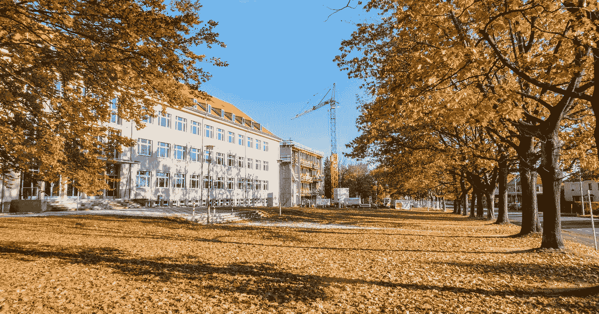

# 在数据科学中，要么专门化，要么死亡

> 原文：<https://towardsdatascience.com/in-data-science-its-specialize-or-die-7ede67a58676?source=collection_archive---------10----------------------->

## 数据科学通才是指在该领域了解不多的人。

照片由 [Unsplash](https://unsplash.com?utm_source=medium&utm_medium=referral) 上的 sanga Rima Roman Selia 拍摄

***注:*** *这只是我的看法！如果你不同意我的观点，留下你的回复，我们可以讨论一下。我喜欢和我不同意的人讨论。对我来说，这比呆在回音室里有趣多了。*

D ata 科学是一个非常广阔的领域，我指的是**广阔**。随着越来越多的数据产生，这意味着公司需要利用和理解越来越多的数据来执行重要决策。事实上，做出可能决定公司未来成败的决定。但即使是这种对数据的使用也不是唯一的。

包括我在内的许多数据科学家和机器学习工程师不喜欢公司理解数据的千篇一律的盒子。生物学领域的数据科学家与商业领域的数据科学家有着本质的不同。虽然编程工具和范例几乎完全重叠，但科学家的领域专长是他们区别于其他候选人的地方。

我喜欢音乐。有时甚至超过我自己。我知道这很奇怪，但这是我真正关心的少数事情之一，以至于所有认识我的人都知道我的两件事:编程和音乐。

当我意识到数据科学的广阔潜力时，我很快意识到我想进入音乐领域。就我个人而言，我不太关心数据科学的大多数应用，但我能够找到我真正关心的东西:利用数据为艺术家提供激励，以激励我们所有人。

在研究如何学习音乐时，更具体地说，是学习录制音乐中的数据时，我意识到我必须学习各种数字信号处理技术，以便能够以可理解的方式处理歌曲，这需要对电气工程领域有很多了解。所以，我咬紧牙关，决定学习什么是需要的，不仅是对我自己，也是对我未来的职业生涯。这样做无疑是我职业生涯中最伟大的决定。

事实证明，学习如何理解音频数据不仅是一个有趣的激情项目，还让我为自己不断增长的工具箱获得了更多工具，我可以随心所欲地使用它们。随着我对音乐的了解越来越多，我开始尝试更多的应用，比如自动语音识别、语音转文本、文本转语音和自动去噪。我可以自信地解决这些问题中的任何一个，因为我决定专注于音频数据。

如果你想在一家大型科技公司工作，并在他们创造的众多虚拟助理中的一个工作，你很可能会在面试中遇到一个基于音频的问题。不太了解数字信号处理的数据科学家可能会一败涂地。为什么？因为在那一刻，他们缺乏解决问题所需的知识。代表录制的音频的最佳方式是什么？语音转文本的最佳算法是什么？这些相同的算法能用于盲源分离吗？为什么？

这就是为什么专业化是关键。

简历中有数据科学家的头衔，并不代表你能胜任每一份数据科学家的工作，没错，我也包括在这份声明中。我不想听起来刺耳，但这就是事实。就像我之前说的，我可以处理很多基于音频的问题。然而，如果你给我一个与商业相关的问题，我可能会比那些已经了解商业和理论各个方面的人花更长的时间来得到相同的结果，如果不是更不利的话。在你的职业生涯中尽早认识到这一点会让你避免浪费申请机会，同时也能在这个过程中最小化你的自负。

作为一名数据科学通才，你声称你可以解决从无人驾驶汽车到 NLP、股票价格预测到蛋白质折叠等领域的问题。所有这些问题都属于数据科学的广阔领域，因为它们需要数据来解决。祝你好运，你可以向招聘人员证明，你可以像那些每天花几个小时钻研这些领域的人一样做好所有这些事情。

你知道多少算法并不重要。如果你不知道你在学习什么，那么你在学习什么呢？数据科学是一门任何人都可以磨练和完善的艺术。这就是我如此喜欢它的原因。然而，找到自己心中最好的数据科学家需要一点反思、一点奉献和大量的热情。

> 感谢您的阅读。