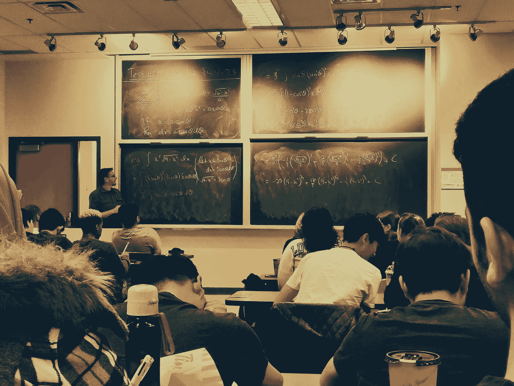

# 为认知媒介辩护

> 原文：<https://towardsdatascience.com/in-defense-of-a-cognitive-medium-9d6f91336625?source=collection_archive---------33----------------------->


图片由我美丽的女友 Beatriz Belbut 提供。

## 从静态认识到动态探索

# 从铅笔到其他东西

如果我问你 10 乘以 3 是多少，你可能会很快回答:“30！”。不需要任何巨大的努力。然而，如果我问你 3498 乘以 2345 是多少，你可能很难直接回答。相反，如果我让你用铅笔和纸，你会没有问题，在几分钟内你会写下数字，并很快得到答案。


作者图片

你可以说 ***铅笔和纸在某种程度上增强了你、*** 。我说的增加是指 ***增加你可以执行*** 的思维和操作范围，让你一次专注于问题的小部分，最终得出正确的答案。

请注意，你仍然在使用你的头脑并在精神上努力，然而，通过使用适当的媒介来帮助这种努力，你的短期记忆的负担会大大减少。

今天，用于*“知识工作”*的技术似乎高度集中于外包我们的脑力:我们用谷歌在几秒钟内找到答案，我们使用计算器，一切都在我们的指尖，以一个应用程序的形式设计，完全或几乎完全取代我们的脑力工作。

另一方面，当谈到可以与我们合作以增强我们能力的技术时，我认为我们没有外包部门那么丰富和多样化。

重点不是批评任何这样的技术本身，人们甚至可以说，像谷歌这样的东西以某种方式增强了我们的能力，但还是要把重点放在它们设计背后的动机上，它们更多地是为被动而不是为主动参与和思考而设计的。

**这篇文章的目的是论证一种不同类型的动态思维媒介的重要性，这种媒介考虑了人类理解模式的多样性，侧重于扩展我们的认知能力。**

# 从柏拉图到现代表征

哲学中有一个传统，可以追溯到柏拉图，将技术或技巧作为人类的一个独特标志，我们用它来克服我们自己脆弱的人类状况。

这个想法来自普罗米修斯的神话，神话中说，普罗米修斯让人类能够控制火(技术的隐喻)，这样人类就可以利用自然来克服自身的身体限制。


图片作者。灵感来自 Ted-Ed 的这个[视频](https://www.youtube.com/watch?v=U_u91SjrEOE&t=137s&ab_channel=TED-Ed)

*技术概念的基础在于它是人类能力的补充工具。然而，历史上发生了一些事情，技术似乎已经走上了替代的道路:语音、通信、计算、物理能力……***我们用机器来为我们做这些事情。****

**

*图片作者。灵感来自 Ted-Ed 的视频[中的图片](https://www.youtube.com/watch?v=U_u91SjrEOE&t=137s&ab_channel=TED-Ed)*

*我认为，旨在帮助人类从事知识工作的技术是最好的例子。它们是为被动而设计的，而我们拥有的许多能力并没有集成在这样的设计中。*

*我认为这应该得到纠正，应该更加重视适当的思考媒介，考虑到有意义的上下文表征，以增强我们的思考能力。*

## *上下文表征*

*这里我所说的 ***表示*** 具体指的是 ***数据结构和类似程序的结构，我们可以用它们来生成洞察力*** 。这个定义属于我最喜欢的一个技术专家 Brett Victor，摘自他的讲座:[“思想的人性化表示”](https://vimeo.com/115154289)。*

*当我们使用笔和纸时，我们可以感觉到这种表达的价值。数字是一种表示，加号是另一种表示。这些塑造了我们对世界的理解，并严重依赖于表达它们的媒体。*

*例如，用铅笔和纸很难有意义地描述时间动态。人们可以写一个“时间”轴，但这与拥有一个实际上是动态的、代表时间行为的媒介是不一样的。*

*铅笔和纸作为思想表达的媒介，就像其他媒介一样，它们所允许的表达方式是有限的。*

**

*[《平地》埃德温·阿博特](https://www.google.com/url?sa=i&url=https%3A%2F%2Fcommons.wikimedia.org%2Fwiki%2FFile%3AFlatland_(first_edition)_page_100.png&psig=AOvVaw1i-cWAcZltOrYGvwgSipVb&ust=1612186965814000&source=images&cd=vfe&ved=0CAIQjRxqFwoTCLCm-82mxu4CFQAAAAAdAAAAABAD)。图片取自维基媒体:[https://commons . wikimedia . org/wiki/File:Flatland _(first _ edition)_ page _ 100 . png](https://commons.wikimedia.org/wiki/File:Flatland_(first_edition)_page_100.png)公共领域。*

*表象是我们可以使用、操纵和发展的心智工具，以建立对世界的复杂理解。本质上，它们是积木，是我们头脑中用来构建思想的“乐高积木”。*

*然而，正如我之前所说，它们高度依赖于表达它们的媒介。我们可以把铅笔和纸这样的媒介想象成我们大脑的显微镜，通过在有意义的上下文中使用丰富的表征来减轻我们短期记忆的负担，让我们看到以前看不到的东西。*

*好的思维媒介有可能通过促进我们接触更丰富的表象来增强我们的能力，我们可以利用这些表象来收集洞察力、解决问题和思考细节。*

> *与这样的媒介一起工作拓宽了我们的思想范围，就像显微镜拓宽了我们能看到的东西的范围一样。*

**

*图片作者。*

*这种表示在不同文化中是共享的(例如，数字和等式在我们的文化中广泛用于数学)。这些心智工具很重要，它们是我们思考复杂事物能力的支柱。*

*以这个例子为例，想象你在家里，你想去某家餐馆。所以你打开你的智能手机，在谷歌地图上输入你选择的餐馆的地址，这个应用程序就会给你指路。*

*然而，该应用程序只能到此为止。现在你面前有了地图，就看你自己去解读这些图像和指示对到达你的位置意味着什么了。因为你知道它们的意思，你可以快速浏览这些方向图，你就可以轻松到达目的地。*

*你能想象这有多难吗？如果这款应用不是用图像和箭头来显示地图，而是只向你展示如何到达目的地的口头描述。*

**

*作者提供的图片和 googlemaps.com 的截图*

*解码书面版本比理解地图要多得多的不必要的脑力劳动！为什么？因为 ***有好坏之分的表象。*** 在这种情况下，带箭头的地图是指引人们走向某个地点的很好的表示。这种情况下的文本不是。*

*可以说 ***地图是方向信息*** 的适当表示。然而，如果我们讨论的是历史或哲学，用地图可能就不太管用了。我们会失去书面语言所能提供的描述困难的、细粒度的抽象概念的信息。人们会用地图来指引人们，用文字来解释存在主义和生存的可怕痛苦。*

**

*图片 ay 作者。*

> *这里的要点是要理解媒介和表现应该适合问题、任务或手边的背景，使用错误的媒介或错误的表现自然会阻碍我们思考特定主题的能力。*

*当我们思考事物时，由于历史的某些原因，我们只专注于符号表征，作为我们表达思想和交流思想的主要渠道。*

*然而，随着技术的发展，我们现在有了历史上独一无二的机会来重新考虑我们被迫的选择，并从我们用来做所有知识工作的这些矩形盒子中进化出来。*

*知识工作不一定非得是打字和点击这种受约束和身体限制的过程。它应该整合一系列更加多样化和人性化的渠道来吸收和处理信息。*

## *通过表象思考*

*表征直接影响我们的思维方式。语言可能是表现力量的终极例子。当我们给某物命名时，我们就获得了对它的控制，这就是授权。*

*表征允许我们将我们希望理解的东西内在化。例如，当你想到数学时，你可能会想到:*

**

*照片由[舒巴姆·莎兰](https://unsplash.com/@shubhamsharan?utm_source=medium&utm_medium=referral)在 [Unsplash](https://unsplash.com?utm_source=medium&utm_medium=referral) 拍摄*

*复杂的符号方程在一个大板上。这种主要存在于符号领域的数学思想是数学符号进化的副产品，换句话说，是数学表示的进化。举一个简单的例子:*

1.  *一个数的平方。*
2.  *x*

*就像地图的情况一样，每次我们打算使用 x 时都要写下对它的描述是不可思议的，但是曾经有一段时间数学是通过书写而不是通过我们今天使用的符号来完成的。*

*这种演变对数学至关重要，因为这种简单而紧凑的表示允许我们有效地压缩信息，极大地提高了数学家可以处理的复杂程度。*

*我展示的例子都是关于把复杂的结构打包成能立即显示其核心直觉的东西。*

# *人们如何思考*

*布雷特·维克托(Brett Victor)在他的演讲《思想的人性化表达》(A humanual Representation of thinking)中精彩地指出，今天用于思考和解决问题的主流媒介(如电脑和平板电脑)是简化的，因为它们只强调了我们所拥有的理解模式范围中的一小部分。他来自皮亚杰的观点，认为我们有以下几种理解模式:*

*   *视觉的*
*   *耳的*
*   *触觉的*
*   *动觉的*
*   *空间的*

*他还提到了其他关于这个问题的观点，比如杰罗姆·布鲁纳的观点:制定的、标志性的和象征性的。他的论点是，我们使用的 ***技术限制了这些模式的大部分，媒体只占专注于视觉和符号表示的子集。****

****我们受限于这种低带宽的知识表达渠道，*** 这与我们拥有的多样化的思维和理解模式形成了鲜明对比。我们被这些屏幕所包围，这些屏幕并没有设计成包含我们可以思考的全部思想。我们可以打字、点击和绘图，就是这样！维克多说得更好:*

> *它限制了我们知识经验的范围*

*他为动态媒体的立场辩护，这种媒体将跨越人类的全部能力，以一种解放我们而不是像我们一直随身携带的这些媒体消费设备那样奴役我们的方式。*

*虽然我认为 AR 和 VR 可以在适当的情况下(这肯定不能保证)缓解这个问题的一部分，但他的批评是独特的，因为 ***它质疑了我们如何做知识工作的本质以及我们用来做知识工作的材料。****

*迈克尔·尼尔森(Michael Nielsen)的两篇伟大文章讨论了这种潜在动态媒介的子集，分别是[“重新发明的解释”](https://michaelnielsen.org/reinventing_explanation/index.html)和[“走向数学的探索媒介”](http://cognitivemedium.com/emm/emm.html)。*

*在这些文章中，他从有意义的互动解释(前者)的角度来探讨对这种媒介的需求，以及如何开始构思这种媒介来探索数学概念(后者)。在后一篇文章中，他展示了一个足以发现和理解一种叫做奇异值分解的数学的环境原型。*

*尼尔森先生提出的观点是，我们需要重新思考我们如何理解解释以及我们用来产生解释的“传统”媒介。*

## *从不足到理解*

*从我还是个孩子的时候起，我就对数学和物理这样的理论课题同时感到着迷，同时又对自己从事这些课题的真正能力感到可怕的无能。*

*虽然我总是可以在学校表演，但我仍然觉得缺少了一些东西: ***一种工具，一种以自然和快速的方式表达我所想的方式，让我可以在不感到无聊或沮丧的情况下摆弄我的想法。****

*这种感觉追了我一辈子，当我开始用 python 进行深度学习和编程时，事情开始对我产生影响。从那一刻起，我变得更加投入，有了这个简单的工具，我可以以我从未想过的速度将我的想法变成现实。*

*虽然我完全被迷住了，但这种感觉并没有消失。即使我可以编写比我以前尝试过的任何其他工具更快实现我的想法的程序，它仍然不够快。*

*考虑这个试图理解什么是导数的简单例子。更好的是，让我们试着勾勒出理解导数是函数在任一给定点的切线斜率所需的工作流程。*

*我想展示我将如何使用我目前的工具来观察这些行为，并从导数的定义出发，得出关于平方函数及其导数之间关系的一些令人满意的结论:*

**

*图片作者。*

*我的第一步是画一个函数，来了解正在发生的事情。之后，我将使用 matplotlib 和小部件编写一个简单的交互式工具，来绘制通过函数上两点的割线的行为:*

```
*# %matplotlib widget
%matplotlib inline
import ipywidgets as widgets
import matplotlib.pyplot as plt
import numpy as np
import seaborn as sns
sns.set()def plotDerivative(a,h):
    """
    Print the current widget value in short sentence
    """
    x = np.arange(-5,10,1)
    f = lambda i: i**2
    pointA = (a,f(a))
    pointH = (a+h,f(a+h))
    m = (f(a+h) - f(a))/float(h)
    print(f"m = {m}")
    y = m*(x-a) + f(a)
    plt.plot(x,f(x), color="blue")
    plt.plot(x,y, color="red")
    plt.scatter(pointA[0],pointA[1],c="purple")
    plt.scatter(pointH[0],pointH[1],c="purple")
    plt.xlim(-20,20)
    plt.ylim(-20,30) widgets.interact(plotDerivative,a=widgets.IntSlider(min=-10, max=10, step=1, value=5),h=widgets.IntSlider(min=0, max=5, step=1, value=1))*
```

**

*此时，我有一个问题:生成这样一个简单的可视化工具所花费的平均时间是否使得这种方法值得？*

*好吧，有更好的方法来用代码形象化这一点，但重点是当你还不知道导数是什么(在这种情况下，作为在任何给定点与函数相切的线的斜率)时理解导数，用这种方法我可以看到一些有意义的行为(当一个点接近另一个点时，线变得与函数相切)，但代价是要花几分钟来获得正确的代码。*

*这里的问题是，对于这个问题的如此低维的表示，它所花费的时间使它成为一个非理想的思考工具，至少对于这个主题来说。*

*当然，我本可以以花费更多时间编码为代价生成一个更好的工具，或者一些能够更紧密地处理衍生产品核心的方法，但是，从试图快速可视化一种关系并了解正在发生的事情的因果关系的人的角度来看，使用一个不是为快速思考而设计的工具是没有意义的。*

*我正在努力思考衍生产品，而思考发生得很快，如果我要使用一个工具来思考， ***工具的速度应该与我对我正在研究的主题有想法的速度相匹配。****

*然而，我仍然认为，与其他方法相比，今天的编码可能是我们拥有的最接近一般意义上的思维工具的东西之一，这回避了什么可能更好的问题？*

*为了举例说明对比，让我们看看一个叫做 [desmos](https://www.desmos.com/calculator) 的工具，特别是图形功能，它可以很容易地在交互式二维网格中可视化任何简单的功能。*

*以下是一个工作流程的快速视频，显示了与之前相同的问题的解决方案，但在 desmos 中:*

*作者关于 youtube.com 的视频*

*又快又简单！它仍然需要一些直观的实践，可能需要几分钟，但它比编码快得多，并能快速提供更多的交互功能，因此对于基本的数学绘图工作流来说，它比编码更好。我可以写下我在高中数学时代就非常熟悉的符号表达式，并立即绘制出图形！*

*现在，这不是一个关于衍生产品的讲座，也不是一个关于为什么 desmos 比编程更好的讲座，而是展示一个给定主题的更合适的工具如何增强我们对它的思考。*

*来自“三蓝一棕”频道的 Grant Sanderson 展示了一个非常好的数学思维流程:*

*你可以看到他是如何在设计、编程和写作之间切换的，因为 ***每种媒介都提供了合适的环境，在那里人们可以以适当的方式操纵合适类型的表达，从而在需要的时候获得有意义的洞察力。****

*从这里得到的教训是，不仅要有适当的表现，而且媒体也很重要，它应该整合可控性、交互性、即时反馈和许多其他元素，使其成为理想的思维媒体。*

# *关于思维媒介草图的最后思考*

*随着我们的思维速度快速地表达知识，就是要与允许对信息进行快速有效的上下文压缩的环境一起工作。*

*互动作为思想本身的一个基本组成部分的想法并不新鲜。道格拉斯·恩格尔巴特是引入交互技术理念的基础思想家之一。在过去的 10 年里，像芭芭拉·特沃斯基、迈克尔·尼尔森、肯·珀利姆和布雷特·维克托这样的作家以这样或那样的方式为适当思维技术的需要辩护。*

*铅笔和纸是思维压缩的好工具，但是它们被限制在我们能思考的事物范围的一个非常低的维度上。*

*我们今天知道[在课堂上记笔记能增强学习](https://journals.sagepub.com/doi/10.1177/0956797614524581)，因为当我们记笔记时，我们有意义地接触了材料。我们不知道的是，如果我们有更合适的媒介来表达我们的想法，与我们拥有它们的速度相匹配，我们可以观察到学习中潜在的巨大进步。*

*就像计算机的发明给我们思考无法通过分析完成的更复杂过程的能力带来了巨大的好处一样，一个更具活力和人性化的思考和解决问题的媒介也会产生类似的积极影响。*

*至于这样一个思考空间的要素，我建议看看维克多先生的著作以及肯·佩里姆的 chalktalk。我认为基本要素是:*

*   *直接操纵*
*   *交互性*
*   *即时反馈*
*   *能够随时提供系统的整体视图*
*   *在上下文操作中*

*这些理论基础应该是创造思维环境的核心。*

# *重新思考你的工作空间*

*举个例子，你今天可以做的一件事就是 ***重新思考你的工作空间*** 。以前，我认为知识工作是一种坐下来的活动，包括点击、打字、有时画画和做手写笔记，但在深入思考这个话题并受到布雷特·维克托、迈克尔·尼尔森、芭芭拉·特沃斯基和肯·佩里姆等人的严重影响后，我决定对我来说最好的事情是重新设计我的工作空间，以考虑到站起来和多动。*

*这还不是故事的结尾，因为技术是问题的主要核心，但它确实有助于参与，以及感受到思考是我们可以体现的东西！哲学家弗里德里希·尼采过去常常长途跋涉去帮助他思考。这不是从他的工作流程中分离出来的东西，而是作为他思考过程的一部分整合在一起的。*

*现在，我有了白板，我的显示器可以扩展到站着和四处移动使用(不仅仅是在桌子上)。我还想集成一个桌面触摸屏，这样我可以站起来，但仍然能够有效地与我的电脑进行数字交互。*

*这里的主要思想是创造一个运动的动机，而不是把一切都集中在坐下这个想法上。*

*尽管这是一个进步，但它并没有解决当今思维技术的主要认知缺陷。这将需要整个集体的人思考更好的方法来建立和传播知识，并参与社会使之成为一个优先事项。*

*这样做的一个危险是，资本的逻辑往往是短视的，错误的选择往往会殖民整个技术景观，所以这取决于人们是否意识到 ***我们被喂养的小矩形笼子不够人性化，不足以成为我们思维空间的未来。****

*谢谢，下次再见！；) .*

*如果你喜欢这篇文章[在 Medium 上关注我](https://lucas-soares.medium.com/)，在 [Twitter](https://twitter.com/home) 和 [LinkedIn](https://www.linkedin.com/in/lucas-soares-969044167/) 上与我联系。*

# *参考*

*   *[思想作为技术](http://cognitivemedium.com/tat/)*
*   *[思想的人性化表现](https://vimeo.com/115154289)*
*   *[思考不可思议的媒体](https://vimeo.com/67076984)*
*   *[走向数学的探索性媒介](http://cognitivemedium.com/emm/emm.html)*
*   *[彻底改造解释](https://michaelnielsen.org/reinventing_explanation/index.html)*
*   *[让看不见的理解变得可见](http://cognitivemedium.com/invisible_visible/invisible_visible.html)*
*   *[动画本](http://cognitivemedium.com/tat/assets/Kay_Goldberg.pdf)*
*   *[看到空间](https://vimeo.com/97903574)*
*   *[数学的不合理有效性](https://web.njit.edu/~akansu/PAPERS/The%20Unreasonable%20Effectiveness%20of%20Mathematics%20(EP%20Wigner).pdf)*
*   *[与互动文章交流](https://distill.pub/2020/communicating-with-interactive-articles/)*
*   *[Welchalabs](http://www.welchlabs.com/technical-storytelling)*
*   *[Petros Vrelis 互动星夜](http://artof01.com/vrellis/works/starry_night.html)*
*   *[Brett Victor 的互动动力系统](https://vimeo.com/23839605)*
*   *[学习的乐趣](https://supermemo.guru/wiki/Pleasure_of_learning)*
*   *[视觉解释有助于学习](http://www.ncbi.nlm.nih.gov/pmc/articles/PMC5256450)*
*   *人们喜欢简单的解释*
*   *[关于知识表示的图表和形式](https://onlinelibrary.wiley.com/doi/abs/10.1111/j.1551-6708.1987.tb00863.x)*
*   *[插图有助于将注意力集中在解释信息上](https://psycnet.apa.org/record/1989-34646-001)*
*   *[芭芭拉·特沃斯基的《作为认知缩影的图表》](https://onlinelibrary.wiley.com/doi/full/10.1111/j.1756-8765.2010.01113.x)*
*   *[个人动态媒体](http://cognitivemedium.com/tat/assets/Kay_Goldberg.pdf)*
*   *尼尔森粉笔对话笔记*
*   *肯·佩里姆的谈话*