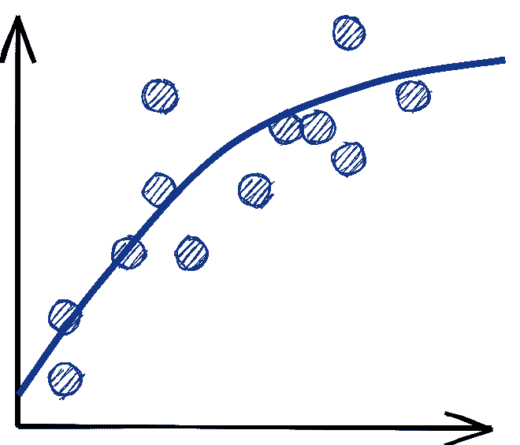

# 为统计建模辩护

> 原文：<https://towardsdatascience.com/in-defense-of-statistical-modeling-e73d889b475d?source=collection_archive---------25----------------------->

## [意见](https://towardsdatascience.com/tagged/opinion)

## 持续不断的评论说数据科学被夸大了。不要相信。

数据科学在[已经](https://hbr.org/2012/10/data-scientist-the-sexiest-job-of-the-21st-century)[热了](https://www.forbes.com/sites/louiscolumbus/2017/05/13/ibm-predicts-demand-for-data-scientists-will-soar-28-by-2020/?sh=c52edc07e3bd)多年，吸引了关注和人才。然而，有一种持续的评论说，数据科学的统计建模核心技能被夸大了，经理和有抱负的数据科学家应该专注于工程。Vicki Boykis 的 2019 年博客文章是我记得的第一篇沿着这些思路写的文章。她写道:

> *…数据科学正逐渐向工程靠拢，数据科学家前进所需的技能更少基于可视化和统计，更符合传统的计算机科学课程…*

在这个前提下，她的合理建议是:

> *不要攻读数据科学学位，不要参加训练营…通过“后门”进入数据科学和技术职业要容易得多，也就是说，从初级开发人员开始，或者在开发运维、项目管理领域，以及可能最相关的领域，担任数据分析师、信息经理或类似职位…*

她列出的一个有抱负的数据科学家应该学习的技能完全由数据工程、MLOps 和工具组成，她故意省略了建模，说:

> *虽然调整模型、可视化和分析占据了您作为数据科学家的部分时间，但数据科学一直以来都主要是在一个地方获取干净的数据以用于插值。*

最近，Gartner 的 2020 年[人工智能炒作周期报告](https://www.gartner.com/smarterwithgartner/2-megatrends-dominate-the-gartner-hype-cycle-for-artificial-intelligence-2020/)承认了数据科学家的作用，但表示:

> Gartner 预测开发人员将是人工智能的主要力量。

Chris I. [说得](/dont-become-a-data-scientist-ee4769899025)更直白，有一篇文章题为《不要成为数据科学家》。

> 每个人和他们的祖母都想成为一名数据科学家…我经常收到新毕业生和转行者的消息，向我咨询进入数据科学的建议。我告诉他们要成为一名软件工程师。

米哈伊尔·埃里克在一篇题为“我们不需要数据科学家，我们需要数据工程师”的文章中呼应了这一想法。

> *如今，在帮助公司将机器学习和建模见解应用于生产中心的数据问题方面存在瓶颈……这听起来可能很无聊，也不性感，但倾向于数据的老派软件工程可能是我们现在真正需要的……对于市场上大量受过数据科学培训的新人来说，职位会越来越少。*

我同意这些文章的观点，即数据工程和 MLOps 对于应用行业数据科学工作非常重要，但**我也相信数据科学的核心技能——统计建模——正变得越来越重要，而不是越来越不重要**。由于在这个 Covid 时代，我们没有太多机会进行面对面的辩论，所以我想象这些怀疑论者会如何进行辩论。

作者图片

# 数据科学这个术语被淡化了

**怀疑论者:** *“数据科学”这个术语到底是什么意思？这么宽泛模糊的称呼，再加上* [*这年头大家都自称数据科学家*](https://medium.com/@chamandy/whats-in-a-name-ce42f419d16c) *，所以完全淡化了。*

**我:**数据科学*就是*一个大帐篷。当人们谈论术语*应该是*的意思时，它通常围绕着*统计建模*的核心技能。例如，boykis[引用](https://veekaybee.github.io/2019/02/13/data-science-is-different/)“机器学习、深度学习和贝叶斯模拟”作为初级数据科学家期望从事的工作，而不是他们最终完成的“清理、塑造数据并将其从一个地方移动到另一个地方”的工作。Eric [将数据科学家描述为“负责构建模型以探索从一些数据源中可以学到什么的人，尽管通常是在原型而不是生产层面。”](https://www.mihaileric.com/posts/we-need-data-engineers-not-data-scientists)

统计建模是大多数统计学、机器学习和数据科学课程中教授的内容。除其他外，它包括:

*   传统的预测模型，即回归和分类。所有最成功的方法——线性模型、提升树、神经网络等等——都属于这一类
*   时间数列预测法
*   实验设计和分析
*   因果推理

# 模型训练将会过时；软件工程师可以做这项工作

**怀疑论者** : *所以数据科学只是训练模型？随着* [*AutoML*](https://www.fast.ai/2018/07/16/auto-ml2/) *和像 GPT-3 这样的大规模预训练模型的崛起，这难道不是已经过时了吗？随着* [*模型的构建变得商品化*](https://www.mihaileric.com/posts/we-need-data-engineers-not-data-scientists)*[*软件工程师*](https://www.gartner.com/smarterwithgartner/2-megatrends-dominate-the-gartner-hype-cycle-for-artificial-intelligence-2020/) *将会做这些工作，而不是* [*方法论者*](/dont-become-a-data-scientist-ee4769899025) *。**

*我:统计建模涉及的不仅仅是按下通用 scikit-learn 或 PyTorch 脚本上的按钮。AutoML 工具可以帮助一些部分，如超参数搜索和特征选择，但还有更多功能。*

*正如我[几周前写的](https://www.crosstab.io/articles/formulation-comes-first)，数据科学家需要做的第一件事是**理解业务问题，并将它们表述为建模任务**。例如，您希望减少客户流失，但是您应该将其视为二进制分类还是事件时间问题？一个预测模型就够了吗，还是需要得出因果结论？你将如何进行实验来验证模型的有效性？*

*建模的下一步是**彻底理解和清理数据**。这项工作本身通常会创造大量的价值，因为数据科学家通常是唯一有资格在业务逻辑和数据工程之间进行转换并发现问题的人。*

*模型拟合过程正在不断发展，尤其是像 [MLFlow](https://mlflow.org/) 、 [Comet](https://www.comet.ml/site/) 和[Weights&bias](https://wandb.ai/site)等模型训练平台已经成熟。但是，许多组件仍然不能自动化或抽象出来。例如，数据科学家必须决定如何评估模型性能。对于一个预测模型，我们应该使用随机的还是时间的训练测试分割？什么评估指标最符合业务用例？*

*建模过程的最后一块是**沟通**。数据工程和 MLOps 需要知道如何在生产中实现模型(如果这不是数据科学家的工作的话)。业务部门至少需要对模型如何工作的基本直觉，以及对意外预测的解释。*

*至于像 GPT-3 这样的大规模预训练模型，当然，大多数公司的大多数数据科学家不应该浪费时间试图从头构建它们。但是这些模型覆盖了真实世界用例的一小部分；**绝大多数应用程序没有预先训练好的模型**来构建。*

# *数据科学家花大部分时间做其他事情*

***怀疑论者:** *很公平。但是我听数据科学家说* [*超过*](https://www.shreya-shankar.com/modeling-libraries/) *和* [*超过*](https://veekaybee.github.io/2019/02/13/data-science-is-different/) *建模工作只占他们时间的一小部分。甚至*你*说* [*数据工作应该在*](https://www.crosstab.io/articles/formulation-comes-first) *建模之前。因此，如果我是一名招聘经理，我不应该首先关注数据工程和 MLOps 工程师吗？如果我选择我的职业，数据工程不是更安全的选择吗？**

*我:让我们先达成共识。问题公式化、数据探索和数据清理是统计建模的*部分。理解数据工程和模型部署管道如何工作是统计建模的*部分*(尽管设计和实现这些系统不是)。即使是只想做统计建模的数据科学家也应该接受这些任务。**

*我同意从组织的角度来看，数据工程比统计建模具有更高的优先级。甚至[实验分析](https://experimentguide.com/)——不需要部署——也完全依赖于良好的仪器和数据管道。*

*更小、更有竞争力的公司的数据科学家将更多时间花在数据工程和 MLOps 上。更喜欢专注于统计建模的人应该关注更大、资金更充足、拥有更多专业团队的公司。不过，我会告诫不要过早进行职业专业化，因为**了解一些工程知识可以让数据科学家在一个组织的技术和业务方面之间充当一座非常有价值的桥梁**。这也为将来转向更偏重于工程的角色留下了余地。*

# *大多数数据科学项目都失败了*

***怀疑者:** *给怀疑者打一分。我还读到过，大多数数据科学* [*项目*](https://www.gartner.com/en/newsroom/press-releases/2018-02-13-gartner-says-nearly-half-of-cios-are-planning-to-deploy-artificial-intelligence) [*失败*](https://venturebeat.com/2019/07/19/why-do-87-of-data-science-projects-never-make-it-into-production/) *，所以我不明白为什么一个公司——尤其是一个小而好斗的公司——要在数据科学家身上浪费资源。**

*我:我见过那些说 85%或 87%的项目失败的消息来源，但他们似乎只是凭空捏造数字。数据在哪里？我对你的怀疑态度表示怀疑！*

*更严重的是，一个数据科学项目的失败意味着什么？Kohavi、Tang 和 Xu 指出，大多数实验都失败了，因为提议的改变并不比现有系统更好。然而，这并不是商业意义上的失败，因为这些实验仍然会导致好的决策和快速的创新节奏。*

*更一般地说，统计建模者带来的最有价值的东西是他们的文化。数据科学家坚持用证据而不是直觉来证明想法，特别是通过量化模型性能。在我们进行实验之前，我们需要知道我们用什么指标来评估一个新想法。在部署复杂的预测模型之前，我们需要知道基线是什么。很可能是目前确定性的，硬编码的系统，你连模型都没想到，更别说度量了！因此，即使一些项目失败，强大的数据科学家也会提高整个组织的标准。*

*建模专家还通过提前发现潜在的建模问题来加快创新的步伐。例如，在[推荐系统](https://twitter.com/karlhigley/status/1368555888609550336)中，提前考虑如何避免闭环反馈、如何解决冷启动问题以及如何确保算法的公平性非常重要。*

*然而，在数据科学项目中，并不是所有的事情都是可以计划的。与其他工程学科不同，**我们不能*先验地*向我们的合作伙伴承诺具体的结果**甚至是可靠的路线图，因为[我们不知道](https://www.shreya-shankar.com/8d5c6ec070babe7c23d3d5b68384a8bd/retrospective.pdf)我们会在数据中发现什么。拥有独特的数据科学角色有助于传达这种局限性。*

# *数据科学家太多了*

***怀疑论者:** *也许高级数据科学家真的很好增值但是现在有了***[*初级数据科学家*](https://veekaybee.github.io/2019/02/13/data-science-is-different/) *。这些穷人最终会在没有准备好统计模型的公司工作，浪费他们的培训和才能。****

****我:**我们上面说过，数据清洗是统计建模的*部分*，数据科学培训项目更应该强调这一点。想专攻模特的人应该去大公司找工作，尽管这也不是万灵药；理解数据和工程管道总是很重要的。**

**数据科学劳动力供大于求可能是真的，至少就有明确“数据科学家”头衔的工作而言。这种观点只见树木不见森林。有抱负的数据科学家可能不得不将他们的求职范围扩大到其他职位或特定业务部门的目标角色，但统计建模可以而且应该应用于几乎所有行业职位。**不管头衔如何，建模技术好的人会更有效果，更能登顶。****

**不管是通过学位、训练营还是自学，真正学习统计建模是很重要的。一个人不能完全专注于数据工程和 MLOps 来获得一份工作，然后希望在没有任何建模经验的情况下转到数据科学团队。**

# **结论**

**在过去的 10 年里，数据科学领域肯定受到了大量的炒作，一定程度的抵制是不可避免的，甚至是富有成效的。但是我们不要忘记它的统计建模核心技能带来的价值。**

***原载***交叉表风筝。****