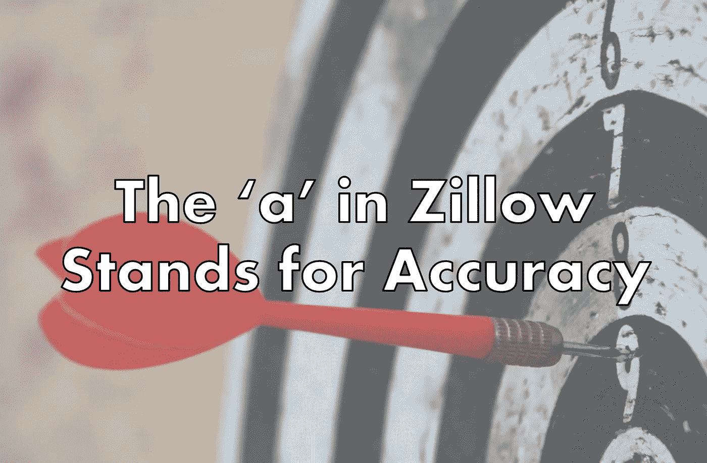

# 为 Zillow 被围攻的数据科学家辩护

> 原文：<https://towardsdatascience.com/in-defense-of-zillows-besieged-data-scientists-e4c4f1cece3c?source=collection_archive---------12----------------------->

## 意见

## 模型必须小心使用

网上流传的许多 Zillow 笑话之一

Zillow 的即时购买(又名 Zillow Offers)业务本月戏剧性地内爆了。3.5 年后，Zillow 做出了艰难的决定，关闭他们的 Zillow 优惠业务。最后的结果[1]:

*   劳动力减少 25%
*   以 28 亿美元购买的 7000 套未售出房屋(第四季度预计减记 3.04 亿美元)。
*   -股票下跌 30%
*   -第三季度亏损 2.45 亿美元

这场灾难的规模令人印象深刻。错误的是，大部分责任都被推到了数据科学家身上；那些盲目创造和信任他们的模型的“书本智能万事通”，嘲笑 ZEstimate 和 Zillow 用数十亿美元信任它的想法是懒惰的[2]。也很容易嘲笑预测科学和 Zillow 的数据科学家只是使用“pip install prophet”(利润)来获得生产模型的概念[3]。

所有这些都是错误的。Zillow Offers and iBuying 是一项具有内在风险的业务，由 Zillow 的商业领袖鲁莽执行，他们希望在短短几年内接管房地产市场。正如 Zillow 的竞争对手 Opendoor 和 Offerpad 所证明的那样，iBuying 确实有效！但这需要耐心、经验和对风险的健康尊重。相反，Zillow 的商业领袖一头扎进了浅水区。

# 什么是 iBuying

iBuying 是一个新兴的、有些未经证实的行业。Opendoor (2014)和 Offerpad (2015)已经在这方面做了多年，并取得了越来越大的成功。这个概念很简单:让人们可以立即以微小的折扣出售他们的房子，同时省去繁琐、痛苦和高风险的出售过程。任何买卖过房子的人都有同样的体会:购房过程迫切需要现代化和创新。即使在 2021 年，它仍然在很大程度上是一个握手和纸张业务。

iBuying 的核心不是市场投机，也不是电视真人秀式的一夜翻新。Zillow 自己花在装修上的运营成本不到 2%(与油漆工作的成本相差不远)。这也不是一项自动化的业务；Zillow 派出家庭检查员，并对每一笔购买进行亲自评估。

困难在于:iBuying 的利润率非常低。Zillow 在第三季度销售了 12 亿美元的房屋，但他们只获得了 2150 万美元的利润……少得可怜的 1.8%。竞争对手的表现要好得多，同期利润率在 7%至 9%之间。这不是巧合，这些接近总房地产经纪人的佣金。对于价值数十亿美元的科技公司 Zillow 来说，只有当它能够将业务规模扩大到 200 亿至 1000 亿美元时，这些微薄的利润才具有吸引力。

Zillow 相信 iBuying 是房地产的未来，他们将会占据主导地位。他们预计这将在几年内成为 200 亿美元的业务，并需要在全国范围内的所有市场积极扩张。当竞争对手继续采取有条不紊、谨慎的方法时，Zillow 的高管们承担了所有的风险。

# 数据科学挑战

为了取得成功，Zillow 需要超精确的预测模型来预测未来 3-6 个月的房屋销售价格，误差在+/- 3%以内[4]。过高的估计可能会使利润化为乌有，或者更糟，导致超过 1 亿美元的损失。低估将导致拒绝低价报价，削弱 Zillow 购买房屋的能力(即购买者转化率低)。虽然基于机器学习的预测模型是技术领域的标准做法，但住房也受到重大和不可预测的宏观经济趋势的影响。根据预测经验，要预测未来 X 个月的情况，需要 2X 个月的历史数据。然而，只有当你的历史数据代表未来时，这条规则才有效。持续的全球疫情、快速的通货膨胀、消费者行为的转变以及房价的大幅波动都确保了这是不可能的:我们正处于前所未有的境地。

经[房地产交易方](https://lightersideofrealestate.com)许可使用的图像

# 激进的增长和商业目标扼杀了 Zillow Offers

为了积极扩大 Zillow Offers 业务，Zillow 高管有意向上调整他们的算法估计，这实现了增加购买转化率的目标，但出价更高[5]。Zillow Offers 由于价格大幅升值，实现了 15%的毛利率，表现得相当自信，并继续扩张。不幸的是，第三季度市场发生逆转，房地产市场非但没有出现+12%的增长，反而出现了-5–7%的下跌，导致 3 亿美元的损失和预计 2 . 45 亿美元的资产减记。这是算法上的失败吗？不，相比之下，Opendoor 报告的第三季度利润为 1.7 亿美元，毛利率为 7.3%。随着 Zillow 退出 iBuying 业务，Opendoor 将坚持到底，继续完善他们的模型，同时非常尊重地对待波动性。失败不在于模型，而在于使用模型的人。模型不是万能的，那些选择以模型为基础创业的人需要了解它们的细微差别和局限性。

## 参考

1.  Zillow 公司(2021 年)。Q3 财报。[https://s24 . q4c dn . com/723050407/files/doc _ financials/2021/Q3/Zillow-Group-Q3 ' 21-Shareholder-letter . pdf](https://s24.q4cdn.com/723050407/files/doc_financials/2021/q3/Zillow-Group-Q3'21-Shareholder-Letter.pdf)
2.  【https://twitter.com/ryxcommar/status/1456079677957804038 
3.  《Zillow，Prophet，时间序列和价格》2021 年 11 月 6 日。[https://ryxcommar . com/2021/11/06/zillow-prophet-time-series-and-prices/](https://ryxcommar.com/2021/11/06/zillow-prophet-time-series-and-prices/)
4.  [Vashishta](https://substack.com/profile/16324927-vin-vashishta) ，Vin。" Zillow 只是让我们看到了机器学习的未来."2021 年 11 月 4 日。[https://vinvashishta . substack . com/p/zillow-just-give-us-a-look-at-ok-machine](https://vinvashishta.substack.com/p/zillow-just-gave-us-a-look-at-machine)
5.  克拉克，帕特里克，纳塔拉詹，斯里达尔，佩尔伯格，希瑟。“这一决定是在该公司调整了让该公司能够提出更高报价的算法之后做出的，在房价上涨有所降温之际，该公司赢得了一系列竞标。”——Zillow 在彭博翻转 Halt 后，寻求以 28 亿美元出售 7000 套房屋。2021 年 11 月 1 日。[https://www . Bloomberg . com/news/articles/2021-11-01/zillow-selling-7000-homes-for-20-80 亿-after-flip-halt](https://www.bloomberg.com/news/articles/2021-11-01/zillow-selling-7-000-homes-for-2-8-billion-after-flipping-halt)
6.  Opendoor Technologies Inc .(2021)Opendoor 宣布 2021 年第三季度财务业绩。[https://investor . opendoor . com/news-releases/news-release-details/opendoor-announced-2021 年第三季度财务业绩](https://investor.opendoor.com/news-releases/news-release-details/opendoor-announces-third-quarter-2021-financial-results)

特别感谢来自[房地产](https://lightersideofrealestate.com)的迈克为鲍勃·罗斯迷因。