# 线性回归建模的深入概述

> 原文：<https://towardsdatascience.com/in-depth-overview-of-linear-regression-modelling-a46ac4eb942a?source=collection_archive---------23----------------------->

## 数据科学家应该知道的关于线性回归建模的一切的简化和详细的解释

首先，由于各种原因，几乎不可能涵盖这个主题的所有内容。这篇博客的目的是简化大多数概念，并展示它们的实际应用，因为它涉及到一个数据科学家。

所以我们走吧！

## **简介**

线性回归建模是一种受监督的机器学习算法，它对自变量(X)和连续因变量(y)之间的线性(直线)关系进行建模。线性回归问题可以被定义为简单问题或多重问题，这取决于其特征的数量(即分别为单一特征或多重特征)。多元线性回归不应与多元线性回归混淆，在多元线性回归中，预测的是多个因变量，而不是一个定标变量。

术语“连续因变量”在这里是指输出值是实数值(如 112，15110.15 等。)与分类问题的离散输出值相反。

考虑样本数据的散点图:

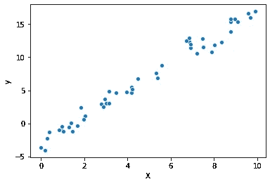

输出:样本数据的散点图，显示自变量和因变量之间的线性关系。图片作者。

线性回归模型有助于找到穿过样本点的最佳拟合直线(回归线)，该直线可用于根据输入特征(X)估算目标输出(y)。

使用如下所示的 Scikit-Learn 包实现一个线性模型可以让我们深入了解线性回归建模的目的:


输出:简单线性回归及其最佳拟合线和样本预测的示例。

如上所述，线性回归建模的目的是拟合预测模型，该预测模型反映一组独立变量(X)与 y 和 X 值的观察数据集的输出变量(y)之间的线性关系；使得如果给出了 X 的附加值而没有其伴随的 y 值，则拟合的模型可以用于基于输入 X 来预测 y*的值*

```
*# Linear regression function.
y = F(X)
where: y= dependent variable
       x= independent variable*
```

*关于将数据集中的哪个变量设置为因变量或自变量的决定通常基于因变量的值受自变量影响(在这种情况下为线性)的假设，即 X 的变化会导致 y 的一些变化。但情况并不总是如此，因为可能有一些操作原因需要根据其他变量对变量进行建模。*

*由于线性回归函数是输入变量的线性组合，因此 y 和 X 之间的直线关系可以表示为:*

```
*y = mX + c 
Where: ***m*** is the coefficient.
       ***c*** *is the intercept*.*
```

*获取函数的权重和系数的最佳值是定义最佳线性预测函数的关键，该函数可根据输入(X)精确得出输出(y)。最佳权重使得它们产生最小的预测误差(也称为残差)。*

## ***线性模型的假设。***

***当确定预测函数时，线性模型对特征和目标变量及其关系做出某些假设。这些假设包括:***

1.  ***预测变量和目标变量之间存在线性关系(线性)。***
2.  ***目标的每个特征都有一个正态分布(多元正态)。***
3.  ***没有一个要素与其他要素高度相关(非多重共线性)。***
4.  ***预测变量是无误差的(弱外生性)。***
5.  ***目标变量的误差方差相同，与预测变量的值无关(同方差)。***

***虽然这些假设中的一些在实际意义上是不现实的(如同质性和弱外生性)，但有一些回归方法(如加权、广义和偏最小二乘法)能够处理这些假设可能产生的误差。***

***既然我们了解了线性回归建模的目的，我们应该关注如何实现这一目的，即在确定线性函数的最佳权重时，哪些概念是有用的？***

## *****拟合线性回归模型*****

***我们将考虑一些最流行的方法来拟合线性回归模型，如最小二乘法，梯度下降法和惩罚估计法。***

***在深入研究这些方法以及它们如何帮助拟合精确的线性回归线之前，让我们简要讨论一下本节中非常常用的一个术语，即**成本函数**。***

***成本函数是用于测量机器学习模型的性能的函数，它们量化预测值和真实值之间的误差，并帮助评估模型的准确性。因为我们对推导精确的预测函数感兴趣，所以我们能够使用成本函数来衡量我们的模型表现得有多好(或多差)。***

***用于评估回归模型的一些最常见的成本函数是平均绝对误差(MAE)、均方误差(MSE)、均方根误差(RMSE)和残差平方和(RSS)。***

***我们将利用这些成本函数中的一些来研究预测线如何精确地适合回归问题，并在以后研究另一些。***

***现在来看拟合优化回归模型的方法:***

*****1。普通最小二乘法(OLS 法)。*****

***普通最小二乘法(OLS) 是拟合线性模型最常见的估计量。最小二乘法基于这样一种理论，即最适合一组给定观察值的曲线被认为是与给定数据点的垂直距离(残差或误差)的平方和最小的曲线。这可以简单地理解为具有最小预测误差的最佳预测函数(成本函数)。***

***给定数据点[(y₁x₁，)(y₂)….x₂)的垂直距离平方和的残差(OLS 方法的成本函数)(yₙxₙ)]定义为:***

***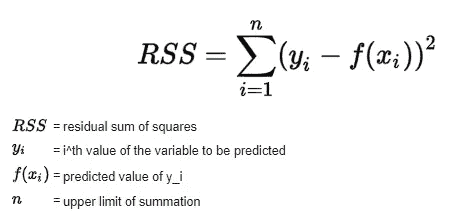***

*****OLS** 方法背后的思想是，由于残差平方和评估特定预测函数的总预测(或残差)误差，因此我们可以使用该成本函数( **RSS** )来导出当其预测误差最小时该函数的参数值( **m** ， ***c*** )。***

***这种推导是通过在最小值(0)时对( **RRS** )误差进行部分求导，找到系数( ***m*** )的表达式，以数学方式实现的。 **m** 的表达式如下:***

***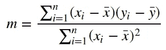***

***其中 x̅是 x 变量的平均值，ȳ是 y 变量的平均值。***

***当最佳系数 **m** 使用上述导出的表达式确定时，我们因此可以通过在等式中输入 **m** 来使用它计算最佳截距 **c** :***

***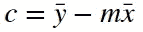***

***因此，我们能够将最优线性回归线的参数估计为样本点的误差平方和最小的参数。***

***也许，一个实际的例子可以更好地解释如何利用普通的最小二乘法来确定预测函数的最佳参数。***

***考虑下面给出的样本数据:***

```
***# independent variables
X = [8, 3, 2, 1, 2, 0, 1, 4, 3, 6, 5, 6, 8, 5, 6, 5, 5, 4, 8, 3] # dependent variables 
y =[12, 1, 2, 1, 5, 1, 2, 6, 4, 9, 6, 10, 14, 10, 6, 4, 9, 10, 8, 8]***
```

***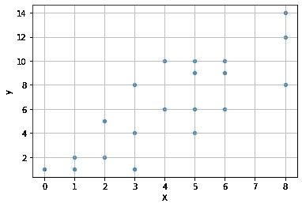***

***数据的散点图***

***如前所述，我们需要一个预测函数来拟合样本点的最佳直线。我们将利用 **m** 和 **c** 的表达式来获得预测的最佳参数。虽然我们可以手工实现，但用 python 代码实现要容易得多。***

***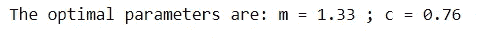***

***显示系数和截距最佳值的输出***

***然后，我们可以将样本数据的最佳预测函数定义为:***

```
***y = 1.33x + 0.76***
```

***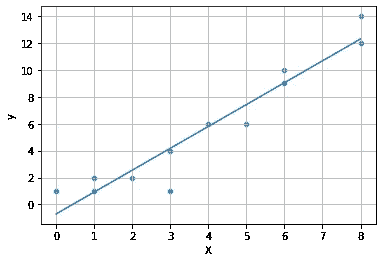***

***使用普通最小二乘法获得最佳回归线的数据点散点图***

***拟合线与给定数据点的垂直距离平方之和最小。***

***虽然普通的最小二乘解尽可能接近地解决了回归问题，但是它的应用受到限制，因为它的唯一目标函数是距离平方的和。我们可以利用一种更有效的方法来实现数据的线性回归建模，这种方法称为梯度下降法，可以应用于任何目标函数，而不仅仅是平方距离。***

*****2。梯度下降法。*****

***梯度下降是一种寻找函数局部极小值的迭代优化算法。它基于这样的思想，即当在函数的初始梯度的相反方向上采取重复步骤时，可以在函数的全局最小值处导出最优函数。***

***简而言之，梯度下降是一种通过反复降低成本函数来寻找函数最佳权重的方法。这是通过沿着初始梯度的相反方向逐渐移动成本函数的梯度来实现的。***

***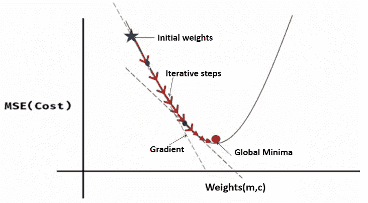***

***梯度下降的 2D 表示。图片作者。***

***这如何帮助我们拟合最佳回归线？***

***嗯，如果我们可以在给定点导出我们的成本函数的梯度(一阶导数)，那么我们可以通过沿着梯度的相反方向重复下降，在曲线的全局最小值处达到最佳预测函数(如上所示)。***

***那么，我们如何沿着成本函数梯度的相反方向下降，以达到全局最小值呢？***

***为此，让我们使用均方误差(MSE)作为成本函数。它是预测值和实际值之间的平均平方差的度量。MSE 由下式给出:***

***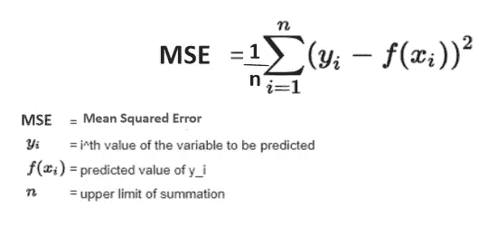***

***当我们将线性预测函数输入方程时，我们得到如下关系:***

***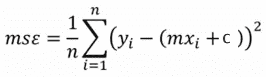***

***MSE 是可微分的，因此可以用来优化预测函数。使用 MSE，我们可以将成本函数在给定点的梯度导出为 **m** 和 **c** 的偏导数，使得:***

***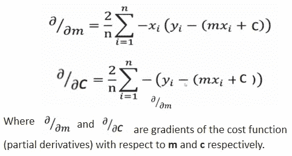***

***然后，我们可以通过逐步向导出的(初始)梯度的相反方向“移动”,使梯度向最小值下降。我们通过使用导出的梯度计算 **m** 和 **c** 的电流值来进行数学计算，如下所示:***

***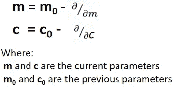***

***因为我们是沿着梯度一步一步地下降，所以控制我们下降的步长是有效的，这样我们就不会错过全局最小值，如下所示:***

***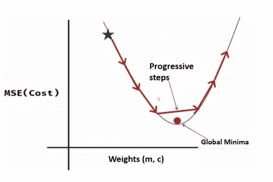***

***为了避免错过全局最小值，我们将包括一个称为**学习率的参数**，其基本功能是控制向全局最小值前进的步长。***

***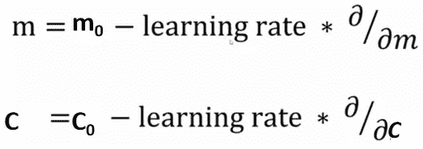***

***通过多次重复这些步骤(迭代)并连续确定参数和梯度的新值，我们逐渐向全局最小值移动，该全局最小值给出具有最小预测误差的预测函数(成本函数)的最优参数。***

***如果梯度下降法还不清楚，也许实用的方法更可取。让我们使用这种方法来获得一个最佳预测函数，该函数与前面使用 python 代码的示例中使用的数据相同。***

```
***# independent variables
X = [8, 3, 2, 1, 2, 0, 1, 4, 3, 6, 5, 6, 8, 5, 6, 5, 5, 4, 8, 3]# dependent variables 
y =[12, 1, 2, 1, 5, 1, 2, 6, 4, 9, 6, 10, 14, 10, 6, 4, 9, 10, 8, 8]***
```

***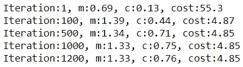***

***请注意成本(MSE)的持续降低，以及第 1200 个历元的参数如何等同于用 OLS 方法和。我们还可以调整超参数，如增加或减少学习率和迭代次数的值，以控制学习过程。***

***绘制学习率为 0.001 的前 50 次迭代的成本显示了向全局最小值的下降。***

***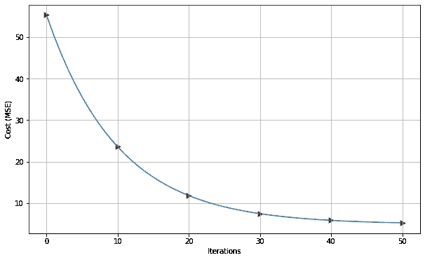***

***在我们的示例中，在通过偏导数调整权重之前，我们计算了每次迭代中所有样本的均方误差，这是一种梯度下降方法，称为**批量梯度下降(BGD)** 。这种方法对于相对较小的数据集(如示例中所示)是有效的，但是对于较大的数据集，可能证明计算开销很大。对于更大的数据集，另一种方法是**随机梯度下降****【SGD】**，其中在每次迭代中仅评估随机样本的成本后调整参数。最常用的方法是**小批量梯度下降**，在每次迭代中使用一批样本进行训练，而不是像 SGD 那样只使用一个随机样本，或者像 BGD 那样使用所有样本。***

***为了简单起见，到目前为止的例子包括了简单的线性回归问题。通过遵循以下关系，所讨论的方法也可以应用于多元线性回归:***

```
***y = *m*₁X₁+ *m*₂X₂+ *m*₃X₃+…*m*ₙXₙ + cWhere: ***m*ᵢ** is the coefficient for each feature.
       ***c*** *is the intercept*.***
```

***前面讨论的线性回归模型的一个缺点是系数有时可能取高值，导致模型预测的不稳定性，这在机器学习中通常被称为过拟合。解决这个问题的一种常见方法是规则化。***

*****3。线性回归的正则化方法。*****

***正则化或收缩是一种控制预测函数系数权重的方法，这样它们就不会取很大的值。***

***如前所述，线性模型对要素和目标变量做出某些假设，例如非多重共线性假设。例如，如果数据包含对预测模型有相反影响的负相关要素，这可能会使模型不稳定，因为要素的微小变化可能会导致预测中的较大差异。***

***虽然这个问题可以通过特征选择来解决(在这种情况下只保留一个相关的特征)，但使用正则化(或惩罚)方法通常是更好的方法，因为这样可以避免遗漏有用的数据。这些方法通过严重惩罚这些特征的系数来解决这类问题，使得它们接收极低的权重。为此，我们将更改线性回归的成本函数，以包含系数，并大幅缩小取值非常高的系数。***

***岭回归、套索和弹性网是线性回归问题中最常见的收缩方法。***

*****3i。**在**岭回归**中，我们简单地将权重的平方和添加到最小二乘成本函数中:***

***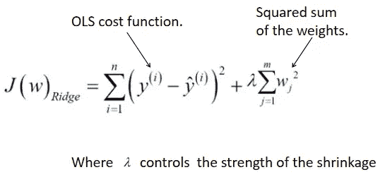***

***通过将权重的平方和添加到成本函数，当优化例程试图在训练期间最小化前面的函数时，它不得不大幅降低系数值。alpha 参数用于控制收缩量。alpha 值越大，收缩越大。请注意，只有权重被正则化，而截距没有被正则化。这种类型的正则化技术被称为 **L2** 正则化。***

***L2 正则化方法的一个缺点是它不能促进稀疏性，因此可能会为高维数据集产生不可解释的模型。如果一个模型的大部分系数降为零，则称该模型为稀疏模型。解决稀疏性问题的一种方法是使用 L1 正则化的 Lasso 回归。***

*****3ii。最小绝对收缩和选择算子** ( **LASSO** )是一种替代的正则化方法，与岭回归相比，它可以产生稀疏模型。***

***在 LASSO 中，很多系数都被降为零。它对于特征选择也很有用，因为它只选择一个相关特征，这与岭回归不同，在岭回归中，相关特征的系数被赋予相同的权重，尽管这通常会使岭回归模型具有更强的预测能力。***

***LASSO 通过用系数的绝对值之和而不是岭回归中的平方和来惩罚系数来实现这些。这就是所谓的 **L2** 正规化。***

***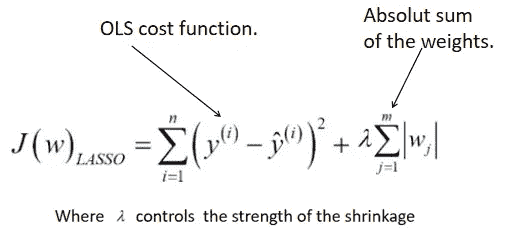***

***虽然套索方法解决了稀疏性问题，但它也有局限性，因为在特征选择过程中相关信息会丢失。在前面的方法之间达成折衷的一种方法是线性组合两者以产生具有 L1 和 L2 正则化子的优点的正则化子。***

*****3iii。** **弹性网络正则化**是 L1 和 L2 正则化的线性组合，具有两种方法的优点。弹性网络函数定义为:***

***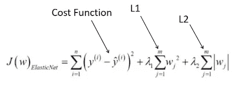***

***调整 alpha 参数可以让我们在两个正则项之间取得平衡。***

***虽然在不确定要使用的正则化方法时，使用弹性网正则化器可能是一个不错的选择，但根据数据集的结构和计算要求可以做出更好的选择。***

## *****线性回归模型的评估指标*****

***由于我们已经介绍了如何在评估(和拟合)回归模型中使用残差平方和和以及均方误差，我们将介绍另外两个常见的评估指标，即**平均绝对误差(MAE)** 和**均方根误差(RMSE)** 。***

***i. **平均绝对误差(MAE)** 是预测值与实际值之间的绝对差值的度量。MAE 由下式给出:***

***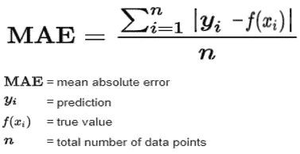***

***MAE 依赖于输入数据的规模，只能用于在基于类似规模的数据训练的模型之间进行比较。***

***二。**均方根误差(RMSE)或均方根偏差(RMSD)** 是预测误差的标准偏差。它是预测误差分布的度量，显示了回归线周围数据的集中程度。它由 MSE 的平方根决定(顾名思义),计算公式如下:***

***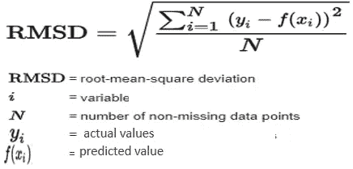***

***在现实世界的应用中，我们可能会对这篇博文中所涉及的方法和概念的更有效的实现感兴趣。这些方法很容易用 Scikit-Learn 的方法在 Python 中实现。***

***最后，让我们使用 Scikit-Learn 框架处理一个线性回归问题，实践这些概念如何结合起来解决现实世界的问题。***

## ***用 Scikit-Learn 实现线性回归建模***

*****数据:**我们将使用[波士顿住房数据集](http://scikit-learn.org/stable/modules/generated/sklearn.datasets.load_boston.html)。该数据集通过 13 个特征包含波士顿各种房屋的 506 个样本点。***

*****任务:**使用数据集建立一个线性回归模型，以估计给定特定特征的区域中的房屋价格。***

1.  *****加载和拆分数据集**:数据集和一些其他流行的数据集在 Scikit-Learn 数据集包中可用，可以使用适当的方法调用来加载。数据集已经进行了使用前的预处理，因此我们可以继续将它分为训练集和测试集，用于模型构建。***

***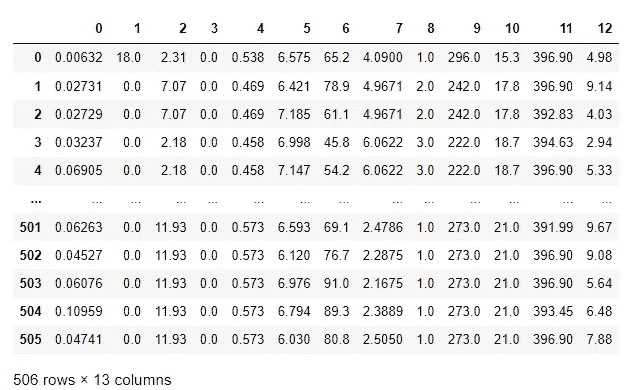***

***输出:特征的数据帧***

***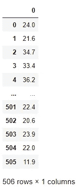***

***目标的数据框架***

***2.**建立线性回归模型:**我们通过创建 Sklearn 的 linear regression 方法的对象来建立线性回归模型。我们将设置参数来分别标准化和集中数据，以便更好地处理和建模。然后，我们将通过将训练特征和目标传递给模型的拟合函数来训练数据上的模型。最后，我们将显示拟合模型的截距和系数。***

***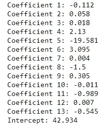***

***输出:特征的系数***

***3.**模型评估:**我们将通过绘制残差图并检查其平均绝对误差来评估模型。***

***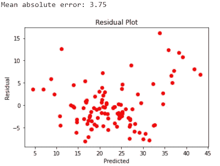***

***该模型的 MAE 为 3.75。残差图显示，大多数残差分散在零附近。***

*****总结:**该帖子强调了线性回归模型的大部分概念、假设和评估，无论是在理论上还是在实践中。它考虑了解决线性回归的 OLS 和梯度下降方法，正则化方法的使用和公共评估指标，如 MSE，MAE 和 RMSE。最后，我展示了一种使用 Sklearn 框架进行线性回归建模的简单方法。***