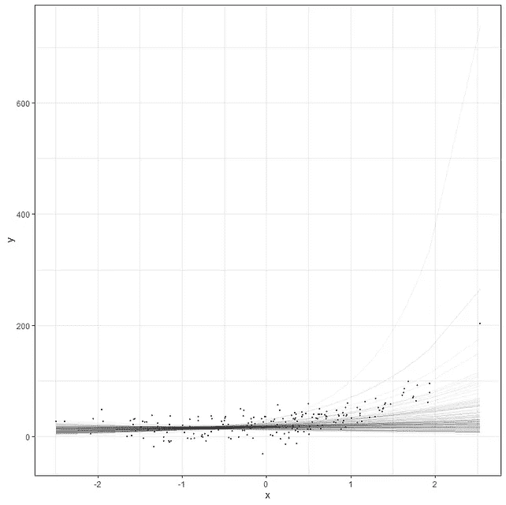

# 在建模中，第一步是最难的

> 原文：<https://towardsdatascience.com/in-modelling-the-first-steps-are-the-hardest-a4250b80a0f2?source=collection_archive---------14----------------------->

## 以及为什么它们会影响你的其他工作

我已经在之前的博客中展示过[模特天生缺乏安全感](https://www.linkedin.com/posts/dr-marc-jacobs-885b1430_waarom-we-nog-niet-kunnen-zeggen-dat-de-activity-6879787496541077504-jm6F)，培养这种不安全感很重要。我也已经提到过[科学是流动的](https://medium.com/@marc.jacobs012/why-science-is-beautifully-human-and-very-frail-4f6225d32bb0)，机遇是有条件的。总之，这意味着事实核查是无用的，因为“事实”从属于当前的知识和依赖于其他机会的机会。因此，只有在您非常清楚这些组是谁的情况下，才可能按组对策略进行分类。因此，基于单一变量的指数化是极不可能的，当然也是极不可取的。

今天我想说的是，对于建模来说，最后一段并不是最难的。不，这只是第一步。当你开始做一个模型的时候，很重要的一点就是要快速明确你要建模什么，为什么要建模。想要“快”有时会妨碍过程，因为你一直在做假设。重要的是你让它们有多重要，尤其是在数据很少的情况下。此外，重要的不是数据量，而是数据是如何创建的。

我们中的许多人都是从数据集开始的，当我们谈论第一步时，我们谈论的是基于数据集创建第一个模型。对于新冠肺炎病毒，情况略有不同。数据每天都有，而正是你的模型在初始阶段的目标决定了行动。矛盾的是，甚至可能是这样的情况，开始时的不确定性决定了未来的进程，因为对病毒的反应也会影响病毒。例如，很有可能在一个模型中使用不同的初始假设会导致不同的政策，从而导致不同的过程。

所有这些现在都是桥下溢出的水，但重要的是要认识到每个模型都是脆弱的，尤其是在开始的时候。

看看下面的指数曲线就知道了:


图片作者。

这种图表的危险之处在于，这里的数据已经相当先进了。先进到足以发布指数曲线(y ~ b1*(1+b2)^x).即使你不确定公式的系数，数据也足以找到系数并画出曲线。换句话说，当你在这个阶段收集数据时，你很清楚你在看什么。

```
library(brms)
library(tidyverse)
library(cmdstanr)
library(kinfitr)
library(nls.multstart)
library(nlme)
library(hrbrthemes)
library(broom)
library(viridis)
library(epifitter)
library(nls2)
library(nlstools)
library(lattice)
library(bayesrules)
library(tidyverse)
library(janitor)
library(rstanarm)
library(bayesplot)
library(tidybayes)
library(broom.mixed)
library(modelr)
library(e1071)
library(forcats)
library(grid)
library(gridExtra)
library(fitdistrplus)
library(ggpubr)set.seed(1123)
b <- c(10, 3
x <- rnorm(200)
y <- rnorm(200, mean = b[1]*(1+(b[2])^x), sd=15)
dat1 <- data.frame(x, y)
plot(dat1$x,dat1$y)

prior1 <- prior(normal(10,30), nlpar = "b1") +
  prior(normal(4, 16), nlpar = "b2")
fit1 <- brm(bf(y ~ b1*(1+b2)^x, b1 + b2 ~ 1, nl = TRUE),
            data ​= dat1, 
            prior = prior1,
            sample_prior = T,
            chains=4,
            cores = getOption("mc.cores", 8),
            threads =16, 
            backend="cmdstanr")
summary(fit1)
plot(fit1)
plot(conditional_effects(fit1), 
     points = TRUE,
     rug=TRUE,
     theme=theme_bw()))

dat1 %>
  add_fitted_draws(fit1, n = 150) %>%
  ggplot(aes(x = x, y = y)) +
  geom_line(aes(y = .value, group = .draw), alpha = 0.05) + 
  geom_point(data = dat1, size = 0.05)+theme_bw()

dat1 %>%
  add_predicted_draws(fit1, ndraws = 4) %>%
  ggplot(aes(x = x, y = y)) +
  geom_point(color="black", alpha=0.2)+
  geom_point(aes(x = x, 
                 y = .prediction, 
                 group = .draw, colour=((y-.prediction)))) +
  facet_wrap(~ .draw) + theme_bw()
```


图片作者。

但是，如果您的数据没有超出最开始的范围呢？如果我只是删除一些数据，然后重新参数化模型呢？不难看出，在这个阶段我知道的很少，当我试图推断我的模型时，我会到处去。因为我做的模型是贝叶斯模型，先验现在占了大部分权重，曲线看起来是指数型的。，但这一切都是基于假设。



图片作者。

上图显示了基于不完整数据以及整个数据集的假设轨迹。两种情况都有可能。甚至有一个超出想象的预测，这是先验与可能性无关的明显标志。

我想展示的另一个例子是基于 Gompertz 曲线。Gompertz 公式如下所示，用于许多过程。例如，在 Gompertz 中可以捕捉到一个人的成长，也可以捕捉到一头猪的成长。它还有助于监测病毒感染，因此在下文中，它已被用于捕捉对“英国变种”增长的估计。我关心的是模型估计，它远远超出了萌芽监测的观察结果。用贝叶斯术语来说——先验 far 否决了可能性。这不是一个问题，因为当我们说话的时候数据正在进来，但是它确实保证持续更新。


图片来源:
国家公共卫生与环境研究所；*厚生劳动省。*

从建模的角度来看，上图实际上是不可能的，因为数据甚至没有越过拐点。拐点是递增增长和递减增长的分界线。现在的情况是，图表非常清楚地表明红色曲线来自一个模型，但它没有说明该模型是基于哪个数据产生的。我们不知道先前的假设。

让我模拟数据来说明我的意思。

```
dat<-sim_gompertz(N  = 10
                  dt = 0.5, 
                  y0 = 0.01, 
                  r  = 0.07, 
                  K  = 1, 
                  n  = 20,  
                  alpha = 1)
dat<-as.data.frame(dat)
plot(dat$time, dat$random_y)

g1<-ggplot(dat, aes(x=time))+
  geom_line(aes(y=y)) +
  geom_point(aes(y=random_y), color="grey", alpha=0.2)+
  labs(title="Gompertz Curve", 
       x="Total time course of the epidemic", 
       y="Disease Intensity")+theme_bw()

g2<-ggplot(dat, aes(x=time))+
  geom_boxplot(aes(y=random_y, group=time), color="grey", alpha=0.2)+
  geom_line(aes(y=y)) +
  labs(title="Gompertz Curve", 
       x="Total time course of the epidemic", 
       y="Disease Intensity")+theme_bw()

g3<-ggplot(dat, aes(x=time, y=random_y))+
  stat_summary(fun.data = "mean_cl_boot", colour = "black", size = 0.2)+
  geom_smooth(color="red", alpha=0.5)+
  labs(title="GAM model", 
       x="Total time course of the epidemic", 
       y="Disease Intensity")+theme_bw()

g4<-ggplot(dat, aes(x=time, y=random_y))+
  geom_point(color="black", alpha=0.2)+
  geom_smooth(aes(color=as.factor(replicates),
              fill=as.factor(replicates)), alpha=0.2)+
  facet_wrap(~replicates)+
  labs(title="LOESS model", 
       x="Total time course of the epidemic", 
       y="Disease Intensity")+
  theme_bw()+theme(legend.position = "none")
ggarrange(g1,g2,g3,g4)
```


图片作者。

左下方的图表可能最能说明我所说的模型和少量数据的含义。这个模型不是在 Gompertz 的基础上获得的，而是在 GAM 模型的基础上获得的，GAM 模型是一种观察数据的统计模型。如果我砍掉数据，直到左边只剩下很小一部分，GAM 就不会显示同样的曲线。基于 Gompertz 函数的非线性模型仍然可以做到这一点，但该模型必须基于许多假设。把它比作在一个黑暗的房间里预测一天的天气，只有微弱的光线指引你。

```
dat<-sim_gompertz(N  = 10
                  dt = 0.5, 
                  y0 = 0.01, 
                  r  = 0.07, 
                  K  = 1, 
                  n  = 20,  
                  alpha = 1)
dat<-as.data.frame(dat);dat$x<-dat$tim
fitgomp<-fit_nlin2(time = dat$time,
          y =  dat$y,
          starting_par = list(y0 = 0.01, r = 0.07, K = 1),
          maxiter = 1024)
fitgomp
g1<-function(x,a,b,c){
  a*exp(-b*exp(-c*x))
}
g2 <- function(x, y0, ymax, k, lag){
  y0+(ymax-y0)*exp(-exp(k*(lag-x)/(ymax-y0)+1))
}
g3<-function(x,n0,nI,b){
  n0*exp(log(nI/n0)*(1-exp(-b*x)))
}
plot(dat$x, dat$random_y)
curve(g1(x, a=1, b=4.5, c=0.07), add=T, col="red", lwd=2) 
curve(g2(x, y0=0.01, ymax=1, k=0.07, lag=8), add=T, col="blue", lwd=2) 
curve(g3(x, n0=0.01,nI=1,b=0.07), add=T, col="orange", lwd=2)
```


图片作者。

幸运的是，一旦模型收集了相当多的数据，它们就可以很好地处理不确定性。这里我将使用一个特定的非线性模型，它能够包含不确定性的来源。假设我们收集了前 20 个城市的数据。

```
dat_new<-groupedData(random_y~time|replicates,
                       data=dat,
                       FUN=mean,
                       labels=list(x="Time", y="Disease Intensity")) 
fit<-nlme(random_y~n0*exp(log(nI/n0)*(1-exp(-r*time)))
          data​=dat_new, 
          fixed=n0+nI+r~1, 
          random=r~1, 
          start=c(0.01,1,0.07),
          method="ML", 
          control=nlmeControl(maxIter=100000, msMaxIter = 100))
plot(augPred(fit, level=0:1))
fitpreds <- dat_new %>% mutate(.fitted=predict(fit, newdata=dat_new))
ggplot(dat_new, aes(x=time, y=random_y)) 
  geom_point() +
  geom_line(data=fitpreds, aes(y=.fitted, 
                               group=replicates, 
                               colour=replicates),size=1) +theme_bw()+labs(title="NLS model",
                                                  x="Total time course of the epidemic",
                                                  y="Disease Intensity")
```


图片作者。

为了更好地了解我们建模的不确定性，即使我们已经有了大量数据，我也会对相同的数据应用贝叶斯模型。

```
gompprior <- c
  set_prior("beta(1, 20)",       nlpar = "n0", lb=0, ub=1),
  set_prior("gamma(1, 1)",       nlpar = "nI", lb=0, ub=1),
  set_prior("normal(0, 1)",      nlpar = "r",  lb=0), 
  set_prior("normal(0.05, 0.2)", class="sigma"))gomp_bayes <- bf(random_y ~ n0*exp(log(nI/n0)*(1-exp(-r*time))),
                             n0 + nI + r ~ 1,
                             nl = TRUE)options(mc.cores=parallel::detectCores())
gomp_bayes_fit <- brm(
  gomp_bayes,
  family=gaussian(), 
  data ​= dat_new,
  prior = gompprior )

plot(gomp_bayes_fit)
pairs(gomp_bayes_fit)

predtimes <- unique(dat_new$time)
gomp_bayes_fitted <- fitted(gomp_bayes_fit, 
                            newdata=list(time = predtimes))%>%as_tibble()
gomp_bayes_pred <- predict(gomp_bayes_fit,
                           newdata=list(time = predtimes))%>%as_tibble()
gomp_bayes_ribbons <- tibble(
  time = predtimes,
  random_y=gomp_bayes_fitted$Estimate,
  Estimate = gomp_bayes_fitted$Estimate,
  pred_lower = gomp_bayes_pred$Q2.5,
  pred_upper = gomp_bayes_pred$Q97.5,
  fitted_lower = gomp_bayes_fitted$Q2.5,
  fitted_upper = gomp_bayes_fitted$Q97.5)
ggplot(dat_new, aes(x=time, y=random_y)) +
  geom_point(size=2, alpha=0.2) +
  geom_ribbon(data=gomp_bayes_ribbons, aes(ymin=pred_lower, ymax=pred_upper), 
              alpha=0.2, fill=colourcodes[3]) +
  geom_ribbon(data=gomp_bayes_ribbons, aes(ymin=fitted_lower, ymax=fitted_upper), 
              alpha=0.5, fill=colourcodes[3]) +
  geom_line(data=gomp_bayes_ribbons, aes(y=Estimate), colour=colourcodes[3], 
            size=1) + labs(title="Bayesian model", 
                           x="Total time course of the epidemic", 
                           y="Disease Intensity")+
  theme_bw()+theme(legend.position = "none")
```


图片作者。

从上图中可以看出，蓝色的模型线包含了相当多的不确定性。这也反映在下面各个参数的估计值中，以及参数之间的相关性中。重要的是要记住，模型预测强烈依赖于模型系数，而这些系数又依赖于数据和相互关系。假设驱动一个只有少量数据的模型。再一次，在贝叶斯分析中，我们接受这样的情况。


图片作者。

如果我们像以前一样删除一些数据，会发生什么？那它看起来像什么？下面我要求的是严格限制天数，并用这些数据显示 Gompertz 曲线。我已经知道了那条曲线的参数，所以我对下限和上限的变化以及繁殖率感兴趣。

```
set.seed(1123
dat<-sim_gompertz(N  = 100,
                  dt = 0.5, 
                  y0 = 0.01, 
                  r  = 0.07, 
                  K  = 1, 
                  n  = 20,  
                  alpha = 1)
dat<-as.data.frame(dat);dat$x<-dat$time
dat_new<-groupedData(random_y~time|replicates, 
                     data=dat,
                     FUN=mean,
                     labels=list(x="Time", y="Disease Intensity"))
dat_new_1<-dat_new%>%filter(x<10)%>%mutate(random_y=replace(random_y,0,0.001))
plot(dat_new_1$x,dat_new_1$random_y)
fit<-nlme(random_y~n0*exp(log(nI/n0)*(1-exp(-r*time))),
          data​=dat_new_1, 
          fixed=n0+nI+r~1, 
          start=c(0.01,1,0.07),
          method="ML", 
          control=nlmeControl(maxIter=100000, msMaxIter = 100)))
```

这个模型不会运行，我也不能在数据上绘制一个假设的 Gompertz 曲线。

```
ggplot(dat_new_1, aes(x=time, y=random_y)
  geom_point(color="grey", alpha=0.2)+
  stat_summary(fun.data = "mean_cl_boot", colour = "black", size = 0.2)+
  stat_smooth(method = 'nls', formula = 'y ~ n0*exp(log(nI/n0)*(1-exp(-r*x)))',
              method.args = list(start=c(n0=0.01,nI=1,r=0.07)), se=TRUE)+
  geom_smooth(color="red",fill="red", alpha=0.2)+
  labs(title="GAM model", 
       x="Total time course of the epidemic", 
       y="Disease Intensity")+
  theme_bw())
```


图片作者。

现在让我们看看，当我试图从现在的模型中推断未来时，会发生什么。毫无疑问，上面的红线是一个模型，它被训练成尽可能整齐地放置在数据之上。非线性函数通常不是这样的。它们的功能是从生物学和逻辑学的角度将起点和终点联系起来。然而，他们需要足够的数据来找到合适的系数。这就是我现在想做的，求系数。

```
set_prior("beta(1, 20)",       nlpar = "n0", lb=0, ub=1),
  set_prior("gamma(1, 1)",       nlpar = "nI", lb=0, ub=1),
  set_prior("normal(0, 1)",      nlpar = "r",  lb=0), 
  set_prior("normal(0.05, 0.2)", class="sigma"))

gomp_bayes <- bf(random_y ~ n0*exp(log(nI/n0)*(1-exp(-r*time))),
                 n0 + nI + r ~ 1,
                 nl = TRUE)
options(mc.cores=parallel::detectCores())

gomp_bayes_fit <- brm(
  gomp_bayes,
  family=gaussian(), 
  data ​= dat_new_1,
  prior = gompprior )
summary(gomp_bayes_fit)
plot(gomp_bayes_fit)
plot(conditional_effects(gomp_bayes_fit), 
     points = TRUE,
     rug=TRUE,
     theme=theme_bw()) 

dat_new_1 %>%
  add_fitted_draws(gomp_bayes_fit, n = 150) %>%
  ggplot(aes(x = x, y = y)) +
  geom_line(aes(y = .value, group = .draw), alpha = 0.05) + 
  geom_point(data = dat_new_1, size = 0.05)+theme_bw()+
  labs(title="Bayesian Model overlayed on trained data",
       x="Total time course of the epidemic",
       y="Disease Intensity")

dat_new %>%
  add_fitted_draws(gomp_bayes_fit, n = 150) %>%
  ggplot(aes(x = x, y = y)) +
  geom_vline(xintercept = 10, color="red", linetype=2)+
  geom_line(aes(y = .value, group = .draw), alpha = 0.1) + 
  geom_point(data = dat_new, size = 0.05)+theme_bw()+
  labs(title="Bayesian Model overlayed on all data",
       x="Total time course of the epidemic",
       y="Disease Intensity")
```

显而易见的是，结果提供了不同的参数。再现值从 0.07 到 0.09，估计线顶是 0.58 而不是 1。

```
Family: gaussian
  Links: mu = identity; sigma = identity 
Formula: random_y ~ n0 * exp(log(nI/n0) * (1 - exp(-r * time))) 
         n0 ~ 1
         nI ~ 1
         r ~ 1
   Data: dat_new_1 (Number of observations: 400) 
  Draws: 4 chains, each with iter = 2000; warmup = 1000; thin = 1;
         total post-warmup draws = 4000

Population-Level Effects: 
             Estimate Est.Error l-95% CI u-95% CI Rhat Bulk_ESS Tail_ESS
n0_Intercept     0.01      0.00     0.01     0.02 1.01      833      662
nI_Intercept     0.58      0.23     0.21     0.98 1.01      527      190
r_Intercept      0.09      0.02     0.06     0.15 1.01      496      162

Family Specific Parameters: 
      Estimate Est.Error l-95% CI u-95% CI Rhat Bulk_ESS Tail_ESS
sigma     0.04      0.00     0.04     0.04 1.00     2006     1936

Draws were sampled using sampling(NUTS). For each parameter, Bulk_ESS and Tail_ESS are effective sample size measures, and Rhat is the potential scale reduction factor on split chains (at convergence, Rhat = 1).
```

表格实际显示的内容可以通过三个视觉效果得到最好的解释。第一，基于数据的条件模型。


图片作者。

第二，基于数据的可能性范围。


图片作者。

第三，模型的外推覆盖了全部数据，但基于不完整的数据。红线显示模型成为外推的地方。它显示了基于起始点来拟合一条曲线是多么困难。这只有在你对疾病强度的过程非常确定的情况下才有可能。这是相当多的假设。为了比较，荷兰国家公共健康和环境研究所的数据再次被加入。看出区别。


图片作者。


国家公共卫生和环境研究所；*卫生、福利和体育部/*

欢迎评论(反馈)和指出错误。讨论当然也是！