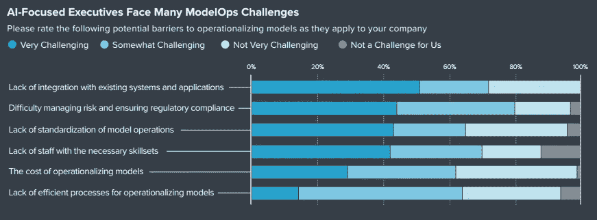
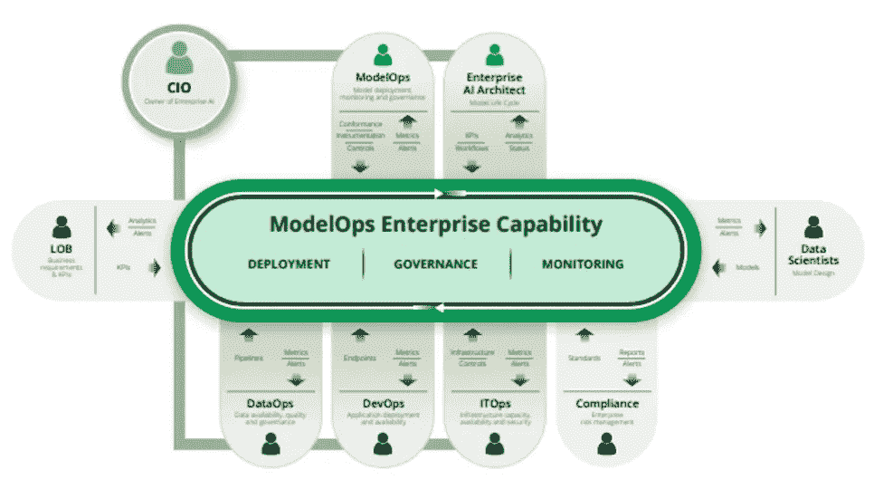
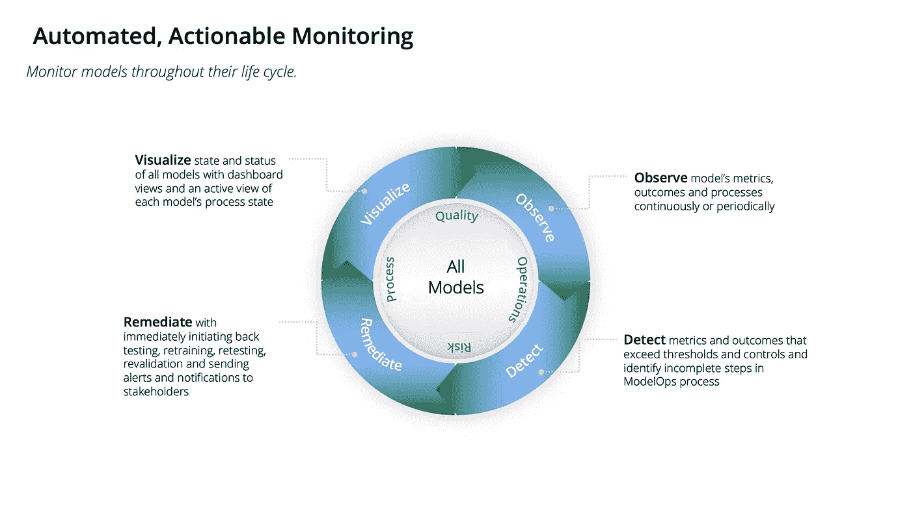
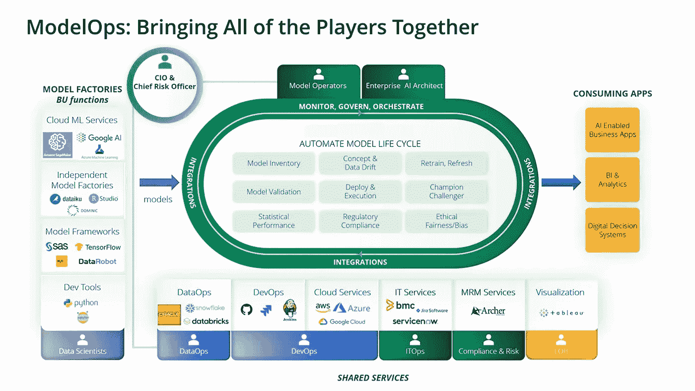
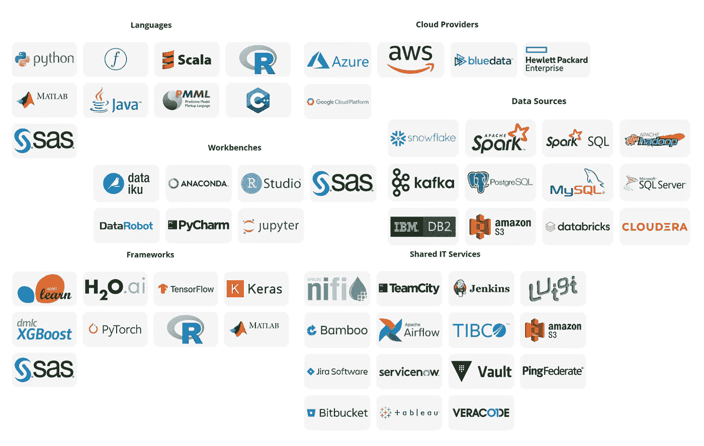

# 在你的人工智能策略中包括模型操作

> 原文：<https://towardsdatascience.com/including-modelops-in-your-ai-strategy-f3a7bb4831dd?source=collection_archive---------28----------------------->

## *如何根据企业的价值预期运营、整合和部署人工智能模型*

由[马库斯·斯皮斯克](https://unsplash.com/@markusspiske?utm_source=medium&utm_medium=referral)在 [Unsplash](https://unsplash.com?utm_source=medium&utm_medium=referral) 上拍摄的照片

现代有组织的企业认识到，采用数据驱动的战略对于在日益数字化的市场中竞争至关重要。数据和分析已经成为一个非常重要的优先事项，上升到董事会层面，董事会将机器学习和人工智能等技术视为增加业务能力的机会，使流程更加高效，并促进新商业模式的传播。

广泛而言，对人工智能和数据管理的投资正在急剧增加，新的数据科学项目正在进行中，以建立用于各种目的的预测和分析模型。然而，尽管公司计划在合理的时间内扩大复杂的人工智能解决方案，但残酷的现实是，这些解决方案的采用往往停滞不前，因为公司通常更关注开发而不是模型的可操作化。对于许多非数字本土企业来说，数据科学学科的采用往往始于众多独立、分散的数据科学团队，这些团队基本上致力于开发机器学习和深度学习的模型。

这些小型的数据科学家团队在不同的业务部门涌现出来，目的是为不同的业务目的构建模型。此外，由于新的先进技术的广泛可用性，这些模型的开发很容易实现，为了利用这些丰富的精彩技术来大规模创建更新和执行的人工智能解决方案，公司必须处理影响生产流程和运营的日益增加的复杂性。试想一下支持数据科学家深入数据科学世界的大量软件工具，如 Python 库、Jupyter notebooks、Spark MLlib、Dask 和其他众多基于新算法的开源库，这些开源库已在各地涌现，允许数据科学家进行传统的聚类、异常检测、大规模预测，甚至更进一步，进行面部识别或视频分析。

不幸的是，这种方法已被许多公司采用，导致数据科学团队的分散和分散，从而导致模型开发速度变慢，业务部门之间完全缺乏协作。因此，首席执行官和企业高管对这些举措感到不满，因为公司未能通过积累未实施、未使用和未更新的模型来扩展人工智能，这些模型是手动实施的，并且通常与人工智能应有的价值预期不一致。

因此，公司需要采用能够帮助他们及时交付价值并符合预期的解决方案。这些功能必须设计为支持和加速模型的开发过程，并通过使企业能够扩展和管理其人工智能计划，找到更快的方式将机器学习模型投入生产。

调查显示，集成和风险管理是人工智能模型可操作化的最大障碍，因此也是人工智能计划成功的最大障碍。

专注于人工智能的高管面临许多模型运算的挑战，从“[状态到
模型运算 2021](https://www.modelop.com/resources/ai-transformation-with-modelops/state-of-modelops-2021-report/)

# **利用 ModelOps 解决模型部署和模型治理之间的差距**

模型长期以来一直被视为必不可少的企业资产，人工智能模型正在显示出它们提供非常重要价值的能力。企业越来越认识到，要在管理风险的同时持续抓住这一价值，需要人工智能时代的模型操作实践。结果，他们投资了 ModelOps。

ModelOps 正在成为一项核心业务能力，企业正在投资创建更有效的流程和系统来运营人工智能模型。

ModelOps 企业功能。图片由[来源](http://modelop.com)，经作者许可编辑

根据 Gartner 的说法，“*人工智能(AI)模型操作化(ModelOps)是一组主要关注所有 AI 和决策模型的治理和全生命周期管理的功能。这包括基于机器学习(ML)、知识图、规则、优化、自然语言技术和代理的模型。与 MLOps(仅关注 ML 模型的可操作性)和 AI ops(IT 运营的 AI)不同，ModelOps 关注所有 AI 和决策模型的可操作性*。因此可以理解，在大型企业中，有效的 ModelOps 能力可以加速整个公司的人工智能计划。ModelOps 消除了浪费、摩擦和超额成本，并释放了企业(包括专业和公民数据科学家)的创造力，同时保护企业免受潜在的无限风险。Gartner 在其报告“ModelOps 的创新洞察—2020 年 8 月 6 日”中，重点关注了组织在大规模部署、监控和治理 AI 模型时面临的挑战以及对企业 ModelOps 战略的需求，指出“*组织在大规模构建和部署 AI 模型时面临重大挑战—导致 AI 人员的生产力低下，运营延迟和价值创造有限。数据和分析领导者必须通过利用 ModelOps 来应对这些挑战，以变得更加有效*”此外“ *ModelOps 是任何组织的企业人工智能战略的核心，它是一项关键的使能技术，可融合各种人工智能工件、平台和解决方案，同时确保可扩展性和治理*”。

因此，模型操作

*   主要专注于人工智能和决策模型的治理和生命周期管理(包括机器学习、知识图、规则、优化、语言和基于代理的模型)。核心能力包括模型开发环境的管理、模型库、冠军挑战者测试、模型展示/回滚和 CI/CD(持续实施/持续交付)集成
*   支持人工智能模型的重新调整、重新训练或重建，在基于人工智能的系统中提供模型开发、运行和维护之间的不间断流程
*   为业务领域专家提供自主性，以评估生产中人工智能模型的质量(解释结果和验证 KPI ),并促进提升或降级人工智能模型进行推理的能力，而无需完全依赖数据科学家或 ML 工程师。

ModelOp 的联合创始人兼首席人工智能架构师 Stu Bailey 说:“ModelOp 是一种专注于将模型投入 24/7 生产的能力。这是 CIO 的组织或大型组织的技术中心必须拥有的能力”。

人工智能模型。图片由[来源](http://modelop.com)提供，经作者许可编辑

# 释放 AI 的价值

人工智能的价值往往没有得到释放，因为操作化人工智能往往是事后的想法，而在整个组织内生产人工智能/人工智能模型的努力被低估了。许多团队仍在努力在他们的应用程序中充分发挥人工智能的潜力，部分原因是在满足企业治理要求的同时支持人工智能生命周期所需的技能、工具和平台方面的投资。人工智能运营支持对于缩小这些差距至关重要，它允许这些团队更容易地将人工智能技术融入他们的应用程序中。

正如数据科学研究员(BNY 梅隆大学)Skip McCormick 所说，许多人工智能功能仍处于有很大潜力的阶段。很少有组织同时将足够的资源投入到他们在生产环境中需要的基础设施中。

今天，为了在竞争中胜出，企业正在投资人工智能。但是人工智能的好处只有在模型被正确操作后才能被认识到。

由于人工智能技术栈在不断发展，数据科学家希望能够使用最好的工具，通过自动化 ModelOps 基础设施工程来大规模开发和部署数据科学模型，而企业通常很乐意适应这一点。因此，在企业环境中开发、部署和管理人工智能的生态系统变得复杂起来。

# **ModelOps 工具**

由于 ModelOps 方法将所有参与者聚集在一起，一些新兴的初创企业和企业公司提供了 ModelOps 解决方案，以在端到端的全自动模型生命周期中统一编排这些组件。让我们看看下图，它展示了企业如何通过管理平台来治理和扩展任何人工智能计划。

模型操作:编排和模型生命周期。图片由[来源](http://modelop.com)，经作者许可编辑

像 [ModelOp Center](https://www.modelop.com/product/) 这样的强大平台通常会与开发平台、IT 系统和企业应用程序集成，以便企业可以利用和扩展在人工智能和 IT 方面的持续投资。通过这种方式，数据科学家可以使用他们最熟悉的工具进行大规模工作。

ModelOps 集成—图片来自[来源](https://www.modelop.com/product/integrations/)，经作者许可编辑

借助 ModelOp Center 等平台，企业可以:

*   将从模型部署到决策制定的时间缩短 50%或更多；
*   将模型收入贡献提升高达 30%；
*   并通过人工智能治理工作流降低业务风险。

# **结论**

在许多行业和公司中，人工智能的战略力量已经彻底确立。这导致了模型创建的激增。但是对操作模型(即模型操作)的人员、流程和工具的投资却落后了。组织必须创建专门的模型操作员或模型工程师角色来承担日常的模型操作职责。

人们越来越认识到这一职能、它所解决的问题、它所创造的机会以及支持这一职能所需的投资。就像之前的 DevOps、ITOps 和 SecOps 一样，随着全球人工智能应用的成熟，ModelOps 看起来将成为一个独立的核心业务功能。

# **参考文献**

*   Modelop 的[网站](http://www.modelop.com)
*   [2021 年模型运行状态报告](https://www.modelop.com/resources/ai-transformation-with-modelops/state-of-modelops-2021-report/)
*   [Gartner《ModelOps 创新洞察》报告](https://go.modelop.com/gartner_innovation_insights_for_modelops?utm_medium=web)
*   [人工智能工程之旅](https://www.modelop.com/wp-content/uploads/2021/05/Gartner-Keynote-Presentation-2021-04-15.pdf)
*   [模型操作在企业规模上实施人工智能的关键](https://www.modelop.com/wp-content/uploads/2021/02/Key-to-Operationalizing-AI-at-Scale.pdf)
*   [维基百科模式操作](https://en.wikipedia.org/wiki/ModelOps)
*   [数据科学发展计划。所以我总是在车安出差](https://www.datamanager.it/2020/05/devops-per-i-dati-e-la-data-science-verso-lai-always-on-anche-nel-business/)
*   [ModelOps 是企业 AI 的关键](https://www.forbes.com/sites/cognitiveworld/2020/03/31/modelops-is-the-key-to-enterprise-ai/?sh=168152846f5a)