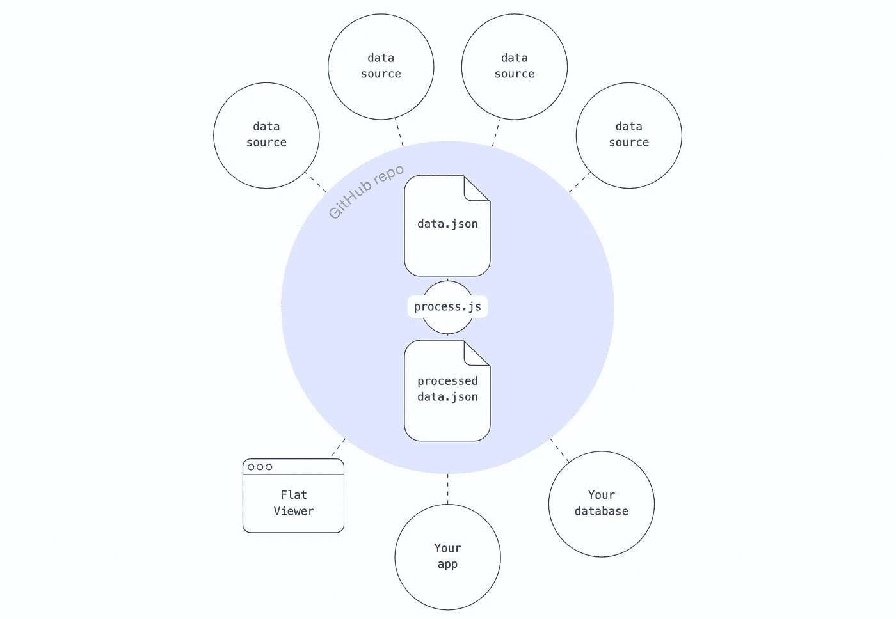
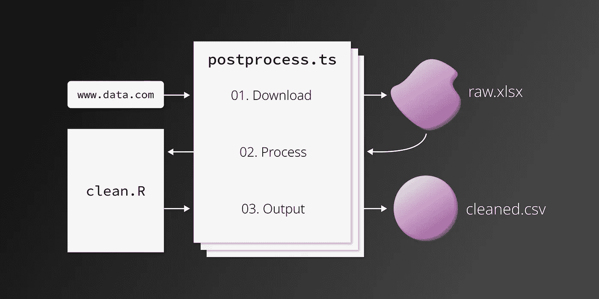

# 在平面数据工作流中包含 R

> 原文：<https://towardsdatascience.com/including-r-in-your-flat-data-workflow-282356342094?source=collection_archive---------36----------------------->

## 使用 GitHub Actions + R 自动获取和清理数据

GitHub OCTO 团队最近发布了他们的第一个项目: [**平面数据**](https://octo.github.com/projects/flat-data) 。该项目旨在提供“一种简单的模式，将工作数据集引入您的存储库并对它们进行版本控制。”它成功地做到了！我最近将平面数据合并到我的项目之一[中，允许我最终停止半定期地手动更新数据(哎呀！).工作时，我找不到任何关于使用 R 处理平面数据的文档。在这里，我将解释我将 R 脚本合并到平面数据管道中所采取的步骤。](https://github.com/connorrothschild/police-killings)

> **注:**如果你想跟随，GitHub repo 可以在[这里](https://github.com/connorrothschild/flat-demo-r-processing/)找到。

# 什么是平面数据？

[平面数据](https://octo.github.com/projects/flat-data)解决了执行相同的重复任务——检索、清理、然后重新发布数据——的问题，这通常会影响希望呈现快速更新数据(例如，每天更新的新冠肺炎数据)的开发人员。尽管存在替代解决方案，但是平面数据简单、直观，并且可以直接与您的 GitHub 存储库集成:



GitHub 平面数据工作流程。图片 via [GitHub Octo](https://octo.github.com/projects/flat-data) 。

如上所述，这个想法本质上是读入数据( *data.json* )，进行一些后处理( *process.js* )，并输出一些更好的数据( *processed-data.json* )。

# 在 R 中做

平面数据项目最重要的步骤是*后处理*。这发生在数据检索之后的**和数据输出**之前的**，并且可以用几种不同的语言来完成。默认情况下，OCTO 团队的[示例](https://github.com/githubocto/flat-postprocessing/tree/main/examples)是用 JavaScript/TypeScript 完成的，一位用户已经给出了用 [Python](https://github.com/pierrotsmnrd/flat_data_py_example) 进行后处理的示例。然而，据我所知，还没有任何在后处理阶段包含 R 的例子，这就是这篇文章的原因！**

**在平面数据管道中使用 R 非常简单，只需安装必要的软件包，然后从后处理类型脚本文件中获取 R 清理脚本。让我们探索一下它是如何工作的。**

我们将从[警察暴力地图](https://mappingpoliceviolence.org/)主页上获取数据，整理后重新发布。(这些经过清理的数据是我对警察暴力进行可视化的来源。)下面是最终的[数据输出](https://flatgithub.com/connorrothschild/flat-demo-r-processing?filename=output.csv&sha=61df289b127a70513b334d686de65ed79ce48a96)。

# 01.设置`flat.yml`

任何平面数据管道的第一步都是创建`.github/workflows/flat.yml`，它将包含项目的配置。你可以通过使用 GitHub 的 [VSCode 扩展](https://marketplace.visualstudio.com/items?itemName=GitHubOCTO.flat)或者手动创建你自己的 YAML 文件来实现。我们在这个项目中使用的 YAML 文件与[样板文件](https://github.com/marketplace/actions/flat-data)非常相似，但有一些不同:

```
name: Update data
on:
  schedule:
    - cron: 0 0 * * * # Runs daily. See https://crontab.cronhub.io/
  workflow_dispatch: {}
  push:
    branches:
      - main # Or master, or whatever branch you'd like to 'watch'
jobs:
  scheduled:
    runs-on: ubuntu-latest
    steps:
      # This step installs Deno, which is a Javascript runtime
      - name: Setup deno
        uses: denoland/setup-deno@main
        with:
          deno-version: v1.x
      # Check out the repository so it can read the files inside of it and do other operations
      - name: Check out repo
        uses: actions/checkout@v2
      # The Flat Action step
      - name: Fetch data
        uses: githubocto/flat@v2
        with:
          http_url: https://mappingpoliceviolence.org/s/MPVDatasetDownload.xlsx # File to download
          downloaded_filename: raw.xlsx # Name of downloaded file
          postprocess: ./postprocess.ts # Runs upon completion
```

您可能会在`http_url`和`schedule`中对这个工作流程进行调整。要确认这一点，请访问 GitHub 的[文档](https://github.com/marketplace/actions/flat-data)。

# 02.后处理

我们从上一部分的最后一行代码开始:

```
postprocess: ./postprocess.ts
```

这里，我们引用一个名为`postprocess.ts`的打字稿文件。数据下载完成后，GitHub 将运行*该脚本*进行任何额外的处理步骤。该文件必须是`.js`或`.ts`文件。

那些擅长用 JavaScript 处理数据的人也许能够在 JavaScript 本身中编写他们的额外处理*，但是我们中很少有人擅长用 JavaScript 处理数据。此外，一些用户希望将他们现有的项目和工作流迁移到平面数据，因此包含 JavaScript 之外的语言(在本例中是 R)是非常必要的。*

*我在工作流程中使用的`postprocess.ts`文件如下所示(这可能有助于了解 [Deno 如何工作](https://deno.land/manual@v1.10.2/examples/subprocess)):*

```
*// 1\. Install necessary packages
const r_install = Deno.run({
    cmd: ['sudo', 'Rscript', '-e', "install.packages(c('dplyr', 'readxl', 'readr', 'lubridate', 'stringr'))"]
});

await r_install.status();

// 2\. Forward the execution to the R script
const r_run = Deno.run({
    cmd: ['Rscript', './clean.R']
});

await r_run.status();*
```

*上面的脚本相当简单:它 1)安装包，2)运行处理脚本，标题为`clean.R`。*

*第一步很重要。在建立这个工作流程时，包管理是我遇到的最大问题；如果你有问题，请注意这一步。您需要识别 R 处理脚本中需要的所有包，但是由于虚拟机权限，您不能在脚本本身中安装这些包*。相反，你必须通过命令行运行它们，使用`sudo Rscript -e`，就像我上面做的那样(在步骤 1 中)。**

*命令`sudo Rscript -e`位于 R 脚本中运行的任何常规函数或命令之前。它通过命令行执行这些命令，而不是在脚本中。(我们添加 sudo 是为了克服系统用户权限问题。)更多内容，见[本页](https://stackoverflow.com/questions/18306362/run-r-script-from-command-line)。*

# *03.清理数据！*

*我的`clean.R`脚本是这样的，我在`postprocess.ts`的底部引用了它:*

```
*# Load libraries
library(dplyr)
library(stringr)

# Read in data, with the same name that we specified in `flat.yml`
raw_data <- readxl::read_excel("./raw.xlsx")

# All the processing!
clean_data <- raw_data %>% 
  rename("Date" = `Date of Incident (month/day/year)`,
         "Link" = `Link to news article or photo of official document`,
         "Armed Status" = `Armed/Unarmed Status`, 
         "Age" = `Victim's age` , 
         "Race" = `Victim's race`, 
         "Sex" = `Victim's gender`, 
         "Image" = `URL of image of victim`, 
         "Name" = `Victim's name`) %>% 
  mutate(Zipcode = as.character(Zipcode),
         Year = lubridate::year(Date),
         Sex = ifelse(is.na(Sex), 'Unknown', Sex)) %>% 
  arrange(Date)

### Additional processing goes here...

# Output data
readr::write_csv(clean_data, "./output.csv")*
```

*显然，上述清理脚本中的内容无关紧要。它的功能和其他 R 脚本一样:它读入数据(基于我们在`postprocess.ts`中下载的数据)，做一些清理，然后输出新数据。[真实剧本](https://github.com/connorrothschild/flat-demo-r-processing/blob/master/clean.R)大概 55 行左右。现在你知道为什么把后处理放在 R 中更好了！*

# *总而言之*

*在完成这些步骤并将上述内容推送到存储库后，GitHub 将自动设置动作并每天运行它。然后，您可以在**动作**选项卡中检查每次运行的日志。该选项卡将有助于调试，您也可以在这里手动强制执行工作流。总之，执行 GitHub 平面数据工作流的过程，加上一个 R 后处理脚本，看起来像这样:*

**

*GitHub 平面数据工作流，包括用于后处理的 R 脚本。图片作者。*

*感谢阅读！你可以通过阅读这篇文章附带的 [GitHub 库](https://github.com/connorrothschild/flat-demo-r-processing)了解更多；否则，请通过 [Twitter](https://twitter.com/CL_Rothschild) 发送任何问题🙂*

**原载于* [*我的博客*](https://www.connorrothschild.com/post/flat-data-r) *。**