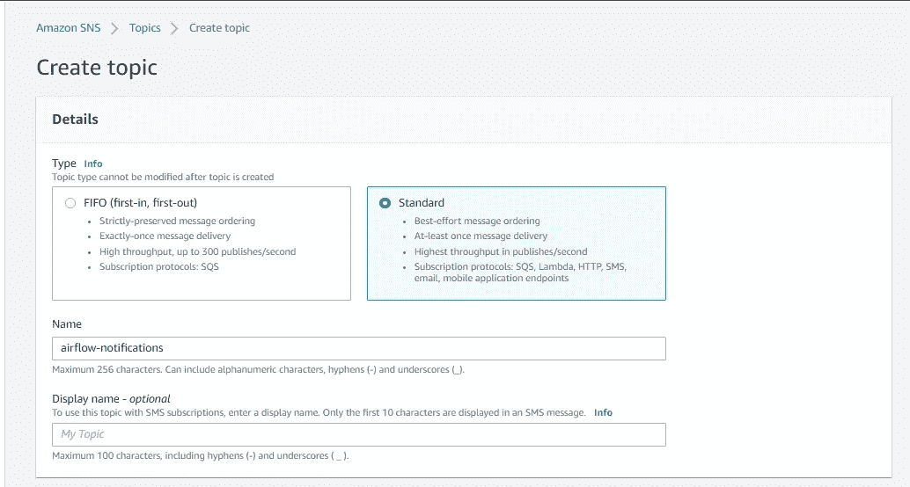

# 包括验证 DBT 云在气流上的作业状态

> 原文：<https://towardsdatascience.com/including-verification-of-dbt-cloud-job-status-on-airflow-4ef551f349a0?source=collection_archive---------17----------------------->

## [行业笔记](https://towardsdatascience.com/tagged/notes-from-industry)

## 使用气流触发 DBT 云作业，在继续之前检查其状态并发送错误通知


[陈明亮](https://unsplash.com/@leoliang1230?utm_source=medium&utm_medium=referral)在 [Unsplash](https://unsplash.com?utm_source=medium&utm_medium=referral) 上拍照

在下面的文章中，我写了关于利用气流引发 DBT 乔布斯的文章。一种选择是将 DBT 作为一个 python 包安装，并直接在与 Airflow 相同的机器上运行。另一个是使用 DBT 云来管理到数据仓库和作业的连接。

**第 1 部分** : [启动实例并安装气流](/creating-an-environment-with-airflow-and-dbt-on-aws-part-1-ca13bc95f479)
**第 2 部分** : [安装 DBT 和一些设置使工作更容易](/creating-an-environment-with-airflow-and-dbt-on-aws-part-2-a23617d56eeb)
**第 3 部分** : [使用 DBT 云并将气流与 DBT 集成](/creating-an-environment-with-airflow-and-dbt-on-aws-part-3-2789f35adb5d)

第二个问题是:当我们发送请求来触发作业时，我们的任务将会成功完成(考虑到气流可以发送这个请求)。但这并不意味着我们在 DBT 的工作也很成功。事实上，我们的 DBT 作业可能仍在排队，等待 DBT 云执行它。因此，使用 DAG 运行 DBT 云作业的更合适的方法不仅可以触发作业，还可以检查它是否正确运行。

# 1.创建 AWS 资源

我们要添加到 DAG 中的一个步骤是在失败时发送通知。为此，我们将使用名为 [SNS](https://aws.amazon.com/sns/) (简单通知服务)的 AWS 服务。转到 AWS 控制台并搜索产品升级和技术支持服务。转到主题并创建一个新主题。选择标准类型并选择一个名称。我选“气流通知”。其他的都不需要改，直接点“创建话题”就可以了。



创建社交网络话题

之后，点击主题名称，您将看到 ARN。复制它。


我们话题的 ARN

在此页面的底部，您还可以选择创建订阅。创建一个，选择“电子邮件”作为协议，您的电子邮件作为端点。


借助 AWS SNS，我们可以轻松管理主题订阅

创建订阅后，您将收到一封确认订阅的电子邮件。去做吧。

在 AWS 中，为了向主题发布消息，我们还需要一个 IAM 用户。仍然在 AWS 控制台中，搜索 IAM 用户，在其页面中，转到 Users 并单击“Add users”。选择一个名称并选中“编程访问”(如果您希望能够以此用户身份登录，也可以选中 AWS 控制台选项)。


创建一个 IAM 用户，编程访问就足够了

点击 Next，在 Permissions 页面中，选择“直接附加现有策略”并选择 AmazonSNSFullAccess。然后点击下一步。


如果你知道你在做什么，你可以定义特定的权限，只是为了发布消息

在下一页中，如果需要，您可以添加一些标记，然后继续查看页面，然后“创建用户”。完成后，您将看到一条成功消息和下载. csv 文件的选项。这个文件将包含您刚刚创建的用户的“访问密钥 ID”和“秘密访问密钥”。下载吧。


结束 IAM 用户创建，下载。csv 文件

好了，现在，为了构建我们的新 DAG，让我们首先创建一些变量和连接。通过这样做，我们可以使用更通用的代码，因此您只需将这些值调整为您自己的值，而不需要编辑大量 Python 代码。

在气流网页中，转到管理>变量。创建三个变量:对于第一个，使用名称“sns_arn”并将主题 arn 粘贴到值中；第二个，用“SECRET_DBT_TOKEN”这个名字，用你 DBT 云的 API 密钥；第三个将被命名为“dbt_account_id ”,您可以猜测该值，即您来自 dbt 云的帐户 id。如果你对如何获得这些信息有任何疑问，你可以查看开头提到的文章。

完成后，您将拥有这三个变量:


有了这些变量，我们不必在代码中使用它们的值

注意，因为我们在令牌变量中使用了单词“secret ”,所以它的值不会出现在 UI 中。

现在，进入管理>连接。我们需要两个连接。第一个将调用“HTTP”类型的“dbt_api”和主机“[https://cloud.getdbt.com/api/v2/](https://cloud.getdbt.com/api/v2/)”。

对于第二个，类型将是“Amazon Web Services”，id 为“aws_conn”。打开。创建 IAM 用户后下载的 csv 文件。Airflow 连接登录将是文件中的“访问密钥 ID ”,密码 host 将是“秘密访问密钥”。在 Extra 字段中，您必须将 json 与您在 AWS 中使用的区域一起使用。在我的例子中是 us-east-2，所以值将是{"region_name": "us-east-2"}。像这样:


创建 AWS 连接

# 2.在 DAG 中使用的通用函数

现在，转到 dag 文件夹，创建一个名为“utils”的子目录。在其中，创建一个名为“dbtFunctions.py”的新文件。

我将讨论代码的每个部分，但整个代码都在这一页的末尾，所以，如果你愿意，你可以跳过代码块。

首先，我们需要导入我们将要使用的库:

```
import requests, jsonfrom airflow import DAG
from airflow.operators.python import PythonOperator
from airflow.sensors.python import PythonSensor
from airflow.hooks.base import BaseHook
from airflow.models import Variable
from airflow.exceptions import AirflowFailException
from airflow.contrib.operators.sns_publish_operator import SnsPublishOperator
```

现在，我们将从先前创建的变量和连接中获取数据。

```
DBT_API = BaseHook.get_connection('dbt_api').host
ACCOUNT_ID = Variable.get('dbt_account_id')
SNS_CONN = BaseHook.get_connection('aws_conn').conn_id
SNS_ARN = Variable.get('sns_arn')
```

当我们使用 DBT 云 API 请求时，我们可能需要传递报头或消息，所以，让我们添加这个来简化一些参数:

```
dbt_header = {
  'Content-Type': 'application/json',
  'Authorization': 'Token {0}'.format(Variable.get('SECRET_DBT_TOKEN'))
}def getDbtMessage(message):
  return {'cause': message}
```

气流运行基于操作员。我们需要一个能触发 DBT 任务的操作员。我们可以使用 PythonOperator 来运行 Python 函数，并使用请求库方法来发送请求。

一旦作业被触发，我们希望能够检查作业状态。每次我们触发一个作业时，都会生成一个作业运行 ID。我们需要这个 ID 来检查它的状态。当我们通过 API 触发作业时，这个 ID 在响应对象中返回。因此，我们可以将这个值存储到一个 [XCOM](https://marclamberti.com/blog/airflow-xcom/) 中。为了便于识别作业，我们还将作业 ID 添加到 XCOM 的名称中。

```
def _triggerJob(job_id, account_id, message, **context):
    response = requests.post(
        f'{DBT_API}/accounts/{account_id}/jobs/{job_id}/run/', 
        headers=dbt_header, 
        data=json.dumps(getDbtMessage(message))
    ).json()
    status_code = response['status']['code']
    job_run_id = response['data']['id']
    jobRunData = json.dumps({"status": status_code, "job_run_id": job_run_id}) 
    context['ti'].xcom_push(key=f'job-{job_id}', value=jobRunData)def triggerJobOperator(task_id, job_id, account_id=ACCOUNT_ID, message='Triggered by Airflow', **context):
    return PythonOperator(
        task_id=task_id,
        python_callable=_triggerJob,
        op_kwargs={'job_id': job_id, 'account_id': account_id, 'message': message}
    )
```

现在，无论我们是想在触发 DBT 作业后添加新任务，还是只考虑 DAG 成功，我们都应该只在作业成功时执行一次。为了验证这一点，我们将使用一个 [PythonSensor](https://marclamberti.com/blog/airflow-sensors/) 。PythonSensor 允许我们运行一个 python 函数，并且只根据某些条件移动到下一个任务。

我们将使用 DBT 云 API 来获取作业状态(数字代码在代码注释中)，从我们的 XCOM 获取作业运行 ID。一旦作业成功，用代码 10 表示，PythonSensor 调用的函数返回 true，这是执行下一个任务的条件。如果我们有一个状态取消或错误，我们也想中止任务，因为我们知道工作没有成功完成。

请注意间隔和重试参数。我定义每 30 秒运行一次 PythonSensor 使用的函数，并检查它的条件(一旦满足就返回 True)。此外，总超时将是 30 秒乘以 20，这意味着我们将尝试多达 20 次。这些值是假设的，你应该检查对你来说什么是好的值。无论如何，你只需要传递这些参数的值。

```
def _waitJobRun(job_id, account_id, **context):
    jobRunData = json.loads(context['ti'].xcom_pull(key=f'job-{job_id}'))
    jobRunId = jobRunData['job_run_id']
    response = requests.get(f'{DBT_API}/accounts/{account_id}/runs/{jobRunId}/', headers=dbt_header).json()
    status = response['data']['status']
    if (status == 10):
        return True
    elif (status == 20):
        raise AirflowFailException('Error on DBT job run!')
    elif (status == 30):
        raise AirflowFailException('DBT job run cancelled!')
    # 1-Queued / 3-Running / 10-Success / 20-Error / 30-Cancelleddef waitJobRunOperator(task_id, job_id, interval=30, retries=20, account_id=ACCOUNT_ID):
    return PythonSensor(
        task_id=task_id,
        poke_interval=interval,
        timeout=interval*retries,
        python_callable=_waitJobRun,
        op_kwargs={'job_id': job_id, 'account_id': account_id}
    )
```

最后，如果在 DAG 执行过程中出现错误，我们希望发送一封电子邮件。为此，我们将使用 SnsPublishOperator。这里，我们还将触发规则定义为“one_failed”。因此，如果在 DAG 期间有任何任务失败(无论是触发 DBT 作业失败还是检查其状态失败)，我们将向我们创建的主题发布一条消息，订阅者将收到电子邮件。

```
def notifyErrorIfOneFailedOperator(task_id, message='Error on DAG!'):
    return SnsPublishOperator(
        task_id=task_id,
        target_arn=SNS_ARN,
        message=message,
        aws_conn_id=SNS_CONN,
        trigger_rule='one_failed'
    )
```

所以，把这些碎片放在一起，我们有:

# 3.达格

好了，到目前为止，我们只创建了一些函数。我们没有创建任何 DAG。我们仍然没有任何关于气流 UI 的新东西。因此，在 Dags 文件夹中创建一个新文件(在 utils 之外)。我把它命名为“load_users_cloud_v2.py”，不过你可以随意选择。添加以下代码。

对于任务 1 和任务 2，您必须使用您自己的作业 ID，来自 DBT 云。但那就足够了。使用我们的函数，我们只需要声明我们想要触发我们的作业，检查直到它完成，如果有任何错误，通知某人。

检查气流 UI。


最后，我们的狗

打开开关并触发 DAG。如果一切正常，第一个任务将很快执行。它将被标在深绿色上。第二个任务将在几分钟内呈浅绿色，同时等待 DBT 任务完成。


检查作业状态的任务将一直运行，直到作业完成，无论成功与否

一旦作业完成，最后一个任务将被标记为粉红色，因为没有错误，任务不必执行。


检查状态成功，意味着作业成功运行，通知被跳过

想要测试错误场景吗？再次触发 DAG。转到 DBT 云并在作业执行前取消它。


DBT 云上气流引发的作业

现在，第二个任务标记为红色，第三个标记为深绿色。你可以查看你的电子邮件。


状态检查失败，成功发送通知

因此，现在我们的 DAG 在 DBT 云中触发一个作业，等待该作业完成，并在出现任何错误时发送电子邮件通知。如果您的 DAG 的目标只是触发 DBT 作业，那么您不必做很多更改，但是您可能会注意到，即使第二个任务失败，DAG 也会被标记为成功，因为我们成功地到达了最后一个任务。例如，您可以在这些操作符之后添加一个新的操作符，并使用一个[触发规则](https://airflow.apache.org/docs/apache-airflow/1.10.2/concepts.html?highlight=trigger#trigger-rules)，以便仅在所有之前的任务都正确运行或被跳过时才运行。如果你需要添加其他任务，你可以考虑的另一件事是将那些任务分组到一个[任务组](https://www.astronomer.io/guides/task-groups)。不管怎样，现在就看你的了。如果你一直坚持到现在，我相信你可以做出适当的改变，在你的项目中使用它。

# 参考

[*https://airflow.apache.org/docs/*](https://airflow.apache.org/docs/)[*https://docs.getdbt.com/dbt-cloud/api*](https://docs.getdbt.com/dbt-cloud/api)[*https://marclamberti.com/blog/airflow-sensors/*](https://marclamberti.com/blog/airflow-sensors/)[*https://marclamberti.com/blog/airflow-xcom/*](https://marclamberti.com/blog/airflow-xcom/)[*https://aws.amazon.com/sns*](https://aws.amazon.com/sns)
[https://www.astronomer.io/guides/task-group
s](https://www.astronomer.io/guides/task-groups)[https 高亮显示=触发#触发规则](https://airflow.apache.org/docs/apache-airflow/1.10.2/concepts.html?highlight=trigger#trigger-rules)