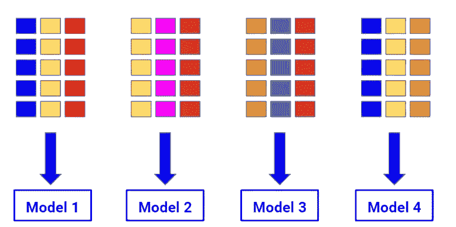
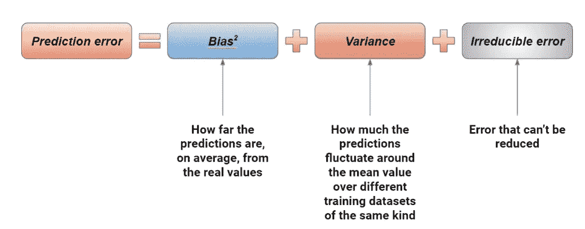
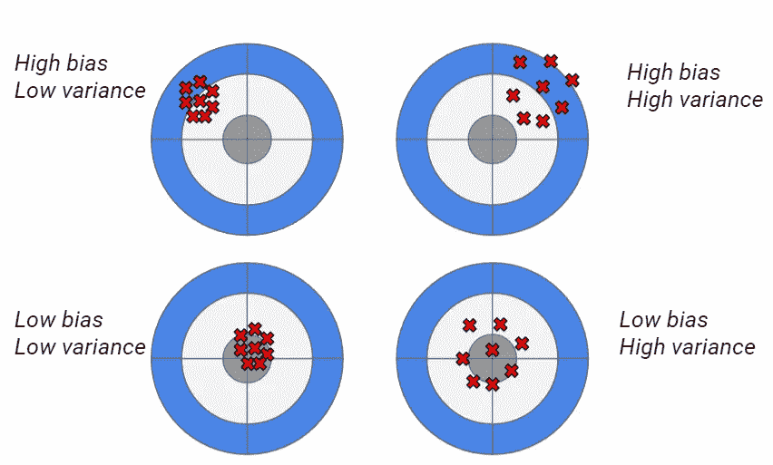
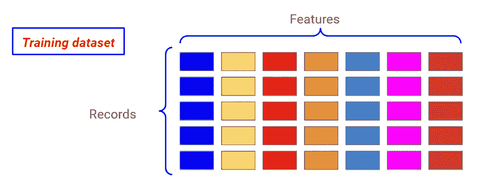
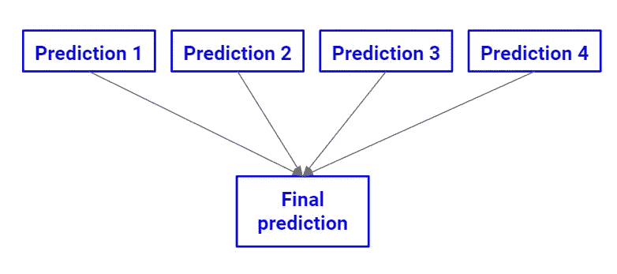

# 在 Python 中使用 Bagging 提高模型稳定性

> 原文：<https://towardsdatascience.com/increase-model-stability-using-bagging-in-python-d407233d2d93?source=collection_archive---------31----------------------->

## 让我们看看如何使用 bagging 技术增加模型的稳定性



装袋示例。作者图片

数据科学家通常会寻找一个尽可能精确的模型。然而，他们还应该关注另一个术语，即稳定性。在这篇文章中，我解释了它是什么以及如何使用一种叫做“装袋”的技术来增加它。

# 偏差-方差权衡

在机器学习中，预测误差可以分解为 3 部分:偏差的平方、方差和不可约误差。偏差是预测值与真实值相差多远的度量，方差衡量我们的模型在根据数据集的原始分布创建的样本上进行重新训练时的稳定性，不可约误差是无法消除的噪声项。研究这些术语并试图减少它们被称为偏差-方差权衡。



作者图片

下图更清楚地展示了偏差和方差是如何工作的。灰色目标是真实值，而红色叉号是使用训练数据集的不同重采样进行的预测。



作者图片

我们的目标是达到低偏差-低方差的情况，在这种情况下，我们的模型对再训练是稳定的，并且它的预测是正确的。然而，具有低偏差的模型(如 XGBoost)往往会随着时间的推移而变得不稳定(高方差)，而具有低方差的模型(如随机森林)往往不太准确(低偏差)。数据科学家必须知道，他们是想创建一个不稳定的精确模型(需要频繁的重新训练)，还是创建一个更稳定的不太精确的模型。

由于模型训练是一项非常复杂和困难的任务，我更喜欢使用低方差的模型，以便随着时间的推移，以较低的性能为代价，获得更稳定的模型。

为了减少偏差，可以使用一种称为升压的技术。为了减少差异，我们可以使用一种叫做装袋的技术。后者是本文的主题。

# 装袋的工作原理

装袋工作遵循[自举](https://www.yourdatateacher.com/2021/04/19/the-bootstrap-the-swiss-army-knife-of-any-data-scientist/)的统计原理。让我们考虑数据集的所有记录和所有特征。



作者图片

现在，让我们考虑我们的训练数据集的一些随机选择的样本，通过替换对我们的记录进行采样，并考虑列的随机子集。通过这种方式，我们可以创建不同的训练数据集来训练我们的模型，预先设置相同的超参数值。


作者图片

最后，该模型集合可用于进行最终预测。



作者图片

对于回归问题，通常使用模型预测的平均值。对于分类，软投票是首选。

Bagging 在数学上减少了我们模型的方差(即当我们在原始训练数据集的不同重新样本上训练我们的模型时，平均性能值周围的波动的度量)。最常见的 bagging 模型是随机森林，但是我们可以将 bagging 概念应用于每一个可能的模型。

一些 bagging 技术使用没有替换的采样，并且样本的大小可以小于原始训练数据集的大小。因此，bagging 引入了 4 个新的超参数:样本数、列数、要使用的记录分数、是否使用替换抽样。

现在让我们看看如何在 Python 中应用 bagging 进行回归和分类，并证明它实际上减少了方差。

# 蟒蛇皮装袋

现在让我们看看如何在 Python 中使用 bagging。完整的代码可以在我的 GitHub [这里](https://github.com/gianlucamalato/collinearity/blob/main/Bagging.ipynb)找到。

让我们首先导入我们的数据集，即乳腺癌和糖尿病数据集。

```
from sklearn.datasets import load_breast_cancer,load_diabetes
```

现在让我们导入一个回归和一个分类模型。对于回归，我们将使用线性回归。对于分类，我们将使用高斯朴素贝叶斯模型。

```
from sklearn.linear_model import LinearRegression 
from sklearn.naive_bayes import GaussianNB
```

为了应用 bagging，我们必须使用元估计器，将这种集成技术应用于给定的模型。在 sklearn 中，我们有打包分类器和开始分类器。让我们导入它们，让我们导入 cross_val_score，以便计算方差。

```
from sklearn.ensemble import BaggingClassifier,BaggingRegressor 
from sklearn.model_selection import cross_val_score
```

先说分类。我们可以导入我们的数据集，训练我们的模型，并在 10 次交叉验证中计算一些性能指标的方差(比如平衡精度)。

```
X,y = load_breast_cancer(return_X_y=True) nb = GaussianNB() cross_val_score(nb,X,y,scoring="balanced_accuracy",cv=10).var() 
# 0.0011182285777794419
```

这个方差是模型稳定性的度量。

现在让我们使用 10 个模型和原始列数的一半来应用 bagging。在实际项目中，您希望使用像[网格搜索](https://www.yourdatateacher.com/2021/05/19/hyperparameter-tuning-grid-search-and-random-search/)这样的超参数调整技术来优化这些值。

```
model = BaggingClassifier(GaussianNB(),n_estimators = 10, max_features = 0.5,random_state = 0, n_jobs = -1)
```

那么，方差是:

```
cross_val_score(model,X,y,scoring="balanced_accuracy",cv=10).var() 
# 0.000944202642795715
```

正如我们看到的，它低于原始方差。因此，装袋减少了方差，使我们的模型更加稳定。

我们也可以将同样的概念应用于回归。让我们使用线性回归模型和 R 平方度量。

```
X,y = load_diabetes(return_X_y=True) lr = LinearRegression() cross_val_score(lr,X,y,scoring="r2",cv=10).var() 
# 0.021605440351612316
```

现在，让我们将 BaggingRegressor 应用于我们的模型，并计算新的方差:

```
model = BaggingRegressor(LinearRegression(),n_estimators = 10, max_features = 0.5,random_state = 0, n_jobs = -1) cross_val_score(model,X,y,scoring="r2",cv=10).var() 
# 0.013136832268767986
```

它是原值的一半。所以，我们创造了一个更稳定的模型。

# 结论

装袋是一种非常有用的技术，它从数学上增加了模型的稳定性。我认为，当您知道将来无法再次训练您的模型，并且希望构建一个随着时间推移而稳定的模型时，应该首选 boosting。当然，监控模型性能对于机器学习项目的成功至关重要，但随着时间的推移，正确使用 boosting 会使您的模型更加稳定和健壮，但代价是性能下降。有时，增加模型的稳定性可能比增加其准确性更可取，bagging 就是这样工作的。

*Gianluca Malato 是一名数据科学家，在*<http://www.yourdatateacher.com/>**上教授机器学习和数据科学。**

**原载于 2021 年 10 月 18 日 https://www.yourdatateacher.com**的* [*。*](https://www.yourdatateacher.com/2021/10/18/increase-model-stability-using-bagging-in-python/)*