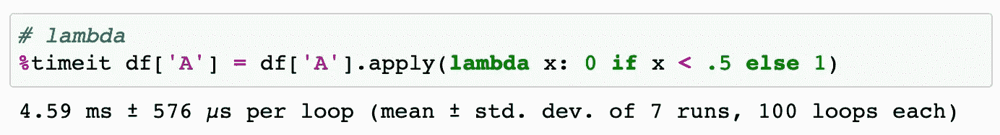

# 用更少的代码行提高性能

> 原文：<https://towardsdatascience.com/increase-performance-with-fewer-lines-of-code-2618a9fd3e0e?source=collection_archive---------30----------------------->

## 如何通过使用 Python 中针对速度优化的方法来修改代码

照片由[马修·施瓦茨](https://unsplash.com/@cadop?utm_source=unsplash&utm_medium=referral&utm_content=creditCopyText)在 [Unsplash](https://unsplash.com/s/photos/car?utm_source=unsplash&utm_medium=referral&utm_content=creditCopyText) 拍摄

数据科学与性能密切相关，无论是关于指标(预测模型准确性、精确度、召回率、F1 分数或日志丢失)还是硬件规格(RAM、存储和 GPU)。然而，有时指标或硬件规格是数据科学家可以控制的变量。也许公司已经建立了关键绩效指标(KPI ),并购买了所有必要的设备来开始运行它。

也就是说，有人可能会认为数据科学家可以通过提高他们的编码能力来影响性能。这是事实，但更重要的是，数据科学家应该知道在每种情况下使用哪种方法。Python 是一种通用的编程语言，允许数据专业人员编写不同的代码行，但仍能获得相同的结果。但是，说到性能，并不是每一行代码都是一样的。

以下是数据科学家使用不同形式的循环来增加处理时间的一些简单方法。因此，您将影响整体性能——尤其是对于大型数据集。

## **数据集**

对于本文，我使用 Pandas 随机生成一万行和三列，数字在`**0**`和`**1**`之间。下面，describe 方法精确地显示了我们所期望的:最小值接近于零，平均值在 0.5 左右，最大值接近 1.0。此外，我们可以确认有 10，000 行和 3 列。

作者图片

## **Iterrows**

Iterrows 是一个常用的 Pandas 方法，它允许您遍历每一行。我们可以单独使用 iterrow，但是循环遍历一些值并打印出来并没有什么好处。因此，让我们从创建一个应用 iterrow 并检查条件的函数开始。在这种情况下，我们将首先传入 DataFrame ( `**df**`)和 column ( `**col**`)。然后，如果值低于 5，Python 会用 0 替换它。否则 Python 会用 1 代替。虽然这是一个简单的例子，但它将允许我们使用 iterrows 来测量每个循环的速度。

作者图片

通过在 iterrow 上使用`[**%timeit**](https://docs.python.org/3/library/timeit.html)`,我们可以检查运行每一行代码所花费的时间。在 iterrows 的例子中，花费了 681 ms，所以，让我们使用这个结果作为评估方法间性能的参考速度。

## **iloc 方法**

`**iloc**`方法是 Pandas 库的一部分，它使我们能够选择数据集**【1】**的特定单元格。所以，现在，我们将运行一个类似于前一个代码的代码，但是我们将使用稍有变化的索引。给定一列，Python 将在索引位置`***i***`找到值。

作者图片

通过使我们的 for 循环适应 Pandas `**iloc**`方法，我们已经设法减少了每个循环的处理时间。`**iloc**`方法大约比 iterrows 快 4.4 倍。然而，仍有改进的余地。

## **应用带有λ的方法**

Lambda 是一个小小的匿名函数，其语法比常规 Python 函数**【2】**更严格，但也更简洁。标准函数使用`**def**`关键字，而在 Python 中，匿名函数使用 *lambda* 关键字。因此，匿名函数也被称为 T21。这是一种高效的编码方式，意味着需要处理的行数更少。因此，时间更少，效率更高。让我们看看它与我们的第一个方法相比如何。

作者图片

Lambda 函数通过 apply 方法比 iterrows 更快。通过一行代码，我们成功地将每个循环的处理时间减少到了 4.59 毫秒，比 iterrows 快了大约 148 倍。

## **NP . where**

`**where()**`方法是 NumPy 库**【3】**的一部分。它告诉你在指定的数组中，哪里的条目满足给定的条件。你可以在 NumPy 的文档上阅读更多关于`**where()**`的内容。现在，我们将继续我们的性能测试，看看它是否能提高每个循环的处理速度。让我们传入之前使用的条件并检查结果。

作者图片

好的，我们已经显著提高了性能。现在，每个循环只需要 332 微秒。因此，1 微秒等于 1000 纳秒或 0.000001 秒。在 apply 方法中，我们达到了 lambda 函数速度的近 14 倍。这是一个巨大的改进，只需要短短的一行代码。

## **NP . where . value**

通过将`**.value**`与`**np.where()**`一起使用，它将上述内容转换成一个 NumPy 数组。它删除了熊猫系列中不必要的功能。Python 需要处理的事情更少。因此，我们提高了速度和性能。

作者图片

好吧，这是一个不可思议的成就。我们已经设法将时间减少了前一个例子的大约一半。Python 处理每个循环只需要 178 微秒。令人惊讶的是，仅仅几个变化就能产生如此巨大的性能差异。

## **结论**

性能是数据科学的关键。然而，大多数时候，数据科学家无法改变业务指标或购买新设备。尽管如此，努力编写提高性能的代码是我们力所能及的。您绝不应该忘记 iterrows，而是应该考虑每个数据集的大小。如果数据集很小，Iterrows 不会影响您的工作。但是，数据集越广泛，稍加改动的好处就越大。这样做可以提高性能并减少时间。性能大幅提升的原因在于使用了针对速度优化的方法(apply/NP . where/vectorization)。因此，尽可能使用优化的方法。

**感谢阅读。这里有一些你可能会喜欢的文章:**

</the-perfect-python-cheatsheet-for-beginners-c7c16799de5>  </switching-career-to-data-science-in-your-30s-6122e51a18a3>  

**参考文献:**

**【1】iloc**[https://pandas . pydata . org/pandas-docs/stable/reference/API/pandas。DataFrame.iloc.html](https://pandas.pydata.org/pandas-docs/stable/reference/api/pandas.DataFrame.iloc.html)

**【2】λ**[https://realpython.com/python-lambda/](https://realpython.com/python-lambda/)

**【3】NP . where**[https://numpy . org/doc/stable/reference/generated/numpy . where . html](https://numpy.org/doc/stable/reference/generated/numpy.where.html)

Python 代码的所有图像都是由[作者](https://docs.python.org/3/library/timeit.html)在 Jupyter 笔记本上创建的。