# 遵循我从 Kaggle 社区学到的 5 个技巧，提高你的 CNN 的准确性

> 原文：<https://towardsdatascience.com/increase-the-accuracy-of-your-cnn-by-following-these-5-tips-i-learned-from-the-kaggle-community-27227ad39554?source=collection_archive---------3----------------------->

## 使用更大的预训练模型、K 倍交叉验证、CutMix、MixUp 和集成学习

试图提高 CNN 的准确性，照片由[塞缪尔·伯克](https://unsplash.com/@sambourke?utm_source=unsplash&utm_medium=referral&utm_content=creditCopyText)在 [Unsplash](https://unsplash.com/@sambourke?utm_source=unsplash&utm_medium=referral&utm_content=creditCopyText) 上拍摄

一个项目经理曾经告诉我 80/20 法则。他抱怨说项目的最后一部分时间太长了。实现最后 20%的功能花费了 80%的时间。

[维尔弗雷多·帕累托](https://www.britannica.com/biography/Vilfredo-Pareto)称之为 80/20 法则或帕累托原则。它说你 20%的努力会产生 80%的结果。

80/20 法则也适用于提高我的深度学习模型的准确性。创建一个准确率为 88%的模型非常简单。我有一种感觉，要把它再提高 3%才能登上排行榜的首位，将需要更多的时间。

如果你不知道我在说什么，我邀请你阅读我以前的文章。那篇文章最后给出了提高模型准确性的五种可能的技术。我从 Kaggle 社区学到了这五个技巧。

1.  使用更大的预训练模型
2.  使用 K 倍交叉优化
3.  使用 CutMix 来增强您的图像
4.  使用混音来增强你的图像
5.  使用集成学习

我尝试了每一种技术，并将它们结合起来。事情是这样的。

所有的源代码都可以在[这个 GitHub 库](https://github.com/PatrickKalkman/leave-disease)中找到。

# 1.使用更大的预训练模型

之前，我们使用的是 B3 高效网络。这个模型是性能和准确性之间的一个很好的平衡。见下文。但是 EfficientNet 提供了其他更精确的模型，例如 EfficientNet-B4。

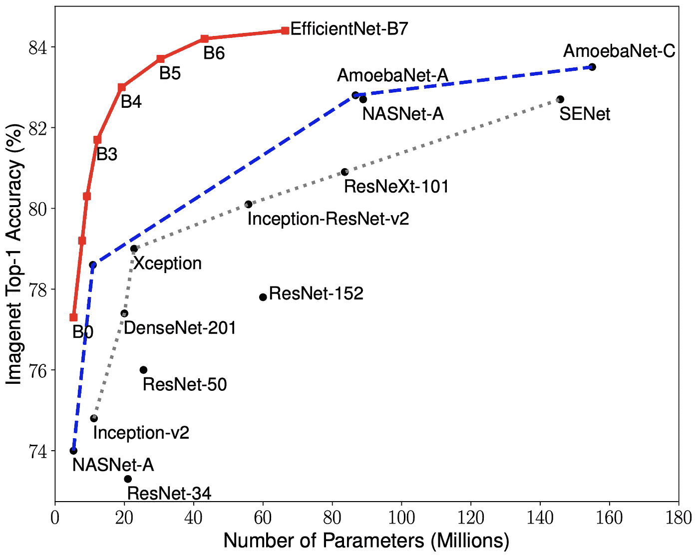

EfficientNet:反思卷积神经网络的模型缩放(Tan 等人，2019 年)

这些更复杂的模型有更多的参数。在训练期间，更多的参数需要更多的计算能力和内存。我从 EfficientNet-B4 开始，结果非常好。验证准确率提高到 90%，验证损失降低到 0.32。

如果您对实现感兴趣，请查看我的[以前的](/helping-african-farmers-increase-their-yields-using-deep-learning-93a8d70dff36)文章或这个 [GitHub](http://www.hemingwayapp.com/GitHub) 资源库。唯一需要的改变是把 B3 变成 B4。

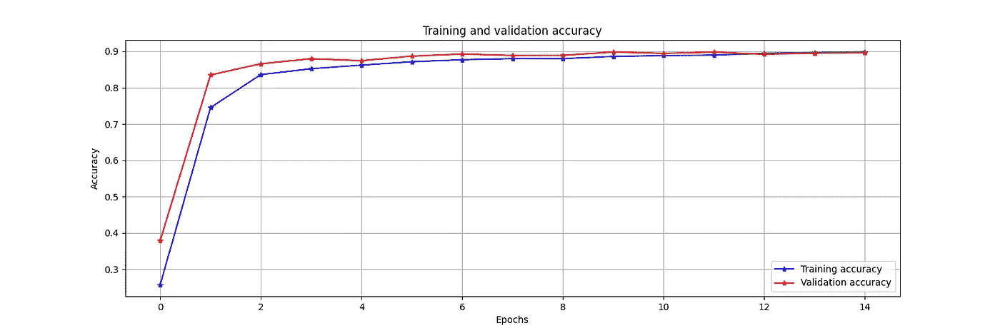

使用 EfficientNetB4 与 Epochs 时的培训和验证准确性，图片由作者提供

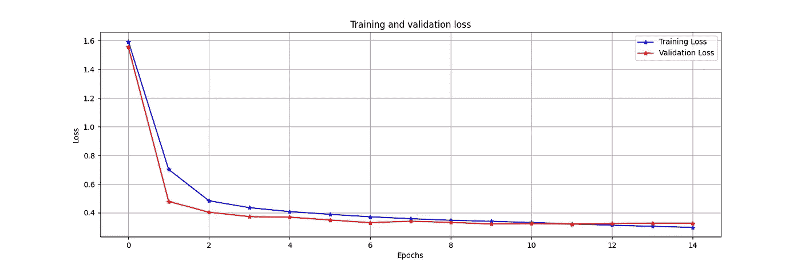

使用 EfficientNetB4 与 Epochs 时的培训和验证损失，图片由作者提供

在我将模型提交给 Kaggle 之后，它显示了公众评分的小幅上升。从 88.9%上升到 89.1%。提高了 0.2%。

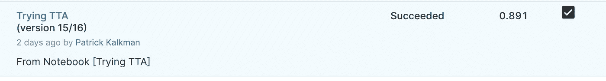

提交的分数，图片由作者提供

我还尝试了其他高效网络模型，如高效网络 B5 和高效 B6。精确度没有增加。

# 2.使用 K 倍交叉验证

到目前为止，我们将图像分为训练集和验证集。因此，我们不使用整个训练集，因为我们使用一部分进行验证。

将数据分为训练集和验证集的另一种方法是 K 重交叉验证。这个方法最早是由[石头 M](https://www.jstor.org/stable/2984809?seq=1) 在 1977 年提出的。

使用 K 倍交叉验证，您可以将图像分成 K 个大小相等的部分。然后，使用不同的训练和验证集对模型 K 进行多次训练。

通过这种方式，您可以充分利用所有的训练数据。

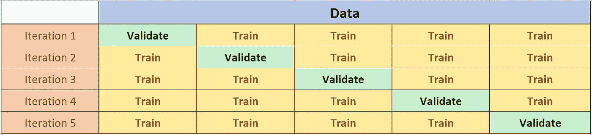

k 倍交叉验证(k = 5)，图片由作者提供

请务必注意，您将训练许多模型，每个折叠一个模型。这意味着改变我们预测的方式。我们有以下选择。

*   使用单一模型，具有最高精度或损耗的模型。
*   使用所有模型。使用所有模型创建一个预测，并对结果进行平均。这被称为[合奏](https://en.wikipedia.org/wiki/Ensemble_learning)。
*   使用与交叉验证相同的设置重新训练替代模型。但是现在使用整个数据集。

## 实现 K 重交叉验证

scikit-learn 库包含帮助我们的对象。有两个对象可以帮助我们将训练数据分成多个文件夹。这些是`KFold`和`StratifiedKFold`。

**KFold**

`KFold`对象将我们的训练数据分成 k 个连续的文件夹。创建对象时，选择折叠次数。如果您随后对该对象调用`split`，它将返回两个数组。第一个数组包含来自我们训练数据的用于训练的索引。第二个数组包含用于验证的训练数据的索引。

使用 scikit-learn 中的 KFold

在第五行中，我们创建了`KFold`对象，并指示它创建五个不同的文件夹并混洗数据。然后在第八行，我们开始一个将运行五次的循环。每次运行都返回包含 train_data 数据帧索引的`train_index`和`val_index`数组。

然后我们创建两个数组，`training_data`和`validation_data`，我们用它们来处理`ImageDataGenerator`。

**分层折叠**

StratifiedKFold 与普通 KFold 的不同之处在于，它确保每个文件夹中每个类别的样本百分比相同。如果您的训练数据不是均匀分布的，这尤其有用。

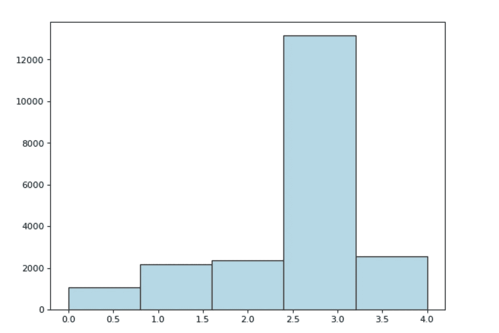

每个疾病类别的训练图像数量，按作者分类的图像

我们的训练数据就是这种情况。所以，我们用 StratifiedKFold。实现与 KFold 相同。

使用 scikit-learn 中的 StratifiedKFold

我们迭代所有折叠，并使用每个训练和验证集来训练模型。每个型号都有一个唯一的文件名。当保存具有最低损失的模型时，我们使用该文件名。

然后，我们将 TensorFlow 从 fit 方法返回的历史对象添加到一个数组中。我们使用这个数组在训练结束时创建每个折叠的图形。我在每次折叠时使用的预训练模型是 B3 效率网。

正如您在折叠 1 和折叠 2 的图表中所看到的，各个图表没有显示验证准确性的增加。

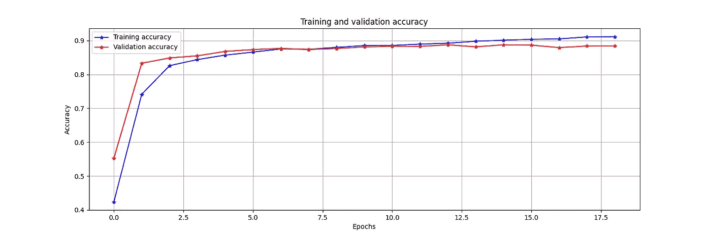

作者对 fold 1 与 Epochs 图像的训练和验证准确性

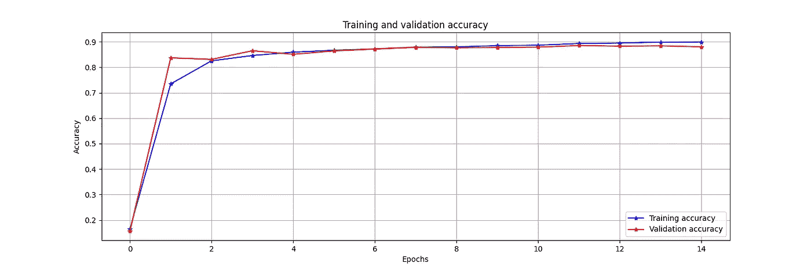

作者对 fold 2 与 Epochs 图像的训练和验证准确性

## 使用 K-Fold 创建和提交预测

为了进行预测，我们必须计算所有单个预测的平均值。为此，我们首先加载所有的模型并将它们存储在一个列表中。

使用 Keras 加载所有模型，并将它们存储在一个列表中

然后我们调用`load_and_predict`函数。这个函数迭代所有加载的模型。我们将模型返回的每个预测添加到包含所有预测的列表中。

用每个模型创建预测并计算平均值

在第 26 行，我们使用 NumPy 来计算所有预测的平均值。然后，在第 27 行，我们迭代所有的预测来构造一个数组。我们使用这个数组创建一个提交，方法是将它加载到 Pandas 数据框中。Pandas 数据框有一种直接将其保存为 CSV 文件的方法。

提交的结果比我们上次提交的结果增加了 0.001。

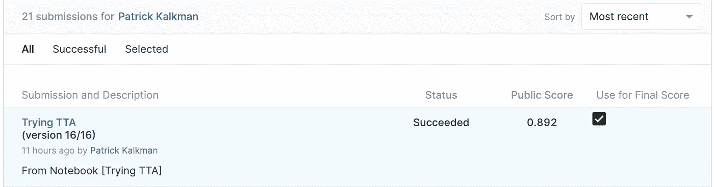

笔记本投稿结果，图片由作者提供

我们在公共排行榜上升了几个名次，排在 1908 位。

最终在 Kaggle 公共排行榜上的排名，图片由作者提供

# 3.使用 CutMix 来增强您的图像

Sangdoo Yun 在 Sangdoo Yun 等人的研究论文 [CutMix:使用可本地化特征训练强分类器的正则化策略](https://arxiv.org/pdf/1905.04899.pdf)中描述了 CutMix

CutMix 组合了来自训练集的两个随机图像。它剪切一幅图像的一部分，并将其粘贴到另一幅图像上。CutMix 还混合两个图像的标签，与剪切大小的区域成比例。

论文的结论是 CutMix 提高了模型的稳健性和性能。

当我们对木薯训练数据使用 CutMix 技术时，我们得到以下图像。我添加了红框，以观察原始图像和补丁之间的区别。

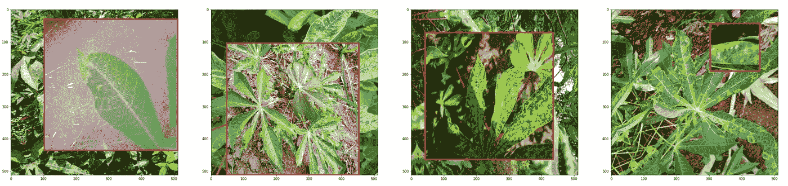

将 CutMix 添加到木薯训练图像，图像由作者提供

## 使用 TensorFlow Keras 实现 CutMix

由于有了`CutMixImageDataGenerator`类，用 TensorFlow 实现 CutMix 很简单。Bruce Kim 开发了这个类。它的作用与`ImageDataGenerator`相同，但它增加了 CutMix。

我们像往常一样定义了一个`ImageDataGenerator`，但是我们创建了两个迭代器，参见第 16 行和第 27 行。

在第 38 行，我们使用两个迭代器作为参数创建了`CutMixImageDataGenerator`。接下来，我们使用它返回的`train_iterator`并将其添加到`fit`方法中。

使用 CutMixImageDataGenerator

EfficientNet-B5 与 CutMix 的结合产生了 89.49%的最大验证准确度和 0.32 的最小验证损失。

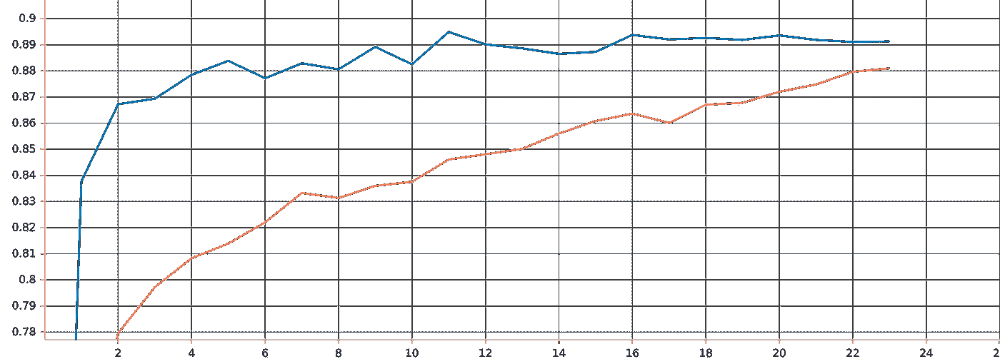

CutMix 准确性和验证准确性与纪元的关系，图片由作者提供，使用 Tensorboard 创建

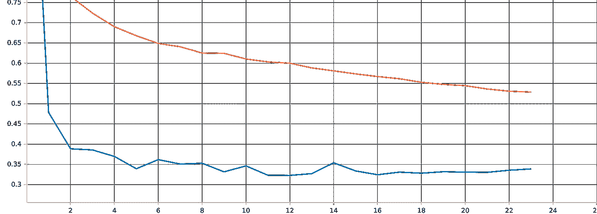

CutMix 训练损失和验证损失与历元，图片由作者提供，使用 Tensorboard 创建

为了报告准确性和损失，我使用了 **Tensorboard** 。TensorBoard 可以跟踪和可视化损失和准确性指标。谷歌还开发了网站 [TensorBoard.dev.](http://www.hemingwayapp.com/TensorBoard.dev) 你可以用它来存储和分享你的训练成果。

最棒的是，你甚至可以在训练过程中观察这些指标。

你可以在这里查看 CutMix 训练[的准确度和损耗结果。](https://tensorboard.dev/experiment/k4brLA2kTYKtzVgvt3vvow)

虽然准确性和损失是迄今为止最好的，但它们并没有在 Kaggle 上产生更高的分数。该模型的得分为 0.889，这不是一个进步。

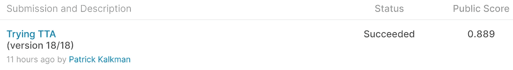

笔记本投稿结果，图片由作者提供

因此，使用 CutMix 和 EfficientNetB5 训练单个模型并没有改善我们的模型。

# 4.使用混音来增强你的图像

张等人的研究论文 [mixup:超越经验风险最小化](https://arxiv.org/pdf/1710.09412.pdf)对 MixUp 进行了描述。

像 CutMix 一样，MixUp 组合了来自我们训练集的两个图像。它使一个图像透明，并把它放在另一个之上。透明度是可调的。

研究论文表明，MixUp 提高了最先进的神经网络体系结构的泛化能力。

当我们对木薯训练数据使用混合技术时，我们得到了下面的图像。我使用的透明度值为 0.2。

添加混合到木薯训练图像，图像由作者

## 使用 TensorFlow Keras 实现混合

当您使用在 [dlology](https://www.dlology.com/blog/how-to-do-mixup-training-from-image-files-in-keras/) 博客中提到的`MixUpImageGenerator`时，MixUp 的实现也很简单。你可以在 GitHub 上找到源代码。

我对`MixUpImageGenerator`做了一点小小的改动，使它能够用于数据集和`flow_from_dataframe`方法。

实现从创建一个`ImageDataGenerator`开始，并将生成器传递给`MixUpImageGenerator`的构造函数。

使用 MixUpImageGenerator

EfficientNet-B4 与 MixUp 的结合产生了 88.5%的最大验证准确度和 0.35 的最小验证损失。

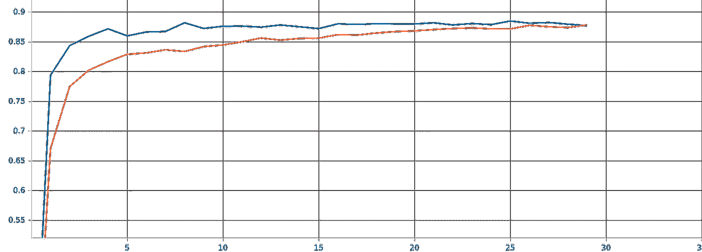

混合精度和验证精度与纪元，图片由作者提供，使用 Tensorboard 创建

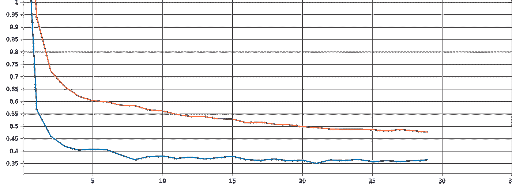

混合训练损失和验证损失与历元，图片由作者使用 Tensorboard 创建

你可以研究这些图，因为我是用 Tensorboard 创建的。

MixUp 没有提高精度或损失，结果比使用 CutMix 低。这也没有给 Kaggle 带来更高的分数。该模型得分为 0。这不是一个进步。

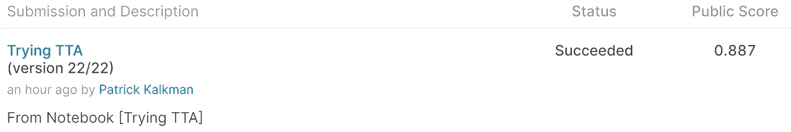

因此，使用 MixUp 和 EfficientNet-B4 训练单个模型不会导致识别木薯疾病的改进。

# 5.使用集成学习

集成学习是一种通过训练和组合多个模型来改进预测的方法。我们之前用 K-Fold 交叉验证做的是集成学习。

我们训练了多个模型，并结合了这些模型的预测。对于 K-Fold 交叉验证，我们使用了相同的模型架构——efficient net-B3。也可以组合不同的架构。

我们将一个用高效 B7 训练的模型和另一个用 ResNext50v2 训练的模型结合起来。经过训练，ResNext50v2 模型的最大验证准确率为 85%。效率网-B7 模型的最大验证准确率为 89%。

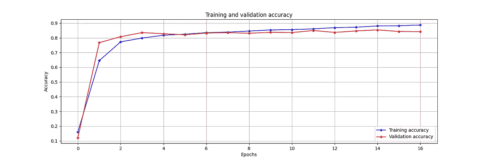

ResNext50v2 与 Epochs 的训练和验证精度，图片由作者提供

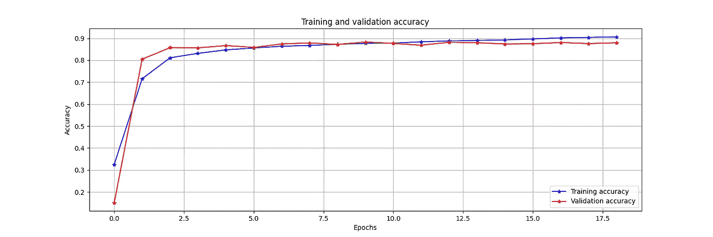

EfficientNet-B7 vs Epochs 的训练和验证准确性，图片由作者提供

## 使用集成学习创建预测

我把这个组合和四倍测试增强结合起来。如果您查看源代码，会发现有两个循环——第一个循环遍历所有模型，第二个循环遍历增强的测试图像。

最后，在第 33 行，我们使用`np.mean`计算预测的平均值。然后，在第 35 行，我们使用`np.argmax`选择得分最高的类别或标签。

使用集成学习创建预测

这一组合加上测试时间增加的结果是迄今为止的最高分。我们在私服上得到了 **89.3%** ，在公服上得到了 **89.35%** 。

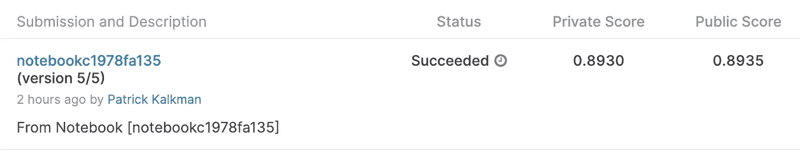

当我试图改进和写这篇文章的时候，比赛结束了。这就是为什么你会看到公共和私人的分数。以前 Kaggle 只会显示公开的分数。

# 结论和进一步优化

正如所料，一些优化技术对木薯数据有效，而另一些则无效。我们可以将准确率从 88.9%提高到 89.35%。

使用更大的模型，K-Fold 交叉验证和集成学习提高了准确性。CutMix 和 MixUp 图像增强没有。

你可以在[这个 GitHub 库](https://github.com/PatrickKalkman/leave-disease)里找到源代码。

我花了更多的时间试图提高准确性，如果你把它与我的模型的初始创建进行比较。创建模型和训练需要更多的时间和计算能力。

我对 80/20 法则的感觉是正确的。

这篇文章中的五个技巧可以提高你的 CNN 的准确性。这取决于训练图像的数量和质量。试着找出答案。

在阅读 Kaggle 论坛时，我发现了更多的优化技术。比如说。

*   执行图像增强，而不是在每个时期。例如，开始前三个纪元时不增加。另外，不要在最后的时期使用强化。
*   创建包含视觉变换(ViT)模型的集合
*   使用不同的损失函数
*   使用过采样平衡数据集

我将使用这些技术来进一步提高我的模型的准确性。

感谢您的阅读，记住永远不要停止学习！

# 已用资源

尚斗云，韩东云，吴成俊，尚赫镇，崔俊锡，柳永俊。 [CutMix:训练具有可定位特征的强分类器的正则化策略](https://arxiv.org/pdf/1905.04899.pdf)。arXiv:1905.04899

H.张、m .西塞、Y. N .多芬和 d .洛佩斯-帕斯。[混乱:超越经验风险最小化](https://arxiv.org/pdf/1710.09412.pdf)。arXiv 预印本 arXiv:1710.09412，2017。

[谭明星与郭诉乐。EfficientNet:反思卷积神经网络的模型缩放](https://research.google/pubs/pub48187/)。《机器学习国际会议论文集》(ICML)，2019 年。

统计预测的交叉验证选择和评估。皇家统计。社会主义者, 36(2):111–147,1974.

[用于图像识别的深度残差学习](https://arxiv.org/abs/1512.03385)。何、、、任、。