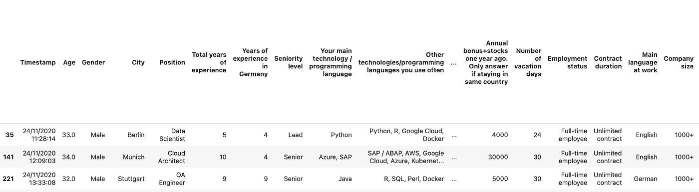
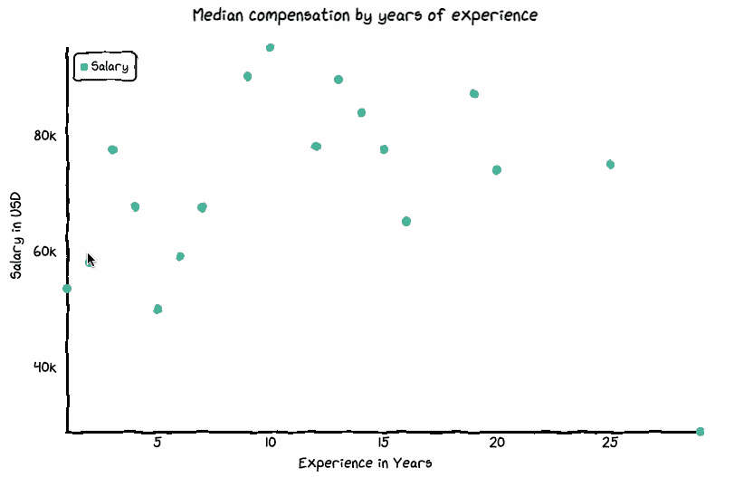

# 增加你的图表的可爱度

> 原文：<https://towardsdatascience.com/increase-the-cuteness-quotient-of-your-charts-fda960d84bee?source=collection_archive---------29----------------------->

## 用 Python 创建手绘 xkcd 样式的图表


由 [Unsplash](https://unsplash.com?utm_source=medium&utm_medium=referral) 上的 [Kelli Tungay](https://unsplash.com/@kellitungay?utm_source=medium&utm_medium=referral) 拍摄|由作者编辑

手绘图表看起来很花哨，以至于有一个 javascript 库可以用来创建它们。 [Chart.xkcd](https://github.com/timqian/chart.xkcd) 是一个可视化库，可以呈现漂亮的“手绘”风格的图表，这些图表也是交互式的。


图表通过 charts.xkcd |图片来自[https://github.com/timqian/chart.xkcd](https://github.com/timqian/chart.xkcd)

你可能会问，这样的图表有什么好处？就我个人而言，我觉得它有时非常适合演示，或者只是给你的情节增加一点小小的变化。可视化是交互式的，这是一个附加功能。不幸的是，这个库是用 javascript 编写的，Pythonistas 可能不太容易访问。但是，多亏了 **cutecharts** (是的，你没听错)——一个模仿 chart.xkcd 但是用 Python 编写的库。作者指出:

> 值得指出的是，cutecharts 更多的是一个用来学习如何将 Javascript world 与 Python/notebook 结合起来的库。作为 Python 社区的一员，我真诚地希望越来越多的开发者能够发挥他们的创造力，为我们喜爱的 Python 世界制作出许多相关的项目。

# 可爱图表

如上所述， [cutecharts](https://github.com/cutecharts/cutecharts.py) 是一个 Python 库，用 Python 渲染交互式手绘图表。该库没有太多的选项，只支持几种类型的可视化。但是，它确实呈现了一些独特的、视觉上令人愉悦的图表。

## 装置

该库可以通过 pip 安装，也可以直接从源代码安装。

```
pip3 install cutechartsor#from sourcegit clone https://github.com/cutecharts/cutecharts.py.git
cd cutecharts.py
pip install -r requirements.txt
python setup.py install
```

你可能想参考知识库获取最新信息:[https://github.com/cutecharts/cutecharts.py](https://github.com/cutecharts/cutecharts.py)。

## 使用

开始使用这个库很容易，我们将通过下面的例子看到它的用法。

# 演示:分析欧洲 IT 人员的工资


Kaggle 数据集通过[https://www . ka ggle . com/parulpandey/2020-it-salary-survey-for-eu-region](https://www.kaggle.com/parulpandey/2020-it-salary-survey-for-eu-region)

我们将使用真实案例研究中的数据。上面的[数据集](https://www.kaggle.com/parulpandey/2020-it-salary-survey-for-eu-region)来自一项匿名薪酬调查，该调查在欧洲 IT 专家中进行，更侧重于德国。我们将使用 2020 年的数据集。该数据集包含有关欧盟地区 IT 专业人员薪酬模式的丰富信息。然而，本文的重点更多的是展示这个库，而不是探索性的数据可视化。但是，我鼓励您在 Kaggle 环境中使用数据集。

## 导入必要的库

一旦安装了库，我们将把它和数据集一起导入。

```
import pandas as pd 
import cutecharts.charts as ctc
```

Cutecharts 兼容 Jupyter 笔记本和 Jupyter lab。然而，在使用 **Jupyter lab** 时，应记住以下先决条件。

*   在开始时导入以下命令

```
from cutecharts.globals import use_jupyter_lab; use_jupyter_lab()
```

*   第一次渲染图表时调用`load_javascript`函数。这应该在呈现图表之前调用。查看下面的饼状图，了解何时致电。

```
chart.load_javascript()
```

## 导入数据集

```
df = pd.read_csv('salary.csv')
df.dropna(inplace=True) # deleting the missing values
df.head()
```



作者对数据集|图像的一瞥

我们的数据现在在内存中，我们已经准备好用 cutecharts 绘制不同类型的图表。

# 1.圆形分格统计图表

## 分析受访者的性别

让我们先用一个饼状图来分析受访者的性别。我们首先用熊猫来计算数量。

```
gender = df['Gender'].value_counts().to_frame(name="values")
gender
```


现在我们将把 dataframe 传递给 cutecharts 的`set_options`方法。这


分析受访者的性别|按作者分类的图片

## 通过定义选项来自定义图表

*   **legend_pos:** 指定要放置图例的位置。(默认为`upLeft)`。可能的值有— `upLeft`、`upRight`、`downLeft`和`downRight`。
*   **颜色:**饼图不同扇区的颜色列表。可选。
*   **内径**:默认为 0。
*   **标签**:鼠标悬停时可以看到的标签。

除了少数例外，这些参数中的大多数对于所有图表都是通用的。

# 2.圆环图

从饼图创建圆环图非常简单。给`inner_radius`参数一个大于零的值，一个甜甜圈图就形成了。

## 受访者人数最多的 5 个城市

让我们通过调查中的受访人数来计算和可视化排名前五的城市。

```
cities = df['City'].value_counts()[:5].to_frame(name='values')
```


受访者数量排名前五的城市|作者图片

# 3.条形图

饼图/甜甜圈图可能不是显示城市细分的最佳方式，尤其是在城市数量增加的情况下。条形图将是首选。


受访者数量排名前五的城市|作者图片

条形图中的大多数参数都是不言自明的。您还可以自定义每个条形的颜色，或者保留默认参数。在这种情况下，所有的条形将显示单一颜色。

# 4.折线图

## 根据多年经验计算的软件工程师薪酬中位数

折线图是显示数据趋势的理想选择；因此，我们将使用它来显示该地区软件工程师的工资比较。这个工资是没有奖金和股票的。


软件工程师多年经验薪酬中位数|图片由作者提供

# 5.散点图

## 根据多年经验计算的软件工程师薪酬中位数

上述信息也可以通过散点图显示出来。



软件工程师多年经验薪酬中位数|图片由作者提供

在这里你可以调整`x_tick_count`和`y_tick_count`以及剧情的`dot_size`。

# 6.雷达图

雷达图也称为蜘蛛图，用于显示多元数据。根据[维基百科](https://en.wikipedia.org/wiki/Radar_chart)，

> **雷达图**是以二维[图表](https://en.wikipedia.org/wiki/Chart)的形式显示[多变量](https://en.wikipedia.org/wiki/Multivariate_statistics) [数据](https://en.wikipedia.org/wiki/Data)的[图形方法](https://en.wikipedia.org/wiki/List_of_graphical_methods)，三个或三个以上的定量变量表示在从同一点开始的轴上。

对于我们的例子，我们将比较有股票和没有股票的软件工程师的工资。请注意，我们已经在前面的部分中计算了不带奖金和股票的工资，并在本部分中将其保存为名为`salary_exp.` 的数据帧。我们将创建另一个名为`salary_exp2` 的数据帧，包含字段`Yearly bonus + stocks in EUR.`


对比有奖金和没有奖金的工资|作者图片

# 结论

在上面的文章中，我们看到了如何用 Python 创建受 javascript 启发的手绘图表。作者在这个工具背后的想法不仅是帮助你制作这些 [xkcd](https://xkcd.com/) 类型的图表，也是为了展示创建一个类似的项目是多么容易。查看开源项目的源代码总是一个好主意。通过这种方式，你将能够理解并为当前的项目做出贡献，并获得创造自己有用的东西的想法。这就是开源的妙处。