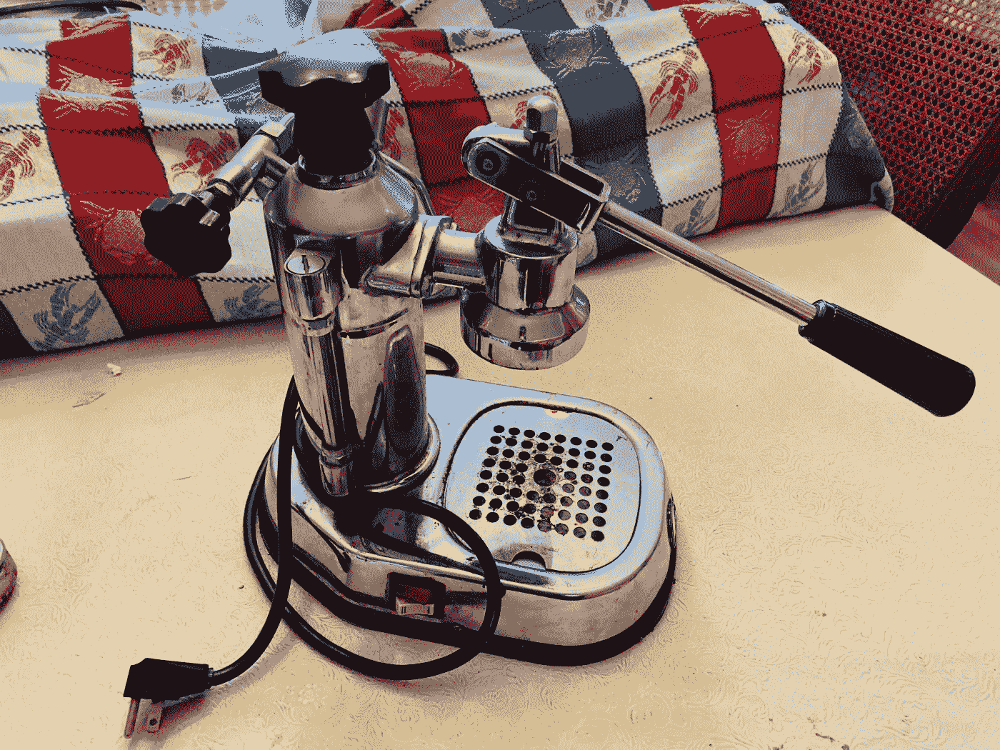
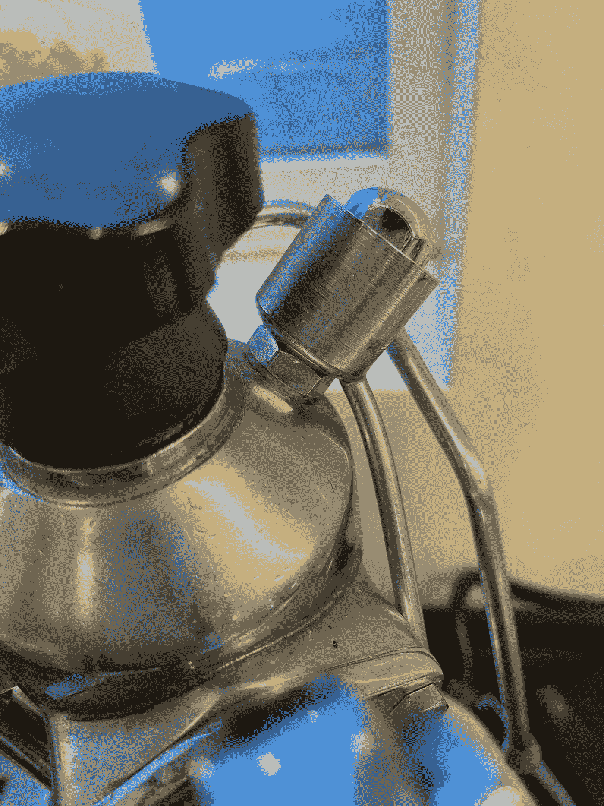
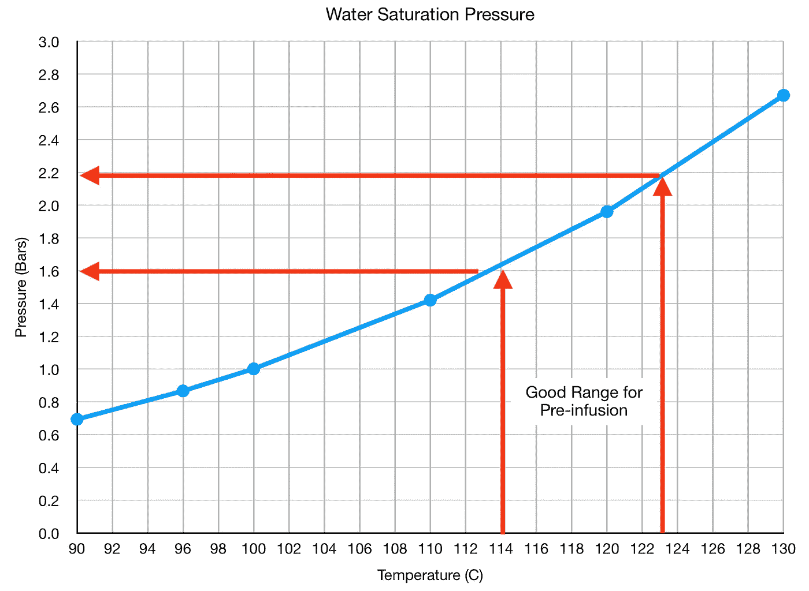
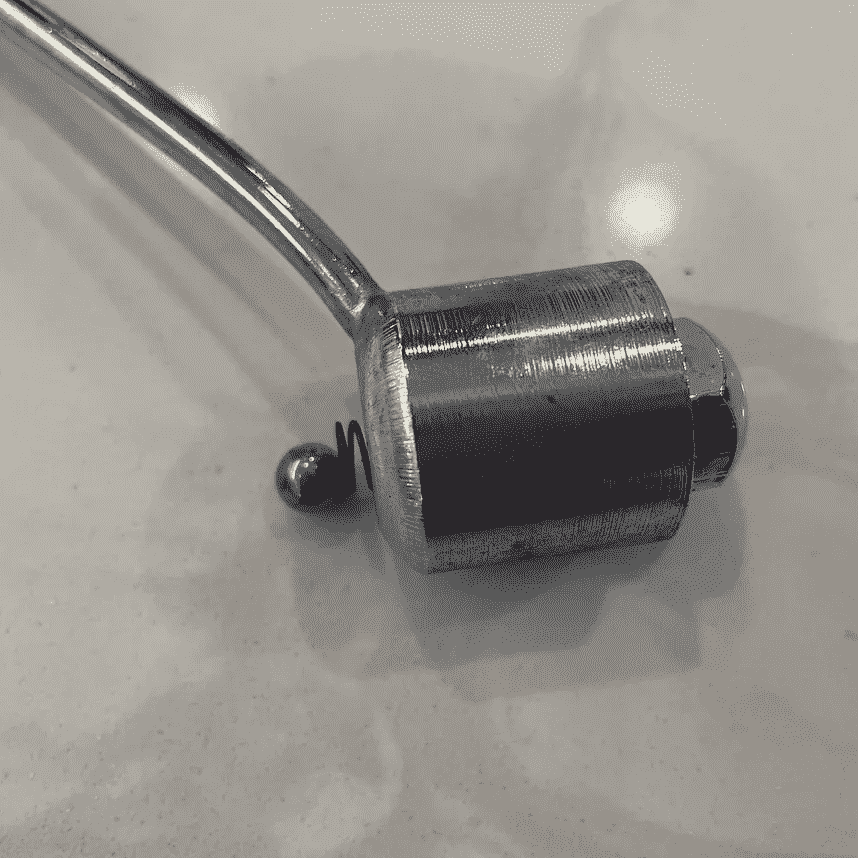
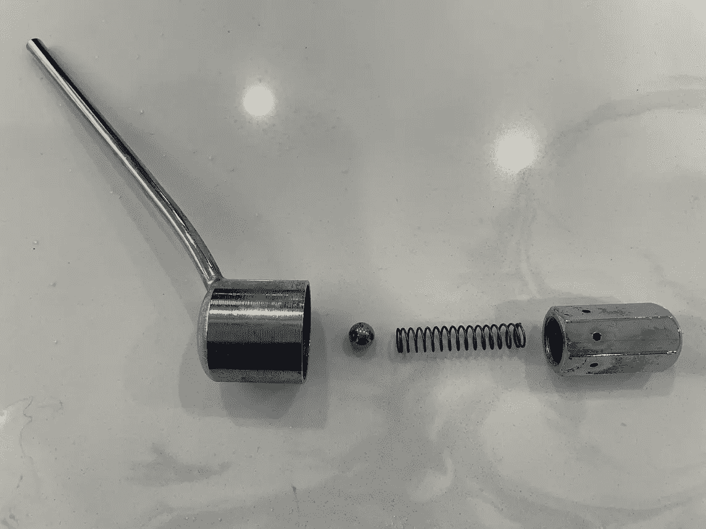
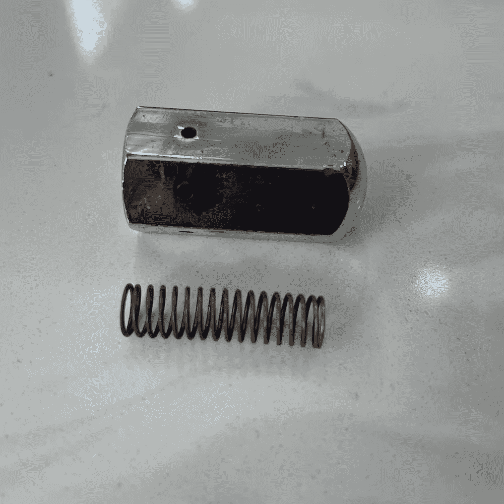
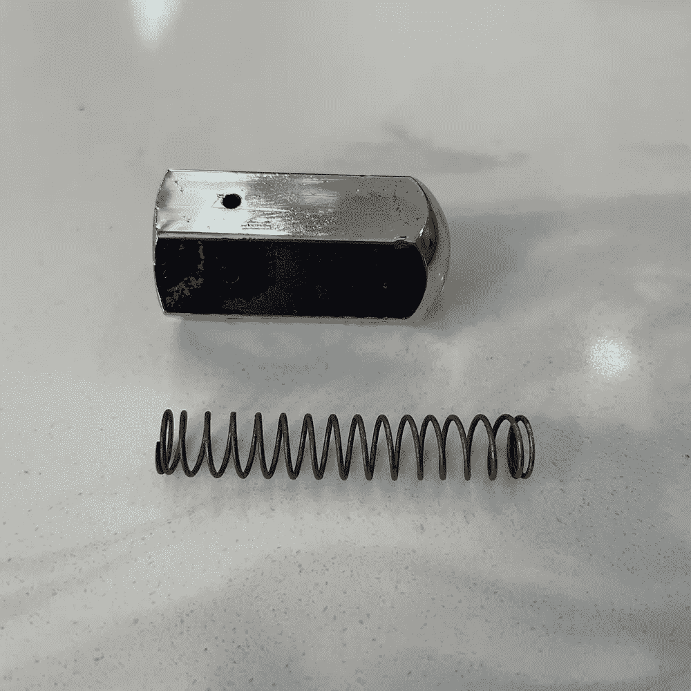
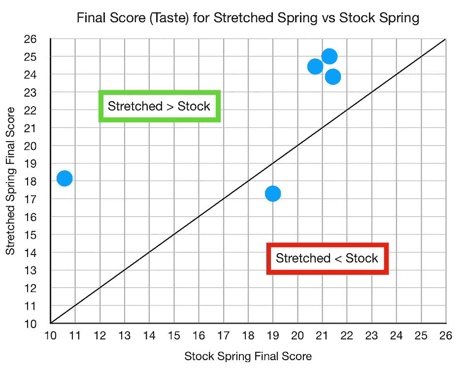
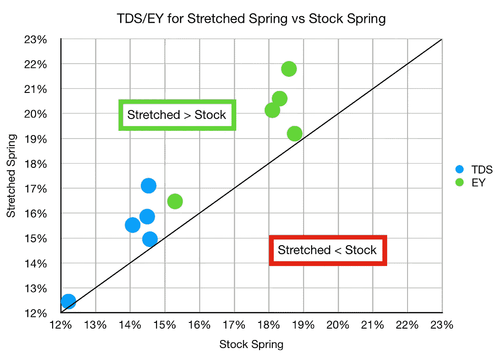

# 为拉帕沃尼增加压力:更好的浓缩咖啡

> 原文：<https://towardsdatascience.com/increasing-the-pressure-for-la-pavoni-espresso-2a8ee0febb1e?source=collection_archive---------25----------------------->

## 咖啡数据科学

## 改装一辆老爷车

自从我在我姻亲家的地下室里发现它以来，我已经拥有它 8 年了。我可以用它拍出像样的照片，但我永远也不能像在我的金快车上那样达到最佳表现。在研究了 Kim 的机器温度后，我看了看 la Pavoni，发现它受到压力释放阀的限制。

所以我修好了。

压力释放阀控制机器可以达到的最大压力和最高水温。所以我想调整阀门来提高温度。

看看水的饱和压力，或者水仍处于液态时的最高温度。锅炉里的水因为体积固定，不能完全变成蒸汽，结果温度升高，压力就升高。

当机器处于 100 摄氏度时，内部压力为 1 巴。对于 Kim Express，我发现 114℃到 123℃之间的温度提供了最好的味道和萃取，在这些温度下，压力在 1.6 到 2.2 巴之间。

当水碰到咖啡渣时，水温就下降了，所以从较高的温度开始，冲泡的温度也提高了。这是我拍摄质量的关键。这并不是说所有的咖啡和机器都应该在更高的温度下冲泡；我的咖啡是家中烘焙的，温度越高对我越好。

在阀门内部，一个弹簧支撑着一个滚珠轴承，当施加足够的压力时，滚珠释放了油箱中的压力。所以，我通过拉伸弹簧来调整阀门。

我轻轻地拉着弹簧，直到它变形。我不知道需要多大的力才能达到我想要的压力范围，但足以在弹簧释放之前达到更高的温度。

# 绩效指标

我使用两个指标来评估技术之间的差异:最终得分和咖啡萃取。

[**最终得分**](https://towardsdatascience.com/@rmckeon/coffee-data-sheet-d95fd241e7f6) 是评分卡上 7 个指标(辛辣、浓郁、糖浆、甜味、酸味、苦味和回味)的平均值。当然，这些分数是主观的，但它们符合我的口味，帮助我提高了我的拍摄水平。分数有一些变化。我的目标是保持每个指标的一致性，但有时粒度很难确定。

# 前后的表现

由于弹簧被拉伸，萃取和味道(最终得分)都增加了。我只有几个镜头可以比较，所以我没有太多的数据。然而，改装绝对允许我温度冲浪。

我也开始在金特快的范围内拍摄。

这个对浓缩咖啡机的小改进对我使用 La Pavoni 有很大的影响。我仍然可以在较低的机器温度下拍摄，但现在我不再受原始最高机器温度的限制。我比以前更喜欢这台机器了。

如果你愿意，可以在 Twitter 和 YouTube 上关注我，我会在那里发布不同机器上的浓缩咖啡视频和浓缩咖啡相关的东西。你也可以在 [LinkedIn](https://www.linkedin.com/in/robert-mckeon-aloe-01581595?source=post_page---------------------------) 上找到我。也可以关注我[中](https://towardsdatascience.com/@rmckeon/follow)和[订阅](https://rmckeon.medium.com/subscribe)。

# [我的进一步阅读](https://rmckeon.medium.com/story-collection-splash-page-e15025710347):

[浓缩咖啡系列文章](https://rmckeon.medium.com/a-collection-of-espresso-articles-de8a3abf9917?postPublishedType=repub)

[工作和学校故事集](https://rmckeon.medium.com/a-collection-of-work-and-school-stories-6b7ca5a58318?source=your_stories_page-------------------------------------)

[个人故事和关注点](https://rmckeon.medium.com/personal-stories-and-concerns-51bd8b3e63e6?source=your_stories_page-------------------------------------)

[乐高故事启动页面](https://rmckeon.medium.com/lego-story-splash-page-b91ba4f56bc7?source=your_stories_page-------------------------------------)

[摄影飞溅页](https://rmckeon.medium.com/photography-splash-page-fe93297abc06?source=your_stories_page-------------------------------------)

[使用图像处理测量咖啡研磨颗粒分布](https://link.medium.com/9Az9gAfWXdb)

[改善浓缩咖啡](https://rmckeon.medium.com/improving-espresso-splash-page-576c70e64d0d?source=your_stories_page-------------------------------------)

[断奏生活方式概述](https://rmckeon.medium.com/a-summary-of-the-staccato-lifestyle-dd1dc6d4b861?source=your_stories_page-------------------------------------)

[测量咖啡研磨分布](https://rmckeon.medium.com/measuring-coffee-grind-distribution-d37a39ffc215?source=your_stories_page-------------------------------------)

[咖啡萃取](https://rmckeon.medium.com/coffee-extraction-splash-page-3e568df003ac?source=your_stories_page-------------------------------------)

[咖啡烘焙](https://rmckeon.medium.com/coffee-roasting-splash-page-780b0c3242ea?source=your_stories_page-------------------------------------)

[咖啡豆](https://rmckeon.medium.com/coffee-beans-splash-page-e52e1993274f?source=your_stories_page-------------------------------------)

[浓缩咖啡用纸质过滤器](https://rmckeon.medium.com/paper-filters-for-espresso-splash-page-f55fc553e98?source=your_stories_page-------------------------------------)

[浓缩咖啡篮及相关主题](https://rmckeon.medium.com/espresso-baskets-and-related-topics-splash-page-ff10f690a738?source=your_stories_page-------------------------------------)

[意式咖啡观点](https://rmckeon.medium.com/espresso-opinions-splash-page-5a89856d74da?source=your_stories_page-------------------------------------)

[透明 Portafilter 实验](https://rmckeon.medium.com/transparent-portafilter-experiments-splash-page-8fd3ae3a286d?source=your_stories_page-------------------------------------)

[杠杆机维护](https://rmckeon.medium.com/lever-machine-maintenance-splash-page-72c1e3102ff?source=your_stories_page-------------------------------------)

[咖啡评论和想法](https://rmckeon.medium.com/coffee-reviews-and-thoughts-splash-page-ca6840eb04f7?source=your_stories_page-------------------------------------)

[咖啡实验](https://rmckeon.medium.com/coffee-experiments-splash-page-671a77ba4d42?source=your_stories_page-------------------------------------)