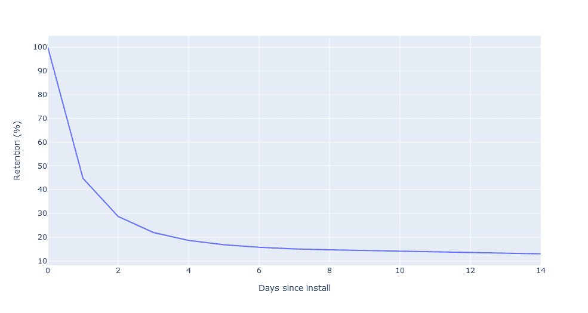

# 移动游戏开发的增量数据科学

> 原文：<https://towardsdatascience.com/incremental-data-science-for-mobile-game-development-955bb059e8a6?source=collection_archive---------14----------------------->

来源:作者

## 有条不紊地改善游戏体验，提升关键绩效指标

开发游戏常常感觉像在黑暗中四处搜寻。有时很难甚至不可能知道你下一步应该做什么来改善玩家的体验。或者如何将这些 KPI 提高一点。开发团队可能有很棒的想法，但是他们经常不确定他们应该先做哪些，或者哪些会有积极的影响。这就是数据可以派上用场的地方。

在这篇文章中，我将讨论数据科学在手机游戏开发中产生直接积极影响的三大方式。这些都是所有具备一定分析能力的手机游戏工作室可以用一款直播(或软发布)游戏做的事情。它们也可以完全离线完成，这使得它们非常适合在移动游戏工作室寻找第一个项目的数据科学家。

# 1.优化 FTUE

FTUE 是第一次用户体验；当玩家第一次启动游戏时，这是至关重要的最初时刻。所有免费游戏都有同样的弱点；因为它们免费且易于安装，所以也免费且易于卸载。我敢肯定，许多人在阅读这篇文章时会想到他们下载了一款手机游戏，但总玩时间不到一分钟就被删除了。安装了越来越多的播放器后，每一分钟都会离开。仅仅几天后安装，你的大多数球员将永远离开。

来源:作者

在此期间，任何小的不便都足以让新用户放弃你的游戏，这种影响在 FTUE 期间最为明显。

一个典型的 FTUE 会给出一步一步的指导，让玩家熟悉游戏，从而产生一个类似于这样的漏斗:

来源:作者

这是分析 FTUE 的第一次标准尝试。随着球员的离开，我们可以看到一个普遍的下降趋势，但如果有任何重大问题还不是很明显。让我们看看从一个阶段到下一个阶段的百分比变化。

来源:作者

现在用户退出 FTUE 的问题领域更清晰了。最大的下降发生在完成介绍视频之前，所以我们可以考虑改变这一点。这个结论的问题是，观看介绍视频平均需要 15 秒，比大多数其他 FTUE 步骤都要长。这可能只是因为在这个阶段有更多的用户离开，因为有更多的时间离开。让我们找出完成每个阶段的平均时间，并计算每个阶段每秒的“流失率”。

来源:作者

这个柱状图告诉了我们一个不同的故事，结合从之前的图中所学到的东西，它给了我们一些有趣的见解。玩家不只是在介绍视频中离开，因为有更多的时间离开，他们离开的速度也比其他阶段快。或许介绍视频不够精彩？也许这种游戏类型的观众只是想直接进入动作？介绍视频可能应该缩短，或者可以选择跳过，或者直接删除。

玩家在初始加载屏幕时似乎缺乏耐心，所以游戏程序员可以研究减少初始加载时间。

如果我们设法在 FTUE 的介绍视频阶段将流失率减少一半，我们可以模拟 KPI 会发生什么情况。也许可以试试前面的建议。我们在这里做了很多假设，最大的可能是，尽管视频介绍阶段的客户流失有所改善，但后期的客户流失保持不变。事实上，这是不可能的，但只是迁就我一会儿。

来源:作者

看起来不多，但我们预计即使在未来很长一段时间后，保留率也会有很大提高。这是因为一些原本会退出的用户现在会停留更长时间。例如，第 7 天的保留率从 15%上升到 15.45%，相对增加了约 2.5%。这也转化为一个可衡量的收入差异，假设每个每日活跃用户(ARPDAU)的平均收入为 0.15 美元，这在两组中保持不变。这是一个相当大的假设，在现实中也不太可能是真的，我们需要做一个现场测试来确定。请参见下文，了解我们对 100，000 名用户群体的 14 天累积收入预测变化:

来源:作者

现在，想象一下，如果我们修复了 FTUE 的其余部分，会产生怎样的影响……对一天的工作来说还不错。

识别 FTUE 问题可能是数据影响早期游戏 KPI 的最简单方法。FTUE 也是游戏开发中仅有的几个小的优化可以产生大的累积影响的地方之一。相比之下，游戏后期的优化通常需要更大的改动才能产生明显的效果。

# 2.模拟玩家流失

留存被广泛认为是免费游戏中最重要的指标[3]。正如我们之前看到的，即使是留存率的微小变化也会对其他 KPI 产生巨大影响，最终影响游戏的成功[4]。

对保留(或流失)建模是第一个机器学习项目的良好候选。然后，我们可以完全离线地解释这个模型，以识别问题，提出修复建议，并改善玩家的体验[5]。这个过程通常会导致一些有趣的和意想不到的改进建议。

基于树的模型是一个很好的选择，因为它们对我们人类来说是相对可解释的，并且它们通常表现得非常好。在这个例子中，我将基于树的 lightGBM 模型拟合到合成游戏数据中，以预测玩家在第一天(第 0 天)后流失和不再回来的概率。一旦我们的模型是合适的，我们对它的性能感到满意，我们可以使用 [SHAP](https://shap.readthedocs.io/en/latest/) [6]来绘制最重要的特征:

来源:作者

SHAP 价值观使用博弈论(数学的一个分支)的原理。简而言之，它衡量每个输入要素对模型每个输出的贡献。换句话说，SHAP 值衡量的是在有和没有每个输入要素的情况下预测的变化程度。上面我们看到了预测客户流失时每个特征的平均绝对贡献。更高的值不一定意味着更高的预测流失概率，该图只是表明每个特性的平均影响程度。这给了我们一个最关键的领域的想法，我们可以看看，以提高我们的游戏中的保留。我们还可以看到每个特性的高值或低值如何对我们的流失预测产生积极或消极的影响。

来源:作者

这里的点是个人用户，这个特性对 x 轴上的流失预测的影响。颜色表示特性的较高/较低值。一些有趣的要点:

1.  获得更多奖励的玩家流失概率要低得多。
2.  花更多时间玩游戏的玩家不太可能流失(咄)。
3.  平均 FPS 较高的玩家不太可能流失。

让我们重点关注第 3 点中强调的 FPS 问题。很明显，较高的 FPS 会降低预测的流失概率。

来源:作者

使用 SHAP 绘制每个用户，我们可以更清楚地了解 avg_fps 值如何影响预测的流失概率。在这里，我们看到 avg_fps 值超过 50 对减少预测的流失有显著影响。我们可以使用另一个输入特征给该图着色，以确定输入变量之间是否存在其他关系:

来源:作者

一个有趣的发现是，如果一个玩家的平均 fps 很低，而且他们每场游戏的死亡人数也很高，那么他们就更有可能流失。同样有趣的是，对于平均超过 30fps 的用户，这种关系开始逆转。如果他们每场游戏的死亡率更高，他们就不太可能流失。原来我们的⅓玩家平均 fps 不到 30。利用这些见解，我们可以建议开发团队尝试降低低性能设备的游戏难度，并看看是否有一些简单的方法来提高游戏的总体性能。让我们假设所有玩家都可以达到 10%的 FPS 提升(除了那些已经达到 60 FPS 上限的玩家)。然后，我们可以通过使用我们的模型来估计进行这种改进的影响:只需将我们的测试数据的 avg_fps 列乘以 1.1，然后将其输入到模型中进行预测。然后，我们可以比较这两组的平均流失预测，并将其绘制为留存/收入曲线:

来源:作者

来源:作者

因此，我们预计第 7 天的留存率将相对提高 3.6%(从 15.5%提高到 16%)，14 天后的收入将比之前的 FTUE 提高 3.3%。

这有点天真，因为我们假设平均 fps 完全独立于数据中的其他特征，而实际情况很可能并非如此。然而，这确实给了我们一个很好的估计，那就是我们希望在真正的 A/B 测试中测量的改进。通过这种方法，我们可以对游戏的几乎任何方面进行建模，确定最大的改进潜力，并生成可测试的假设，以确定做出这种改变对各种 KPI 的影响有多大。利益相关者经常发现这些数据驱动的建议非常有说服力。

# 3.普遍获得优化的 LTV 模型

除了游戏本身的改进，数据科学也有很大的机会来帮助用户获取和性能营销。UA(用户获取)通常包括指定当在特定国家的特定平台上显示广告时你愿意支付的一些 CPI(每次安装成本)。根据广告网络的不同，还有许多其他的“购买”方法，但出于教导的目的，我将坚持使用常规 CPI，因为这通常是所有其他方法的总结。主要的贡献是为 UA 经理提供早期信号和见解，使他们更好地了解广告支出在哪里是有利可图的，在哪里是不利的，同时也有助于识别具有未开发潜力的来源。这对于手机游戏来说至关重要，原因如下:

*   应用商店充斥着游戏，如果没有良好的营销，大多数玩家永远不会知道你的游戏的存在。
*   花在永远不会盈利的广告活动上只会招致损失。
*   在高投资回报率的广告活动上投入不足可能意味着次优的增长。

营销经理通常会使用历史数据来绘制一条简单的 LTV 曲线[8]，并使用它来估计某个给定日期的广告支出回报。这就是数据科学的用武之地。使用来自我们玩家早期游戏会话的数据，我们可以建立一个更复杂、更强大的模型来预测用户的长期价值。然后，我们可以将该模型应用于通过广告获得的新用户，以预测他们的长期价值，并更早地了解每个广告活动是否可能盈利。与简单的历史 LTV 曲线相比，这些模型通常对产品的变化和安装质量的波动更加稳健。

我们的 UA 经理通知我们，我们的目标是在 D90 之前在某个特定的活动中实现 100%的 roa(广告支出回报)。也就是说，她预计到第 90 天，每个每日安装群组将实现收支平衡。在我们开始活动的几天后，我们可以使用我们训练的模型来预测到目前为止该活动获得的每个用户的 D90 值。然后，我们可以将其汇总，以比较预测的 D90 ARPI(每次安装的平均收入)与每次安装的活动成本(有时称为 LTV/CAC 比率[9])。

来源:作者

这很好——我们预测的 D90 ARPI 几乎在所有情况下都高于我们的收购成本。但没有这么快，很多信息可能会在平均值中丢失，我们知道用户支出通常遵循帕累托分布。意味着极少数玩家花了大部分的钱。一些“局外”玩家可能夸大了我们的数字，所以让我们从预测数据中剔除 99%的消费者。

来源:作者

当从我们的预测中剔除前 1%的支出者时，我们的活动看起来不那么有利可图。这告诉我们，我们依赖于非常小的安装百分比来使我们的一些活动在 D90 达到收支平衡，并且由于我们通过这些活动可以获得的这些高价值用户的数量每天都在变化，我们面临着高损失风险。这很快就变成了关于风险承受能力的讨论，这是每个工作室都非常具体的，所以我不会在这里深入讨论。

因此，我们可以建议我们的 UA 经理取消法国的活动，并降低英国的 CPI，因为该国似乎是最依赖“鲸鱼”的国家，仅在 D90 达到收支平衡。澳大利亚、加拿大和瑞士是我们可以提高消费物价指数以实现更多增长的国家。

这里重要的一点是，竞选活动的表现并不固定。它会因为各种原因而改变。考虑到这一点，我们应该经常评估我们的广告活动的表现，并使用我们的模型预测 D90 ROAS，并反馈给 UA 经理进行调整。通过这样做，我们可以直接为我们的游戏带来额外的收入，然后我们可以将这些收入投入到更多的开发或额外的广告支出中，以获得更多的增长。这是我们如何利用数据将我们的游戏变成增长引擎的基础:)

## 参考资料:

[1][https://www . interaction-design . org/literature/article/first-time-use-experience-ftue-start-as-you-mean-to-go-on](https://www.interaction-design.org/literature/article/first-time-use-experience-ftue-start-as-you-mean-to-go-on)

[2][https://medium . com/Google playdev/why-the-first-ten-minutes-if-you-want-keep-to-your-mobile-game-4a 89031 b 6308](https://medium.com/googleplaydev/why-the-first-ten-minutes-is-crucial-if-you-want-to-keep-players-coming-back-to-your-mobile-game-4a89031b6308)

[3]https://supercell.com/en/news/10-learnings-10-years/7436/

[4][https://www . games industry . biz/articles/2016-09-08-1000 万美元-生产预算-避免鱼翅](https://www.gamesindustry.biz/articles/2016-09-08-usd10m-production-budgets-avoiding-the-shark-fin)

[5][https://medium . com/Google play dev/churn-acting-before-that-a 19 F6 a 680 c 09](https://medium.com/googleplaydev/churn-acting-before-its-too-late-a19f6a680c09)

[https://shap.readthedocs.io/en/latest/](https://shap.readthedocs.io/en/latest/)

[7][https://mobiledevmemo . com/why-payed-ua-is-the-primary-driver-of-discovery-for-mobile-apps/](https://mobiledevmemo.com/why-paid-ua-is-the-primary-driver-of-discoverability-for-mobile-apps/)

[8][https://quant mar . com/17/What-is-lifetime-customer-value-ltv？show=18#a18](https://quantmar.com/17/What-is-lifetime-customer-value-ltv?show=18#a18)

[9][https://mobiledevmemo.com/ltv-cpi-vs-cashflow/](https://mobiledevmemo.com/ltv-cpi-vs-cashflow/)