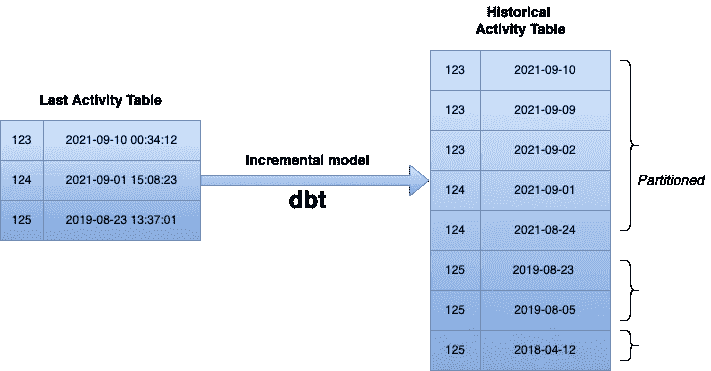

# 使用 dbt 跟踪用户活动

> 原文：<https://towardsdatascience.com/incremental-models-to-track-activity-with-dbt-7f6565b893f3?source=collection_archive---------8----------------------->

## 使用 dbt 增量模型在 Bigquery 中生成历史活动表(分时段)

在这篇文章中，我将展示如何在 **BigQuery** 中使用*增量模型*和 **dbt** 创建历史表并跟踪用户活动。如果 **dbt** 没有响铃，则检查此[物品](https://blog.getdbt.com/what-exactly-is-dbt/)。您也可以从跟随[这](https://docs.getdbt.com/docs/building-a-dbt-project/building-models/configuring-incremental-models)的增量模型开始。

好，回到我们的例子！让我简单地说一下:我们有每个用户的最后活动时间戳，现在我们想知道用户每天访问我们平台的频率。



作者图片

假设我们有一个保存每个用户最近活动的表。我们需要建立一个表来跟踪用户每天是否在我们的平台上。我们不能用当前的 **Last Activity 表**做到这一点，因为它只保存了每个用户的最新活动时间戳。

一个简单的解决方案是保留**最后活动表**的每日副本。这当然可行，但是我们会有重复的用户，特别是当他们有一段时间没有来我们的平台的时候。

让我们列出我们的要求和考虑事项:

1.  我们需要一个像`Merge`这样的操作，只保留唯一的用户行和他们的日常活动。
2.  我们可以每天至少运行一次管道，以获得每日跟踪。
3.  历史表会随着时间的推移而增长，所以让我们将它存储为一个时间单位*分区的*表，这样我们可以大幅降低成本。如果您不知道什么是分区表，请查看这个[链接](https://cloud.google.com/bigquery/docs/partitioned-tables)。

我们的管道应该每天运行，选取**最后一个活动表**，并将其插入到我们分区的**历史活动表**中，同时考虑 user_id+activity_date 的唯一性。我将一步一步地向你展示如何用 **dbt** 做到这一点。

*   创建一个文件，我把它命名为`inc_user_activity.sql`
*   让我们决定使用`SQL`查询。我们需要从**最后一个活动表**中选择所有内容，但是以每天为粒度。假设我们将我们的表称为`last_activity_table`。如果你没有引用你的表，那么用你的表名代替`{{ref('last_activity_table')}}`。然而，我强烈推荐使用 **dbt** 中的引用，如果你不知道如何做，检查一下这个[链接](https://docs.getdbt.com/reference/dbt-jinja-functions/ref)。所以不要

```
select user_id, last_activity from {{ ref('last_activity_table'}}
```

我们需要

```
select 
{{ dbt_utils.surrogate_key(['user_id',     dbt_utils.date_trunc('day','last_activity')]) }} as   user_activity_id,
user_id, 
date(last_activity) as activity_date 
from {{ ref('last_activity_table'}}
```

因为我们只需要每日粒度。如果我们让`last_activity`保持时间戳不变，那么如果用户不止一次访问，新表中就会有几行是同一天的。这就是为什么我们需要使用`dbt_utils.date_trunc('day', 'last_activity')`，以便我们将`last_activity`截断到日粒度。此外，我们的表需要一个键，它将保持`user_id`和活动日期之间的关系。我们通过`dbt_utils.surrogate_key(['user_id', dbt_utils.date_truc('day', last_activity)])`创建密钥。

*   写我们的`config`吧！我们需要定义`user_id`和`activity_date`的惟一性，我们还需要创建一个日期分区表，所以瞧:

```
{{ config(
materialized='incremental',
unique_key = 'user_activity_id',
partition_by = { 'field': 'activity_date', 'data_type': 'date' },
incremental_strategy = 'merge') }}
```

让我们花一点时间来理解我们在这里做了什么:我们告诉 **dbt** 创建一个增量模型`materialize = 'incremental'`，然后我们想要使用`user_activity_id`作为`unique_key`，正如我们在上面看到的，它是`user_id`和`activity_date`的组合。我们还需要告诉 **dbt** 创建一个分区表，所以`partition_by = {'field':'activity_date', 'data_type' = 'date'}`。最后，我们需要`merge`策略，所以如果已经有了`user_id`和`activity_date`的组合，那么就重写它，这样我们就尊重了我们的唯一性约束，但是也插入了不存在的组合。

*   现在让我们告诉 **dbt** 如何运行增量模型的查询，因此我们将需要重新定义我们的`SQL`，以便只从**最后一个活动表**中选取昨天和今天的数据，并将它们添加到您的**历史活动表**中。我这样做是为了减少查询，我们只处理昨天和今天的数据。` ... `块只为增量模型运行，因此查询将被修改以添加`where`条件，从而只过滤今天和昨天的数据。

```
select 
{{ dbt_utils.surrogate_key(['user_id',     dbt_utils.date_trunc('day','last_activity')]) }} as   user_activity_id, 
user_id, 
date(last_activity) as activity_date from {{ ref('last_activity_table'}}and date_diff(current_date(), date(last_activity), DAY) <= 2
```

好了，这里我将把我上面描述的整个过程放在一起，这样你就可以简单地将它复制粘贴到你的 **dbt** 文件中，并进行适当的调整！

```
{{ config(
materialized='incremental',
unique_key = 'user_activity_id',
partition_by = { 'field': 'activity_date', 'data_type': 'date' },
incremental_strategy = 'merge') }}select 
{{ dbt_utils.surrogate_key(['user_id',     dbt_utils.date_trunc('day','last_activity')]) }} as   user_activity_id, 
user_id, 
date(last_activity) as activity_date from {{ ref('last_activity_table'}}and date_diff(current_date(), date(last_activity), DAY) <= 2
```

总之， *dbt 不仅可以用于转换数据以创建分析模型，还可以用于生成历史数据！*源自 OLTP 源的表可能并不总是保留历史数据，因此您可以使用 **dbt** 的强大功能来构建增量模型并对其进行正确调优，以开始跟踪历史，而不是每天都保留完整的快照。此外，考虑您的表将如何扩展，因此时间分区，尤其是对于事件数据，从长远来看将会挽救您的生命。

这都是我送的！如果你想了解更多关于分区的内容，可以看看这篇很棒的帖子[https://discourse . get dbt . com/t/big query-dbt-incremental-changes/982](https://discourse.getdbt.com/t/bigquery-dbt-incremental-changes/982)