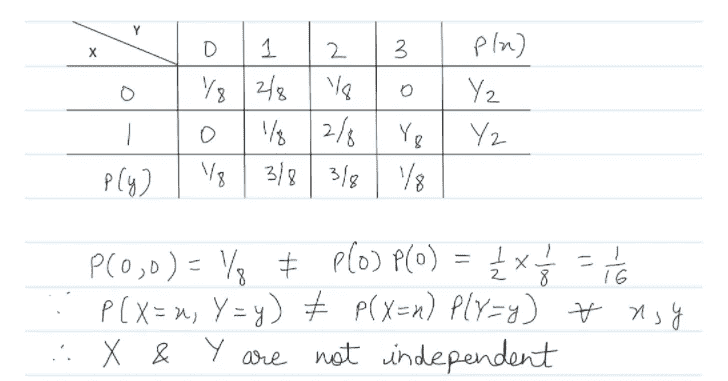
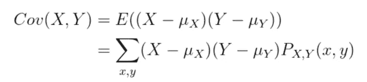
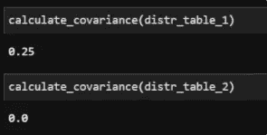
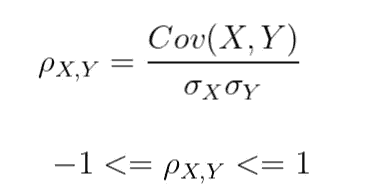
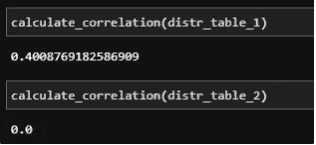

# 两个随机变量之间的独立性、协方差和相关性

> 原文：<https://towardsdatascience.com/independence-covariance-and-correlation-between-two-random-variables-197022116f93?source=collection_archive---------2----------------------->

马库斯·斯皮斯克在 [Unsplash](https://unsplash.com?utm_source=medium&utm_medium=referral) 上的照片

在本文中，我将讨论两个随机变量之间的独立性、协方差和相关性。这些是统计学中的基本概念，在数据科学中非常重要。

# 介绍

让我们用一个例子从随机变量的简单定义开始。

# 随机变量

随机变量，通常写成 *X* ，定义为一个变量，其可能值是随机现象的数值结果[1]。给定样本空间 **S 的随机实验，**随机变量 ***X*** 是一个集合函数，它为属于样本空间**S**【2】**的每个元素 ***s*** 分配一个且仅一个实数。**

随机变量的一个例子可以是掷硬币，其结果可以是正面(H)或反面(T)。因此，样本空间为:

**S = {H，T}**

我们可以将随机变量 X 定义如下:

*   让 X = 0 代表正面
*   让 X = 1 表示尾部

注意，随机变量给样本空间(H 和 T)的每个样本分配一个且仅一个实数(0 和 1)。在这种情况下，X 的支撑或空间是{0，1}。

# 概率质量函数[2]

离散随机变量 X 取特定值 X 即 P(X=x)的概率用 *f(x)* 表示，称为概率质量函数(p.m.f .)。它被称为连续随机变量的概率密度函数。pmf 是离散随机变量的概率分布，提供可能的值及其相关概率[3]。它被定义为:

p(x) = P(X=xᵢ)

p(x)有一个性质，与所有可能值相关联的概率必须是正的，并且总和为 1。

现在我们有了关于随机变量和 pmf 的背景，我们将看看独立性，协方差和相关性。

# 随机变量的独立性

如果 X 和 Y 是两个随机变量，并且 X 的分布不受 Y 的取值影响，反之亦然，则称这两个随机变量是独立的。

在数学上，两个离散的随机变量是独立的，如果:

P(X=x，Y=y) = P(X=x) P(Y=y)，对于所有的 X，Y。

直观地说，对于独立的随机变量，知道其中一个变量的值，不会改变另一个变量的概率。X 和 Y 的联合 pmf 仅仅是 X 和 Y 的个体边缘化 pmf 的产物。

让我们解决一个示例问题，以更好地理解如何使用该公式。假设我们有两个随机变量 X 和 Y，它们的联合概率是已知的。它可以表示为一个表格，如下所示。X 的边缘化 pmf 值可以通过对所有 Y 值求和来获得[5]。对于 y 也可以进行类似的边缘化。在联合 pmf 表中，它只对应于对列求和。联合 pmf 表以及边际 pmf 值如下所示:

来源:作者

为了使两个随机变量独立，联合 pmf 的单元条目应该等于求和行和列中表示的边缘化 pmf 值的乘积，即 P(X=x，Y=y) = P(X=x) P(Y=y)，对于所有 X，Y。

如果这种关系对于 x，y 对中的任何一个都不成立，那么这两个随机变量就不是独立的。所以在我们的例子中，这些对不是独立的。

下面是从分布表创建边际 PMF 的代码。(注意，它没有经过任何优化。)

然后使用边际 PMF 来检查独立性:

我们看两个例子，一个是独立的，另一个不是。

我们从两个表中得到预期的关系:

来源:作者

# 协方差

协方差是两个随机变量的联合可变性的度量[5]。它显示了两个随机变量之间的线性相关程度。正协方差意味着存在直接的线性关系，即一个变量的增加对应于另一个变量的更大值。负协方差意味着一个随机变量的值越大，另一个随机变量的值越小。因此，协方差的符号显示了两个随机变量之间线性关系的性质。最后，对于两个独立的随机变量，协方差为零。然而，零协方差并不意味着两个随机变量是独立的。

协方差的大小取决于变量，因为它不是一个标准化的措施。因此，这些值本身并不能清楚地表明线性关系有多强。

协方差的公式为:

来源:作者

注:E(X)是随机变量的期望值。你可以在这里了解更多:[https://en.wikipedia.org/wiki/Expected_value](https://en.wikipedia.org/wiki/Expected_value)

除了知道联合 pmf 的值，我们还需要 X 和 Y 的平均值来计算协方差。以下函数计算分布表的协方差。

我们两个测试案例的协方差是:

来源:作者

我们确认独立情况下的协方差为零。而我们看到非独立测试用例的正协方差。这表明当 X 增加时，Y 也会增加。

最后，让我们看看相关性。

# 相互关系

相关性只是协方差的缩放/标准化版本，因此值介于-1 到 1 之间。分别使用 X 和 Y 的标准偏差进行归一化。

来源:作者

自变量同时具有零协方差和相关性。相关值为 1 意味着与正的线斜率完全相关。而相关性为-1 意味着与负的线斜率完全反相关。

为了计算相关性，除了计算协方差之外，我们还需要计算 X 和 X 的标准差。

我们的测试用例的相关性是:

来源:作者

正如所料，我们得到了与协方差相同的相关性。独立测试用例具有零相关性。而具有正协方差的测试用例具有低于 1 的正相关性。

还有一件事，需要注意的是，协方差/相关性并不意味着因果关系，即 X 与 Y 相关并不意味着 X 是 Y 的原因。 [Seema Singh](https://medium.com/u/a1a9e99dd9df?source=post_page-----197022116f93--------------------------------) 就此写了一篇很棒的文章:[https://towardsdatascience . com/why-correlation-does-not-implie-causance-5b 99790 df 07 e](/why-correlation-does-not-imply-causation-5b99790df07e)

# 结论

最后，我们看了什么是随机变量，什么是概率密度函数。之后，我们讨论了两个随机变量的独立性。最后，我们将协方差和相关性作为度量两个随机变量之间线性相关性的标准。后者只是前者的标准化版本。

# 参考

[1]http://www.stat.yale.edu/Courses/1997-98/101/ranvar.htm

[2][https://online.stat.psu.edu/stat414/lesson/7/7.1](https://online.stat.psu.edu/stat414/lesson/7/7.1)

[https://en.wikipedia.org/wiki/Probability_mass_function](https://en.wikipedia.org/wiki/Probability_mass_function)

[4][https://www . math . UMD . edu/~ millson/teaching/stat 400 fall 18/slides/article 16 . pdf](https://www.math.umd.edu/~millson/teaching/STAT400fall18/slides/article16.pdf)

[https://en.wikipedia.org/wiki/Marginal_distribution](https://en.wikipedia.org/wiki/Marginal_distribution)

[https://en.wikipedia.org/wiki/Covariance](https://en.wikipedia.org/wiki/Covariance)