# 独立成分分析

> 原文：<https://towardsdatascience.com/independent-component-analysis-ica-a3eba0ccec35?source=collection_archive---------3----------------------->

## 发现数据中隐藏的因素

这是关于主成分分析(PCA) 和独立成分分析(ICA) 的两部分系列文章的最后一篇。虽然技术是相似的，但它们实际上是不同的方法，执行不同的任务。在这篇文章中，我将提供 ICA 的高级介绍，将其与 PCA 进行比较，并给出一个使用 ICA 从 EEG 数据中去除眨眼伪迹的例子。

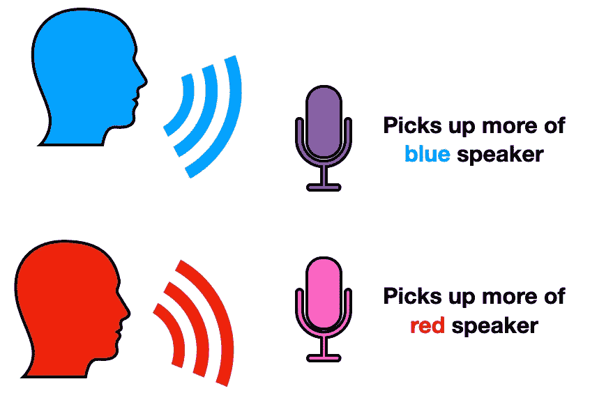

“鸡尾酒会问题”的最简单版本。图片作者。

# 国际通信机构(International Communications Agency)

用来描述 ICA 的标准问题是“鸡尾酒会问题”。最简单的形式，想象两个人在一个鸡尾酒会上进行对话(就像上面的红色和蓝色发言者)。不管出于什么原因，你在两个参加聚会的人附近都放置了两个麦克风(就像上面的紫色和粉色麦克风)。根据人和麦克风之间的距离，*两个*麦克风以不同的音量听到两种声音。换句话说，我们录制了两个文件，其中包括两个派对参与者混合在一起的音频。接下来的问题是，我们如何分离每个文件中的两个声音，以获得每个说话者的独立录音？

这个问题很容易用独立分量分析(ICA)来解决，独立分量分析将一组向量转换成一个最大独立的集合。回到我们的“鸡尾酒会问题”，ICA 会将两个混合音频录音(由下面的紫色和粉红色波形表示)转换为每个单独扬声器的两个非混合录音(由下面的蓝色和红色波形表示)。请注意，**输入和输出的数量是相同的**，由于输出相互独立，因此没有明显的方法像**主成分分析(PCA)** 那样丢弃成分。

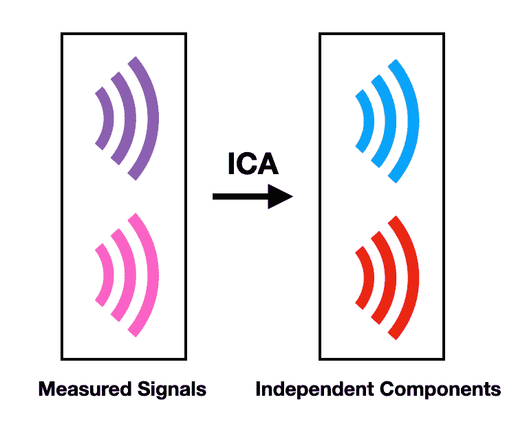

利用独立分量分析将混合信号转换为独立分量。图片作者。

## 它是如何工作的

ICA 中有两个关键假设**。我们试图揭示的隐藏独立成分必须是一个，**统计独立**，和两个，**非高斯**。语义上，我说的独立是指关于 x 的信息不会给你关于 y 的信息，反之亦然。从数学上来说，这意味着，**

****

**统计独立性的数学定义。图片作者。**

**其中 *p(x)* 表示 x 的概率分布。 *p(x，y)* 表示 x 和 y 的联合分布。非高斯假设只是意味着独立分量具有非高斯分布，这意味着它看起来不像钟形曲线。**

****

**非高斯性是 ICA 的一个关键假设。图片作者。**

**第一个假设是 ICA 的起点。我们想理清信息，得出一组独立的因素。如果没有多个独立的信息生成者需要发现，那么就没有必要使用 ICA。例如，想象使用 ICA 解决“鸡尾酒会问题”，但是只有一个参加聚会的人。我们可以称之为 COVID 生日派对问题。这没什么意义。**

**第二个假设的必要性在于数学。ICA 使用**非高斯**的思想来揭示独立组件。非高斯性**量化了随机变量的分布*与*偏离高斯分布**的程度。非高斯性的示例度量是峰度和负熵。从**中心极限定理**中可以看出这种方法为什么有用。具体地说，一个结果表明，两个独立随机变量之和的分布比任何一个原始变量更接近高斯分布。ICA 结合了这一思想、非高斯度量和非高斯假设来揭示隐藏在数据中的独立成分。**

**为了说明这一点，考虑具有两个变量 **x_1** 和 **x_2** 的数据集。这些变量作为定义空间的基础，即我们可以用它们在二维空间中绘制点。假设，我们知道数据背后的两个独立分量，**S1，**和**S2**。这两个组件作为描述同一空间的替代基础。因此，这个空间中的任何一点 **y** 都可以写成变量**x1**和**x2**或者分量**S1**和**S2**的线性组合。**

**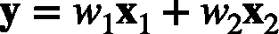**

**测量信号的线性组合，即输入变量。图片作者。**

**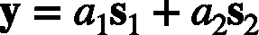**

**独立分量的线性组合。图片作者。**

**回到中心极限定理，两个随机变量之和的分布将*比任一单个变量更高斯*。因此，当 a1 和 a2 都不为零时， **y** 的分布将是比**S1**或**S2**更高斯的*。反之，如果 a_1 或 a_2 为零，那么 **y** 的分布将比前一种情况少*高斯分布*。并且，如果 **s_1** 和 **s_2** 的非高斯假设成立，那么它将根本不是高斯的，因为 **y** 将正好等于其中一个独立分量！***

**换句话说， **y** 的非高斯性在与其中一个独立分量成正比时达到最大。这使得我们可以将 ICA 框架作为一个优化问题。举个例子，**

**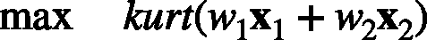**

**将 ICA 框架化为单个独立分量的优化问题。图片作者。**

**其中我们希望找到使我们已知输入变量的线性组合的峰度最大化的 w1 和 w2 的值。w1 和 w2 的这些最佳值将定义一个独立的分量。**

**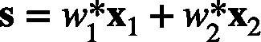**

**ICA 优化问题的解决方案定义了独立分量。**

**更一般地，我们可以求解权重矩阵 **W** ，这使得 **W** 和数据矩阵 **X** 的矩阵乘法的非高斯性最大化。**

****

**将 ICA 框架化为多个独立分量的优化问题。图片作者。**

## **要点**

**我可能又一次在数学领域走得太远了。作为总结，我将强调 ICA 的三个关键点:**

*   **输入的数量等于输出的数量**
*   **假设独立成分在统计上是独立的**
*   **假设独立分量是非高斯的**

# **主成分分析与独立成分分析**

**在继续举例之前，我将简单比较一下 PCA 和 ICA。尽管这两种方法看似相关，但它们执行不同的任务。具体来说， **PCA** 常用于**压缩信息**即降维。而 **ICA** 旨在**通过将输入空间转换成最大独立基来分离信息**。两种方法的共同点是要求输入数据**自动缩放**，即**减去每一列的平均值，然后除以其标准偏差**。这就是为什么 PCA 通常是在执行 ICA 之前做的一件好事的原因之一。**

**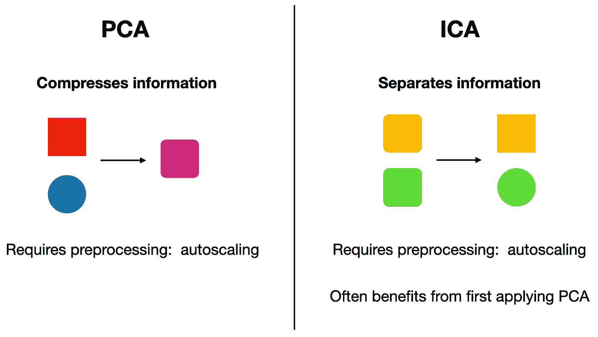**

**主成分分析和独立成分分析的比较。图片作者。**

**</principal-component-analysis-pca-79d228eb9d24>  

# 示例:从 EEG 中去除眨眼

一如既往，我将以一个具体的实例来结束我的发言。在这个例子中，我将使用 ICA 从 EEG 数据中移除眨眼伪迹，代码可在 GitHub 的<https://github.com/ShawhinT/YouTube/tree/main/ica>**库中找到。**

**脑电图(EEG)是一种测量大脑产生的电活动的技术。EEG 的一个主要缺点是它对运动和其他非脑伪像的敏感性。每当参与者眨眼时，就会出现这样的假象。在下图中，通过 Fp1 电极(靠近头部前方)的电压-时间图中的尖峰可以清楚地看到眨眼伪影。**

**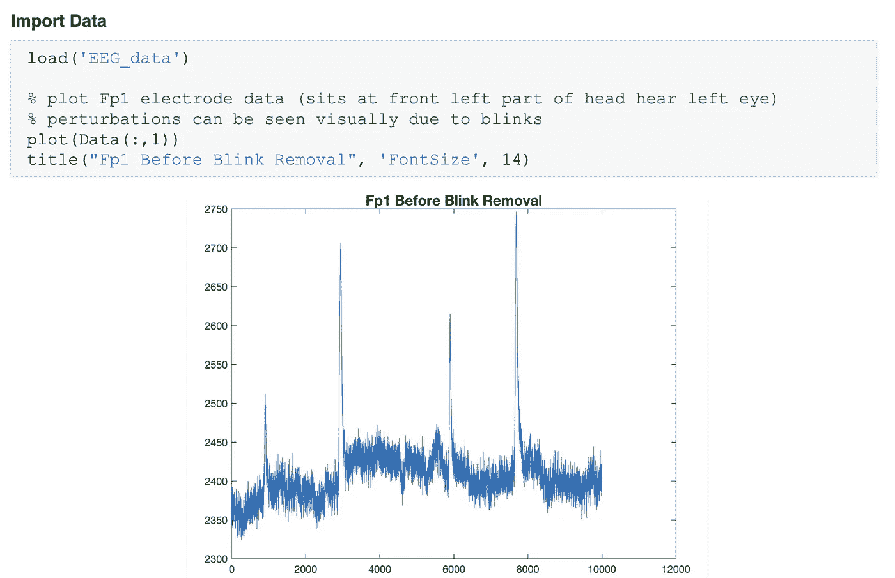**

**导入数据并绘制 Fp1 电压与时间的关系。图片作者。**

**使用 ICA 的第一步是首先对数据集执行 PCA。在 Matlab 中用函数 *pca()* 很容易做到这一点。我要在这里指出，自动缩放数据至关重要。这在 *pca()* 功能中自动完成。此外，这里我们从对应于随时间测量的 64 个 EEG 电极电压的 64 列开始。在 PCA 之后，我们剩下 21 列，对应于 21 个得分向量，即主成分。**

**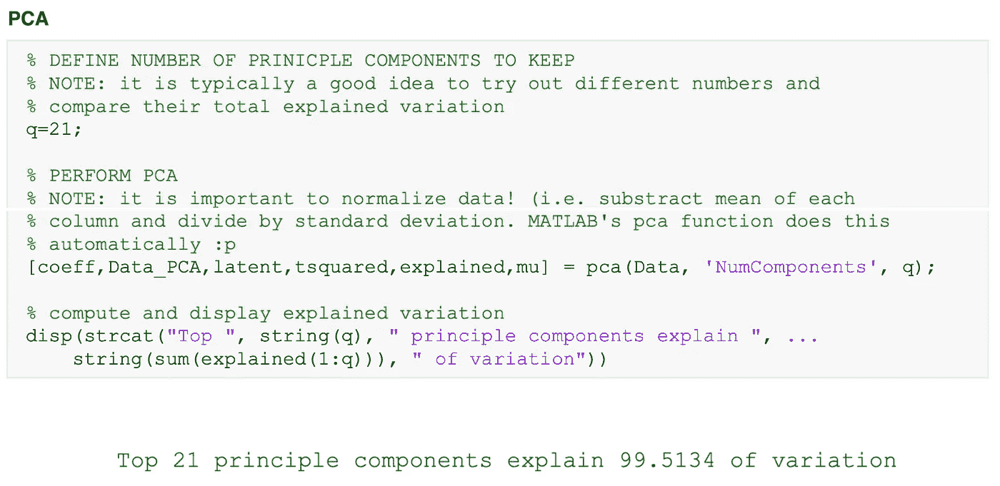**

**将 PCA 应用于数据集的代码。图片作者。**

**接下来，我们可以训练 ICA 模型，并将其应用于 PCA 得分矩阵。**

**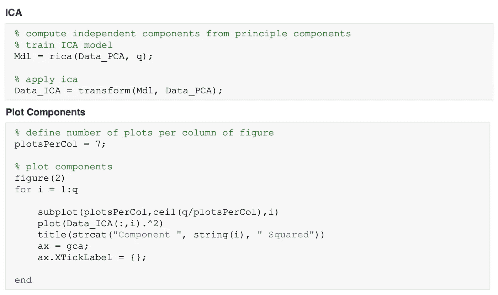**

**将 ICA 应用于主成分的代码。图片作者。**

**绘制独立组件，我们可以检查哪些组件对应于闪烁伪像。**

**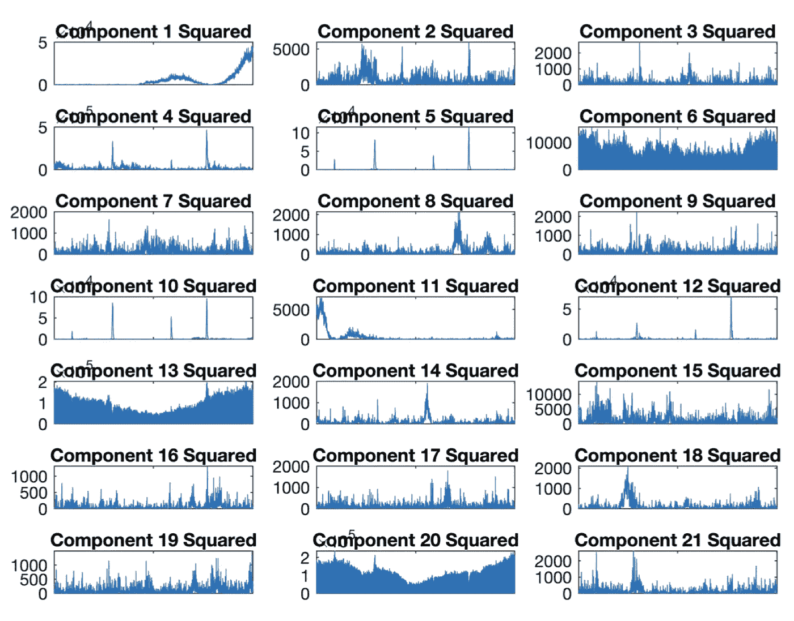**

**21 个独立成分的平方图。图片作者。**

**我使用一种惰性试探法来挑选出代表眨眼信息的独立成分。也就是说，挑选有 4 个主峰的分量。剩余的分量可以用于重建原始数据集，而不需要来自这些眨眼分量的信息。**

**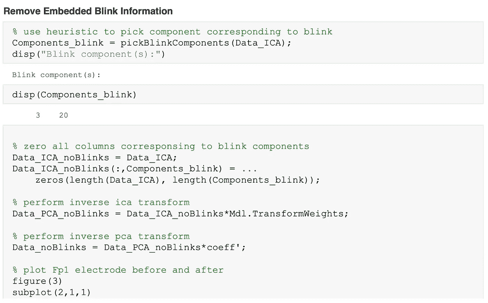**

**挑选出与眨眼无关的成分并重建脑电图数据的代码。图片作者。**

**最后，我们绘制了 Fp1 电极的原始和最终电压随时间的变化图。**

**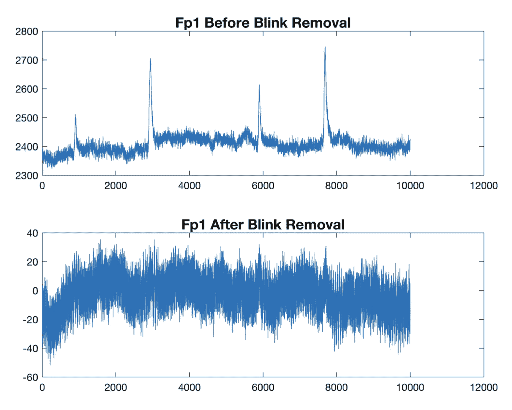**

**消除闪烁前后的 Fp1 信号。**

# **结论**

****独立成分分析(ICA)** 通过将一组变量转换为一个最大程度独立的新集合，提取数据中的隐藏因素。ICA 依赖于非高斯性的度量来完成这项任务。 [**主成分分析**](/principal-component-analysis-pca-79d228eb9d24) 和 **ICA** 针对不同的目标，即前者压缩信息，后者分离信息。尽管它们有所不同，但使用 PCA 作为 ICA 的预处理步骤通常是有帮助的。这种技术组合在金融分析和神经科学等领域都有应用。**** 

# ****资源****

******本系列更多** : [主成分分析](/principal-component-analysis-pca-79d228eb9d24) | [GitHub 回购](https://github.com/ShawhinT/YouTube/tree/main/ica)****

******连接** : [我的网站](https://shawhint.github.io/) | [预定电话](https://calendly.com/shawhintalebi) | [消息我](https://shawhint.github.io/connect.html)****

******社交**:[YouTube](https://www.youtube.com/channel/UCa9gErQ9AE5jT2DZLjXBIdA)|[LinkedIn](https://www.linkedin.com/in/shawhintalebi/)|[Twitter](https://twitter.com/ShawhinT)****

******支持** : [给我买杯咖啡](https://www.buymeacoffee.com/shawhint?source=about_page-------------------------------------) ☕️ | [成为会员](/membership?source=about_page-------------------------------------) ⭐️****

****<https://shawhin.medium.com/membership> **** 

******【1】hyvrinen A，Oja E.** 独立成分分析:算法与应用。神经网络。2000;13(4–5):411–430.doi:10.1016/s 0893–6080(00)00026–5****