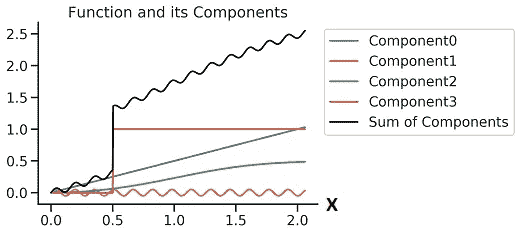
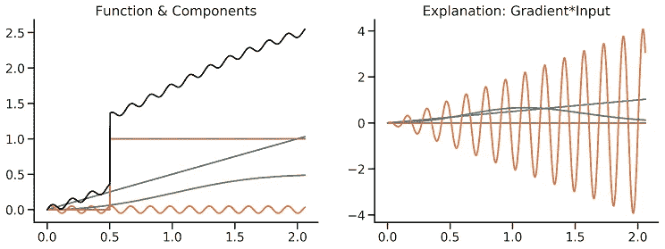
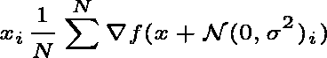
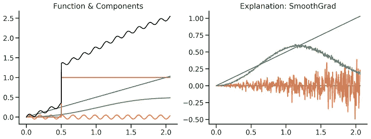
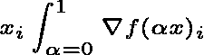
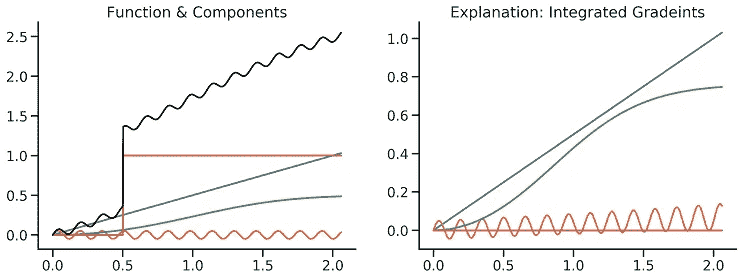

# 深度:用梯度解释 DNNs

> 原文：<https://towardsdatascience.com/indepth-explaining-dnns-with-gradients-2bb148a30ba0?source=collection_archive---------40----------------------->

## 梯度，平滑梯度和综合梯度作为机器学习的解释，解释

基于梯度的解释或解释方法是用于解释深度神经网络(DNN)决策的最简单且通常有效的方法之一。原则上，它们可以用于任何可微分模型和任何类型的输入。在本文中，您将了解使用梯度来解释决策的不同方法，尤其是要注意的陷阱。

我们将研究局部归因方法，给定一个输入，给该输入的每个维度分配一个分数。该分数表明维度对于我们从模型中获得的输出有多重要。

作为一个跑步玩具的例子，我们将有如下的设置:一组四个简单的函数，所有加起来形成我们要解释的“预测函数”。我们将使用基于梯度的方法来解释在给定任何输入 x 的情况下，这些分量函数中哪一个对输出更重要。

黑色:要解释的函数。所有其他颜色都是它的组成部分。

即使我们在这个简单的运行示例中没有使用 DNN，以下技术也可以 1:1 用于任何可微分模型。(事实上，我们甚至可以尝试训练四个独立的 dnn 来逼近分量函数，并对它们的输出求和。)

我选择了组件函数来说明下面基于梯度的方法的某些缺点。分量函数是线性函数、正弦函数、阶跃函数和适应的 [sigmoid](https://en.wikipedia.org/wiki/Sigmoid_function) 函数。所有函数都依赖于同一个一维 x。

注意，我们要解释的函数的输出值最强烈地依赖于线性分量和阶跃函数。总体来说，鼻窦大部分是噪音。

# **渐变*输入**

先从[(输入-)渐变](/the-many-uses-of-input-gradient-regularization-e2af244e6950)作为解释方法 [Baehrens et al.](http://is.tuebingen.mpg.de/fileadmin/user_upload/files/publications/baehrens10a_%5b0%5d.pdf) 说起。梯度是输出 wrt 的导数。输入端。这意味着，对于输入的任何微小变化，梯度告诉我们输出将如何变化。如果梯度较大，则输入尺寸的微小变化会对输出产生较大影响，如果梯度较小，影响也会较小。

这意味着，对于我们想要解释的输入周围的小区域，我们可以用每个输入的单个数字(梯度)来完美地表达改变输入的效果。这正是我们想要的！

我们可以将梯度*输入解释写成:

梯度*单一输入尺寸的输入。

这里的 x 是我们的输入特征。我们将每个梯度与相关的特征相乘，因为我们希望属性只有在特征也存在于数据中时才是大的，如果特征很小(即使它是一个重要的特征)时才是小的。

如果我们计算 x 的梯度一次，然后把它们当作常数，上面的公式就是一个线性函数。这很好，因为这意味着我们已经将网络的复杂性降低到一个简单的加权和，其中权重是我们的特征重要性。(注意:如果你试图解释一个线性模型而不是 DNN，你的模型在某种意义上已经是可解释的了。)

缺点是这个函数比我们最初的组件总和要简单得多，所以它不能忠实地代表网络实现的整个决策函数。但是，在本地，在这个特定输入周围的小邻域中，我们可以说这些权重确实代表了每个特征的重要性。即使我们不能保证这一点，如果我们的模型代表的函数是简单的，那么对于某些目的，梯度可能是决策函数的一个很好的近似。

梯度非常方便，因为它们可以在像 [pytotch](https://pytorch.org/) 和 [tensorflow](https://www.tensorflow.org/) 这样的框架中轻松自动地计算出来，而且由于它们对深度学习如此重要，这些实现非常高效和快速。这意味着你可以即时计算你的解释，而不需要大量的计算。

左:待解释的功能。右图:所有 x 的渐变*输入属性。

该图显示了每个分量函数和每个输入 x 的梯度*输入属性。如果线高，则意味着根据我们的解释，相应的函数对于输出高是非常重要的。我们可以清楚地看到简单梯度的弱点作为解释:虽然它是局部正确的(对于 x 的一些区域，正弦比其他函数更陡)，但它错过了全局画面，即我们的函数主要依赖于线性部分和阶跃函数。

除了 0.5 之外，阶跃函数在任何地方都是平坦的，因此它没有倾斜度，因此也没有梯度。我们不能用梯度*输入来解释它的效果。

sigmoid 函数在 0 和 1 附近比较平坦，所以梯度也小。

显然，gradient*input 在这种设置下不能很好地工作，即使这种简单的方法也可以在不太病态的情况下工作。

现在你可能会想:如果我想知道输入的较大变化会有什么影响，渐变对我有什么帮助？不要烦恼！有一些方法建立在简单的输入梯度上，但是给你一个更“全局”的函数图像。

# **SmoothGrad**

可能最直接的补充是 SmoothGrad (SG) [ [Smilkov 等人](https://deepai.org/publication/smoothgrad-removing-noise-by-adding-noise)。当你改变输入时，复杂函数的梯度变化非常快(想想我们的正弦函数)。顾名思义，SG 试图消除梯度中的这些凸起。它只需多次计算输入梯度，每次都会在输入中加入一点点噪声:

单一输入维度的 SmoothGrad。

实际上，我们对与我们想要解释的输入非常相似的许多输入的梯度进行平均。这个想法是梯度函数的不平度将达到平均，我们只剩下输入空间的这个区域中梯度的总体趋势。通过增加更多的样本和更大的噪声，我们可以使这种方法任意全局，但也增加了计算时间。

左:待解释的功能。右图:所有 x 的 SmoothGrad 属性。

在该图中，计算了 50 个噪声梯度，并对每个 x 取平均值。尽管我们没有恢复出真正的重要性比例，但这已经比单一梯度好得多:很明显，线性函数比正弦函数更重要，但我们仍然对 sigmoid 和阶跃函数有困难。我们可以通过使用超参数得到更好的结果。

# **综合渐变**

在许多情况下，我们在输入空间中有一些参考点，在那里我们可以说根本“没有信息”，任何改变只是增加了信息。例如，在图像处理中，一片漆黑或平均值图像经常被用作这样的参考点。在这种情况下，我们只对我们的输入给参考输入增加了什么信息感兴趣(根据我们的 DNN)。集成梯度(IG) [ [Sundararajan 等人](https://arxiv.org/abs/1703.01365) ]沿输入和参考点之间的最短路径(直线)集成梯度。如果我们将参考点设置为 x=0，这在我们的玩具示例中是合适的，因为此时没有相关的函数，公式简化为:

单一输入维度的集成渐变。

沿着这条路径，通过平均多个样本(梯度评估)来近似地完成积分。我们可以通过采集更多的样本来提高解释的质量。

左:待解释的功能。右图:所有 x 的集成渐变属性。

对于这个玩具例子，我们的参考点在 x=0，这里我们的输出也是 0。我们可以近似地恢复具有任何梯度信息的所有分量的相对重要性，即使每个输入 x 只有 30 个样本！甚至 sigmoid 函数也得到了正确的归属，因为要解释的 x 和 0 之间的所有梯度都被考虑在内。尽管这些解释已经很好了，但增加样本数量会导致更准确的解释，例如消除正弦解释中的轻微倾斜。

这个结果并不意味着积分梯度一定会打败 SG，但是如果我们知道一个 0-信息输入是什么样子，我们不妨试一试。

注意，我们还不能解释阶跃函数的作用，因为它的梯度是 0 或者到处都是未定义的。不依赖于梯度信息的解释方法，如[遮挡分析](https://cs.nyu.edu/~fergus/papers/zeilerECCV2014.pdf)或[沙普利值](https://proceedings.neurips.cc/paper/2017/hash/8a20a8621978632d76c43dfd28b67767-Abstract.html)对于识别阶跃函数的影响是必要的。

# **外卖:**

基于梯度的方法，如梯度*输入、平滑梯度或综合梯度，是基于输入的微小变化如何改变输出(也称为梯度)，这引入了两个问题:

1.  *复数* f(x):如果要解释的函数随 x 变化非常快，那么输入梯度将只对我们输入周围非常小的范围有意义。SG 和 IG 通过平均许多梯度来提供解决方案，以获得较少的局部解释。
2.  *平坦* f(x):如果要解释的函数随 x 的局部变化很小，那么它只会产生一个很小的梯度。IG 通过考虑到 0-信息输入的最短路径上的所有梯度来解决这个问题，但是我们必须记住，在局部和全局精确的解释之间总是有一个折衷。
3.  *零梯度 f(x)* :如果根本没有梯度，我们就不能指望基于梯度的方法起作用。幸运的是，这个问题实际上从来没有发生过，至少如果你使用的是 DNNs。

# **我还可以使用哪些方法？**

基于梯度方法的其他变体也存在，如 [VarGrad](https://export.arxiv.org/pdf/1806.03000) 和 [SG-SQ](https://papers.nips.cc/paper/2019/file/fe4b8556000d0f0cae99daa5c5c5a410-Paper.pdf) ，但它们相当奇特，没有被社区广泛采用。

除了最简单和最容易实现的基于梯度的解释方法之外，还有很多(也更复杂)的方法试图克服基于梯度的方法的缺点。我已经在本文中列出了一些最受欢迎的方法，但是研究人员每个月都在试图提出更好的方法，所以这个列表远非详尽无遗。关于最近的调查，请看[这里](https://deepai.org/publication/a-survey-on-neural-network-interpretability)。

希望你学到了有用的东西！