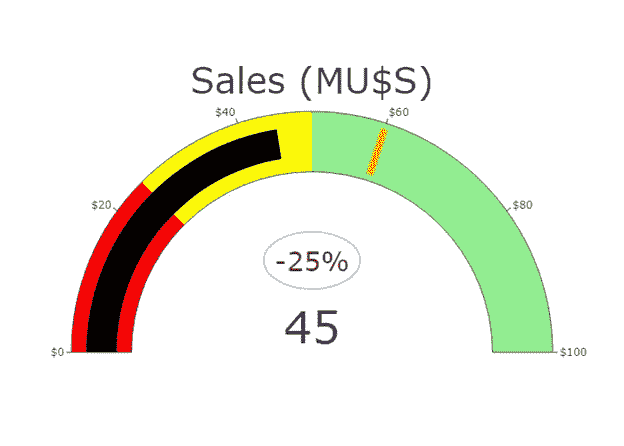
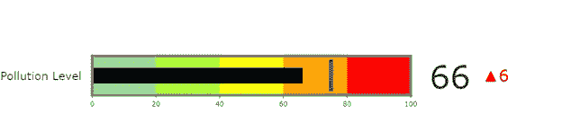

# Plotly 指示器

> 原文：<https://towardsdatascience.com/indicators-with-plotly-85a543f002cd?source=collection_archive---------20----------------------->

## **角规还是子弹图？**

图片来自 Unsplash 的 Shuaib Khokhar

商业智能(BI)是商业环境中用于将数据转化为知识的一组资源和技术。其主要目标是提高每个组织的生产率和绩效。BI 依赖于关键绩效指标仪表板( **KPI 仪表板**)。

KPI 仪表板是运营和战略信息的可视化显示，经理和决策者需要这些信息来评估其当前流程并解决可能影响业务绩效的问题。

KPI 仪表板必须易于查看、导航和理解。**指标**提供关于单个定量测量的信息，通常用于表示业务关键数据中涉及的主要指标。因此，**指标必须出现在 KPI 仪表板上。**

[Plotly](/bubble-charts-70ef7485c51e) 包括一个名为*指示器*的轨迹，有两种量规类型:*角度*和*子弹*。我们分别来分析一下。

# **角度规图**

[角度规图表](/gauge-bullet-charts-cfe171ca3094)(速度表图表、刻度盘图表)直观地显示定量测量是否低于、处于或高于给定的数值范围。有不同的布局，最常见的看起来像车辆的速度表，指针或指针在径向标尺上移动。另一种经典的布局包括一个内部带有阴影条的圆弧。

范围的数量是可变的(三个、四个、五个)，它们中的每一个都用某种颜色来标识。例如:红色、黄色和绿色用于表示警报、警告和满意，或者表示低性能、正常性能和高性能。指标通常包括一个**目标**或**阈值**，用与数值范围不同颜色的垂直线表示。这个阈值可以是一个基准、要超过的前一个值或要达到的目标。

# **带 Plotly 的角度规图表**

对于本文中的角度规图，Plotly trace 是 *go。Indicator()* 和相应的参数有:*域*来表示图的范围；*标题*为轨距以上的文字；*值*表示要显示的数值；和 *mode = "gauge + number"* 用测量值画一个圆弧。

最重要的参数是*标尺*具有以下属性:*形状*设置形状(有角或子弹)；步骤设置范围及其对应的颜色；*条*表示阴影条的颜色和粗细。对于*阈值*值，我们必须指明*颜色、宽度、厚度、*和*值*。如果我们想指示圆弧周围的刻度，我们必须包括*轴*属性。我们通过一个 D3.format 函数将出现在量表中的数字格式化。

这是角度规图的代码:

在该仪表中，我们决定用圆圈内的注释显示测量值和参考值之间的差异，而不是标准程序(*mode = " gauge+number+delta "*):

下图显示了具有三个扇区的角度仪表图:S1 从 0 到 25，颜色为红色，低性能；S2 从 25 岁到 50 岁，肤色发黄，表现正常；S3 从 50 到 100，颜色绿色，高性能。测量值设置为 45，并用黑色弯条编码。要实现的目标设定为 60，并用橙色线表示。测量值及其与参考值的差异用大数字突出显示。

图 1:作者用 Plotly 制作的角度规图。

角度仪表图是非常简单的图形，具有直观的颜色序列，即使对于非专业观众来说，也能提供清晰、简单的方法来理解信息。

它们有一些缺点:1 .-它们占用大量物理空间；2.-他们可能会忽略关键信息；3.-它们没有描述业务环境；4.-他们可能会用红绿色盲来迷惑观众。永远记住这些缺点，以避免糟糕的故事。

# **项目符号图表**

这种类型的图形与角度规的概念相同，即通过与参考值进行比较来提供单个数值测量的信息。该图表显示两到五个范围或部分，用不同的颜色区分，表示质量值，如差、一般和优秀。

[项目符号图](/gauge-bullet-charts-cfe171ca3094)包括一个编码绩效指标的中间窄线性条和一条编码参考指标的垂直线。它们有一个沿线性轴的数量刻度，刻度等距。

# **带情节的项目符号图表**

对于本文中的子弹图，其轨迹是 *go。Indicator()* 和相应的参数有:*域*来表示图的范围；*标题*为图左侧的文字；*值*表示测量值。与前面的例子相反，我们使用标准程序显示测量值和参考值之间的差异: *mode = "gauge + number + delta "。*

最重要的参数是*量规*和*增量。* *仪表*有以下属性:“shape”:“bullet”用于绘制水平项目符号图；*轴*表示线性刻度的范围；*条*表示阴影线型条的颜色和粗细；步骤设置范围及其对应的颜色。对于*阈值*值，必须注明*颜色、宽度、厚度、*和*值*。*边框颜色*和边框宽度用于改善图形的最终外观。

*增量*参数需要一个参考值，一个*位置* ( `"top"` | `"bottom"` | `"left"` | `"right"`)。最后，*增加*和*减少*设置指示测量值和参考值之间差异的数字的颜色和符号。

这是项目符号图的代码:

下图显示了一个包含五个扇区的项目符号图:S1 从 0 到 20，颜色为浅绿色，污染程度良好；S2 20 至 40，颜色黄绿色，中度污染；S3 从 40 到 60，颜色偏黄，敏感人群污染水平；S4 从 60 到 80，颜色为橙色，不健康的污染水平；S5 从 80 到 100，颜色为红色，危险污染级别。测量值设置为 66，并用黑色线性条编码。未达到的危险级别设置为 75，并用蓝色垂直线表示。测量值及其与参考值(60)的差值显示在图的右侧。当测量值高于参考值时,“增量”参数的递增属性用一个红色向上的三角形表示该差异。

图 2:作者用 Plotly 做的子弹图。

项目符号图表也简单易懂。它们比角度仪表图占用更少的物理空间，并且它们的格式也不会分散观众的注意力。然而，与前面的方法一样，它们没有提供经理和决策者有时需要支持更好的业务决策的完整故事和背景。

如果你发现了这篇感兴趣的文章，请阅读我之前的(https://medium.com/@dar.wtz):

棒棒糖和哑铃图，有曲线、平均值或中值？

 [## Plotly 的棒棒糖和哑铃图表

### 均值还是中值？

towardsdatascience.com](/lollipop-dumbbell-charts-with-plotly-696039d5f85) 

斜率图表，为什么和如何，用斜率讲故事

 [## 斜率图表，为什么和如何

### 用斜坡讲故事

towardsdatascience.com](/slope-charts-why-how-11c2a0bc28be)