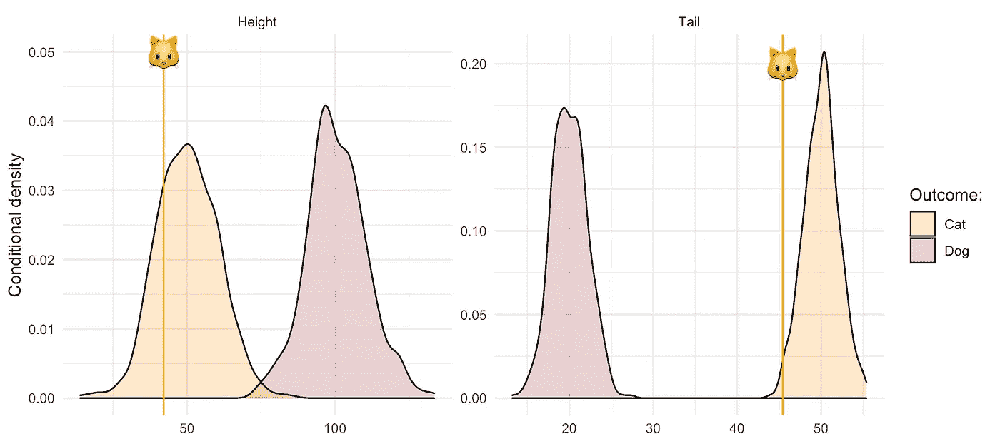
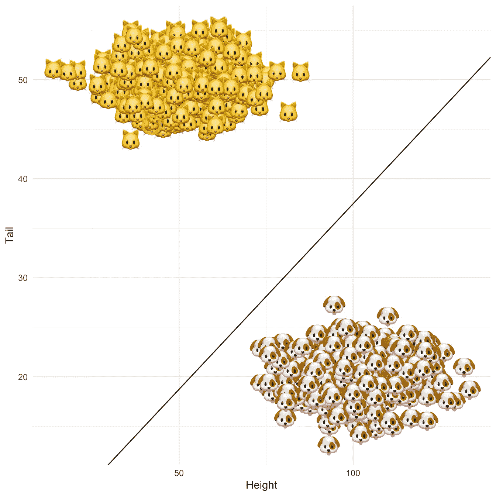
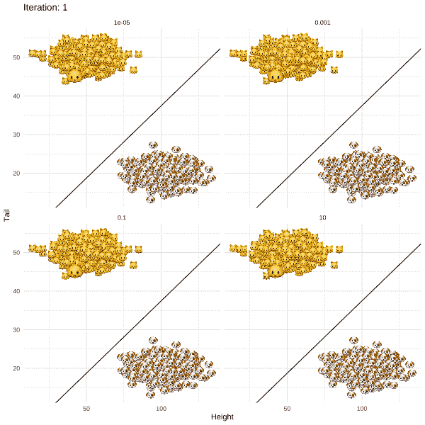

# 黑盒模型的个人追索权

> 原文：<https://towardsdatascience.com/individual-recourse-for-black-box-models-5e9ed1e4b4cc?source=collection_archive---------45----------------------->

## [模型可解释性](https://towardsdatascience.com/tagged/model-interpretability)

## 通过猫和狗的故事直观地解释

> *“你不能诉诸【算法】。他们不听。他们也不屈服。”*
> 
> *-凯茜·奥尼尔*

图片作者。

在她受欢迎的书[数学毁灭的武器](https://en.wikipedia.org/wiki/Weapons_of_Math_Destruction)中，凯茜·奥尼尔举了公立学校教师莎拉·威索基的例子，她在教师评估算法使她成为多余的奥尼尔后失去了工作(2016)。莎拉在同龄人、主管和学生中很受欢迎。

这篇文章着眼于一种新颖的算法解决方案，它解决了这样一个问题，即像 Sarah 这样面临不良结果的人，应该被提供修正结果的方法。文献通常将此称为*个人追索权*。Ustun、Spangher 和刘(2019)提出了第一种个人追索方法。在最近的一篇后续论文中，Joshi 等人(2019)提出了一种他们称为`REVISE`的方法，该方法在至少三个关键方面扩展了早期的方法:

1.  `REVISE`提供一个框架，通过对修改后的属性施加一个阈值似然性来避免建议一组不切实际的变更。
2.  它适用于更广泛的模型类别，包括黑盒分类器和结构因果模型。
3.  它可以用来检测定义不明确的代理和偏见。

关于这些问题的详细讨论，你可以查看这张[幻灯片](https://pat-alt.github.io/2021/04/26/individual-recourse-for-black-box-models/paper_presentation.pdf)或直接查阅论文(可在 [DeepAI](https://deepai.org/publication/towards-realistic-individual-recourse-and-actionable-explanations-in-black-box-decision-making-systems) 上免费获得)。在这里，我们将从这些复杂性中抽象出来，转而看一个稍微简化版本的`REVISE`的应用。这应该有助于我们首先建立良好的直觉。对技术细节和代码感兴趣的读者可以在下面的附件中找到所有这些内容。

# 从🐱到🐶

我们将通过一个简短的猫狗故事来解释`REVISE`。这个故事的主角是基蒂🐱，一只识别为狗的幼猫。不幸的是，凯蒂不是很高，她的尾巴虽然对猫来说很短，但比一般的狗要长(图 1)。

图 1:描述猫和狗的模拟数据集的经验分布。竖梗代表 Kitty 的属性值。图片作者。

令她非常沮丧的是，我们通过随机梯度下降训练的线性分类器 *g(x)* 已经将 Kitty 识别为一只猫(同样，感兴趣的读者可以在下面的附件中找到技术细节和代码)。图 2 显示了在属性空间中产生的线性分离，决策边界用黑色实线表示，Kitty 的位置用红色圆圈表示。我们能向凯蒂提供个人求助吗？

图 2:猫和狗在二维属性空间中的线性分离，拟合分类器的判定边界为纯黑色。Kitty 的位置由一个红圈表示。图片作者。

让我们看看我们是否以及如何将`REVISE`应用于凯蒂的问题。下面的总结应该会让您对算法的工作原理有所了解:

1.  初始化 *x* ，这是将被递归修改的属性。Kitty 的原始属性似乎是一个合理的起点。
2.  通过梯度下降递归修正 *x* 直到 *g(x*)=* 🐶。此时下降终止，因为对于这些修改的属性，分类器将小猫标记为狗。
3.  返回 *x*-x* ，这是 Kitty 的个人追索权。

图 3 说明了当这种方法应用于 Kitty 的问题时会发生什么。不同的面板示出了正则化参数的不同值的结果，该正则化参数控制实现期望的标签切换和保持原始和修改的属性之间的距离较小之间的折衷。除了一种情况，`REVISE`收敛了:随着高度的增加，尾巴长度的减少最终允许 Kitty 穿过决策边界。换句话说，我们已经成功地把 Kitty 变成了一只狗——至少在线性分类器的眼里是这样！

我们还观察到，对于固定的学习速率，当我们增加正则化参数时，`REVISE`需要更长的时间来收敛。这一点也不奇怪，因为我们明确规定了更严格的惩罚，即小猫必须行进的距离。当我们惩罚过多时(右下图)，Kitty 永远不会到达决策边界，因为她不愿意改变超过某个点的特性。

图 3:运行中的简化`REVISE`算法:Kitty 如何通过改变属性来跨越决策边界。关于距离惩罚的正则化从左上到右下增加。图片作者。

# 讨论

虽然希望凯蒂的旅程为你提供了一些有用的直觉，但这个故事当然非常愚蠢。即使你的猫似乎暗示过她想成为狗，帮助她跨越那个决定界限也是很棘手的。有些属性是不可变的，或者很难改变，Joshi 等人(2019)在他们的框架中解释了这一点。他们提出的方法提供了一个简单而巧妙的方法来提供个人求助。与其担心黑盒的可解释性，为什么不简单地提供补救措施以防出错呢？

在某种程度上，这个想法有其优点。正如这篇文章所展示的，`REVISE`简单易懂，易于应用。它可能是一个非常有用的工具，在许多现实世界的应用程序中提供个人资源。正如我们的简化版`REVISE`的实现所展示的，研究人员也应该发现进一步开发该方法并使其适合特定用例相对容易。例如，这里的更简单的版本可能在维度相对较小的设置中有用，并且可以合理地对属性的分布进行建模，而不需要生成模型。

尽管如此，你可能想知道:如果最初的分类器是基于定义不良的规则和代理，那么`REVISE`到底有什么用？回到高中教师 Sarah Wysocki 的例子，决定教师评价的一个关键因素是学生的表现。意识到这一点，一些老师采取了人为夸大学生考试成绩的捷径。`REVISE`很可能已经提出了同样的行动方针。正如 Joshi 等人(2019 年)所证明的，`REVISE`的这一特性实际上可能有助于在释放决策系统之前发现它们的弱点(关键贡献 3)。

尽管如此，上面的例子也证明了像`REVISE`这样的方法，尽管它们可能有用，但它们倾向于为非常特殊的问题提供解决方案。在现实中，数据驱动的决策系统经常会遇到许多不同的问题，因此对可信人工智能的研究需要从各个角度解决这个问题。几个地方开始包括处理固有偏见的数据的问题，提高临时和临时模型的可解释性，以及围绕因果关系启发的人工智能继续努力。

# 参考

[1] Joshi、Shalmali、Oluwasanmi Koyejo、Warut Vijitbenjaronk、Been Kim 和 Joydeep Ghosh，[关于黑箱决策系统中现实的个人追索权和可操作的解释](https://deepai.org/publication/towards-realistic-individual-recourse-and-actionable-explanations-in-black-box-decision-making-systems) (2019)，arXiv 预印本 arXiv:1907.09615。

[2]奥尼尔，凯茜，[数学毁灭的武器:大数据如何增加不平等并威胁民主](https://en.wikipedia.org/wiki/Weapons_of_Math_Destruction) (2016)，皇冠

[3]乌斯顿、伯克、亚历山大·斯潘赫和刘洋，[线性分类中的可诉追索权](https://econcs.seas.harvard.edu/files/econcs/files/spangher_fatml18.pdf) (2019)，《公平、问责和透明度会议论文集》，第 10–19 页

# 强占

在我的博客文章中，我的目标是从头开始实现有趣的想法，即使有时这意味着事情需要进行某种简化。这种方法的好处是，这种经历在教育上是有益的——对我自己来说是如此，希望对读者也是如此。在这个中型出版物上，我将只附上线性分类器的注释代码和下面的`REVISE`。对于带有语法突出显示的代码，也为了体验一下其中的数学，请查看我的个人博客[上的帖子。](https://pat-alt.github.io/2021/04/26/individual-recourse-for-black-box-models/)

## 线性分类器

线性分类通过具有铰链损失的随机梯度下降(SGD)来实现。`linear_classifier`函数输出一个 S3 类，这是在 r 中使用面向对象编程的常见方式。下面是分类器的`print`和`predict`方法。

## `REVISE`(简体)

如上所述，我们正在研究 Joshi 等人(2019)提出的算法的一个稍微简化的版本。特别是，这里的方法没有结合可能性的阈值，也没有考虑不可变的属性。

`revise`函数被实现为上面创建的分类器类的方法。

*原载于 2021 年 4 月 26 日*[*https://pat-alt . github . io*](https://pat-alt.github.io/2021/04/26/individual-recourse-for-black-box-models/)*。*