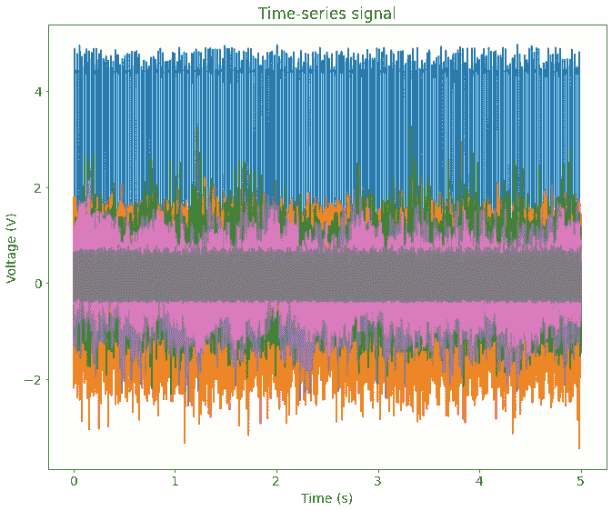
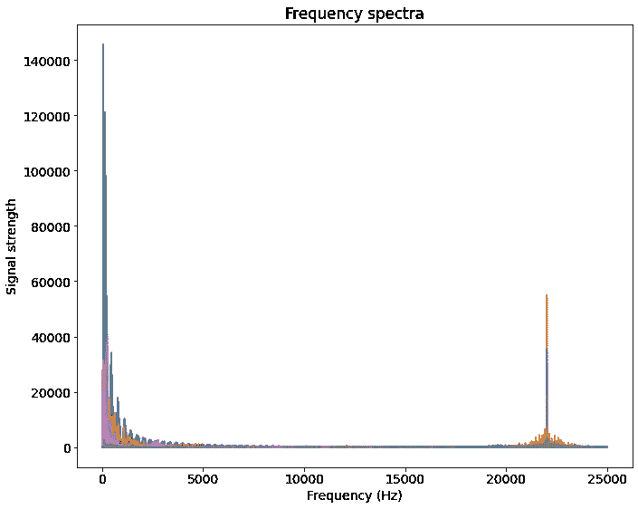
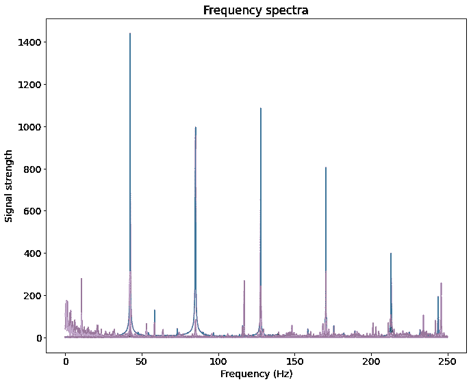
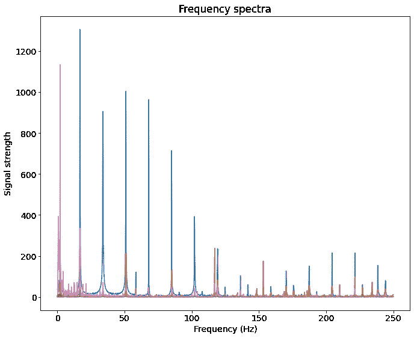
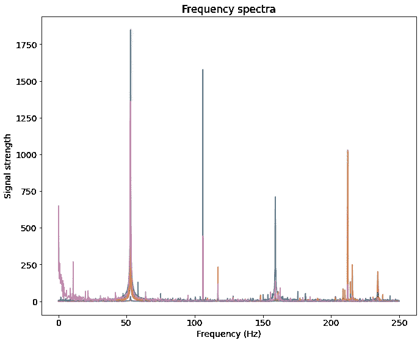
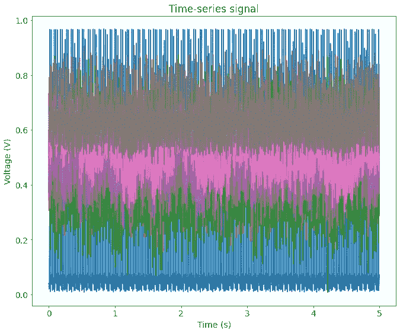
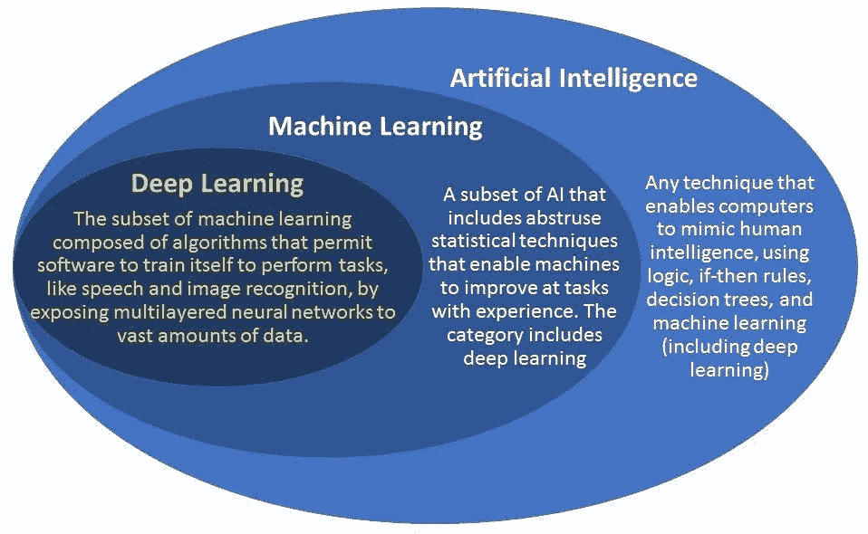
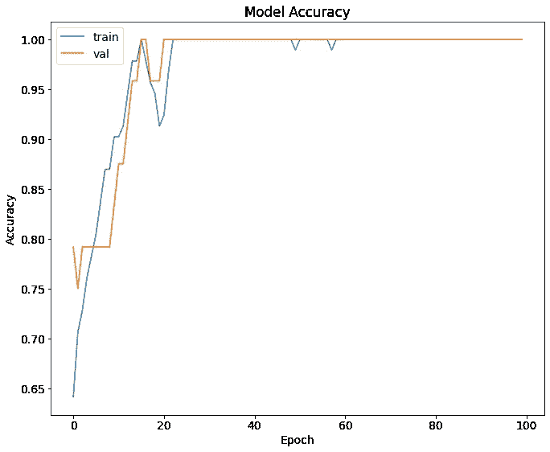
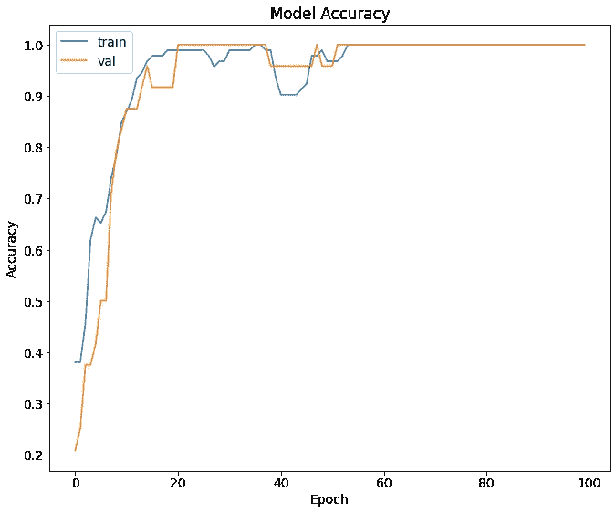
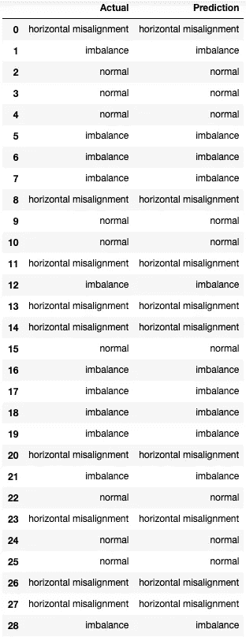

# 基于物联网的深度学习工业电机故障分类

> 原文：<https://towardsdatascience.com/industrial-motor-fault-classification-using-deep-learning-with-iot-implications-fd36ddc8ad5b?source=collection_archive---------9----------------------->

## 使用真实数据和应用人工智能(AI)制定预测性维护策略


米卡·鲍梅斯特在 [Unsplash](https://unsplash.com?utm_source=medium&utm_medium=referral) 上的照片

**目的 **

*以下作品仅用于教育目的，不得用于商业用途。*

*我不断挑战自己，发展自己在工程、数据科学、沟通和商业敏锐度方面的技能。我喜欢从事测试我知识的项目，将我推出舒适区，并允许我表达我的创造力。我承担了这个个人项目，通过使用与电动马达操作相关的真实世界数据集来进一步发展我在机器学习方面的经验。*

*我学到了很多——现在我与读者分享我的学习，利用媒体平台增加我的公共作品组合，并发展我的沟通技巧。*

*所有的源代码都可以通过我的*[***GitHub***](https://github.com/milank94/motor-fault-classification)*上的一个资源库公开获得。*

*享受！*

# 问题陈述和机会

作为一名新的电气工程毕业生，我的第一个任务是诊断和排除一台停止工作的感应电机。第一步是检查故障的症状并确定故障的根本原因。为了做到这一点，我需要一个特定的诊断工具和一个详细的测试程序。不幸的是，诊断工具在短期内不可用，测试程序需要至少 3 周才能执行。

我一直在思考这个场景，我把它归类为一个机会，来改善当前的电机诊断和维修标准。我的假设是，有一个更快、更具成本效益的解决方案来对电机故障进行分类，并减少操作停机时间。

# 机器学习项目

工业电机是现代经济的主力。在所有主要行业中都可以找到它们，如发电、石油和天然气、采矿和制造。工业电机的故障以及长时间的诊断和维修过程会导致生产价值的损失。

在本文中，我研究了实施**人工智能(AI)** 解决方案的可行性，以诊断电机故障并向系统操作员实时报告。这种解决方案将减少工程师和技术人员诊断故障所需的时间，并因此减少操作中的停机时间。

## **方法论**

本实验的范围是评估开发能够对不同电机运行状态进行分类的机器学习模型的可行性。我将开发两个机器学习模型:

*   二进制分类器检测故障何时发生
*   多类分类器对故障类型进行分类

## **领域理解和数据采集**

为了开发能够对电机故障进行分类的机器学习模型，必须有足够的数据来训练该模型。

在这个实验中，我使用了来自机械故障数据库的公开数据[1]:

> “该数据库由 SpectraQuest 的机械故障模拟器(MFS)校准-平衡-振动(ABVT)上的传感器获得的 1951 个多变量时间序列组成。1951 包括六种不同的模拟状态:正常功能、不平衡故障、水平和垂直错位故障以及内外轴承故障。”

第一步是构建一个数据采集模块，能够从数据源获取数据，并将数据存储在数据结构中以供处理。数据被组织在一批文件夹[中，按操作条件标记为](https://en.wikipedia.org/wiki/Supervised_learning)，在**逗号分隔值(csv)** 文件中按转速**排序。**每个 csv 文件都是一个训练实例。

```
INPUT_DATA_DIR = get_project_root() / Path('data_acquisition/data')NORMAL_FILE_NAMES = glob.glob(str(INPUT_DATA_DIR)+'/normal/*.csv')
HORI_MIS_FILE_NAMES = glob.glob(str(INPUT_DATA_DIR)+'/2.0mm/*.csv')
IMBALANCE_FILE_NAMES = glob.glob(str(INPUT_DATA_DIR)+'/25g/*.csv')
```

对于这个项目，我将重点关注三种不同的操作条件:**正常**、**不平衡**和**水平错位**。正常和不平衡数据集各包含 49 个训练实例，水平未对准数据集包含 47 个训练实例。每个训练实例包含测量旋转速度的编码器信号、六个[加速度计](https://www.omega.com/en-us/resources/accelerometers)信号:两个轴向信号、两个切向信号和两个径向信号，以及来自麦克风的可听见的噪声信号。信号以 50，000 Hz 的速率采样 5 秒钟；因此，每个信号是具有 250，000 个样本的时间序列。

为了更好地理解可用数据，请听听每种条件下的电机性能。

你能听出区别吗？

我的假设是，这些声音信号，以及从加速度计收集的信号，足以开发一个能够对不同操作条件进行分类的人工智能模型。

## **数据处理和探索性数据分析**

在我们可以将数据输入机器学习算法之前，我们需要执行一些初步的数据处理。让我们来看看一个训练实例在正常操作条件下所有时间序列信号的曲线图。



正常操作下一个训练实例的所有传感器数据的时间序列图

对数据和数据图的初步分析揭示了两个关键观点:

*   由于高采样率，存在大量的数据点
*   这些信号不在同一个范围内

这两种见解都会对机器学习算法产生影响:

*   太多的数据点将需要更长的模型训练时间
*   不同的尺度会扭曲机器学习模型的结果

**数据重采样**

首先，我们应该以较低的频率对数据进行重新采样，以减小每个训练实例的大小，从而加快训练算法的速度。为了确定重采样率，让我们使用 [**【快速傅立叶变换】**](https://en.wikipedia.org/wiki/Fast_Fourier_transform) 来分析信号的频谱:



采样率为 50，000 Hz 时正常工作条件下的频谱

频谱在 25，000 Hz 的[奈奎斯特频率](https://en.wikipedia.org/wiki/Nyquist_frequency)处截止。FFT 显示大部分高信号强度频率位于较低的频率带宽(0Hz-5，000 Hz)。在 20，000 Hz-25，000 Hz 处存在相对高强度频率的第二带宽，并且在 5，000 Hz 和 20，000Hz 之间存在死区。以丢失高频带宽信息为代价，决定以 500 Hz 的较低速率对数据进行重新采样。较低的抽样率将把时间序列数据点的数量从 250，000 减少到 2，500，减少了两个数量级；因此，大大减少了模型训练时间。



正常操作条件下 500 Hz 重采样率的频谱

当在相同转速下对比时，重采样信号的频谱显示了操作条件的特定特征:



重采样率为 500 Hz 时水平失调运行条件的频谱



重采样率为 500 Hz 时不平衡运行条件的频谱

**数据缩放**

下一个数据处理步骤是将信号重新调整到一个共同的尺度。该函数将确保机器学习模型不会扭曲最终结果。



正常操作下一个训练实例的所有传感器数据的时间序列图:缩放和重新采样

**频域**

数据处理流程的最后一步是将信号从时域转换到频域。这种转换是通过使用 FFT 变换数据来实现的。将数据转换到频域的好处是:

*   通过仅使用正频谱，每个训练集的行数从 2，500 减少到 1，250；因此，减少了模型训练时间
*   每个操作条件的频谱具有更多指示性特征；因此，提高了模型精度

**训练/测试分流**

最后一步是留出一部分数据在最后用于模型验证。这就是所谓的[测试集](https://en.wikipedia.org/wiki/Training,_validation,_and_test_sets)。

## **构建深度学习模型**

在开始这一部分时，我将引用一个关于人工智能、机器学习和深度学习之间关系的有用信息图。



[https://medium . com/@ harish _ 6956/what-is-machine-learning-deep-learning-7788604004 da](https://medium.com/@harish_6956/what-is-machine-learning-deep-learning-7788604004da)

由于输入数据遵循一个序列(频域)，我将使用一个 [**递归神经网络(RNN)**](https://en.wikipedia.org/wiki/Recurrent_neural_network) 架构，这是一个[深度学习](https://en.wikipedia.org/wiki/Deep_learning)架构。具体来说，我使用的是[**【LSTM】**](https://en.wikipedia.org/wiki/Long_short-term_memory)****的长短期记忆架构。****

**使用 Python 中的 [TensorFlow](https://www.tensorflow.org) 库实现 LSTM 模型非常简单。我将从最简单的架构开始，它包含两层:LSTM 输入层和带有可配置激活功能的密集输出层。**

**对于二元分类模型，我使用一个 *sigmoid* 激活函数和一个*二元交叉熵*损失函数来训练模型。**

```
Model: "sequential"
_________________________________________________________________
Layer (type)                 Output Shape              Param #   
=================================================================
lstm (LSTM)                  (None, 100)               43600     
_________________________________________________________________
dense (Dense)                (None, 1)                 101       
=================================================================
Total params: 43,701
Trainable params: 43,701
Non-trainable params: 0
```

**该模型在 116 个训练实例上进行训练，在 100 个时期中具有 20%的验证保留集。该模型在训练和验证数据上达到 100%的准确度分数。**

****

**序列分类 RNN(二元)的模型精度**

**对于多类分类模型，我使用一个 *softmax* 激活函数和一个*稀疏分类交叉熵*损失函数来训练模型。**

```
Model: "sequential"
_________________________________________________________________
Layer (type)                 Output Shape              Param #   
=================================================================
lstm (LSTM)                  (None, 100)               43600     
_________________________________________________________________
dense (Dense)                (None, 3)                 303       
=================================================================
Total params: 43,903
Trainable params: 43,903
Non-trainable params: 0
```

**该模型在训练和验证数据上获得了 100%的准确度分数。**

****

**序列分类 RNN(多类)的模型精度**

## ****模型验证****

**模型在后处理测试集上得到验证。测试集包含 29 个实例，两个模型都能够准确地对所有 29 个样本进行分类，达到 100%的测试分数。**

****

**多级分类的实际值和预测值之间的比较**

# ****总结与未来工作****

**最终的二元和多类分类模型被证明在准确识别电机故障和按类型分类故障方面是成功的。**

**一些重要的经验教训:**

*   **我 85%的时间花在了数据处理和探索性数据分析阶段。**
*   **最终的模型，虽然听起来非常复杂(DL，RNN，LSTM)，却是最容易建立的部分。**
*   **我利用我在电机领域的行业和学术经验，以及我在电气工程方面的背景，制作了一个成功的模型。例如，我最初使用时域作为模型的输入，它产生的训练和验证分数并不比随机抽样好(66%)。直到我执行频域变换，我才看到模型的显著改进。**
*   **我对学习模式做了很小的调整；最显著的收益来自数据处理。**

## **未来的工作**

**本项目使用的数据是[可用数据](http://www02.smt.ufrj.br/~offshore/mfs/page_01.html)的子集。总共有六种可用于分类的状态:正常、不平衡、水平未对准、垂直未对准、悬挂下轴承故障和悬挂轴承故障。此外，一些状态具有子状态，例如，水平错位可以通过以毫米为单位的错位量来分类:0.5 mm、1.0 mm、1.5 mm 和 2.0 mm。更有用的模型是包含所有故障条件并且可以通过其条件的极端来细分每个故障的模型。**

## **[工业物联网](https://en.wikipedia.org/wiki/Industrial_internet_of_things)含义**

**正如我的介绍中所说，这个项目的目的是为了教育目的，而不是商业用途。然而，想想用例的结果对我们的工业世界的潜在影响是令人兴奋的。工业环境中互联技术的实施已经发展到包括更快的连接网络、云计算系统和大数据分析。我设想我的工作成果可以得到显著的改善、增强，并整合到跨各种行业的更大的资产管理战略中，以改善运营、效率、可靠性和安全性。**

***结束语***

***感谢您花时间阅读我的文章。我希望它对你有一些价值，并且你能够学到至少一条新的信息。我希望继续发表类似的文章，并感谢你能提供任何建设性的批评。***

***如需任何未来出版物，请订阅我的* [*Medium*](https://milan-kordic.medium.com) *个人资料，并在*[*LinkedIn*](https://www.linkedin.com/in/milankordic/)*上添加我。***

***访问我的代码库，在那里你可以找到这个项目和我完成的其他项目的所有源代码，请检查我的*[*GitHub*](https://github.com/milank94)*。***

***谢谢***

**米兰科尔季奇**

****参考文献****

**[1]机械故障数据库，[机械故障数据集](http://www02.smt.ufrj.br/~offshore/mfs/page_01.html) (2021)，Web**