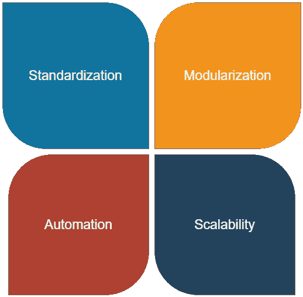

# 商业高级分析的工业革命设计原则课程

> 原文：<https://towardsdatascience.com/industrial-revolution-design-principles-lessons-for-commercial-advanced-analytics-3c10b1368454?source=collection_archive---------22----------------------->

每天都有新的工具和方法出现，那么您的分析团队如何保持警惕呢？关于工业革命四大支柱的思考:**标准化**、**模块化**、**自动化、**和**可扩展性**



作者图片

纵观历史，我们已经经历了三次工业革命，许多人认为我们正在经历第四次。从第一次煤和蒸汽革命开始；第二次是大规模生产，第三次是计算机，最近的第四次是人工智能和物联网，人类用汗水和泪水，有时甚至是鲜血吸取了许多教训[1]。随着“工业 4.0”即将到来，将以前的经验和最佳实践应用到日常工作中不仅对我们个人，而且对组织都至关重要。

对于商业高级分析领域的许多人来说，“工业 4.0”可以简化为将来自各种来源的数据汇集到一个仓库或数据湖中，然后部署必要的分析、人工智能、机器学习来生成可操作的见解的过程。也就是说，任何分析相关团队的另一部分工作都是准备文档、吸纳同事、获得支持以及与利益相关方打交道。

在这篇文章中，我将讨论我对 4 个工业革命设计原则的概念的想法:标准化、模块化、自动化和可伸缩性；它们的相关性如何，以及如何将它们整合到任何分析组织的日常工作中。

# 目录

[标准化](#2d97)
[模块化](#0389)
[自动化](#6724)
[可扩展性](#ceb7)

# 标准化


照片由[在](https://unsplash.com/@callmefred?utm_source=unsplash&utm_medium=referral&utm_content=creditCopyText) [Unsplash](https://unsplash.com/s/photos/standard?utm_source=unsplash&utm_medium=referral&utm_content=creditCopyText) 上叫我弗雷德

## 这是什么？

> 标准化，顾名思义，就是使某物符合标准的过程。用技术术语来说，它意味着在各方(例如:公司、用户、利益集团、标准组织和政府)一致同意的基础上实施和开发标准[2]。

从以前的工业革命开始，由于对高精度机床和可互换零件的需求，标准化就变得非常重要。由于某些基本标准，企业可以避免冲突和重复劳动。

## 它是如何关联的？

每个组织都应该有自己的分析产品技术标准:从数据格式结构、流程实现到代码语法。应该注意的一些标准化示例:

```
**Data** - Is this data useful or redundant?
- Are these **data entries** pointing to the **same** thing?
- Is it "cold" or "hot"? Where to store it?
- How should we structured it into a **single format** and make it **consistent**?
- How is the **documentation** process and how frequent is it update?
- If this is used by many platforms, then is there any requirements for **input**/**output flows**?**Processes
-** Are these steps useful or redundant? 
- Can we make it **easier** to onboard/outsource/implement?- Can we create a **set of rules** of how to run this ABC process?
- Can we reduce the **deviations**?
- Have we implemented "**best practices**" from similar processes?**Metrics** - Have we all agree on this metric / KPIs?
- Can we **quantify** this metric with good clarity?
- Can we use these KPIs on this project / process?
- How can this metric measures impact on sales / customer satisfaction / engagement rate...etc?**Tools & Platforms** - Are we using the same tools/platforms?
- Do we have the same versions of the softwares / codes?
- Can this new vendor's tool **integrate** to our ecosystem smoothly?
- Can the change processes be more **transparent**?
```

> 拥有标准将有助于分析团队从业务利益相关者那里获得更多的信任和支持，因为它显示了专业性和透明度。

从长远来看，在早期阶段建立具体的标准肯定会有所帮助，特别是在处理不同平台之间相互通信的挑战方面(公司倾向于在业务中使用不同的供应商，并且不是所有的供应商都能顺利集成到生态系统中)。标准化还有助于我们更好、更快地识别不一致，这有助于组织的决策过程。在知识转移方面，标准化将加速入职、外包和实施流程。最后，拥有标准将有助于在技术专家和商业利益相关者之间建立更好的桥梁，因为它显示了**专业性和透明度**。

# 模块化


[沃洛德梅尔·赫里先科](https://unsplash.com/@lunarts?utm_source=unsplash&utm_medium=referral&utm_content=creditCopyText)在 [Unsplash](https://unsplash.com/s/photos/module?utm_source=unsplash&utm_medium=referral&utm_content=creditCopyText) 上的照片

## 这是什么？

在第二次工业革命中，亨利·福特将他从芝加哥一家屠宰场获得的灵感付诸实践，从而使美国工业发生了革命性的变化:大型生产工厂；**标准化**、**互换零件**；以及**移动装配线**。一旦标准化达到一定程度，模块化就可以正式启动了。

> 模块化设计是一种将一个系统细分为模块的设计原则，这些模块可以独立创建、修改、替换或与其他模块或不同系统之间交换。[3].

## 它是如何关联的？

任何有编程经验的人(尤其是 *OOP —面向对象编程*)一定都知道模块化的概念:代码放入函数和类中；然后只在需要的时候被召唤。在高级分析项目中，模块化可以在许多机器学习工作流工具中看到，如 sklearn workflow、apache airflow、kedro、Luigi...仅举几个例子。这些工具使专家能够监督开发过程并有效地监控项目。虽然有很多工具可用，但通常包括这 4 个主要步骤: ***数据收集*；*数据预处理*；*培训和细化*；*部署*** 。在这些步骤中，代码应该被分成小模块，这些小模块可以被修改、替换和交换，而不会破坏大的“管道”。


由 [Kelly Sikkema](https://unsplash.com/@kellysikkema?utm_source=unsplash&utm_medium=referral&utm_content=creditCopyText) 在 [Unsplash](https://unsplash.com/s/photos/scrum?utm_source=unsplash&utm_medium=referral&utm_content=creditCopyText) 上拍摄的照片

事实上，这个概念现在已经从技术方面发展到了产品管理方面。想想敏捷的概念:

*   我们以 sprint 周期运行项目数周，从 POC(概念验证)开发一个原型
*   在测试和收集反馈之后，我们旋转更多的周期来轻松地集成或替换产品的各个部分(当然是在模块中)
*   有时，由于利益相关者的要求，我们不得不将产品的大部分从开发周期中剔除。这里模块化将帮助我们保持过程的健全:**没有那些“大块”，产品应该运行良好，没有问题**。
*   后来，当我们推出 MVP(最小可行产品)时，新功能可以以模块的形式很好地集成。

> 随着开发过程中业务方面的参与，模块化将有助于分析团队在利益相关者的要求和产品质量之间取得平衡。

# 自动化


由[大卫·莱维克](https://unsplash.com/@davidleveque?utm_source=unsplash&utm_medium=referral&utm_content=creditCopyText)在 [Unsplash](https://unsplash.com/s/photos/robot?utm_source=unsplash&utm_medium=referral&utm_content=creditCopyText) 上拍摄的照片

## 这是什么？

> 自动化是在最少人工干预的情况下，创造和应用生产和交付商品和服务的技术。自动化技术、工艺和过程的实施提高了以前由人类执行的许多任务的效率、可靠性和/或速度。[5]

## 它是如何关联的？

术语“**自动化**”源于古希腊词:[αὐτόματος](https://en.wiktionary.org/wiki/%CE%B1%E1%BD%90%CF%84%CF%8C%CE%BC%CE%B1%CF%84%CE%BF%CF%82#Ancient_Greek)(*autóMatos*，“自动、任性”)，正如定义所述，关键词是“最少的人工干预”。一旦从两大支柱 ***标准化*** 和 ***模块化*** 中取得可持续的成果，企业就可以开始自动化其分析流程。自动化分析机制的复杂性各不相同，从将数据传输到预建模型的简单脚本，到执行 EDA(探索性数据分析)、功能增强、模型选择、测试和部署的全方位服务工具[6]。对于组织来说，即使是一个简单的经过良好调整的自动化分析管道也能带来巨大的好处。例如，从内部数据库收集数据以提供预测模型并将结果更新到交互式仪表板的管道可以大大减少工作量和运营成本。

> 即使是一个简单的经过良好调整的自动化分析管道也能为企业带来巨大的好处

公司可以使用机器人流程自动化(RPA)等工具开始他们的自动化之旅，这些工具用于标准化的流程，也称为“低级人工智能”，以不费吹灰之力产生“速赢”。我在“智能自动化”中写了一篇文章，其中深入讨论了 RPA 和数据科学之间的关系:

[](/intelligent-automation-a-symbiotic-relationship-between-rpa-and-data-science-632af34555e3) [## 智能自动化 RPA 和数据科学之间的共生关系

### 组织应该如何建立他们的自动化和分析任务团队，同时避免“孤岛化”陷阱？

towardsdatascience.com](/intelligent-automation-a-symbiotic-relationship-between-rpa-and-data-science-632af34555e3) 

与此同时，高级分析团队在实现*标准化*和*模块化*后，可以通过使用机器学习工作流工具部署模型并将其推送到云服务平台，开始**自动化**他们的产品(这里我使用了词语“*”而不是“*”)，因为后者需要最后一个支柱:“*”)***

# ***可量测性***

## ***这是什么？***

***从商业角度来看，可扩展模式是一种随着在资本、劳动力和服务方面投入更多而看到回报不断增加的业务。不可扩展的商业模式作为小企业可能有利可图，但不能以经济的方式增长。***

******

***科林·沃茨在 [Unsplash](https://unsplash.com/s/photos/agriculture-field?utm_source=unsplash&utm_medium=referral&utm_content=creditCopyText) 上的照片***

> ***在计算机科学领域，彼得·洛辛和他的合著者在他们的书 [*电子商务*](https://www.encyclopedia.com/social-sciences-and-law/economics-business-and-labor/businesses-and-occupations/electronic-commerce) 中，将可伸缩性定义为:“当系统负载增加时，具有多个可用处理器的系统调用尽可能多的处理器的能力，以及该系统被扩展的能力。”***

## ***有什么关联？***

***完成 ***标准化*** — ***模块化*** — ***自动化*** 三大支柱，并不意味着产品或流程已经“规模化”。为了能够创建生产级的高级分析产品，我们必须非常注意扩展方面。 [Sigmoid Analytics](https://www.sigmoid.com/blogs/5-challenges-to-be-prepared-for-before-scaling-machine-learning-models/) [7]强调了在为企业扩展机器学习模型时的 5 个挑战如下(强烈推荐阅读该文章):***

```
**1\. Complexities with data
2\. Engineering and deployment
3\. Integration risks
4\. Testing and model substance
5\. Assigning roles and communications**
```

> **虽然“扩展”分析产品主要局限于技术技能和基础设施，但在组织范围内“扩展”分析是另一个不同的挑战。**

**虽然扩展分析产品仅限于技术技能，但在组织范围内扩展分析是另一个不同的挑战。从[麦肯锡的《脱离:扩展分析的秘密》](https://www.mckinsey.com/business-functions/mckinsey-analytics/our-insights/breaking-away-the-secrets-to-scaling-analytics)【8】2018 年，尽管在分析方面进行了大量投资，但许多公司并没有像他们预期的那样捕捉到巨大的价值。原因是:虽然他们从一些用例中获得了小收益，但他们未能将分析嵌入组织的所有领域。该报告确定了许多使领先企业脱颖而出的驱动因素:首先是调整战略，建立正确的基础，获得正确的人才，为员工提供数据洞察力，以及最重要的最后一部分:**将分析结果嵌入决策过程**。为了实现规模分析，公司可以从以下方面入手，应用脱离领导者的经验:**

1.  **首先，在公司业务战略的背景下，确定他们可以改进以产生价值的决策过程**
2.  **然后，反向工作以确定影响决策的所需数据洞察类型**
3.  **最后，在公司的支持下，获取人才和流程方面的数据和知识**

**虽然在工业革命的教训上可能有不同的思想流派，但我相信这四个设计原则:标准化、模块化、自动化和可伸缩性；将长期伴随我们，尤其是在工业 4.0 即将到来的情况下。**

**感谢阅读！如果你能留下回复，我会很高兴，我们可以进一步讨论这个话题。**

# **放弃**

**本文中表达的所有观点都是我个人的观点，不代表我曾经、现在或将来隶属的任何实体的观点。**

# **参考**

**[1]History.com 编辑(2019)。*工业革命*。[在线]历史。可查阅:[https://www . history . com/topics/industrial-revolution/industrial-revolution](https://www.history.com/topics/industrial-revolution/industrial-revolution)【2021 年 1 月 20 日获取】。**

**[2]谢，z .，霍尔，j .，麦卡锡，I.P .，斯科特莫尔，m .，沈，L. (2016)。标准化努力:知识维度、搜索过程和创新成果之间的关系。*技术创新*，【在线】48–49，第 69–78 页。可在:[https://www . science direct . com/science/article/pii/s 0166497215000929？通过% 3 di hub](https://www.sciencedirect.com/science/article/pii/S0166497215000929?via%3Dihub)[2021 年 1 月 20 日访问]。**

**‌[3]维基百科贡献者(2021)。*模块化编程*。[在线]维基百科。可在:【https://en.wikipedia.org/wiki/Modular_programming 【2021 年 1 月 20 日进入】。**

**History.com 编辑]( 2009 年)。*亨利·福特*。[在线]历史。上市时间:[https://www.history.com/topics/inventions/henry-ford](https://www.history.com/topics/inventions/henry-ford)【2021 年 1 月 20 日上市】。**

**[5]Techopedia.com。(2016).*什么是自动化？—来自 Techopedia* 的定义。[online]可从以下网址获得:[https://www . techopedia . com/definition/32099/Automation #:~:text = Automation % 20 is % 20 创建% 20 和之前% 20 由% 20 人% 20 执行% 20。](https://www.techopedia.com/definition/32099/automation#:~:text=Automation%20is%20the%20creation%20and,were%20previously%20performed%20by%20humans.)【2021 年 1 月 20 日获取】。**

**[6] ‌Stitch.(2021).*通过自动化数据分析|整合资源*提高数据团队的工作效率。[online]可从以下网址获得:[https://www . stitch data . com/resources/Automated-data-analytics/#:~:text = Automated % 20 data % 20 analytics % 20 is % 20 the，automating % 20 thes % 20 data % 20 analytics % 20 processes。](https://www.stitchdata.com/resources/automated-data-analytics/#:~:text=Automated%20data%20analytics%20is%20the,automating%20their%20data%20analytics%20processes.)【2021 年 1 月 22 日获取】。**

**[7]西格蒙德分析法(2020 年)。*机器学习模型规模化前需要准备的 5 个挑战——Sigmoid*。[在线]乙状结肠。可从以下网址获取:[https://www . sigmoid . com/blogs/5-challenges-to-be-prepared-for-scaling-machine-learning-models/](https://www.sigmoid.com/blogs/5-challenges-to-be-prepared-for-before-scaling-machine-learning-models/)【2021 年 1 月 23 日获取】。**

**[8]比松，p .，霍尔，b .，麦卡锡，b .和哈立德·里法伊(2018)。打破常规:扩展分析的秘密。[在线]麦肯锡&公司。可从以下网址获取:[https://www . McKinsey . com/business-functions/McKinsey-analytics/our-insights/breaking-away-the-secrets-to-scaling-analytics](https://www.mckinsey.com/business-functions/mckinsey-analytics/our-insights/breaking-away-the-secrets-to-scaling-analytics)【2021 年 1 月 23 日获取】。**

**‌**

**‌**

**‌**

**‌**