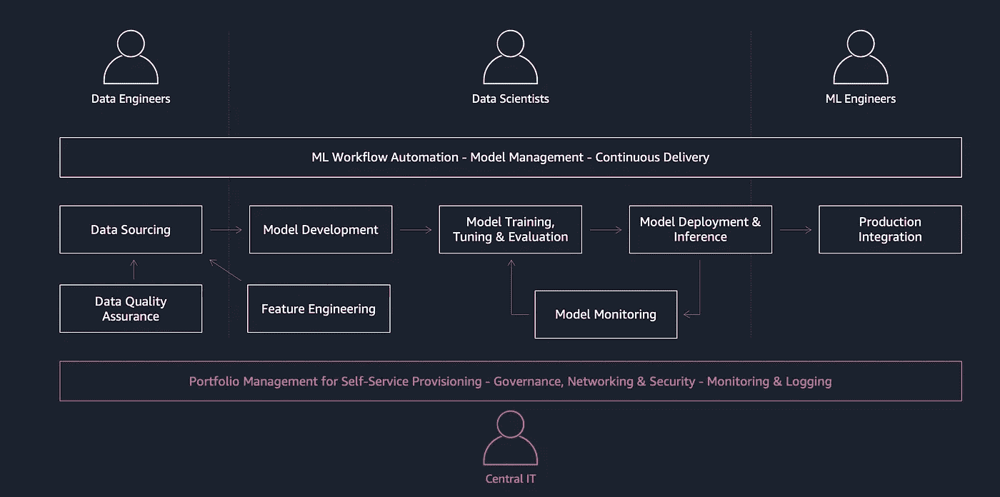
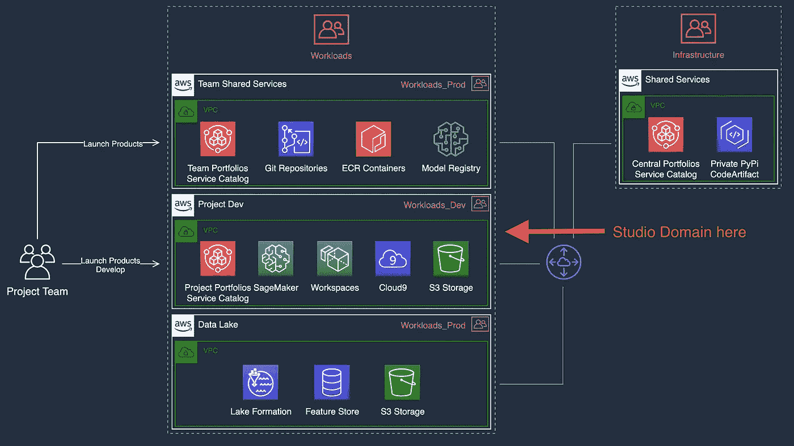
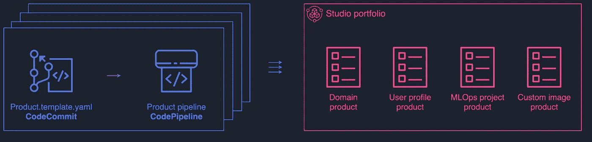
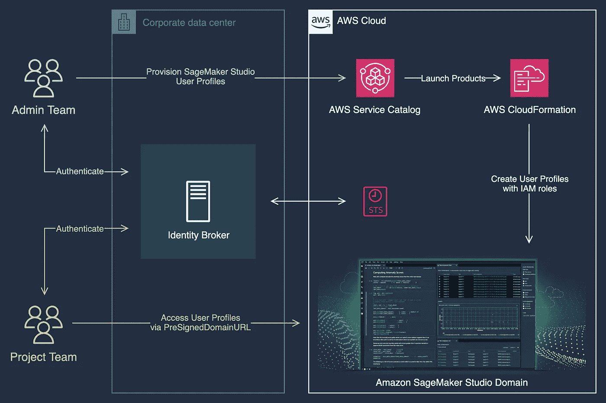
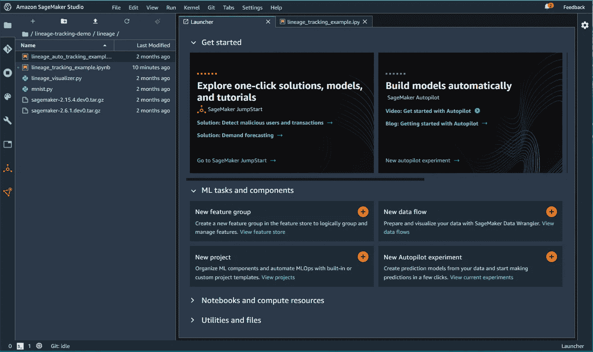
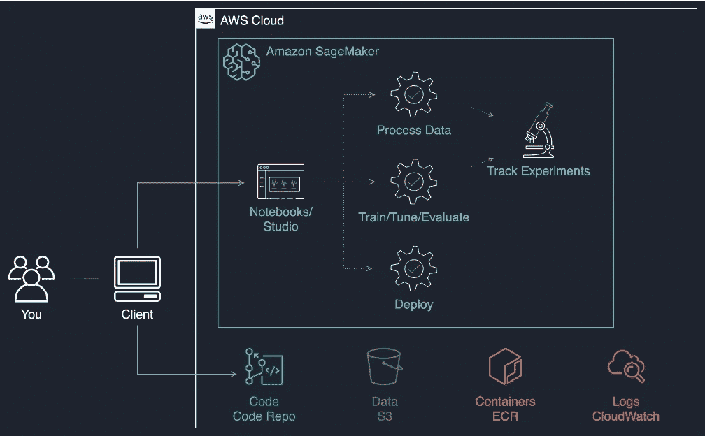
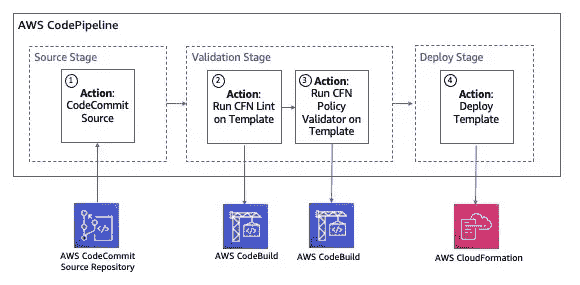
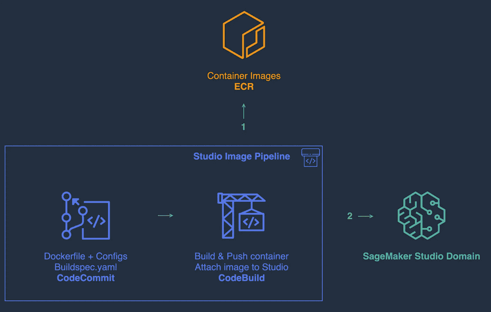
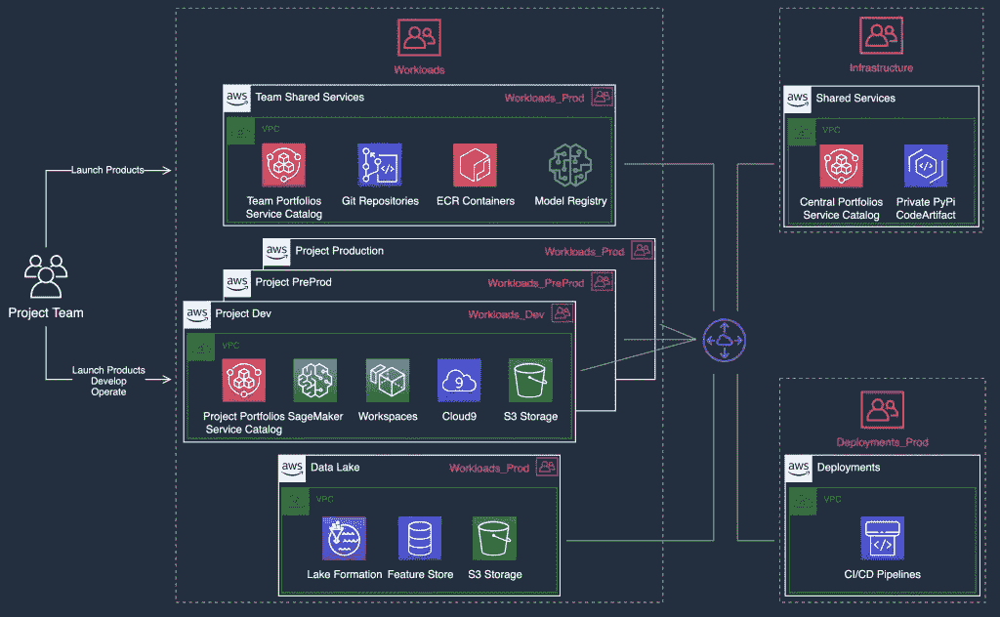
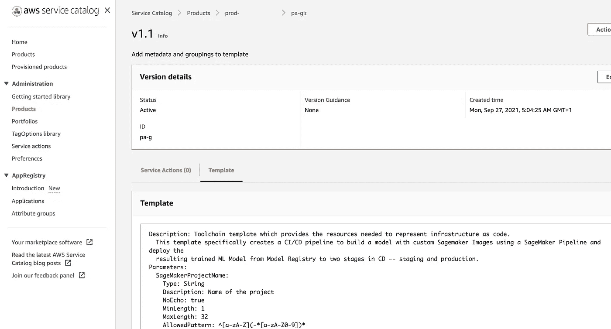

# 利用 Amazon SageMaker Studio 实现 ML 平台的工业化

> 原文：<https://towardsdatascience.com/industrializing-an-ml-platform-with-amazon-sagemaker-studio-91b597802afe?source=collection_archive---------6----------------------->

## 在企业中推广 Studio 的步骤和注意事项

通常在大型企业中，ML 平台管理员需要平衡治理和合规性要求与 ML 团队快速访问工作环境的需求，以及实施其解决方案的脚手架。

由 [Unsplash](https://unsplash.com/?utm_source=unsplash&utm_medium=referral&utm_content=creditCopyText) 上的 [CHUTTERSNAP](https://unsplash.com/@chuttersnap?utm_source=unsplash&utm_medium=referral&utm_content=creditCopyText) 拍摄

用 SageMaker 的话来说，这就是用[工作室](https://aws.amazon.com/sagemaker/studio/)访问安全、治理良好的工作环境，用[管道](https://aws.amazon.com/sagemaker/pipelines/)提供模板化的 MLOps 项目。

SageMaker 提供了现成的，在这篇文章中，我将分享 ML 平台团队如何组织、标准化和加速他们的供应。

*包含相关人物角色的 ML 工作流示例(*作者图片)

# 演练概述

我们将分三步解决这个问题:

*   我们将首先建立多帐户基础和自助服务供应，以便 ML 团队可以在几分钟内访问批准的工作室环境。
*   然后，我们将了解如何管理 Studio 的日常工作。
*   最后，我将展示如何使用 SageMaker 管道来启用模板化的 MLOps 项目。

# 先决条件

要关注这篇文章，请确保您:

1.  像 DevOps 一样，MLOps 是文化、实践和工具的结合，而不仅仅是工具。确保您的企业拥有明确定义的 ML 运营模式和治理流程。MLOps 项目模板应该只是这些的技术实现。
2.  熟悉 [SageMaker 工作室的架构](https://aws.amazon.com/blogs/machine-learning/dive-deep-into-amazon-sagemaker-studio-notebook-architecture/)。
3.  [采用多账户战略](https://docs.aws.amazon.com/whitepapers/latest/organizing-your-aws-environment/benefits-of-using-multiple-aws-accounts.html)将在如何满足您的 ML 平台的治理、安全和运营要求方面发挥最重要的作用。确保您已经阅读了[在 AWS 上建立安全的、治理良好的机器学习环境](https://aws.amazon.com/blogs/mt/setting-up-machine-learning-environments-aws/)。
4.  熟悉 [SageMaker 管道](https://www.youtube.com/watch?v=Hvz2GGU3Z8g)和 [MLOps 项目模板](https://aws.amazon.com/blogs/machine-learning/building-automating-managing-and-scaling-ml-workflows-using-amazon-sagemaker-pipelines/)。

# 步骤 1:允许最终用户访问 Studio

首先，我们希望 ML 团队能够自行供应工作室笔记本电脑，这样，在几分钟内，他们就可以在批准的环境中开始工作。

这将是你的 ML 平台的 V1，一个你的团队可以努力的 sprint 1。

## 在项目开发帐户中设置工作室域

在[这篇文章](https://aws.amazon.com/blogs/mt/setting-up-machine-learning-environments-aws/)中，我分享了一些例子场景和相应的账户模式，你可以采用它们来实现 ML 项目。

当一个新的 ML 项目出现时，您可以创建一组专用于它的帐户，并在 Project Dev 帐户中找到 project team Studio 域。

使用公司数据进行项目试验的示例帐户模式。 *(* 图片[来自博文](https://aws.amazon.com/blogs/mt/setting-up-machine-learning-environments-aws/))

从项目开发帐户中的 Studio 域，团队可以连接到团队共享服务帐户中的团队范围的存储库，并共享诸如代码、容器和 ML 模型之类的资产。由于工作负载 OU 中的帐户实现了公司防护栏，ML 项目团队可以通过安全网关安全地访问数据湖帐户中的数据。在此项目期间开发的工程特征可以提升到数据帐户中的特征存储中以供以后使用。

## 启用经批准的工作室资源的自助供应

您可以使用 AWS 服务目录启用已批准的 Studio 域和用户配置文件的自助供应。项目团队可以从团队共享服务帐户或项目开发帐户访问服务目录组合。

参见[启用 Amazon SageMaker Studio 资源的自助供应](/enabling-self-service-provisioning-of-amazon-sagemaker-studio-resources-7ac017925016)并了解如何为 Studio 创建服务目录组合。

作者图片

## 工作室设置的主要注意事项

在[域](https://docs.aws.amazon.com/AWSCloudFormation/latest/UserGuide/aws-resource-sagemaker-domain.html)级别:

*   **用户笔记本电脑的网络**在 Studio 域级别进行管理。参见[使用私有 VPC 保护亚马逊 SageMaker Studio 连接](https://aws.amazon.com/blogs/machine-learning/securing-amazon-sagemaker-studio-connectivity-using-a-private-vpc/)了解更多详情。
*   **需要为域分配一个默认的 IAM 执行角色**。您可以选择对其所有用户简档使用此默认角色。
*   **MLOps 项目模板**是 Studio 通过 [boto3](https://boto3.amazonaws.com/v1/documentation/api/latest/reference/services/sagemaker.html#SageMaker.Client.enable_sagemaker_servicecatalog_portfolio) 访问的服务目录产品，在[启用权限](https://docs.aws.amazon.com/sagemaker/latest/dg/sagemaker-projects-studio-updates.html)后在 AWS 服务目录控制台可见。您可以运行一个 Lambda 函数来启用它们，如本例中的[和](https://github.com/SofianHamiti/aws-service-catalog-sagemaker-studio/blob/master/domain/templates/studio_template.yaml)所示。

在[用户简档](https://docs.aws.amazon.com/AWSCloudFormation/latest/UserGuide/aws-resource-sagemaker-userprofile.html)级别:

*   **Studio 中的认证**可以通过 SSO 和基于 IAM 的方法来完成。企业可能有一个现有的身份提供者，它在用户访问 AWS 控制台时联合用户。如果是这种情况，您可以使用 IAM 为每个联合身份分配一个 Studio 用户配置文件。请参见[为团队和组配置 Amazon SageMaker Studio 完全资源隔离](https://aws.amazon.com/blogs/machine-learning/configuring-amazon-sagemaker-studio-for-teams-and-groups-with-complete-resource-isolation/)中的*将策略分配给 Studio 用户*部分，了解更多详细信息。

*用户使用 IAM 登录 SageMaker Studio 的认证流程(*图片由作者提供)

*   **IAM 执行角色**也可以分配给每个使用配置文件。使用 Studio 时，用户承担映射到其用户配置文件的角色，这将覆盖域默认执行角色。这可以用于 ML 项目团队中的细粒度访问控制。例如:把数据科学家和 ML 工程师在项目中能做的事情分开。
*   **成本跟踪**可以在账户层面进行，因为每个项目都有专门的账户。AWS 具有内置支持，可在 ML 平台中整合和报告您的整套账户的成本。如果您需要在用户级别跟踪成本，您可以将成本分配标签应用于用户配置文件。例如:标签可以由用户 ID 和项目 ID/成本中心组成。

现在，在您的 ML 平台中，您应该拥有多帐户基础和经批准的工作室环境的自助供应。您的 ML 团队现在可以访问批准的工作室环境，并使用[预建图像](https://docs.aws.amazon.com/sagemaker/latest/dg/notebooks-available-kernels.html)在笔记本上工作。

# 第二步:日常管理工作室

在这里，我们深入探讨 ML 平台团队可能应用于其工作室环境的常见定制。

来源: [SageMaker 文档](https://docs.aws.amazon.com/sagemaker/latest/dg/studio-ui.html)

这可能是一个 sprint 2，但是请记住，定制可能代表您的平台团队的持续努力，因为项目团队的需求会随着时间的推移而发展。

## 使用 IAM 策略管理用户权限

当用户打开 Studio 时，他们承担与其用户配置文件相关联的执行角色，因此需要控制该角色的权限。

您可以简化权限管理，并对参与项目的所有用户配置文件使用相同的 IAM 角色。这是可行的，因为项目已经在帐户级别被隔离。或者，如果 ML 团队有需要不同权限的角色，您可以使用多个 IAM 角色。

SageMaker 提供了[特定于服务的资源、动作和条件上下文键](https://docs.aws.amazon.com/service-authorization/latest/reference/list_amazonsagemaker.html)，以便与 IAM 一起使用。另请参见[本页，了解对其他 AWS 服务的管理权限](https://docs.aws.amazon.com/service-authorization/latest/reference/reference_policies_actions-resources-contextkeys.html#actions_table)。

项目工作流程示例。用户访问他们的 Studio 环境，并在 SageMaker 中手动启动作业，以准备数据、训练和托管模型。(图片由作者提供)

至少，你的 ML 团队想要:

*   能够启动 SageMaker 处理、培训、超参数调整和自动驾驶作业。
*   对 SageMaker 控制台页面具有读取权限，以监控作业状态。
*   他们的容器发送给 *stdout* 或 *stderr* 的任何东西都会被发送到 Amazon CloudWatch 日志。因此，他们将需要对 CloudWatch 日志的读取权限来调试作业和端点。

**规模化管理 IAM 权限**

在某种程度上，您可能会让数百个 ML 团队在您的平台上工作，并且需要一种方法来扩展权限管理。通过 CI/CD 管道实现流程自动化会有所帮助。

在 CI/CD 管道中嵌入 cfn-policy-validator 工具。(图片[来自博文](https://aws.amazon.com/blogs/security/validate-iam-policies-in-cloudformation-templates-using-iam-access-analyzer/)

更多详细信息，请参见[使用 IAM 访问分析器](https://aws.amazon.com/blogs/security/validate-iam-policies-in-cloudformation-templates-using-iam-access-analyzer/)验证云信息模板中的 IAM 策略。

## 在 Studio 中限制实例类型

您可能希望限制 ML 团队在 Studio 中可以使用的实例类型，以控制成本。例如:默认情况下只允许某些 CPU 实例，需要时允许 GPU 实例。

为此，您可以调整用户配置文件的 IAM 权限。特别是，您需要对执行角色限制的是`sagemaker:CreateApp`权限，而`sagemaker:InstanceTypes`是要使用的条件键。

以下是拒绝除 t3 实例之外的所有 SageMaker 实例类型的策略示例:

## 使用生命周期配置定制工作室环境

Studio 支持生命周期配置。它们提供了一种自动地、可重复地将定制应用于 Studio 环境的方法，包括:

*   安装自定义软件包
*   配置非活动笔记本应用程序的自动关闭
*   设置 Git 配置

参见[使用生命周期配置定制 Amazon SageMaker Studio](https://aws.amazon.com/blogs/machine-learning/customize-amazon-sagemaker-studio-using-lifecycle-configurations/)了解更多详情。

## 自动化 SageMaker Studio 自定义图像的设置

除了在[预构建映像](https://docs.aws.amazon.com/sagemaker/latest/dg/notebooks-available-kernels.html)中提供的库之外，您的 ML 团队还可以使用库来运行他们的笔记本。Studio 允许您创建包含他们最喜欢的库的容器，并将它们作为自定义图像附加到他们的域中。

您可以为自定义映像实现简单的连续交付，以自动化该过程。参见[自动化 SageMaker Studio 定制图像的设置](/automating-the-setup-of-sagemaker-studio-custom-images-4a3433fd7148)了解更多详情。

作者图片

您甚至可以将其打包为[服务目录产品](https://github.com/SofianHamiti/aws-service-catalog-sagemaker-studio/tree/master/custom-image)，以便按需访问。

## 在您的服务目录组合中添加更多产品

随着时间的推移，您可以在服务目录中添加更多产品，并使 ML 团队能够在其项目中做更多工作。

以下是您的团队可能需要的产品示例:

*   亚马逊云 9 环境。除了朱庇特之外。
*   容器映像构建器管道。用于构建 SageMaker 作业中使用的 docker 容器的代码 repo + CI 管道。流水线可以[对图像](https://container-devsecops.awssecworkshops.com/)进行林挺和安全扫描。
*   [SageMaker 特征店](https://www.youtube.com/watch?v=mHEUlPFT6xg)中的特征组。
*   亚马逊 EMR 集群[用 Studio](https://aws.amazon.com/blogs/machine-learning/perform-interactive-data-engineering-and-data-science-workflows-from-amazon-sagemaker-studio-notebooks/) 的 Spark 处理数据。
*   亚马逊 EKS 集群
*   任何通过基础设施即代码定义的东西:)

# 步骤 3:使用 SageMaker 管道启用 MLOps 项目

ML 团队可能需要工作流程编排、模型注册和 CI/CD 的脚手架，以减少运行端到端 MLOps 项目的工作量。 [SageMaker Pipelines](https://www.youtube.com/watch?v=Hvz2GGU3Z8g) 满足了这一需求。

在 sprint 3 中，您可以打包 MLOps 项目模板，并允许 ML 团队通过服务目录自行配置它们。

用于构建、培训和部署模型的 MLOps 项目模板示例。(图片[来自博文](https://aws.amazon.com/blogs/machine-learning/building-automating-managing-and-scaling-ml-workflows-using-amazon-sagemaker-pipelines/))

## 为跨客户部署构建 MLOps 项目模板

对于 MLOps，除了 ML 团队可以访问的项目开发帐户之外，您还可以创建项目预编程和项目生产帐户。这将在部署的操作阶段之间提供高级别的资源和安全隔离。参见[账户模式 3 此处](https://aws.amazon.com/blogs/mt/setting-up-machine-learning-environments-aws/)，以及[在 AWS 上构建安全的企业机器学习平台](https://docs.aws.amazon.com/whitepapers/latest/build-secure-enterprise-ml-platform/automation-pipelines.html)了解更多详情。

您可以用来生产 ML 项目的客户布局示例。(图片由作者提供)

您可以从头开始创建[自定义项目模板，或者修改 SageMaker 提供的](https://docs.aws.amazon.com/sagemaker/latest/dg/sagemaker-projects-templates.html)模板。

如果您不确定从哪里开始，您可以在导入的服务目录产品组合中找到预构建的 MLOps 模板。你可以把它们作为自己制作的基础。(图片由作者提供)

您的 MLOps 项目模板需要位于与团队共享服务/自动化帐户共享的服务目录组合中。启动后，它将在该帐户中创建代码仓库、[跨帐户 CI/CD 管道](https://aws.amazon.com/blogs/devops/aws-building-a-secure-cross-account-continuous-delivery-pipeline/)和工件存储。ML 团队可以使用跨帐户 IAM 权限从项目开发帐户访问这些内容。

## 在您的 MLOps 模板中使用第三方工具

您的企业可能有标准化的代码仓库和 CI/CD 工具。

以下是您可以在 MLOps 项目模板中完成的集成示例:

*   对于 CodeCommit、CodeBuild 和 CodePipeline，您可以简单地重用鲍鱼示例的[，并使其跨帐户工作。](https://www.youtube.com/watch?v=Hvz2GGU3Z8g)
*   [使用 GitHub 和 Jenkins 的第三方源代码控制](https://aws.amazon.com/blogs/machine-learning/create-amazon-sagemaker-projects-using-third-party-source-control-and-jenkins/)。
*   [GitLab 和 GitLab 管道](https://github.com/aws-samples/sagemaker-custom-project-templates/tree/main/mlops-template-gitlab)。
*   SageMaker 有一个[原生模型注册表](https://docs.aws.amazon.com/sagemaker/latest/dg/model-registry.html)，但是如果需要的话，你也可以使用 MLflow。请参见[使用 MLFlow 和 Amazon SageMaker 管道的 MLOps】。](/mlops-with-mlflow-and-amazon-sagemaker-pipelines-33e13d43f238)

您甚至可以构建模板来解决重复出现的 ML 用例。

# 结论

在这篇文章中，我分享了 ML 平台团队如何让分布式 ML 团队使用 SageMaker Studio 交付他们的项目，以及这样做的关键考虑。

该方法基于多帐户基础和 AWS 服务目录，允许自助供应经批准的 Studio 环境和 MLOps 项目模板。

更进一步，了解阿斯利康如何在 AWS 上构建了一个工业化的 ML 平台，为数百名科学家简化药物研发、临床试验和患者安全。