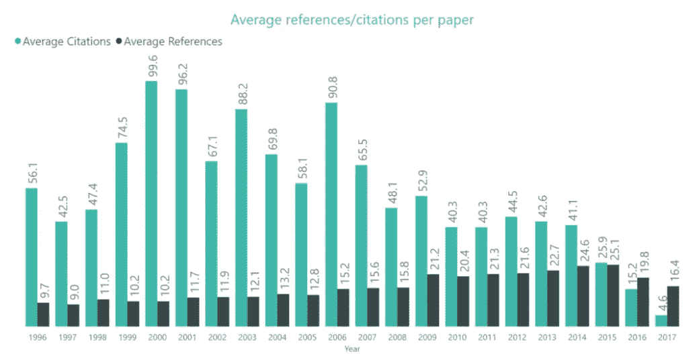

# 机器学习中的工业与学术界

> 原文：<https://towardsdatascience.com/industry-vs-academia-in-machine-learning-3e304033d3f5?source=collection_archive---------3----------------------->

## 我是如何做出决定的

由 [Unsplash](https://unsplash.com/s/photos/decisions?utm_source=unsplash&utm_medium=referral&utm_content=creditCopyText) 上的[路博宣礼塔](https://unsplash.com/@bubo?utm_source=unsplash&utm_medium=referral&utm_content=creditCopyText)拍摄的照片

选择职业本身就很难。与利润丰厚的行业工作相比，博士学位需要 5-6 年的时间，你会对这种可能性感到惊讶。我在本科和硕士毕业后也处于类似的位置(两次都是)。

如果你知道我的[职业道路](https://www.linkedin.com/in/purvanshi-mehta/)，我很幸运地在大二的夏天被介绍到研究中，在那里我从事半监督关系抽取。后来，在进入研究生院之前，我在一个研究实验室做全职工作。这让我得以一瞥全职研究员/博士生的生活。

但尽管有研究经验，我还是在硕士毕业后加入了微软(我目前在那里工作)。做决定的过程是乏味的，因此我最终写下了我的想法。我强烈建议将这篇文章作为一种观点(以及我如何和为什么做出这个决定的更多信息)，并在最终确定你的观点之前与工业界和学术界的许多人交谈。

# 人工智能发展水平

在学术界和工业界全职工作后，我意识到的一件事是

> 在工业界或学术界，你可以从事令人兴奋的工作，是人工智能革命的一部分。现在的问题是你想在哪个层次上发展。

你想把一个古老的基于规则的系统移植到 ML/DL 模型上吗？或者将现有的 ML 回归模型扩展到更先进的水平？或者你可以致力于更基本的问题，并尝试回答一些问题，这些问题将有助于在未来 5-10 年内(显然取决于应用)而不是立即建立系统。我试着通过问自己以下问题来回答我想在哪个‘提升水平’上努力~

## 一个研究问题对你来说有多重要？

> 工业研究主要是面向产品的

除非你是在纯研究组(刚读完硕士甚至博士都很难进)。通常你有一个与产品相关的问题陈述，你试图找到如何解决它的相关工作。如果你在这个过程中发现了一些新奇的东西，你可能会把它出版。

> 业内大多数团体在他们的绩效评估过程中不考虑已发表的作品。所以基本上你自己要有内在动力。

如果你不执着于问题陈述，那么行业研究小组可能是一个不错的选择。

对我来说，我找到了一个积极发表文章的团体，其中大多数人都有博士学位。因此，我发现它非常适合我。

## 影响对你意味着什么？

ML 研究很有趣，但并不是所有的研究都有影响力。来看看数字吧~

arXiv 上与人工智能相关的出版物数量增长了 6 倍多，从 2015 年的[5478 篇增加到 2020 年的](https://www.microsoft.com/en-us/research/project/academic/articles/neurips-conference-analytics/)34736 篇。数量肯定在增加，但我不确定*的质量。*

以下是 NeuriPs 论文每年被引用的图表。随着出版物数量的增加，你的出版物被引用的平均数量逐年减少。这意味着，如果你在 2017 年在 Neurips 发表文章，你的平均引用次数或使用你作品的人数将是 4.6。这些数字在我看来相当可怕。

我知道有一些特别的论文，平均引用率并不是衡量一篇论文价值的最好标准，但至少是对你的影响的一个大概的评估。

有一些特殊的贡献(实际上推动了该领域的发展)，但也有很多因素促使我写这样的论文(其中一些是顾问、我所在的研究实验室、研究领域和我博士期间的良好心理健康)。

# 行业转变

[2019 年，65%的北美人工智能专业毕业博士](https://aiindex.stanford.edu/wp-content/uploads/2021/03/2021-AI-Index-Report_Master.pdf)进入了行业——高于 2010 年的 44.4%，突显出行业开始在人工智能发展中发挥更大的作用。

> 当我作为一名应用科学家在亚马逊工作时，我团队中的所有人都是博士。随着我和他们的交流越来越多，我意识到我可以做类似的工作。

在过去的几年里，人工智能发展的热潮是惊人的。要制造出伟大的产品，有很多工程*要做，这需要阅读论文和思考应用它们的用例的技能，或者你有一个用例，阅读论文就能解决问题。*

> 事实是，并不是每个人在获得机器学习博士学位后都只是做研究。

获得博士学位后，如果我在一个和现在类似的团队工作会怎么样？经历整个过程在当时没有任何意义。

# 学术界很难

这里实话实说吧——学术很难。

*   不可能进行团队变更，或者至少不可能像行业中那样频繁而容易地进行团队变更
*   5-6 年的高度承诺。
*   好的研究是极其困难的，需要耐心。
*   好的研究*我认为*高度依赖于许多其他因素，而不仅仅是你努力工作——*最重要的是你的导师和你与他们的兼容性*。我见过很多聪明人对他们与顾问的关系现状感到不开心和紧张。处于类似的位置是我最大的恐惧。
*   津贴和报酬——感觉这个世界仍然不尊重研究人员。大学没有退休计划，没有股票津贴，甚至不能评论为什么博士工资低。不确定这种情况什么时候会改变，但当时我不想成为这样一个系统的一部分。

尽管有这些因素，我还是非常欣赏在学术界工作的人。我理解对新奇想法的追求和对基本问题的研究。当你追根究底的时候，我能理解智力模拟！

# 学术界的支持者

我仍然考虑回到学术界，特别是当我在日常工作中不得不做一些平凡的任务时(欢迎加入工业界)。作为一名博士，你从事的工作有很多好处

*   *拥有你的作品——你的论文是你的，会以你的名字被引用。如果所有权是你所追求的，那么在大公司里，有 100 或 1000 人在开发一个产品，这是非常困难的。*
*   *智力模拟——我相信这就是人们攻读博士学位的原因。发现事物和回答未回答问题的乐趣。*

# *结论*

*最后，一切都是关于令人兴奋的话题。不管是生产还是研究。我不知道我是否能拿到博士学位。但是如果我做了，我肯定会准备得更好。工业将会给*添加非常需要的观点，什么是重要的*和什么是重要的问题。*