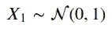
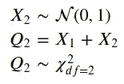
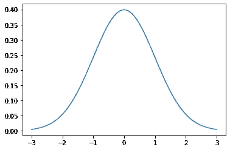
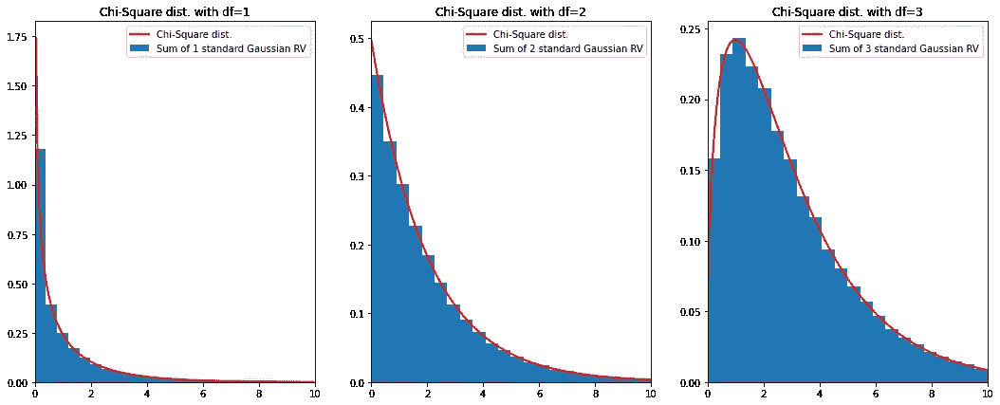
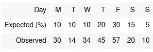
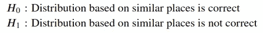
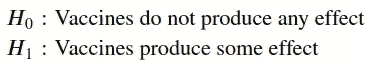
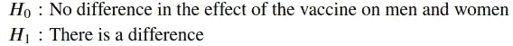
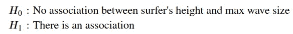
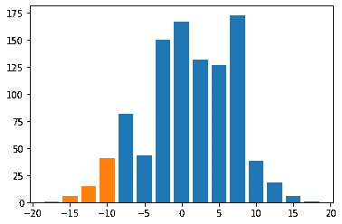

# 用 Python 对分类数据进行推理

> 原文：<https://towardsdatascience.com/inference-for-categorical-data-9f3c6034aa57?source=collection_archive---------28----------------------->

## 用 Python 实现大学统计

# 介绍

在一系列的每周文章中，我将会涉及一些重要的统计学主题。

目标是使用 Python 来帮助我们获得对复杂概念的直觉，从经验上测试理论证明，或者从零开始构建算法。在本系列中，您将会看到涵盖随机变量、抽样分布、置信区间、显著性检验等主题的文章。

在每篇文章的最后，你可以找到练习来测试你的知识。解决方案将在下周的文章中分享。

迄今发表的文章:

*   [伯努利和二项随机变量与 Python](/bernoulli-and-binomial-random-variables-d0698288dd36)
*   [用 Python 从二项式到几何和泊松随机变量](/geometric-and-poisson-random-variables-with-python-e5dcb63d6b55)
*   [用 Python 实现样本比例的抽样分布](/sampling-distributions-with-python-f5a5f268f636)
*   [Python 的置信区间](/confidence-intervals-with-python-bfa28ebb81c)
*   [使用 Python 进行显著性测试](/significance-or-hypothesis-tests-with-python-7ed35e9ac9b6)
*   [用 Python 进行组间差异的双样本推断](/two-sample-inference-for-the-difference-between-groups-with-python-de91fbee32f9)
*   [分类数据的推断](/inference-for-categorical-data-9f3c6034aa57)
*   [高级回归](/advanced-regression-f74090014f3)
*   [方差分析— ANOVA](/analysis-of-variance-anova-8dc889d2fc3a)

像往常一样，代码可以在我的 [GitHub](https://github.com/luisroque/College_Statistics_with_Python) 上找到。

# 卡方分布

让我们从定义一个标准的正态分布随机变量(RV) X_1 开始。



为了定义我们的第一个卡方 RV，我们从我们的标准正态分布 X_1 中取样并对结果求平方。因为我们取一个标准正态分布变量的和，所以我们将卡方分布的自由度定义为 1。为了定义具有 2 个自由度的卡方 RV，我们遵循相同的想法。这次我们从两个独立的标准正态分布 RVs 中取样，取各自样本的平方，最后对结果求和。



```
from scipy.stats import norm, chi2
import matplotlib.pyplot as plt
import math
import numpy as np
import seaborn as sns
from scipy import stats
import tabulate
import pandas as pd
from IPython.display import HTML, display
import tabulatemu = 0
variance = 1
sigma = math.sqrt(variance)
x = np.linspace(mu - 3*sigma, mu + 3*sigma, 100)
sns.lineplot(x = x, y = norm.pdf(x, loc=mu, scale=sigma));
```



图 1:标准正态分布的概率密度函数。

```
norm_dist = stats.norm(0, 1)

x1 = norm_dist.rvs(size=100000)**2
x2 = norm_dist.rvs(size=100000)**2
x3 = norm_dist.rvs(size=100000)**2

x = [x1, x2, x3]

_, ax = plt.subplots(1, 3, figsize=(18, 7))

f = np.zeros(100000)
for i in range(3):
    x_ = x[i]
    f += x_

    ax[i].hist(f, 60, density=True, label=f'Sum of {i+1} standard Gaussian RV')

    d = np.arange(0, 10, .05)
    ax[i].plot(d, stats.chi2.pdf(d, df=i+1), color='r', lw=2, label='Chi-Square dist.')
    ax[i].set_xlim(0, 10)
    ax[i].set_title(f'Chi-Square dist. with df={i+1}')
    ax[i].legend()
```



图 2:来自平方标准正态分布(正态分布的总和等于自由度的数量)的样本直方图与卡方分布的概率密度函数之间的比较。

# 适合度

芮在一家科技公司远程工作。如果人不太多的话，他喜欢在咖啡店工作。最近新开了一家咖啡店，他想了解一周中每天的顾客分布情况。这样，他会选择百分比较小的日子在那里工作。根据他在类似地方的经验，他画出了一周中每天顾客数量的分布。为了测试这一假设，在接下来的 3 个月里，他随机选择了一周中每天的一个样本，并记录了观察到的顾客数量。

```
table = [["Day",'M','T', 'W', 'T', 'F', 'S', 'S'],
         ["Expected (%)",10,10, 10, 20, 30, 15, 5],
         ["Observed",30, 14, 34, 45, 57, 20, 10]]
display(HTML(tabulate.tabulate(table, tablefmt='html')))
```



表 1:一周中每天新咖啡店的顾客分布。

在进一步讨论之前，我们需要确保满足卡方拟合优度测试条件。我们先来列举一下:

*   样本必须是随机的
*   每类结果的预期数量必须大于或等于 5(也称为大计数条件)
*   要求样本是独立的。经验法则是，如果你是在没有替换的情况下抽样，你的样本量应该少于总体量的 10%

我们被告知，芮随机选择了一周中的每一天，所以第一个标准得到了满足。对于大计数的条件，让我们计算一周中每天的预期客户数。

```
n = 7 # number of days in a week
alpha = 0.05

table = np.asarray(table)[1:,1:]
table = table.astype(np.float32)
table[0] = table[0]/100total_number_customers = np.sum(table[1])
expected_num = table[0]*total_number_customerstable = np.concatenate((table, expected_num.reshape(1,-1)))
table[2]array([ 26.460001,  64.26    ,  85.049995, 107.729996,  37.8     ,
        18.9     ], dtype=float32)
```

请注意，我们没有任何小于 5 的值。最后，我们有独立的条件。Rui 从 3 个月的人口中选择了每一天，这给了我们每一类 12 个可能的值。这意味着芮抽样的样本不到总人口的 10%,即使他的样本没有替换，我们也可以假设它是独立的。

根据这些数据，Rui 定义了以下假设检验:



首先，他必须计算一个统计数据，比较估计的和观察到的客户数量。它近似遵循卡方分布。如果基于相似位置的分布是正确的，他可以使用这个统计量来计算观察到特定值或更极端值的概率。如果这个概率小于显著性水平(让我们使用α=0.05)，我们可以拒绝 H_0，从而接受另一个假设，即新咖啡店每天的顾客分布不同于芮考虑的类似场所。

```
chi_sq_statistic = np.sum((table[2]-table[1])**2/table[2])
chi_sq_statistic19.246035(1-chi2.cdf(chi_sq_statistic, df=n-1))<alphaTrueif (1-chi2.cdf(chi_sq_statistic, df=n-1))<alpha:
    print('Reject H_0')Reject H_0
```

我们根据 Rui 收集的观察结果拒绝了 h0，这些观察结果包括新咖啡店每天的顾客数量。事实上，我们拒绝了 h0 意味着新的地方不遵循假设的分布定义的芮根据他的经验在类似的地方。

# 列联表卡方检验

一个政府机构想知道目前正在使用的针对新冠肺炎病毒的疫苗是否对新的 Delta 变种有任何效果。他们将样本分成 3 组:第一组服用辉瑞的疫苗，第二组服用让桑，第三组服用安慰剂。


图 3:新冠肺炎疫苗；[来源](https://unsplash.com/photos/mAGZNECMcUg)

```
table = [['Sick', 15, 10, 30],['Not sick', 100, 110, 90]]
alpha = 0.05
df = pd.DataFrame(table)
df.columns = ['Effect', 'Pfizer', 'Janssen', 'Placebo']
df = df.set_index('Effect')
df
```


表 2:服用疫苗(辉瑞和让桑之间)或安慰剂的患病或未患病人群的样本数量。

让我们定义我们的假设检验:



像在任何假设检验中一样，我们将假设零假设为真，并计算得到上面收集的数据的可能性。如果它低于显著性水平，我们拒绝零假设。

```
arr = df.to_numpy()
arr = np.concatenate((arr, (arr.sum(axis=1)[0]/arr.sum() * arr.sum(axis=0)).reshape(1,-1)))
arr = np.concatenate((arr, (arr.sum(axis=1)[1]/arr.sum() * arr.sum(axis=0)).reshape(1,-1)))
arrarray([[ 15\.        ,  10\.        ,  30\.        ],
       [100\.        , 110\.        ,  90\.        ],
       [ 17.81690141,  18.5915493 ,  18.5915493 ],
       [ 97.18309859, 101.4084507 , 101.4084507 ]])chi_sq_statistic = np.sum((arr[2] - arr[0])**2/arr[2]) + np.sum((arr[3] - arr[1])**2/arr[3])
```

我们应该使用的自由度数等于表的行数减 1 乘以列数减 1。

```
print('P-value = ' + str(np.round(1-chi2.cdf(chi_sq_statistic, df =2*1), 4)))P-value = 0.0012if 1-chi2.cdf(chi_sq_statistic, df =2*1) < alpha:
    print('Reject H_0')Reject H_0
```

我们拒绝了 h0，这意味着疫苗产生了一些效果，并影响了我们实验中的患病人数。

# 同质性卡方检验

同一家机构决定测试辉瑞的疫苗，但这次的目标是测试对男性和女性的效果。

这是一个同质性检验，可以转化为以下假设:



```
table = [['Sick', 25, 12],['Not sick', 92, 88]]
alpha = 0.05
df = pd.DataFrame(table)
df.columns = ['Effect', 'Men', 'Women']
df = df.set_index('Effect')
df
```


表 3:服用辉瑞疫苗的患病或未患病的男女样本数量。

```
arr = df.to_numpy()
arr = np.concatenate((arr, (arr.sum(axis=1)[0]/arr.sum() * arr.sum(axis=0)).reshape(1,-1)))
arr = np.concatenate((arr, (arr.sum(axis=1)[1]/arr.sum() * arr.sum(axis=0)).reshape(1,-1)))
arrarray([[25\.        , 12\.        ],
       [92\.        , 88\.        ],
       [19.94930876, 17.05069124],
       [97.05069124, 82.94930876]])chi_sq_statistic = np.sum((arr[2] - arr[0])**2/arr[2]) + np.sum((arr[3] - arr[1])**2/arr[3])print('P-value = ' + str(np.round(1-chi2.cdf(chi_sq_statistic, df =1*1), 4)))P-value = 0.0674if 1-chi2.cdf(chi_sq_statistic, df =1*1) < alpha:
    print('Reject H_0')
else:
    print('Fail to reject H_0')Fail to reject H_0
```

请注意，尽管观察到这些值或甚至更极端值的概率相当低(约 6.7%)，但我们未能拒绝 H_0。这意味着我们没有足够的证据表明疫苗对男性和女性的效果有差异。

# 关联的卡方检验

最后，让我们为两个变量之间的关联建立一个卡方检验。在这种情况下，我们想要测试冲浪者的身高 X 和他曾经冲浪的最大浪高 y 之间是否存在关联。请注意，这个特定的测试使用了单一人群的随机样本。



```
table = [['x<1.6m', 25, 22, 28],['1.6m<=x<1.9m', 10, 21, 35], ['x>=1.9m', 5, 10, 34]]
alpha = 0.05
df = pd.DataFrame(table)
df.columns = ['height', 'y<2m', '2m<=y<4m', 'y>=4m']
df = df.set_index('height')
df
```


表 4:不同冲浪者高度的样本数量 X/曾经冲浪的最大波浪尺寸 y。

```
arr = df.to_numpy()

for i in range(arr.shape[0]):
    arr = np.concatenate((arr, (arr.sum(axis=1)[i]/arr.sum() * arr.sum(axis=0)).reshape(1,-1)))
arrarray([[25\.        , 22\.        , 28\.        ],
       [10\.        , 21\.        , 35\.        ],
       [ 5\.        , 10\.        , 34\.        ],
       [15.78947368, 20.92105263, 38.28947368],
       [13.89473684, 18.41052632, 33.69473684],
       [10.31578947, 13.66842105, 25.01578947]])chi_sq_statistic = np.sum((arr[3] - arr[0])**2/arr[3]) + np.sum((arr[4] - arr[1])**2/arr[4]) + np.sum((arr[5] - arr[2])**2/arr[5])print('P-value = ' + str(np.round(1-chi2.cdf(chi_sq_statistic, df =2*2), 4)))P-value = 0.0023if 1-chi2.cdf(chi_sq_statistic, df =2*2) < alpha:
    print('Reject H_0')
else:
    print('Fail to reject H_0')Reject H_0
```

我们拒绝 H_0，也就是说，有证据表明冲浪者的高度和最大浪高有关联。

# 结论

本文涵盖了卡方检验家族的一部分。它们有助于检验关于分类数据分布的假设。我们评估了适合度检验，即检验样本数据是否符合假设分布。我们还看到了两个变量之间不同类型的独立性检验。当我们从两个不同的人群中抽取样本时，我们检验同质性。如果我们从一个总体中取样，我们测试变量之间的关联。

保持联系: [LinkedIn](https://www.linkedin.com/in/luisbrasroque/)

# 练习

你将在下周的文章中找到答案。

1.  根据冲浪板经销商的说法，66%的冲浪板是常见的，25%是不常见的，9%是罕见的。José想知道他和他的朋友拥有的板子的稀有程度是否遵循这种分布，所以他随机抽取了 500 块板子并记录了它们的稀有程度。结果如下表所示。进行拟合优度测试，以确定 José和他的朋友拥有的冲浪板的稀有程度分布是否与声称的百分比不一致。

```
table = [['Cards', 345, 125, 30]]
alpha = 0.05
df = pd.DataFrame(table)
df.columns = ['Rarity level', 'Common', 'Uncommon', 'Rare']
df = df.set_index('Rarity level')
df
```


## 上周的答案

1.  医生假设，疫苗接种前后因新冠肺炎而住院的平均时间发生了变化。将 1000 名患者随机分为治疗组和对照组。治疗组已经注射了疫苗，而对照组没有注射。结果显示，治疗组的平均住院时间比对照组少 10 天。下表总结了 1000 次数据重新随机化的结果。根据数据，治疗组的平均值比对照组的平均值小 10 天或更多的概率是多少？从实验结果中你能得出什么结论(假设 5%的显著性水平)？

```
diff = [[-17.5,1],
[-15.0, 6],
[-12.5, 15],
[-10.0, 41],
[-7.5, 82],
[-5.0, 43],
[-2.5, 150],
[0., 167],
[2.5, 132],
[5.0, 127],
[7.5, 173],
[10.0, 38],
[12.5, 18],
[15.0, 6],
[17.5, 1]]plt.bar(x = np.asarray(diff)[:,0], height = np.asarray(diff)[:,1], width=2, color='C0')
plt.bar(x = np.asarray(diff)[:4,0], height = np.asarray(diff)[:4,1], width=2, color='C1');
```



```
diff = np.asarray(diff)np.sum(diff[diff[:,0]<=-10][:,1])/np.sum(diff[:,1]) < 0.05False
```

基于 5%的显著性水平，结果不显著。实验中测量到的差异可能仅仅是随机因素造成的。