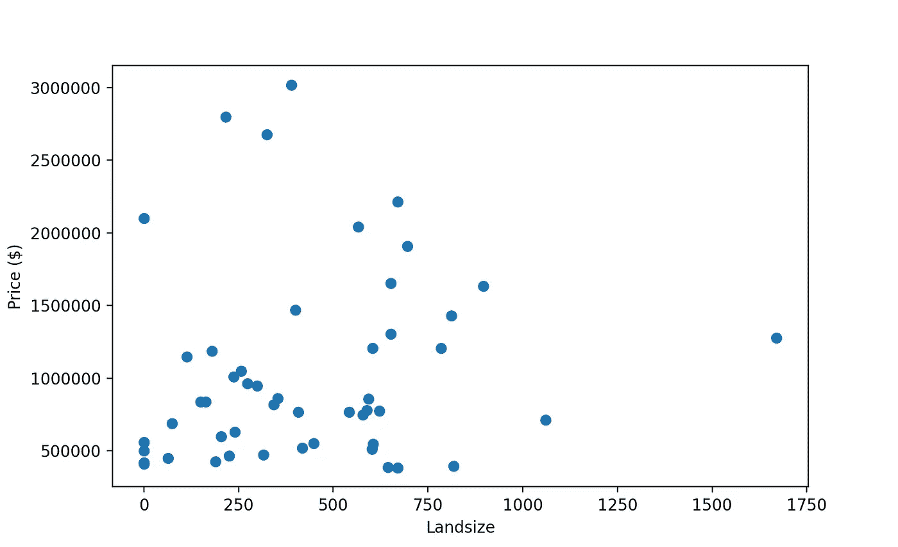

# 推断和预测的区别是什么

> 原文：<https://towardsdatascience.com/inference-vs-prediction-b719da908000?source=collection_archive---------13----------------------->

## 在统计学习的背景下讨论预测和推断的区别

Jonathan Pielmayer 在 [Unsplash](https://unsplash.com/s/photos/table?utm_source=unsplash&utm_medium=referral&utm_content=creditCopyText) 上的照片

## 介绍

简单来说，统计学习是指可以应用于**估计未知函数** ***f*** 的方法和途径的集合。

例如，让我们假设我们必须处理一些房地产数据，以便我们可以潜在地找到属性的特征(即预测值或自变量)与其估值(目标或因变量)之间的关系。其中一些特征可能与实际价格有关，可能是位置、卧室数量、建造日期、土地面积等等。

为了说明这个概念，让我们以墨尔本住房数据集为例。下面，我们将 50 处房产的价格与相应的土地面积进行对比。

蓝点是观察到的房产价值和土地面积——来源:[作者](https://gmyrianthous.medium.com/)

现在，我们可能有兴趣尝试使用土地面积来预测房地产的价格。然而，指定价格和地产土地面积之间关系的函数是未知的。

为了将这个问题放到更一般的背景下，我们本质上假设在响应(即价格) **Y** 和独立变量(即土地大小、卧室数量等)之间存在某种关系。)X = (X1，X2，…)。换句话说，我们可以用下面的符号来建模

> Y = *f* (X) + *ε*

其中 *f(X)* 为自变量的未知函数， *ε* 为误差项(平均值约为零)。

现在，根据我们想要达到的目标和我们需要回答的(潜在的商业)问题，我们首先需要估计函数 *f* 有两个基本原因。我们要么想执行**推理**或**预测**。

## 预言；预测；预告

在许多用例中，独立变量 X 是可用的，而输出 Y 通常是未知的(或者不能以直接的方式计算)。因此，**估计**未知函数 *f* 并使用它对输出 y 进行预测可能是有用的。在这种情况下，符号将变为

> ŷ=f̂(x)

其中 *f̂* 对应于未知函数 *f 的估计值，而*ŷ代表目标变量 y 的预测值。我们还省略了误差项 *ε* ，因为它的平均值为零。

换句话说，当对数据执行**预测**时，我们最感兴趣的是**估计** *f.* 我们对估计函数的确切形式不感兴趣，只要它能相当精确地执行预测。

为了将上述内容放在一个背景中，让我们再来看一下我们的房地产定价例子。X1，X2，..是独立变量，对应于物业的特征(如土地面积、卧室数量等)，Y 是物业的实际价格。在这种情况下，用 X 来预测 Y 是非常有益的，因为这将有助于你避免为某个特定的房产支付过高的价格，或者在房地产市场发现好的机会。

由于 *f̂* 是一个估计值，预计它不会是实际 *f* 的完美估计值，因此会引入一定量的误差(称为可约误差)。即使我们能够完美地估计出 *f* ，我们仍然会观察到一些误差，因为 *f* 本身就是 *ε* (这是不可约误差)*的函数。*

总之，在进行预测时，我们感兴趣的是尽可能准确地估计未知函数，即通过使用最合适的统计学习技术来最小化可约误差。

## 推理

在其他情况下，我们可能需要或必须了解自变量 X 影响目标变量 y 的方式。在这种情况下，我们仍然对估计 *f* 感兴趣，但是我们并不真的需要执行任何类型的预测。

换句话说，我们有兴趣了解 X 和 Y 之间的关系，以及后者如何作为前者的函数而变化。当我们想要了解哪些自变量实际上与目标变量相关联时，通常会用到推断。

为了更好地理解这一点，让我们再次考虑一下房地产的例子。在收集的房产特征(土地面积、卧室数量、位置等)中。)实际上只有这些特征的子集与价格相关联。

此外，我们可能需要了解目标变量和每个独立预测因子之间的关系。例如，我们可能希望观察某个特定的预测值(比如卧室数量)是否对 y 有积极的贡献。例如，当卧室数量增加时，价格是否会增加。

最后，推理的另一个重要应用是当我们需要了解自变量 X 与目标变量 Y 之间的关系是否为线性时。

## 最后的想法

在今天的文章中，我们讨论了统计学习中的一些基本概念，并探讨了预测和推断之间的主要区别。

在预测设置中，我们感兴趣的是尽可能准确地估计 *f* ，这样我们就可以根据独立变量 X 对目标变量 Y 进行预测。另一方面，在推理设置中，我们仍然感兴趣的是估计 *f* ，但这次不是进行任何类型的预测，而是为了理解 X 和 Y 之间的关系

[**成为会员**](https://gmyrianthous.medium.com/membership) **阅读媒介上的每一个故事。你的会员费直接支持我和你看的其他作家。**

**你可能也会喜欢**

</what-is-machine-learning-e67043a3a30c>  </supervised-vs-unsupervised-learning-bf2eab13f288>  </14-must-know-pip-commands-for-data-scientists-and-engineers-a59ebbe0a439> 