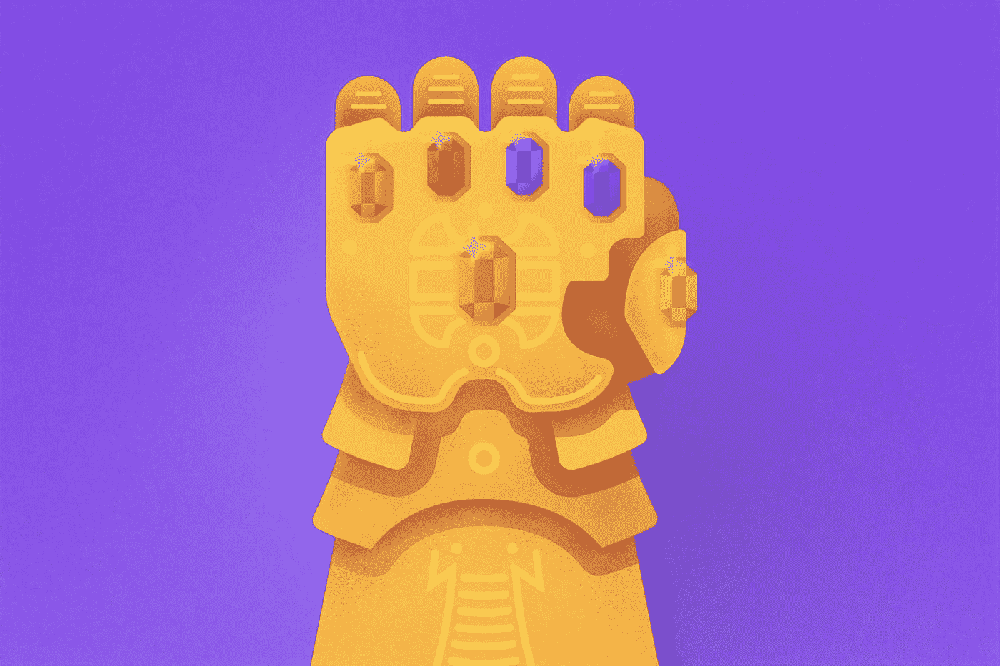
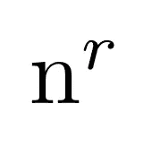
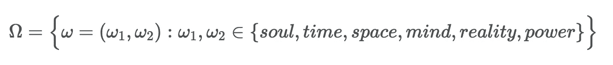
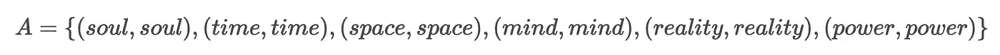
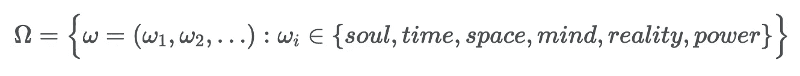
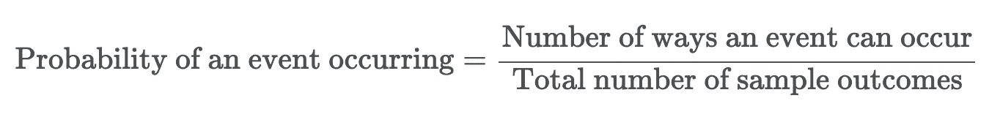

# 无限宝石和样品空间

> 原文：<https://towardsdatascience.com/infinity-stones-and-sample-spaces-ad890c9be950?source=collection_archive---------58----------------------->

## 以有趣的方式学习概率！

照片由[晨酿](https://unsplash.com/@morningbrew?utm_source=medium&utm_medium=referral)在 [Unsplash](https://unsplash.com?utm_source=medium&utm_medium=referral) 拍摄

掌握概率是一个人最接近拥有超能力的方式。这是你可以应用到日常生活中的越来越有用的技能之一。你可以用它来决定某些事件的结果，在赌场大获全胜，甚至用它来阻止强大的灭霸毁灭半个宇宙！开玩笑的。本质上，我说的是概率是你如何量化/描述一个随机事件。这是一种语言和远见，让你做出明智的决定，并且很可能在事情发生之前就知道会发生什么。

## 先决条件和符号

*   ω:样本空间；考虑了一套。
*   ω:样本结果。
*   *A* :事件；ω的子集[。](https://en.wikipedia.org/wiki/Set_(mathematics))
*   | *A* |:集合 *A.* 中元素的个数
*   a ∈ *S* :值 a 是集合 *S* 的“一个成员”或简单的“在”集合*S*中。

先举个例子吧！

顺便说一句，我喜欢漫画书，电影世界，以及所有流行文化的优点。我假设很多读者对此都很熟悉，所以我的例子将围绕这些主题。例如，假设钢铁侠正与疯狂的泰坦灭霸对决，后者已经拥有了所有六块无限宝石。在他们激烈的战斗中，史塔克的目标是防止灭霸折断他的手指，为了确保这一点，钢铁侠需要的是六块石头中的一块！

现在，由于灭霸是最难对付的坏人，我们将认为这种联系是一个“随机事件”。钢铁侠独自一人，没有了托尔、惊奇队长和其他复仇者，因此我们认为钢铁侠只能获得六块无限之石中的一块，并在灭霸消灭他之前逃离。我们还必须声明，从灭霸只获得六颗无限宝石中的一颗也是同样可能的结果。我们还必须注意到，这场战斗很容易重复，每场战斗的结果都不会改变。

有很多东西要吃吗？欢迎来到数学课，别担心。变得容易了。

我们将把这场战斗称为“实验”。在这个实验中，有六种可能的结果:获得灵魂石、时间石、空间石、心灵石、现实石或力量石。在与灭霸的一场战斗之后，我问，比如说，获得心灵之石的可能性有多大？

## 示例空间和事件

众所周知，数学是一项极其严谨的工作。因此，为了明智地谈论钢铁侠和灭霸之间的激烈战斗，我们从定义几件事情开始。

我们将从**样本空间**开始。用ω表示的样本空间是实验中所有可能结果的集合。集合ω中的元素用ω表示，称为**样本结果**。ω的任何子集被称为一个**事件**，并由 *A* 表示。

回到灭霸的例子，如果我们正好与灭霸战斗一次，那么我们的样本空间由ω*= {灵魂、时间、空间、思想、现实、力量}* 定义。一个简单的结果是获得由ω *=威能定义的灵能石。*一个事件可以是一个实验的一个或多个样本结果(子集)。让我们更难一点，如果我们和灭霸打，比方说…两次，样本空间是多少？

我们如何定义在两场战斗中**选择相同的**无限之石的事件？嗯，在这种情况下，有 36 个样本结果(|ω| = 36)而在我们的样本空间里: *{(灵魂，时间)，(灵魂，空间)，…}* 。如果这令人困惑，不要担心。我一点也不明白为什么会有 36 种可能的结果。为了更好地理解这一点，我们将涉猎**组合学**。样本结果的数量可以使用以下公式计算:

其中 *n* 代表可供选择的项目数量，而 *r* 代表我们希望选择的数量。此处可以找到对该公式的详细描述[。因此，在我们的例子中，有 6 个无限宝石可供选择，我们希望选择其中的 2 个，因此 6 = 36。](https://www.mathsisfun.com/combinatorics/combinations-permutations.html)

我们不会列出所有的可能性，但是相反，我们会做一些更好的事情来定义这个**样本空间**。我们将使用数学符号！

如果我们和灭霸打两次，样本空间就是集合:

符号∈仅仅意味着一个元素在集合中。如果ω₁ =灵魂和设定*s = {灵魂、时间、空间、心灵、现实、力量}* 。那么我们可以说灵魂石是集合 *S* 的“成员”,或者用集合符号表示:ω₁ ∈ S。在两场战斗中选择相同的无限石的事件可以描述为:

用| *一个* | = 6。如果钢铁侠和灭霸打无数次，样本空间会是多少？嗯，应该是这样的:

就像美国队长会说的，“我可以一整天都这样”。

那么什么是概率呢？嗯，可以定义为:

所以让我们把这个概念和我们的例子联系起来。如果钢铁侠打灭霸**两次**，钢铁侠拿**同**无极石的概率有多大？嗯，样本结果的总数是|ω| = 36，它发生的方式是| *A* | = 6，所以我们简单地除以 6/36 = 1/6。因此，在两场战斗中，钢铁侠都有 1/6 的几率选择相同的无限之石。

总而言之，在这篇博文中，我们基本上了解了概率论中的随机实验。为了形式化，随机实验包括三个部分:

1.  样本空间ω，它是所有样本结果的集合。
2.  一组事件，其中每个事件 A 是包含零个或多个样本结果的ω的子集。
3.  每个事件都必须有一个概率。

现在，这对你意味着什么？好了，现在基础架构已经到位，并且已经迈出了理解统计学的第一步，你会看到数学经常出现在最意想不到的地方，然而却是最令人兴奋的地方！

正如尼克·弗瑞(Nick Fury)在《钢铁侠》(Iron Man)的结尾所说，“斯塔克先生，你已经成为一个更大宇宙的一部分。你只是还不知道罢了。”