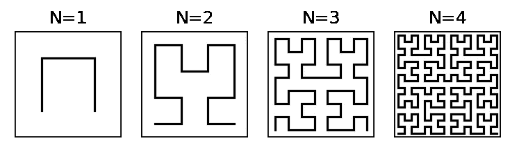
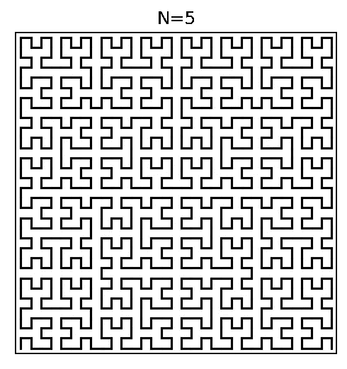
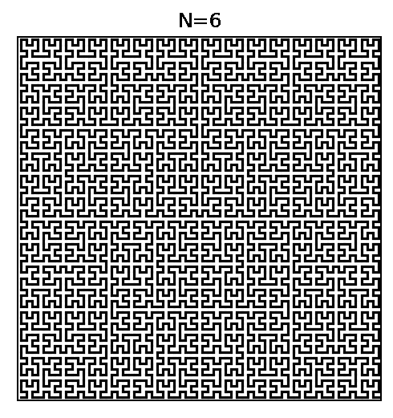

# 深度学习中的信息瓶颈与降维

> 原文：<https://towardsdatascience.com/information-bottlenecks-c2ee67015065?source=collection_archive---------22----------------------->

## [思想与理论](https://towardsdatascience.com/tagged/thoughts-and-theory)《语音处理笔记》，2021 年 9 月 2 日

自动编码器和其他具有信息瓶颈的深度神经网络已经成为时尚。启发式思想是减少隐藏层的维度，使得网络被迫关注数据的重要部分。实验也证明了自动编码器在这个意义上是有效的。然而，我一直在想，T2 的信息量是否可以用精确的术语来描述。有多少信息通过瓶颈流动？我们该如何衡量呢？

这篇短文是我描述和理解这个问题的尝试。我将从信息论和线性代数的一些经典概念开始，然后讨论这些概念在机器学习中的适用程度。一个中心结果是隐藏层的*维度不能单独用作信息内容的度量。*

## 离散表示中的信息内容

如果一个系统有两种状态，A 和 B，那么显然我们可以用一个比特来表示状态。4 个状态可以用 2 位表示，8 个状态用 3 位表示，一般来说，N 个状态用 log2(N)位表示。因此，我们总能很容易地确定状态数有限的系统所需的位数。描述状态所需的比特数是系统信息量或熵的直接度量。

如果我们能额外得到每个状态的概率，我们可以把它扩展到可数集合，比如整数。然后，我们可以陈述平均比特率，也就是说，如果我们多次观察系统，我们平均需要多少比特来表示状态？如果状态 *k* 的概率为 *Pk* ，则表示该状态所需的比特数为- *log2 Pk* 。该比特率，- *log2 Pk* 以概率 *Pk* 出现，使得平均比特率可以被计算为总和，- *sum Pk log2 Pk* ，其中总和覆盖所有 *k* 。这也适用于 k 遍历一个无限但可数的集合。

## 线性连续值系统中的信息量

如果题目比较混乱，就想到*线性代数*。一个长度为 *N* 的向量 *x* 有多少信息。嗯，还没有真正的定义。然而我们所知道的是，如果我们用矩阵 *A* 乘以矩阵 *y=Ax* ，那么如果矩阵 *A* 是满秩的，那么所有信息都被保留。其实那我们就可以通过求逆 *x=inv(A)y* 从 *y* 中恢复出 *x* 。没有信息丢失。显然， *A* 的等级因此定义了其容量移除信息。如果*等级为(A) < N* ，则信息丢失，并且无法从 *y* 恢复。

然而，这还不是故事的全部。在逆运算的实际实现中，我们知道不仅秩是重要的，而且 *A* 的条件也是重要的。如果 *A* 的任何奇异值接近零，则 *A* 变得病态，使得从 *y* 恢复 *x* 在数值上变得困难。在最好的情况下，我们失去了准确性，使得 *x* 只能被近似地恢复，在严重的情况下，信息可能完全丢失。因此，信息内容不仅通过维度来描述，还通过准确性来表征。正如我们将看到的，我认为把信息的损失描述为准确性的损失比描述维度的损失更有用。

## 转向:空间填充曲线

如果你没有听说过空间填充曲线，那就从观看关于它们的[数字爱好者视频](https://www.youtube.com/watch?v=x-DgL49CFlM)开始吧。这个想法是一个无限的递归；你从一个穿过空间的简单形状开始。然后，您将扭曲添加到该形状，以便它在空间中扩展得更大。重复添加更多的摆动会使曲线越来越分散，以至于它收敛到覆盖整个空间。一维线因此覆盖了整个二维空间(即其[豪斯多夫维数](https://en.wikipedia.org/wiki/Hausdorff_dimension)为 2)。

就信息内容而言，现在，一维曲线包含了二维空间的信息。如果我们从 2D 空间中的某个特定点 *(x，y)* 开始，我们可以将其转换为一维线上的点 *d* ，然后再将其转换回 2D 点 *(x，y)* 。只是涉及到一个无限递归，所以这不是一个实用的算法。

然而，我们可以实现有限次数的递归来得到一个近似值。在下面的例子中，我实现了一个[希尔伯特曲线](https://en.wikipedia.org/wiki/Hilbert_curve)，并绘制了不同递归数 *N* 的曲线。

```
import matplotlib as mpl
import matplotlib.pyplot as plt
import numpy as np

def hilbert_curve_expansion(str, n):
    k = 0
    while k < len(str):
        if str[k] == 'A':
            str = str[0:k] + '+BF-AFA-FB+' + str[(k+1):]
            k+=10
        elif str[k] == 'B':
            str = str[0:k] + '-AF+BFB+FA-' + str[(k+1):]
            k+=10
        k += 1
    if n > 1:
        return hilbert_curve_expansion(str,n-1)
    else:
        return str

def draw_curve(str):
    direction = np.array([[1,0]])
    edge = np.zeros([2,2])+.5
    P = np.array([[0,1],[-1,0]])

    for c in str:
        if c == '+':
            direction = np.matmul(direction,P)
        elif c == '-':
            direction = np.matmul(direction,-P)
        elif c == 'F':
            edge[0,:] = edge[1,:]
            edge[1,:] = edge[1,:] + direction
            plt.plot(edge[:,0],edge[:,1],'k')

# plotting parameters
default_dpi = mpl.rcParamsDefault['figure.dpi']
mpl.rcParams['figure.dpi'] = default_dpi*1.5

# plot hilbert curves with different number of recursions
for k in range(4):
    plt.subplot(241+k)
    curve = hilbert_curve_expansion('A',k+1)
    draw_curve(curve)
    plt.gca().set_aspect('equal', 'box')
    plt.xlim([0,2**(k+1)])
    plt.ylim([0,2**(k+1)])
    plt.xticks([])
    plt.yticks([])
    plt.title('N=' + str(k+1))

plt.show()

draw_curve(hilbert_curve_expansion('A',5))
plt.gca().set_aspect('equal', 'box')
plt.xlim([0,2**5])
plt.ylim([0,2**5])
plt.xticks([])
plt.yticks([])
plt.title('N=5')
plt.show()

draw_curve(hilbert_curve_expansion('A',6))
plt.gca().set_aspect('equal', 'box')
plt.xlim([0,2**6])
plt.ylim([0,2**6])
plt.xticks([])
plt.yticks([])
plt.title('N=6')
plt.show()
```



我们可以容易地看到，对于每次迭代，曲线填充空间的精度加倍(误差减半，即误差能量为 1/4)。我所说的准确性是指从 2D 空间中的任意点到曲线上最近点的平均距离。

另一方面，每次迭代以 2 比特的代价将每个段分成 4 个子段。因此，误差减半的代价是 2 比特。因此，这个结果遵循传统有损编码的结果；误差减半的代价和我们拥有的尺寸一样多。现在我们有 2 个维度，所以误差减半需要 2 位。

## 自动编码器中的信息内容

注意，上面的空间填充曲线结构可以被解释为自动编码器。二维空间被映射(编码器)到一维空间(瓶颈)，我们可以用逆空间(解码器)来恢复。该曲线是分段线性的，并且可以容易地用单层整流线性单元(RELUs)来实现。每个递归由细分为 4 个部分组成，因此我们可以预期网络可以用 *2^(2N)* RELUs 来实现。相反，如果 RELUs 的数量是四倍，映射的误差减半。

## 熏青鱼

人们很容易被愚弄，认为我们可以做一些比希尔伯特更简单的空间填充曲线(或其他等价曲线)。例如，我们可以在尺寸 *x* 上绘制首尾相连的之字形线，然后在尺寸 *y* 上进行一步 *1/N* 。这可以用 *O(N)* RELUs 实现。这张地图的精确度将会相对于 *2^-N* 而不是*2^-(2n*。然而，我们将仅在 *y* 维度上有误差，并且 *x* 维度可以总是被完美地重建。因此，我们的精度论证和以前一样适用，当假设每个轴上的精度相等时，我们需要每个维度 1 位来将精度减半。

## 作为信息度量的重建精度

自动编码器的相关结果是瓶颈的*维度不能单独定义通过的信息量*。通过指数增加编码器和解码器中的非线性数量，我们获得了均方误差的对数线性下降。由于我们不能用维数来测量信息，因此我们应该根据重建精度来测量信息量。

这种方法也符合概率和统计中的传统概念。对于连续值变量 *x* ，我们不能定义概率，而只能定义概率分布，因为有无限多的可能值，任何特定值的概率总是零。同样，对于连续值的信息瓶颈，我们不能定义绝对信息内容，而只能定义相对信息内容的准确性。也就是说，我们可以说，当改变网络结构时，准确性(以及因此信息内容)被提高或降低，特别是关于非线性的数量。然而，我们不能说通过了多少信息，而只能比较不同网络结构的相对信息量。

## 矢量量化

已经流行的一种特殊形式的自动编码器是 VQ-VAE 编码器，即矢量量化变分自动编码器。我不会在这里讨论“变化”的部分，但是*矢量量化*自动编码器指的是瓶颈也被量化的系统。特别地，矢量量化器具有固定数量的量化级别，使得比特率被很好地定义。因此，上述分析不能直接应用于这种系统。启发性地说，我认为(并猜测)编码器的复杂度必须*足够*，这样它才能将信息消化成 VQ 可以处理的形式。进一步增加编码器复杂度不会提高重建精度，因为它受到 VQ 精度的限制。相反，如果编码器具有给定的结构，那么 VQ 比特率必须足够大，以便它可以充分利用嵌入的好处。从上面的空间填充曲线，你可以理解，如果 VQ 比特率很低，那么它不能模拟高递归曲线中包含的复杂信息。换句话说，为了最佳性能，编码器结构和 VQ 比特率必须联合匹配。

## 结论和待办事项

这是我第一次尝试描述自动编码器中的信息内容。我自己的印象是，我正在做一些事情。显然，一个复杂的编码器可以将信息压缩到一个狭窄的瓶颈中，从而可以高精度地重构信息。事实上，假设具有完美的精度(没有数值舍入误差)，那么如果相应的编码器和解码器足够复杂，任何向量都可以被压缩为单个实数值，并以任意精度进行重构。神奇之处在于空间填充曲线嵌入无限的方式；两个无限精确的信号可以交错在一起而不丢失信息。

上面的演示没有严格的证明，而且有很多挥舞手臂的动作。例如，我只详细描述了 2D 信号映射到 1D 信号(2D 到 1D)的情况，它可以很容易地扩展到 nd 到 1D，但需要更多的反射来扩展到任意宽度的瓶颈，ND 到 KD。我也没有恰当地定义重建精度，也没有定义空间填充曲线中的 RELUs 数量等等。我还想用 pytorch 之类的东西来实现空间填充曲线作为演示。VQ 的讨论也很肤浅。我也没有做过文学研究；如果你知道相关的工作，请告诉我！也许下次吧。

无论如何，这是关于自动编码器和相关深度神经网络中信息内容的理论讨论的开始。