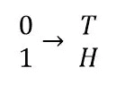

# 信息论:温和的介绍

> 原文：<https://towardsdatascience.com/information-theory-a-gentle-introduction-6abaf99835ac?source=collection_archive---------21----------------------->

这是关于信息论及其与数据驱动型企业和战略的关系的系列文章中的第一篇。虽然在每一部分都会有一些等式，但是对于那些对细节不太感兴趣而对含义更感兴趣的人来说，它们可以被忽略。

20 世纪早期和中期见证了电信技术和能力的爆炸。因此，工程师和研究人员面临着许多以前从未真正解决过的问题，例如:

我如何将单词和声音转换成点和破折号？

我如何将电子信号重构为单词和声音？

当电子信号中加入噪声时会怎样？

我可以传输多少的信息，但仍然可以重建一条消息？

信息到底是什么？

在这样做的时候，这些研究人员意外地建立了一套应用数学给我们的最强大的工具，用来处理和解决无数“不太数学”的问题。上述问题及其衍生的附加问题显然是受电信的启发；然而，这些挑战与数据驱动型企业和现代分析领导者面临的现代挑战有相似之处:

什么信息是我绝对需要的？

哪些信息可以忽略，什么时候可以忽略？

我的投资组合或策略有多复杂，我拥有的数据证明了它的合理性吗？

我应该更相信数据还是我的经验？(也许令人惊讶的是，我们会看到答案经常是‘不要相信数据’)

我的项目可能会在哪里失败？

在我的金融敞口中，我面临什么样的系统性风险？

现在有了数据，我该怎么做？

在前几篇文章中，我们将介绍 5 种工具——熵、互信息、霍夫曼码、Kolmogorov 复杂性和 Fisher 信息——用于评估个人和职业生活中的这些和其他挑战。虽然未来的文章将更多地关注原理和含义，但首先我们必须介绍信息论的构建模块:熵

**熵:随机性的一种度量**

如果你和一位定量专家交谈，问他们从事这项工作多久了，通常，外交式的回答会涉及他们从本科毕业以来的年数。然而，事实上，对于我所认识的数据科学及其相邻领域的大多数人来说，他们至少从十几岁开始就沉浸在这个主题中。每一年，相同的材料或多或少都呈现出一层额外的精确、细致和/或复杂。通常定义是相加的。举例来说，重力最初是导致苹果下落的原因，之后是大质量物体相互作用的方式，然后与加速度和流形上的扭曲有关。一个比一个复杂，一个比一个完整。

但不是熵。在我 20 年的学习和实践中，我已经得到了半打熵的定义。虽然这些定义有一些时间和方式上的效用，但它们不是附加的，也不容易。以下是几个最糟糕的例子:

*熵是…*

系统中的无序或混乱

系统中自由度的数量

掩盖系统初始条件的“力”

第一个定义，可能是最常见的，是完全错误的。后两个，虽然相当正确，但让你对它的含义没有任何直觉。

这是信息论的第一个伟大胜利:对科学中最容易被误解的概念给出了一个合理而直观的定义。 ***熵是系统*中不确定性——或随机性——的程度。**[**【1】**](#_ftn1)*这比仅仅称之为无序或混乱好一点，但却隐含着某种深刻的东西。即不同的系统和不同的随机事件具有不同程度的随机性。让我们用统计学家最喜欢的两个玩具来检验我们的直觉，一个硬币和一个骰子。掷硬币和掷骰子哪个更随机？让我们以两种方式检查。首先，我们问一个问题，如果我们随机猜测(或稍后最优猜测)，我们猜对的几率有多大？掷硬币的概率是 50%,掷骰子的概率是 16.7%。其次，让我们问一下有多少种可能的状态(读作:结果)会发生。硬币是 2(正面或反面)，骰子是 6 (1，2，3，4，5，6)。在这两种情况下，看起来骰子比硬币更随机。不同事件具有不同水平或随机性的概念通过了嗅探测试。*

*对于公平的硬币和公平的骰子，很容易看出哪个更随机，我们的直觉很快就同意了。现在我们来改变一下对比。假设我们仍然有我们的公平硬币，但现在我们想把它比作一个加权骰子。这个加权骰子在 90%的情况下出现“1 ”,在每个剩余的面上出现 2 %( 2%代表 2，2%代表 3，以此类推)。现在哪个更随机。随机猜对硬币还是 50%有效，对骰子是 16.7%[【3】](#_ftn3)。同样，硬币有两种状态，骰子有六种状态。但是装载的骰子感觉起来没有公平的那么随机；毕竟，它几乎总是出现“1”。现在我们需要一个更严格的熵的定义。*

**

*熵(H)取决于可能状态的数量及其概率*

*这通常是人们忽略的部分，大 sigmas 是令人生畏的。然而，等式 1 所说的都是我们已经感觉为真的 ***:结果多的事件往往比结果少的事件更随机，结果更公平的事件往往比严重偏向少数结果的事件更随机*** 。等式 1 为我们提供了一种描述这一点的正式方式，即对于具有结果 I 的事件 X，熵 H 等于每个结果的概率与该概率的对数底 2 之和。为什么是 base 2？因为最复杂的场景可以分解成许多 2 个状态事件，描述为:是或否，是或不是，真或假，等于或不等于。*

*现在回到我们的场景，装载的骰子对硬币。让我们首先通过比较公平的骰子和公平的硬币来对我们的直觉进行分层。公平骰子的熵是 2.58，而我们公平硬币的熵正好是 1。这当然与我们上面提到的直觉一致。那装了子弹的骰子呢？装载的骰子有大约 0.7 的熵，低于公平骰子(符合我们的直觉)，也低于硬币。既然我们对随机性、熵以及如何用它来测量系统、事件和过程有了更好的理解，我们可以继续讨论它与信息的关系。*

***熵和信息***

*提醒一下，抛硬币的熵正好是 1。我们已经确定，这意味着它比掷骰子更不随机，但也意味着它包含更少的信息。更确切地说，这意味着一次硬币的投掷可以用 1 比特的信息来表示。*

*一个比特是一个信息单位，它可以有两种状态:1 或 0。抛硬币可以用一位来表示的原因是，硬币有两面出现的可能性相等。我们将 0 映射到反面，1 映射到正面，看到我们的硬币翻转可以用 1 位来表示。*

**

*将一点映射到抛硬币*

*公平骰子的情况有点复杂。它的熵为 2.58，因此可以用 2.58 位来写。但是位是离散的，没有. 58 位这样的东西。我们可以尝试用 2 或 3 位来表示它。首先是 3:*

**

*3 位骰子滚动具有额外容量；我们排除了两种可能的状态来解释这一点*

*有了 3 比特，我们就有了过剩的容量，或者换句话说，有了 3 比特，我们就有了一个比我们所需要的要复杂得多的场景模型。如果我们试图将骰子滚动到 2 位，我们会得到:*

**

*一个 2 比特的骰子滚动破坏信息*

*我们无法将公平骰子完全写入 2 位。这是一个 ***有损*** 的表示法。当我们试图用太少的信息来描述事件时，我们会丢失信息——在这种情况下是“5”和“6”的结果。*

*所有这三个——1 位硬币投掷、2 位骰子滚动和 3 位骰子滚动——都是事件的模型。随着模型位数的增加，它的复杂性也在增加。我们可以在这里创建一个经验法则: ***如果我们试图用一个过于复杂的模型来表示一个系统，我们往好里说是效率低下，往坏里说是过于复杂，并且有犯大错的危险。如果我们代表的系统太少，我们就失去了重要的信息。****

*最后让我们看看我们不公平的骰子。它的熵值是 0.7。这里有两件事会让你印象深刻。首先，在我们的不公平骰子上，我们将丢失大约相同数量的信息，该模型表明“这个骰子只出现 1”与我们在我们的公平骰子上的 2 位模型相同。 ***这让我们得出另一条经验法则:即使事件很少发生，剔除异常值也能剔除大量信息。第二，它具有更低的熵，并且可以适合比公平骰子更简单的模型。接下来让我们检查一下，我们所掌握的关于不公平骰子的信息量的增加是如何导致这个结果的。****

***条件熵和信息的力量***

*回到定义，熵是不确定性的度量。如果你想了解——或者更好地利用——一个系统拥有较少的信息通常是好的。我们已经检查了一个降低事件熵的坏方法:制作一个不能准确描述场景的有损模型。在这里，我们将研究通过寻找有用信息来减少不确定性的最佳方法。*

*首先说句题外话，概率的一个怪癖是，如果你除了可能的状态之外对一个场景一无所知，你能做出的最好的猜测是所有的状态都是同样可能的。这是真的，即使你被告知某个场景在某些不具体的方面是不公平的。例如，如果你被告知一枚硬币是不公平的，但不是通过多少或哪个方向，而是通过所有可能不公平的方式的平均值，它是公平的。*

*在我们的加权骰子的例子中，我们得到了一条重要的信息。值得注意的是，骰子被加权为“1 ”,因此“1”出现的概率为 90%。据此，我们还可以推断出 2、3、4 或 5 出现的概率各为 2%。结果就是条件熵。更正式地说:*

**

*条件熵(H(X|Y)是具有更多信息的熵；在其他条件相同的情况下，它总是小于无信息熵*

*就像等式 1 一样，这些看起来比实际情况更吓人。等式 2 所说的是，条件熵用给定一些新信息的概率来代替事件发生的概率。在加权骰子的情况下，新信息(Y)是“1”出现的概率是 90%。等式 3 从等式 2 得出，并且注意到条件熵总是减少系统的不确定性。稍微不那么正式的 ***相关信息总是会降低一个系统的不确定性。****

***让我们看另一个场景。假设你住在洛杉矶。那里每年大约有 33 天下雨，所以任何一天下雨的几率都是 10%。在没有任何额外信息的情况下，LA 的降水时间表可以有效地用 170 比特模拟。洛杉矶确实有雨季，大约 90%的雨天(其中 30 天)发生在 11 月 1 日至 4 月 30 日之间。通过了解雨季及其对降雨可能性的影响，降水计划的熵减少到约 145 位，不确定性减少了 15%。***

*****投资组合分析:DJI 是一个怪异的指数*****

***如前所述，这篇文章在玩具问题和基本原理上花费的时间是独一无二的。当我们遇到更复杂的主题时，对熵有一个好的技术和直观的理解将是至关重要的。既然我们已经有了很好的理解，尽管我们可以抛开玩具问题，去找更有说服力的例子。对于许多这样的例子，道琼斯工业平均指数将充当替罪羊。***

***如果你在寻找一个充满不确定性、人们愿意利用的系统，股票市场可能是一个不错的起点。假设你想建立一个投资组合来获取交易所的回报。交易所领域由三家公司主导:洲际交易所(ICE，市值 680 亿美元，交易价格约 120 英镑)、伦敦交易所集团(LDNXF，市值 53 美元，交易价格约 105 英镑)和纳斯达克(NDAQ，市值 260 亿美元，交易价格约 160 英镑)。未来的回报是不确定的，但我们可以利用迄今为止所涵盖的原则来构建一些明智的尝试策略。***

***首先，让我们注意到投资组合只不过是回报可能所在的模型。如果我们没有其他信息，我们应该追求最大化投资组合熵的策略。这就产生了一个由 1/3 ICE、1/3 LDNXF 和 1/3 NDAQ 组成的投资组合。***

***还有一些其他明智的方法来构建投资组合。如果我们想复制行业的现状，我们可能会采取市值加权策略——44%的 ICE，39%的 LDNXF，17%的 NDAQ——我们将在下一篇文章中介绍原因。类似地，如果我们对未来回报有特殊的了解，我们可能会根据我们对回报如何在三者之间分配的预期来采取策略。这让我们想到了道琼斯指数。***

***道琼斯工业平均指数是一个价格加权的投资组合。这意味着这些元素的权重取决于它们的交易价格。在我们的交易所案例中，将产生 31% ICE、27% LDNXF 和 42% NDAQ 的投资组合。这个策略没有信息直觉。只是很奇怪。***

*****交易和基准测试*****

***结束前最后一个例子。假设我们想建立一个交易特定股票或指数的策略，而不是建立一个投资组合。为了简单起见，我们的策略可以在某一天做两件事之一:买入或持有，卖出或什么都不做，持有现金。我们需要一种方法来确定我们设计的任何给定策略是否有效。请注意，策略就像投资组合一样，只不过是回报的模型。***

***由于战略包括做出大量连续的决策，每个决策都应该比一个更简单的模型更有价值。回想一下，一个简单的模型可以用很少的比特来表示。这里有两种策略可以写成 0 比特。第一个很简单:只要持有现金。我想任何人都会同意，如果你的策略比不上持有现金，那就是一个糟糕的策略；直觉检查通过。第二个 0 位策略是买入并持有，这个策略是你在第一个交易日买入股票，然后一直持有。这是一个很好的基准有无数的现实原因，包括交易成本和税收优化。然而，我们的信息直觉是，更复杂的模型应该提供更高的回报。1 位模型应该改进 0 位策略，2 位模型应该进一步改进。***

*****信息风险*****

***根据我们对基准测试的评估，一个自然的推论是，复杂性的增加应该伴随着回报的增加。这是我们第一次遇到我称之为 ***信息风险*** 的概念。信息风险是一种脆弱性，它是在没有足够的相关数据来证明其合理性的情况下，远离稳健的低信息战略而产生的。它与过度拟合、正则化和交叉验证等概念相关，但味道略有不同。如何以稳健和明智的方式使用信息以降低信息风险将是这一系列活动背后的驱动因素。***

***下一篇文章:互信息作为预测***

***[【1】](#_ftnref1)信息论要素，盖&托马斯***

***顺便说一句，从现在起，容易的事情将被称为容易的，困难的事情将被称为琐碎的，不可能的事情将被称为“留给读者的练习”***

***[【3】](#_ftnref3)我们将在下一篇文章中讨论最佳猜测***

***数学家们称之为“用一物代替另一物”***

***[【5】](#_ftnref5)当我们引入互信息时，我们将再次对此进行更正式的处理***

****免责声明:本文表达的观点仅代表作者个人观点，不一定代表任何雇主、组织或其附属机构的观点。****

***2021 道格拉斯·汉密尔顿***