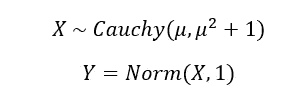
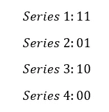
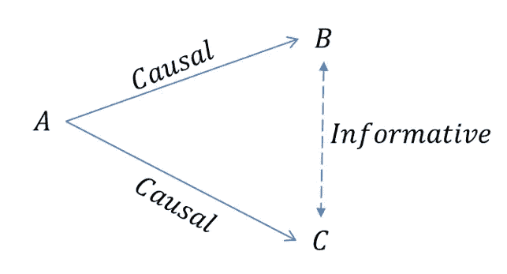
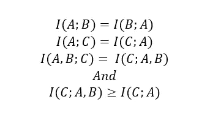
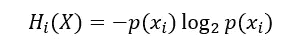
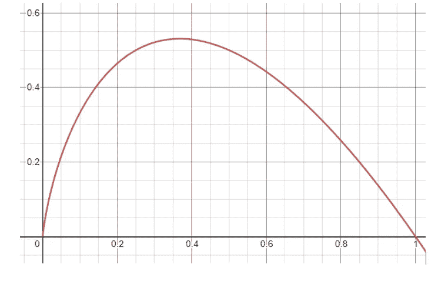
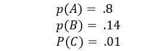
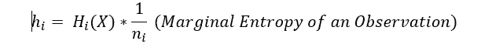
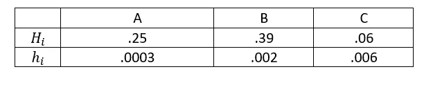

# 信息论:原则与叛教

> 原文：<https://towardsdatascience.com/information-theory-principals-and-apostasy-a7c1be72be5f?source=collection_archive---------27----------------------->

这是关于信息论及其与数据驱动型企业和战略的关系的系列文章的第三篇。虽然在每一部分都会有一些等式，但是对于那些对细节不太感兴趣而对含义更感兴趣的人来说，它们可以被忽略。前文关于互资的文章&奇怪的是麦克白的情节可以在这里找到**。**

***因果关系被高估***

*我们来创造一个情境。假设有一个随机过程，称之为 x。这个过程接受一些输入( )，然后根据以为中心的柯西分布产生一个输出。柯西分布很麻烦，因为它们几乎在所有方面看起来都像正态分布，但极端事件的可能性略高(尾部略厚)。结果是，虽然正态过程有明确定义的期望，并以预期的方式变化，但柯西分布有未定义的均值，并且变化无穷。让我们定义另一个称为 Y 的过程。Y 过程的结果由 X 引起，即:*

**

*注:所有图片由作者提供*

*y 由 X 引起，X 由。知道 X 的输入几乎不能给你关于 X 的信息，而知道 Y 只能给你关于 X 的有限信息。如果你想知道 X，你最好知道相关信息(Y)而不是因果信息()。*

*对因果关系的关注在很大程度上是由对虚假相关性的恐惧和对短暂关系的过度信任所驱动的。要了解这一点，请考虑通过以相等的几率随机选择 1 和 0 生成的以下序列:*

**

*在不知道生成函数的情况下，数列 2 和 3 提供了彼此的完全信息。当然，不能保证这种趋势会持续下去——事实上，它不太可能持续超过 3 或 4 位数。换句话说，我们可以制定一个简单的规则:当系列 2 表示 1 时，系列 3 表示 0，反之亦然。事实上，随着这个系列的继续，从这些观察中得出的任何规则最终肯定会灾难性地失败。*

*正如上面的例子所展示的，关注因果关系并不疯狂，但仅仅关注它是愚蠢到令人痛苦的愚蠢。众所周知，因果关系很难证明，尤其是在社会科学领域……尤其是在商业环境中。考虑以下一组连续事件:*

**

*在上图中，A 是事件 B & C 的实例化事件。A 的结果通过一些未知的因果过程影响 B & C。在一个泛乐观主义的世界里，我们会对事件 A、其结果以及导致事件 B 和/或 c 的过程了如指掌。我们可能无法访问这些信息的一些原因包括以下问题:*

*1.保密性:在某种意义上，了解 A 的结果或影响 B&C 的过程可能是非法的。参见:秘密信息和重大非公开信息示例*

*2.不可简化的复杂性:场景可能非常复杂，以至于没有人有足够的智力去理解事件 A 或因果过程中无数的混杂因素和相互作用。参见:公共健康和社会心理学*

*3.费用:从直接成本、技术债务或时间成本的角度来看，理解这一场景可能会非常昂贵。看看天体物理学(我们倾向于不去遥远的星球)和宏观经济学(我们倾向于不要让经济崩溃来看看会发生什么)*

*如果以上任何一条适用，一切都不会失去。如果 A 是 B 的因果关系，我们会期望它与 B 拥有大量(或至少非零)的互信息。A 和 c 也是如此，因为互信息是对称的:*

**

*相关事件(B&C)可以给出彼此的信息，即使它们不是因果关系(A)*

*更简洁地说，观察事件 B 给出了关于事件 C 的信息，即使 B 不是因果关系。但情况更好。B 不仅以一种相关的方式提供了关于 C 的信息，它甚至通过了 sniff 测试，因为它们通过 a 是相关的。如果你有一些关于 A & B 之间的一般关系的历史数据，那么它排除了理解连接 A 到 B 或 c 的复杂因果过程的需要*

*销售和 ARR 的增长是价格变动的原因，尽管它们在收益电话会议之前是保密的。他们网站上留下的评论数量是不保密的，虽然评论不会导致销售，但它很可能提供关于销售数量的信息(更多的销售->更多的评论)。同样，周四晚上的海鹰队比赛不会在工厂车间引发事故，但可能预示着事故的发生。因果关系是昂贵和误导的，相互提供信息的事件是廉价和有用的。*

***罕见事件信息不对称:一场游戏化危机***

*先说一个数据科学面试问题。通常，作为入门级候选人初步筛选的一部分，我喜欢在他们的简历中找到一个使用真实生活数据的项目实例。现实生活中的数据比学术和研究数据要糟糕得多。它充满了缺失数据、混合(整数和字符串)数据和异常值，这使得消费和建模信息变得非常困难。大多数谈话总是围绕着这些现实世界的考虑。你如何处理丢失的数据？通常的答案包括某种信息替换策略，比如用列的平均值替换它们。公平合理。我们如何处理畸形或混合的数据？同样，通常一个合理的答案是将字符串映射到数字。最后，您对大型异常事件做了什么？通常，答案是他们“删除了它们”，因为“不能指望你预测罕见的事件。”最终的理由是:它提高了模型的准确性。如果建立预测是一个游戏或竞赛，这是一个很好的答案，如果你想使用它，那就更糟了。*

*离群值非常重要。虽然去除它们可能是公平的，但我们也必须谨慎对待它们。我们可以从信息论和直觉的角度看到这一点。一如既往，让我们从理论开始。首先，让我们考虑一个结果的部分熵。*

**

*偏熵*

*部分熵是随机过程中特定结果的信息量。每个结果的部分熵之和就是随机过程 x 的熵。*

**

*具有不同可能性(x 轴)的事件的偏熵(y 轴)*

*从上面的图表中，我们注意到一些事情。首先，形成结果信息是不对称的。发生概率为 40%的结果不包含与发生概率为 60%的结果相同的信息。事实上，部分熵倾向于更罕见的事件；40%概率的事件比 60%概率的事件包含更多的信息。这使我们得出第二个观察结果，即概率接近 0 的罕见事件包含的信息量与非常常见的事件相同。发生概率为 96.4%的事件增加了大约 0.05 比特的信息，大致相当于发生概率为 0.7%的事件。忽视世界的 96.4%是不明智的，同样不明智的是忽视世界的 0.7%。*

*无情地忽略罕见事件的机制使得这种行为更加危险。让我们考虑结果为 A，B，C 的流程 X，这样:*

**

*假设我们有 1000 个观察值，我们将在这些观察值的基础上建立我们的模型。X 的熵是~.72。让我们考虑另一个来自熵的度量:*

**

*任何观测中包含的信息*

*观察的边际熵看的是单次观察所携带的信息量。这有助于评估删除(忽略)单个数据行的影响。通过应用边际熵和部分熵，我们可以评估忽略任何部分数据的影响。*

**

*每个事件的部分信息(H)与边缘信息(H );随着事件越来越少，边缘信息也越来越多*

*关于事件 C 的单个观察携带的信息是事件 B 的 3 倍，是 A 的 20 倍。如果没有充分的理由，您不会忽略关于 80% (A)结果的观察，并且您应该需要一个更好的理由来忽略关于 C 的观察。结果 C 也包含数据中总信息量的 8%。尽管忽略世界上 8%的人可能没问题，但格外小心是值得的。*

*删除这些事件不仅会丢失信息，还会对您的预测产生错误的信心。从交互信息的角度来看，一个好的预测是最大化模型和世界之间的交互信息。一旦我们去除了罕见的事件，我们就不再是在模拟世界，而是在模拟别的东西。我们正在对它的游戏化版本进行建模，其中的目标不是降低风险或获取回报，而是获得高分。这对于指导目的来说可能是好的，但是对于标记合理的决策来说是糟糕的。*

*撇开理论不谈，消除极端事件的实践也应该扰乱我们的内脏。绝大多数的汽车碰撞都涉及到低速时的挡泥板和保险杠。爱情在拥挤的车流中前行，在停车场倒车撞上横梁，诸如此类。如果您删除离群值，您最终会忽略您真正关心的碰撞类型。工厂不会突然停工，因为货物是在下午而不是上午到达的，经济也不会因为资产价格的日复一日的变化而崩溃。极端事件是指后果和信息不对称的事件。*

***信息风险:重新审视***

*在[的第一篇文章](/information-theory-a-gentle-introduction-6abaf99835ac)中，我们简要描述了一个叫做信息风险的概念。到目前为止，我们已经讨论了在一个不确定的世界中，我们如何更好地理解不确定性以及如何应对不确定性。我们还展示了对确定性的畸形认知或对“因果关系”的过度依赖，往好里说是有害的，往坏里说是灾难性的错误。在这些场景中，信息风险很大程度上意味着在我们不应该自信的时候过于自信。在下一节中，我们将看看当确定性系统——那些在观察和结果之间具有完美交互信息的系统——变得比我们希望理解的更复杂时会发生什么。*

*— — — — — — — — — — — — — — — — — — — — — — — — — — —-*

*[【1】](#_ftnref1)还有一个叫做没有免费的午餐的定理*

*[【2】](#_ftnref1)在以后的文章中，我们将把它视为“通道容量”*