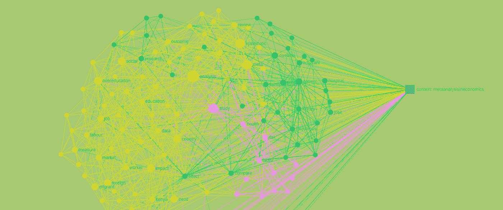
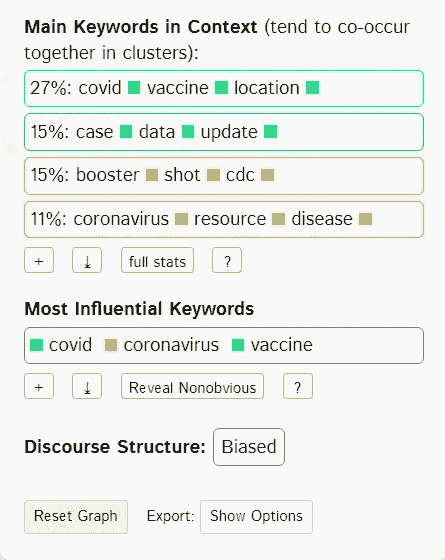
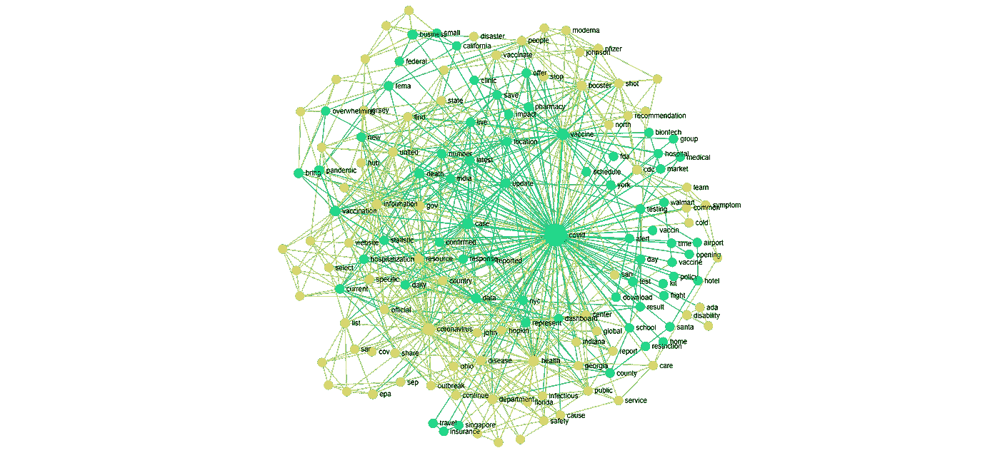
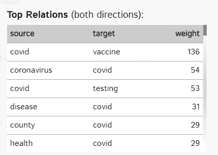

# InfraNodus:文本数据分析的优秀工具

> 原文：<https://towardsdatascience.com/infranodus-excellent-tool-for-textual-data-analysis-2b4839e6cd10?source=collection_archive---------10----------------------->

## 以新冠肺炎疫情期间的谷歌趋势查询为例介绍 InfraNodus

来源:作者图片

文本挖掘涉及将非结构化文本转换成结构化格式，以识别有意义的模式和新的见解。公司可以应用高级分析技术和其他深度学习算法来探索数据集中隐藏的关系。通过这种方式， [IBM](https://www.ibm.com/cloud/learn/text-mining) 定义了使用*字符串*数据格式的数据科学的广阔领域:演讲、声明、评论、诗歌等。如果我们能够用好的统计软件对它们进行训练，这些文本数据集是很方便的。

一个很好的选择就是使用文本网络分析作为核心框架的 [**InfraNodus**](https://infranodus.com/) 。我将展示一个使用 Google Trends 数据的例子来演示主要原则，但是值得探索 InfraNodus 提供的更多数据挖掘特性。

# **核心框架:文本-网络分析**

InfraNodus 基于文本网络框架，遵循以下步骤:

*   **导入**你的数据源，或者利用很多内置的 API 数据流，包括 **Twitter** feeds、 **Google trends** 、研究论文摘要和标题(PLOS、PubMed)、 **RSS** news feeds、 **Evernote** notes、
*   得到一个**网络结构:**网络将从文本中生成。图表中最有影响力的单词显示得更大，而更频繁出现的单词被分组为簇，并具有不同的颜色。图表显示了主要主题和最有影响的术语以及它们之间的关系。
*   生成**洞察**分析，侧重于情感、产品评论、使用谷歌查询的供需、聚类、词云可视化等。

# 用例:与 Covid 相关的 google 查询的词云

让我们举一个简单的例子。有了 Google Trends API，我们可以通过 Google 查询访问数据，并通过几次点击对其进行分析。这些参数是位置:美国，周期:31/10/2021，对关键字“covid”的相关查询

首先，我们用内置的 API 直接导入数据。我们可以看到四组主要的主题:第一组涉及疫苗接种和 Covid 的位置，第二组涉及 Covid 的病例、报告和基础数据，第三组涉及 Covid 的治疗，最后一组包含关于该疾病的资源。

来源:作者图片

接下来，我们生成单词及其关系的单词云。与标准的单词云相比，这个网络是与其他主题相关联的。调整节点的大小和它们的描述，我们得到了在 covid 期间在 Google 上搜索的术语的词云以及它们之间的关系网络。

来源:作者图片

Infranodus 还提供了一组关于数据关系的统计数据。人们最常使用“covid”关键字查找疫苗、测试、疾病、县和健康。

来源:作者图片

根据我们在媒体上看到的情况，我刚才提出的统计数据并不令人惊讶。但是想象一下，你有一个你一无所知的更广泛的文本数据集。在这里，InfraNodus 非常有用，因为它绘制了数据的结构，并帮助发现您以前不知道的关系。

上面的图表只是 InfraNodus 可以产生的一小部分知识。要查看其他令人兴奋的应用程序，请查看他们的一些教程。

# 结论

重要的是要提到定价。InfraNodus 有一个免费的、[开源版本](https://github.com/noduslabs/infranodus)，需要一些编程知识。我用来准备图表的标准版本在云上工作，对于大多数较小的项目(9 欧元/月)来说很好。我也承认创作者没有把产品作为黑盒出售，而是在[原文](https://noduslabs.com/wp-content/uploads/2019/06/InfraNodus-Paranyushkin-WWW19-Conference.pdf)中共享基础设施。这对于那些可以在论文中引用来源和使用文本网络的研究人员来说很重要。

*PS:你可以订阅我的* [*邮件列表*](https://medium.com/subscribe/@petrkorab) *在我每次写新文章的时候得到通知。如果你还不是中等会员，你可以在这里加入*<https://medium.com/@petrkorab/membership>**。**