# 使用 AWS 将基础设施作为代码

> 原文：<https://towardsdatascience.com/infrastructure-as-code-with-aws-207239573de?source=collection_archive---------18----------------------->

## 部署您的第一个云形成脚本

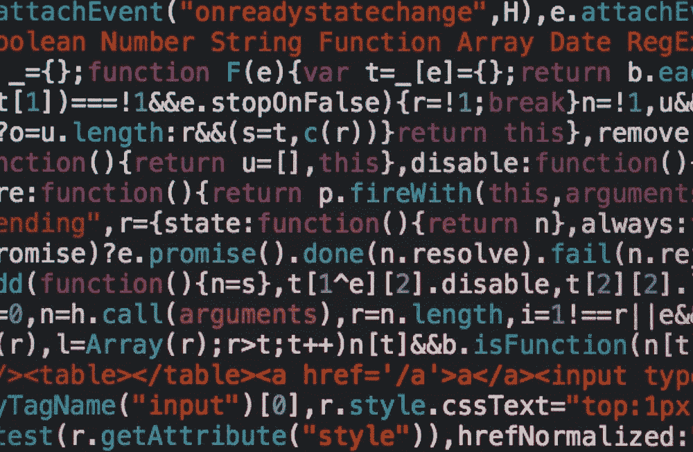

图片来自 [Unsplash](https://unsplash.com/photos/cvBBO4PzWPg)

[基础设施即代码(IaC)](https://www.redhat.com/en/topics/automation/what-is-infrastructure-as-code-iac) 是 DevOps 的一个关键概念，在我们构建和定义生产级工作负载时，它在数据科学领域至关重要。IaC 允许开发者将项目的**基础设施作为软件**来管理。这使得开发人员能够轻松地维护和配置项目资源和架构中的变更。虽然与传统脚本类似，但 IaC 允许开发人员使用**声明性语言**来提供资源。有许多 IaC 工具可用，如 [Terraform](https://www.terraform.io/) 、 [Chef](https://www.chef.io/) 、 [Puppet](https://puppet.com/devops/) 和 [Ansible](https://www.ansible.com/) 。对于今天的演示，我们将使用特定于 AWS 资源的[云信息](https://aws.amazon.com/cloudformation/)。通过这篇文章，您将了解如何在一个软件文件中维护您的所有资源，并了解 IaC 带来的速度优势。**没有** IaC，不同基础设施的**手动**部署的**成本**和**时间**可以**暴涨**，通过将你的基础设施维护为软件，你能够从**中央**源轻松而**快速地测试各种部署**。在本文中，我们将探讨一个**示例**手动**供应资源**与**部署 **CloudFormation** 脚本在 AWS 上创建 **REST API** 和无服务器 **Lambda 函数**。**

**注意**:对于那些刚接触 AWS 的人来说(有一些经验来完全理解这篇文章是很好的)，如果你想继续下去，请确保你在下面的 [**链接**](https://aws.amazon.com/console/) 做了一个帐户。确保还安装了 [**AWS CLI**](https://aws.amazon.com/cli/) **来使用示例。我还将提供一个我们将使用的服务列表，以及更深入的定义。如果您已经熟悉这些服务，请随意跳到您感兴趣的部分。**

# 目录

1.  AWS 服务
2.  示例概述
3.  手动部署
4.  使用云编队部署
5.  整个代码和结论
6.  其他资源/参考资料

# 1.AWS 服务

[**【AWS API 网关(API GW)**](https://aws.amazon.com/api-gateway/) :允许开发人员创建、发布和监控安全 RESTful 和 Socket APIs 的服务。我们将使用这个服务来创建我们的 REST API。

[**AWS Lambda**](https://aws.amazon.com/lambda/) :无服务器计算服务，允许开发者运行代码，无需管理或提供服务器。我们将使用该服务在后端设置一个与 REST API 集成的示例无服务器功能。

[**身份访问和管理(IAM)**](https://aws.amazon.com/iam/) :允许您通过权限和角色管理对 AWS 服务的访问。我们将为我们的 **Lambda** 函数创建一个角色，以便能够**访问** API GW。

[**AWS CLI**](https://aws.amazon.com/cli/) :要使用 AWS 资源和服务，您可以使用它们提供的 CLI，而不是控制台，以便于访问。

[**AWS SAM**](https://aws.amazon.com/serverless/sam/) :云信息的抽象，有助于构建无服务器应用，查看 [SAM CLI](https://docs.aws.amazon.com/serverless-application-model/latest/developerguide/serverless-sam-reference.html#serverless-sam-cli) 了解更多信息。

# 2.示例概述

对于本文，我们将构建一个带有 API Gateway 的 REST API，它集成了一个无服务器后端 Lambda 函数，该函数处理来自我们 API 的 GET 和 POST 请求。第一步将详细介绍如何通过 AWS 控制台手动构建和部署这些资源，而第二步将使用 CloudFormation 来自动化和重复完全相同的过程。

# 3.手动部署

对于手动部署，我们必须在 AWS 控制台中工作。这本身已经是开发人员的一个坏习惯，因为我们不能在本地 IDE 上工作，而且在一个更大的项目中，很难在控制台内跟踪变更/开发。第一步，我们将创建一个 Lambda 函数示例。

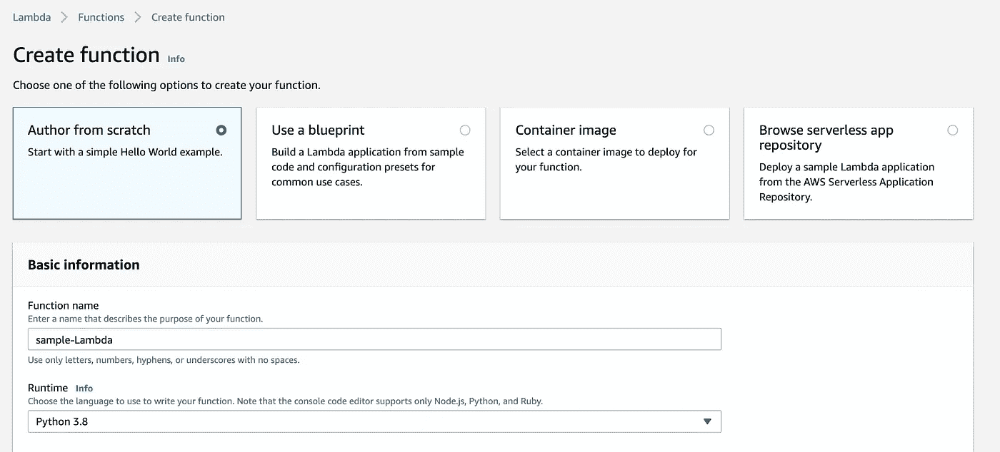

作者截图

确保创建一个具有基本权限的角色，如果你想让你的 Lambda 使用不同的服务，比如 comprehension 或类似的服务，确保为该服务提供权限。关于 IAM 角色和权限的更多信息，请查看下面的[资源](https://aws.amazon.com/iam/features/manage-permissions/)。

这里我们有一个示例“Hello World”lambda 函数，如果与 API Gateway 正确集成，它将返回所示语句。

现在我们已经配置了 Lambda 函数，我们希望设置我们的 REST API 以确保它可以与 Lambda 函数接口，因此我们转到 Amazon API Gateway。单击 create API 并从提供的选项中选择 REST API。

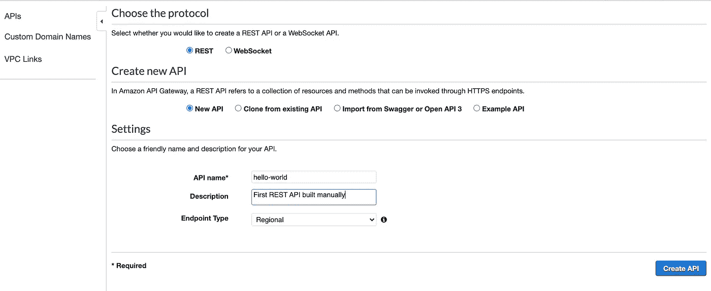

创建 REST API(作者截图)

现在，我们从 Actions 下拉栏创建一个 GET 方法，并确保 REST API 指向 Lambda 函数。

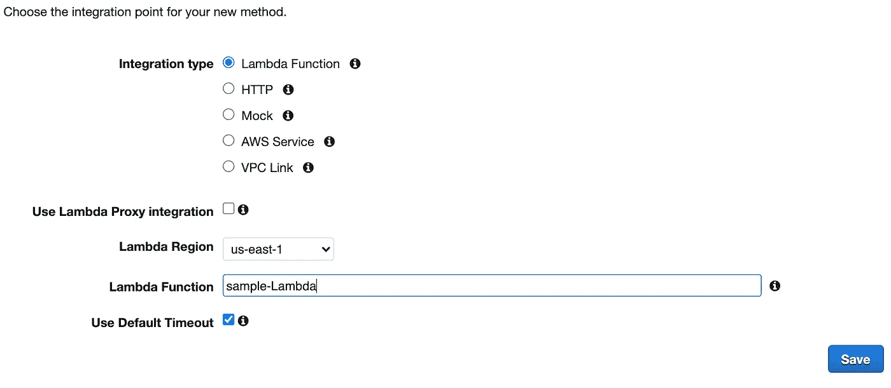

将 REST API 与 Lambda 集成(作者截图)

我们现在可以部署我们的 API 来测试它是否正确地与我们的 Lambda 函数集成在一起(为 stage 选择您想要的任何名称，我们将使用“prod”)。

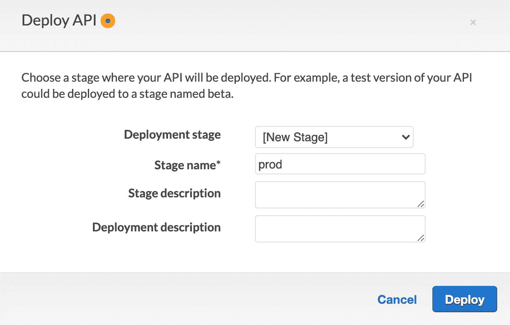

作者截图

部署完 API 后，您应该能够在 prod 阶段看到一个 URL，如果您访问这个 URL，您应该会看到 Lambda 函数正在运行，返回“Hello World ”,正如我们在函数中描述的那样。

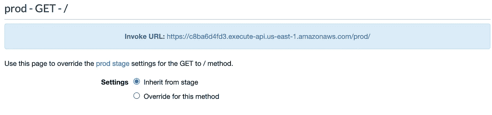

作者截图

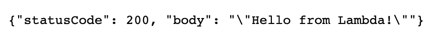

Lambda 函数返回(作者截图)

# 4.使用云编队部署

这在一开始看起来并不太糟糕，只是几个需要几分钟的步骤，但是假设你有不止一个方法，不止一个 API，不止一个开发人员。你应该如何集中跟踪所有这些资源和任何变化。如果你想调整你的 Lambda 函数来和另一个 API 集成呢？您必须手动删除当前的方法或 API 吗？这将要求开发人员拥有跨帐户访问权限，并且在相互合作时能够在不同的帐户中查看和提供彼此的资源。所有这些都会导致时间、成本和资源的大量浪费，因此我们将使用 AWS CloudFormation 在几分钟内部署这个完全相同的示例，同时还让开发人员能够灵活自由地通过简单的脚本调整他们的基础架构。

首先，云的形成是如何工作的？我们将使用一个 **YAML 文件**来声明和提供我们部署到 AWS 的资源，以创建一个 **CloudFormation 堆栈**，其中包含我们项目所需的所有资源。我们将使用的模板被称为 [**SAM 模板**](https://sanderknape.com/2018/02/comparing-aws-sam-with-serverless-framework/) ，它是 CloudFormation 的抽象，具有相同的底层功能，但更适合于需要较少 YAML 代码的无服务器应用程序。对于那些不熟悉 **YAML** 的人来说，可以把它想象成**类似于**和 **JSON** (CloudFormation 使用两者)，两者都具有构建**大型声明性配置文件**的功能。首先，我们进入本地代码编辑器，而不是控制台，并运行完全相同的 Lambda 函数。与此同时，我们将创建一个包含我们的基础设施的 **template.yaml** 文件。

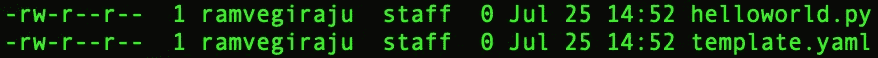

项目的文件结构(作者截图)

在 helloworld.py 中，我们可以放入与控制台中完全相同的 Python 代码。

现在我们可以在 template.yaml 文件中定义 API 网关和 Lambda 函数了。为了首先构建这个文件，我们需要添加一些所有 SAM 模板通用的语句。

SAM 模板通用

现在我们可以在 CloudFormation 模板文件中添加一个名为“ [Globals](https://docs.aws.amazon.com/serverless-application-model/latest/developerguide/sam-specification-template-anatomy-globals.html) 的东西。全局是针对您将要部署的资源的**通用配置**，我们可以针对特定的资源类型将它们设置为全局，而不是为不同的资源指定相同的信息。对于这个用例，我们将以 Lambda 函数为例，尽管我们只有一个。

现在我们可以专注于我们的资源，这是一个 Lambda 函数和 REST API，我们在 template.yaml 文件中的 Resources 标签下定义它们。要访问在 CloudFormation 上定义无服务器功能的文档，请查看下面的[链接](https://docs.aws.amazon.com/serverless-application-model/latest/developerguide/sam-resource-function.html)。

这里我们定义了一些创建 Lambda 函数的参数。对于这个事件，我们正在创建一个 REST API，因为它触发了我们的 Lambda 函数。有一组**其他参数**，您可以为您的无服务器函数指定，如 CodeURI、描述等，您可以在 **CloudFormation 文档**中遵循这些参数。一般来说，创建模板文件的最佳方法是访问 CloudFormation 文档，查看为您的特定服务/资源创建模板文件所接受的参数/语言。

现在我们可以部署模板文件了，为此我们将使用 AWS CLI 运行两个命令。

部署 CFN 模板

运行第一个 bash 命令后，您应该会看到创建了一个 sam 模板文件，这是我们在第二个命令中用来创建 CloudFormation 堆栈的文件。

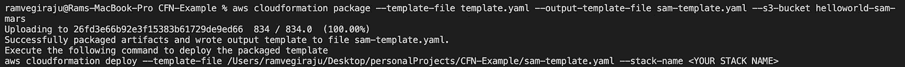

作者截图

运行这两个命令几分钟后，您应该会看到在 CLI 中成功创建了堆栈，我们可以通过在控制台中转至 CloudFormation 来验证这一点。

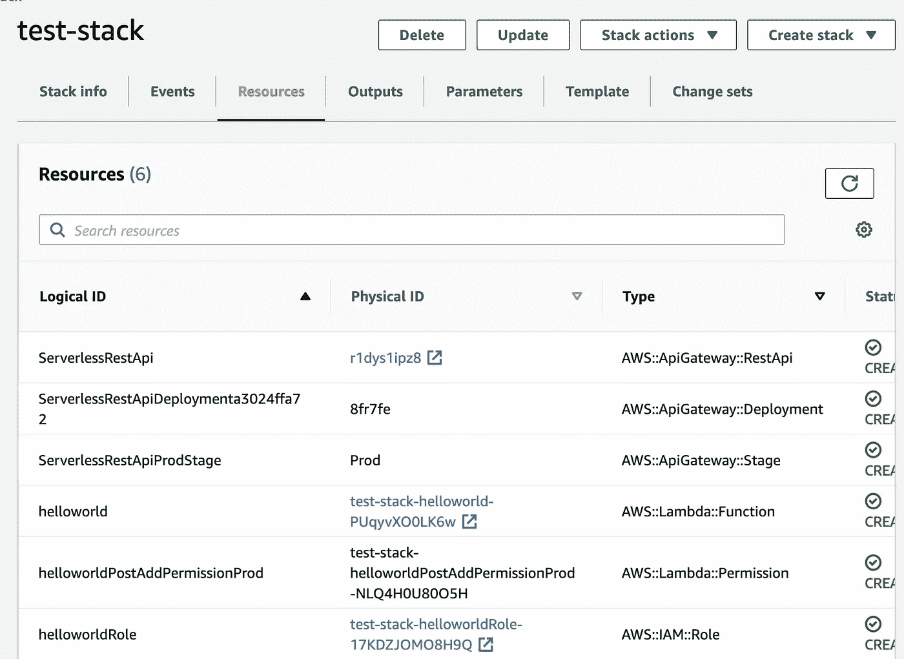

云形成堆栈已创建(作者截图)

在这里，我们可以看到通过简单的 template.yaml 文件成功部署和创建的代码提供的所有资源。为了进一步验证这一点，我们可以单击创建的 API 并测试 URL，就像我们在手动部署中所做的那样，以确保在部署 API 后具有相同的工作功能

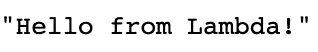

API & Lambda 来自 CFN 模板(作者截图)

为了**清理**，我们可以通过 CLI 运行一个 **delete stack** 命令来销毁为此演示创建的所有资源。运行下面的命令，您应该看到正在删除所有资源。

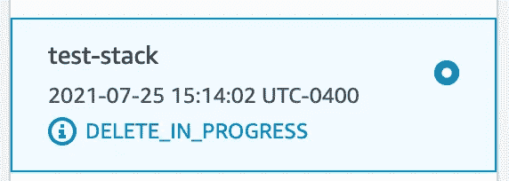

删除堆栈(作者截图)

# 5.整个代码和结论

<https://github.com/RamVegiraju/Serverless-CFN>  

要复制示例并访问完整演示的代码，请查看位于上方的**库。起初，CloudFormation 看起来令人生畏，因为它有一种奇怪的 yaml 语法和语言，掌握 CloudFormation 肯定需要一个学习曲线。但是，如果您对该服务有了一定的了解和熟悉，它将帮助您从一个中央模板文件中以简单高效的方式构建和管理极其强大的应用程序。虽然这种比较显示了手动部署与 IaC 部署在方便性和效率上的差异，但是当您的项目增长并且有多个开发人员在一个项目上工作时，这种差异会更加明显。关于接下来的步骤，请看这篇[文章](https://workshop.quickstart.awspartner.com/40_setup_cicd/1_setup_cicd.html)中的 CloudFormation 如何无缝地帮助在 AWS 中构建 CI/CD 管道。**

我希望这篇文章对任何试图了解 IaC、CloudFormation 或 AWS 的人有所帮助。欢迎在 [LinkedIn](https://www.linkedin.com/in/ram-vegiraju-81272b162/) 上与我联系，或者在 [Medium](https://ram-vegiraju.medium.com/) 上关注我，了解我更多的写作内容。分享任何想法或反馈，谢谢阅读！

# 其他资源/参考资料

[云形成 Udemy 大师班](https://www.udemy.com/course/aws-cloudformation-master-class/)

[AWS 无服务器 Udemy 类](https://www.udemy.com/course/aws-lambda-serverless-architecture/)