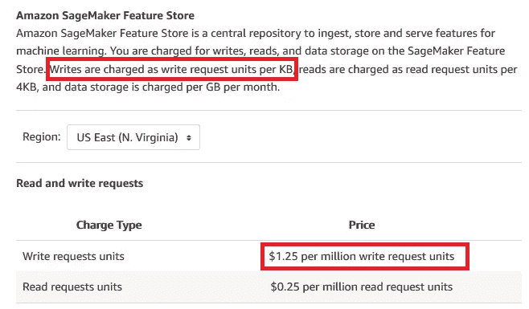

# 将历史要素数据纳入 SageMaker 要素库

> 原文：<https://towardsdatascience.com/ingesting-historical-feature-data-into-sagemaker-feature-store-5618e41a11e6?source=collection_archive---------13----------------------->

## 如何通过直接写入 S3 来回填 SageMaker 离线功能库

简·安东宁·科拉尔在 [Unsplash](https://unsplash.com?utm_source=medium&utm_medium=referral) 上拍摄的照片

# 这是怎么回事？

[亚马逊 SageMaker 功能商店](https://aws.amazon.com/sagemaker/feature-store/)是一个完全托管的、专门构建的存储库，用于存储、更新、检索和共享机器学习(ML)功能。它于 2020 年 12 月在 AWS re:Invent 上推出，并迅速成为 SageMaker 家族中最受欢迎的服务之一。自从 re:Invent 以来，我交谈过的许多 AWS 客户都对 SageMaker 功能商店(SMFS)表示了兴趣。

其中一些客户拥有历史特征数据，他们希望将其迁移到 SMFS 离线商店，该商店可以存储大量的特征数据，这些数据用于跟踪历史特征值，并为模型开发或批量应用创建训练/测试数据。

将历史数据摄取到 SMFS 线下商店的一个主要挑战是，用户在使用摄取 API 时将被收费，即使他们只想回填历史数据。如果客户想要将数 TB 的数据迁移到 SMFS，这些费用可能会快速增长。

在这篇博文中，我展示了如何将历史特征数据直接写入 S3，它是 SMFS 线下商店的支柱。使用这种方法绕过了摄取 API，大大节省了成本。

> 问:我来这里只是为了代码，在哪里可以找到它？
> 
> 甲:[这里](https://github.com/marshmellow77/sm-feature-store-backfill/)你去:)

# 快速估算成本

[这款笔记本](https://github.com/aws/amazon-sagemaker-examples/blob/master/sagemaker-featurestore/feature_store_introduction.ipynb)是一个很好的例子，展示了如何使用专用摄取 [API](https://sagemaker.readthedocs.io/en/stable/api/prep_data/feature_store.html#sagemaker.feature_store.feature_group.FeatureGroup.ingest) 将数据摄取到 SMFS。根据[亚马逊 SageMaker 定价网站](https://aws.amazon.com/sagemaker/pricing/)，用户将被收取每百万写请求单位 1.25 美元的费用(这是针对地区*美国东弗吉尼亚州*——不同地区可能适用不同的费用)。

Sagemaker 功能商店的定价

一个写入请求相当于 1KB 的数据，因此每 1gb(= 100 万 KB)写入 SMFS 的成本为 1.25 美元。我曾与拥有数兆字节历史特征数据的客户交谈过，他们只想填充 SMFS 的线下商店。如果他们使用 API 回填这些数据，他们将被收取数千美元的费用。相比之下，[将文件直接放入 S3**要比**便宜](https://aws.amazon.com/s3/pricing/)(在*美国东弗吉尼亚州*每 1000 个文件 0.005 美元)。

# 如何将要素数据直接写入 S3

游戏计划很简单:我们将创建一个[特征组](https://docs.aws.amazon.com/sagemaker/latest/dg/feature-store-create-feature-group.html)，修改相应的数据集，并按照 [SMFS 线下商店数据格式](https://docs.aws.amazon.com/sagemaker/latest/dg/feature-store-offline.html)直接保存在 S3。因此，该数据集将在 SMFS 线下商店中提供。

## 准备数据

在这个练习中，我将使用一个代表信用卡交易的合成数据集。该数据集在 SageMaker 样本 S3 桶中公开提供:

一些列是类型为 *object* 的，我们需要将它们转换为*字符串*，以便 SMFS 接受数据(参见[本页](https://docs.aws.amazon.com/sagemaker/latest/dg/feature-store-quotas.html#feature-store-data-types)了解 SMFS 支持的数据类型):

SMFS 的每个数据集都需要每个数据点的时间戳。由于我们的数据集没有时间戳，我们需要手动添加它:

## 创建功能组

数据集现已准备就绪，我们可以创建相应的要素组了。为此，我们首先像这样定义特性组:

现在我们已经准备好创建特性组了。请注意，创建要素组不同于获取数据，并且不会产生费用。该功能组将被注册到 SMFS，但它将保持为空，直到我们用数据填充它。我们还需要提供唯一标识记录的列名，即主键和包含每条记录时间戳的列名:

到目前为止，我们遵循的步骤与您通过 API 将数据导入 SMFS 时遵循的步骤相同。现在，我们将把数据直接输入 S3。

## 将数据写入 S3

将数据写入 S3 以便在 SMFS 可用的关键是这个[文档](https://docs.aws.amazon.com/sagemaker/latest/dg/feature-store-offline.html)。我们对用于组织离线商店中的文件的命名约定特别感兴趣:

S3 线下商店的命名惯例

要重建这个对应的 S3 文件路径，我们只需要表名，以及我们之前创建的事件时间戳的年、月、日和小时:

需要注意的是，在使用摄取 API 时，SMFS 将创建额外的字段:

数据集的附加字段

因为我们没有使用 API，所以我们需要手动添加这些额外的字段。这两个时间戳( *api_invocation_time* 和 *write_time* )与我们之前创建的事件时间戳不同。但是，出于演示目的，可以重用相同的时间戳:

要为数据创建有效的文件名，我们可以将事件时间和一个随机的 16 位字母数字代码连接起来。最后一步，我们现在可以将数据保存为 S3 的拼花文件:

## 检查摄取是否成功

SMFS 离线存储通过 Athena 查询进行访问，因此检查数据获取是否成功的最快方法是编写一个 Athena SQL 查询，从要素存储中检索数据:

如果摄取成功，从功能存储中检索的数据集将与我们上传的数据集相同。

# 结论

我们已经成功地用历史数据回填了 SageMaker 离线特性存储，而没有使用摄取 API。为此，我们修改了数据集，设置了适当的 S3 文件夹结构，并将数据集直接上传到 S3。

这种方法允许用户节省摄取 API 的费用，这对于大量的历史数据来说是相当大的。

*【2021 年 4 月 29 日编辑:讨论更高级场景的后续博文可在此处找到***】**