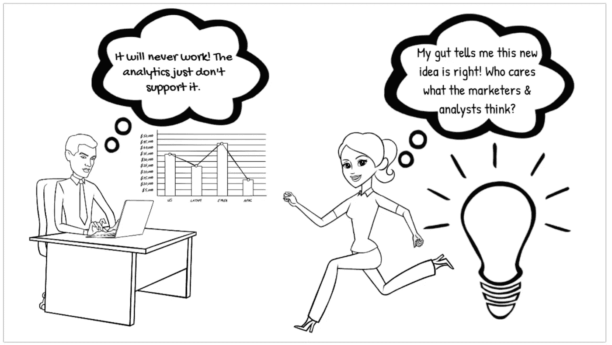

# 创新和预测分析

> 原文：<https://towardsdatascience.com/innovation-predictive-analytics-aac44954651f?source=collection_archive---------23----------------------->

## 浅析索尼随身听和苹果 iPod

版权所有 2021 —作者保留所有权利

> 还是那句话，你不能向前看，把点点滴滴串联起来；你只能回头看才能把它们联系起来。所以，你必须相信这些点在你的未来会以某种方式连接起来。你必须相信某些东西——你的勇气、命运、生活、因果报应等等。这种方法从未让我失望，它让我的生活变得完全不同。

在他 2005 年在斯坦福大学的毕业典礼上的演讲中，史蒂夫·乔布斯对他的创新过程的本质进行了如上陈述。数据和分析都没有被提及。它们是为“向后看”而保留的，例如，回顾过去。未来仍然是一块干净的画布，由创新者的想象来描绘。

P 预测分析是一种受人尊敬的分析形式，被公司用来绘制未来的产品路径。它广泛使用算法、数据挖掘和数据解释来整理市场需求和趋势。预测分析还结合了一系列强大的人工智能(AI)工具。这些可以包括机器学习(ML)、模式识别(PR)、自然语言处理(NLP)、情感分析和情感识别(SAER)等，以在预测过程中实现更精确的结果。

然而，预测分析是容易出错的。它受市场变化的影响，经常产生可疑的结果。分析过去和现在的数据并不能保证绝对的结果。事实上，谈到创新，尤其是“颠覆性创新”，依赖预测分析可能会让公司走上灾难性的道路。

新的想法、过程、模型和进步始于创新，有希望产生基于创新过程的工作模型。预测分析指导着这一过程，同时试图准确回答这一创新将在何时、何地、以何种方式以及为何改善产品的现状。

数据分析需要一种考虑创新并负责任地使用预测分析的方法，而不是一个可靠的水晶球。

创新的最终目标是创造一种新的商品或对现有产品的重大改进——无论是大的还是小的。预测分析能帮助还是阻碍这一过程？面对未知的未来，创新会自动否定预测分析对未来市场趋势的洞察吗？一个人如何以理智的方式使用创新和预测分析来促进公司的健康发展？

## 索尼随身听和苹果 iPod

对上述问题的回答构成了关于创新型公司的研究和文献的相当一部分。虽然许多理论似乎在特定的背景下有效，但在任何使用分析进行创新的尝试的核心，也有从合理的理论中收集的基本公式。应对创新，主要是颠覆性和激进的创新，需要一种新的分析模式。这不仅仅是推断数据和查看销售图表的问题，因为这只有在创新渗透到市场之后才会发生。

即使应用预测分析也可能是大错特错的，这是索尼的惨痛教训:

> 索尼突破性的随身听卡带播放器被暂时搁置，因为市场研究表明，消费者永远不会购买没有录音能力的磁带播放器，而且消费者会因为使用耳机而感到烦躁。但是森田无视市场部的警告，而是相信自己的直觉。这款随身听的销量超过了 3.3 亿部，并创造了全球个人音乐设备文化。

索尼的市场数据指向了随身听的彻底失败——苹果 iPod 的前身。事实上，一个颠覆性创新导致了另一个颠覆性创新，两者都在当前所有的市场数据和分析中取得了成功。索尼和苹果都是由依靠直觉、直觉和对消费者的深刻理解的人引导的。他们不允许市场研究或预测分析成为所有决策的起点和终点。也许，特别是对于史蒂夫·乔布斯来说，这是由于市场营销人员的不屑，他们仅仅依靠预测数据来确定他们的观点。

在处理创新时，数据，即使是预测性数据，也可能具有欺骗性。克里斯腾森的基本问题，一个他纠结了超过 25 年的问题，又回来困扰我们:*‘是什么促使顾客购买并使用某个特定的产品或服务？’*

索尼随身听和苹果 iPod 是如何回答这个问题的绝佳例子。[随身听发布于 1977 年(2010 年停产)](https://en.wikipedia.org/wiki/Walkman)而 iPod 发布于 2001 年 10 月 23 日——24 年的差距。从表面上看，这两种颠覆性的创新似乎没有什么联系。毕竟，随身听只是一个带耳机的盒式音乐播放器。然而，不仅如此，随身听给市场带来了一种新的听音乐的方法，创造了一种更“私人”的体验。

很少有研究者追踪从随身听到 iPod 的线索，这是试图理解和评估创新时的一个巨大错误。作为一台机器，随身听可以说是两者中更具颠覆性的创新。随身听代表了一种新的进程，最初是为一群特殊的旅行记者和商人设计的。然而，iPod 使用不同的技术和完全不同的方法向消费者提供音乐，扰乱了同一个市场。

这款随身听迎合了一种以前未被认识和分类的消费者需求。如前所述，随身听的预测数据是绝对错误的。索尼领导层做出的假设大多不一致，导致发布推迟。市场分析师的逻辑推断未能发现对该设备的任何需求，因为没有先例可以指导分析师。在当前的市场中，完全没有数据来推断出一个合理而精确的分析。随身听代表了对本能和直觉的一次豪赌。

> 颠覆是一种对创新的竞争性反应理论，为寻求驾驭威胁和机遇的管理者提供了有价值的见解。但它没有回答一个关键问题，即公司应该如何创新才能持续增长。它没有提供具体到哪里寻找新机会的指导，也没有具体说明你应该创造什么样的产品和服务让客户愿意购买。

虽然传统观点认为苹果的 iPod 具有颠覆性，因为它进入了一个全新的、以前未知的、未被发现的市场，但事实并非如此。史蒂夫·乔布斯不仅自己是个音乐迷，而且知道随身听及其成功。在这里，向大众提供音乐并不是破坏。乔布斯颠覆的是他专注于消费者需求的能力。正如 Christensen 等人评论的那样，*“要将创新从漫无目的提升到可预测，你必须理解潜在的因果机制——消费者在特定环境下试图取得的进步。”⁴*

为了让 iPod 获得成功，[苹果公司将其创新技能应用于多个领域](https://en.wikipedia.org/wiki/IPod):

苹果首先通过以下方式改进了架构:

*   为 iPod 的屏幕和其他技术申请专利；和
*   获得东芝公司开发的一种创新小硬盘的使用权，这种硬盘可以存储 1000 首歌曲。

它在用户界面和用户体验方面应用了其著名的功能，使用户可以轻松地从一首歌切换到另一首歌。

最重要的是，苹果利用其拥有从硬件到软件的端到端链的公司哲学，在发布 iPod 前 9 个月发布了 iTunes 商店。换句话说，iTunes Store 最初是为 Mac 而不是 iPod 发布的。苹果颠覆了原来的颠覆者。

索尼犯了一个经典的错误，认为随身听拥有市场，没有看到新技术的到来。乔布斯利用他天才的创造性火花和对消费者总是想要更多、更好、更小和更可靠的直觉理解，证明了*“创新型公司的标志不仅在于它首先提出新想法，还在于它知道当发现自己落后时如何跨越。”⁵*

苹果和乔布斯都不是真正的创新者，让消费者能够把音乐放在口袋里。然而，他们所做的是:

*   仅仅根据随身听的流行程度就认识到巨大的市场潜力；
*   理解整个链条上的创新是成功的主导因素；
*   理解技术发展超越盒式磁带的需要；
*   拥有从歌曲销售到 iPod 本身的整个过程，包括硬件和软件，把顾客留在苹果的世界里；和
*   给消费者更好的体验。

正如诺基亚和黑莓忽视了智能手机，百视达忽视了网飞，索尼也从未预见到它的到来。这种颠覆确实发生在技术领域，但它成功了，因为它没有止步于一项纯粹的技术发明。苹果将市场、创造力、本能、直觉和市场数据结合起来，颠覆了一个从颠覆中诞生的市场。

> 一个想法要真正产生影响，它需要被广泛采用，这意味着如果它要改变整个行业或领域，它需要取代现有的已在使用的模式。这一转变过程与之前的发现和创新一样具有挑战性和重要性。⁶

iPod 的故事和它的发布经常被美化到事实与虚构无法区分的程度。苹果创造了一种新产品，但是这种产品的市场已经因为随身听而为人所知。苹果增加了个人可以随身携带的音乐数量和获取音乐的方式，并确保自己“拥有”音乐的整个消费者价值链。它也创造了一个美丽的装置。简而言之，苹果公司以这项创新的因果机制为中心，提出了一种处理预期结果的新方法。

> 将我们的理解从有根据的猜测和关联转移到潜在的因果机制是意义深远的。真正揭示因果机制改变了我们解决问题的方式——也许更重要的是，阻止了问题的发生。⁷

## 唯一不变的是变化

S o，如果数据可以误导，直觉不正确，那还剩下什么？好吧，一个人可以什么都不做——但这将是一个根本性的错误。放弃梦想不是创新的方式。此外，如果创新没有发生，那么再多的预测分析也无法帮助发现下一步该做什么。在她著名的推文中，小野洋子写道:[*‘记住，我们每个人都有改变世界的力量。’*](https://twitter.com/yokoono/ status/4746029903) 这句话抓住了创新过程的内在魄力。然而，仅靠一个人是不足以让创新取得成功的。奇怪的是，小野洋子还写了一份声明，被她的丈夫约翰·列侬在一次采访中引用:*‘一个人做的梦只是一个梦。你们一起做的梦就是现实。⁸*

矛盾的是，创新需要一个人的力量和许多人的力量。它可能始于一个人头脑中闪现的天才，但实现的愿望将被那些敢于梦想的远见者所接受。创新是一个人的力量，敢于梦想——然后邀请其他有远见的人和你一起改变世界——把你的梦想变成现实。一旦你的目标被其他人认同，你的创新愿景已经开始——那么，也只有到那时，看看数据。通过创新和预测分析的正确结合，梦想确实会变成现实。人类思维的独创性和创造性是无限的。人们不需要更多的证据来证明小野洋子的话的真实性，“你们一起做的梦就是现实。”

创新会带来持续的变化。这种变化将反映在应计数据中。利用数据分析过去和现在的趋势、想法和市场行为。预测分析将绘制出市场内的近期地图，从而引发渐进式或可持续创新。然后，市场将转向或受制于颠覆，带来变革并引领创新。创新和预测分析是由创新创造力和数据支撑的无限变化循环。

**参考文献:**

1.  克里斯滕森，C.M .，狄龙，k .，霍尔，t .和邓肯，D.S. (2016)《与运气竞争:创新和客户选择的故事》，哈珀商务出版社，纽约，纽约，Kindle 版，位置 1227。
2.  *同上*，位置 819
3.  *同上*，位置 424
4.  *同上*，位置 460
5.  艾萨克森，W. (2011)《史蒂夫·乔布斯:独家传记》，Little，布朗图书集团，纽约，纽约，Kindle 版，位置 8965。
6.  Satell，G. (2017)“测绘创新:导航颠覆性时代的剧本”，麦格劳-希尔教育，纽约，纽约，Kindle 版，位置 1183。
7.  克里斯滕森等人，参考文献。1 以上，位置 491。
8.  sheff d .(2000 年)“我们所说的一切”，纽约圣马丁出版社，第 16 页

**(上面的文章是我最初的学术文章的节选版&，*‘论文和对偶——创新
和预测分析:σ(过去+现在)数据≠未来成功’*****，最初发表于** [**《应用营销分析》第 6 卷第 3 期，亨利·斯图尔特出版的期刊**](https://hstalks.com/article/6051/thesis-and-antithesis-innovation-and-predictive-an/) **。整篇文章的 PDF，可以使用**[**ResearchGate**](https://www.researchgate.net/publication/349519573_Thesis_and_antithesis_-_Innovation_and_predictive_analytics_S_Past_Present_Data_Future_Success)**，** [**谷歌学术**](https://scholar.google.com/citations?user=qqEe9UEAAAAJ&hl=en) **，**[**fig share**](https://figshare.com/authors/Ted_Gross/10182179)**，或者直接在**[**LinkedIn**](https://www.linkedin.com/in/tedwgross)**上联系作者。在所有情况下，如果您引用这篇文章或整篇文章，需要完全归功于原作者。)**

**关于作者:** Ted Gross 担任 R & D 的 CTO & VP 多年，擅长数据库技术，专注于 NoSQL 系统、NodeJS、MongoDB、加密、AI、创新&混沌理论。他还擅长虚拟世界技术&增强现实。他还在专业期刊和在线@ Medium & LinkedIn 上发表了许多关于技术主题的文章。 [**他也是文学小说、儿童书籍和各种非小说类文章**](http://amazon.com/author/tedgross) 的作者。他的短篇小说集， [*【古代故事，现代传说】*](http://www.amazon.com/Ancient-Tales-Modern-Legends-Collection/dp/1469901714) 获得了极好的评价。

可以通过[电子邮件](http://tedwgross@icloud.com)联系 Ted[推特](https://twitter.com/tedwgross)(@ tedwgross)；[LinkedIn](http://il.linkedin.com/in/tedwgross)；[中等](https://medium.com/@tedwgross)